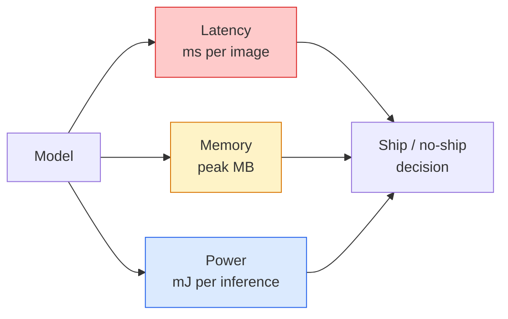

# Real-Time Vision — Edge Deployment

> Edge inference is the discipline of getting a 90-accuracy model to run at 30 fps on a device with 2 GB of RAM. Every percentage point of accuracy is traded against milliseconds of latency.

**Type:** Learn + Build
**Languages:** Python
**Prerequisites:** Phase 4 Lesson 04 (Image Classification), Phase 10 Lesson 11 (Quantization)
**Time:** ~75 minutes

## Learning Objectives

- Measure inference latency, peak memory, and throughput for any PyTorch model, and read the FLOPs / params / latency trade-off
- Quantise a vision model to INT8 using PyTorch's post-training quantisation and verify accuracy loss < 1%
- Export to ONNX and compile with ONNX Runtime or TensorRT; name the three most common export failures and their fixes
- Explain when to pick MobileNetV3, EfficientNet-Lite, ConvNeXt-Tiny, or MobileViT for an edge constraint

## The Problem

A training-time vision model is a floating-point monster. 100M parameters, 10 GFLOPs per forward pass, 2 GB of VRAM. None of that fits on a phone, a car's infotainment unit, an industrial camera, or a drone. Shipping a vision system means fitting the same predictions into a budget that is 100x smaller.

Three knobs do most of the work: model choice (a smaller architecture with the same recipe), quantisation (INT8 instead of FP32), and the inference runtime (ONNX Runtime, TensorRT, Core ML, TFLite). Getting them right is the difference between a demo that runs on a workstation and a product that ships on a $30 camera module.

This lesson sets up the measurement discipline first (you cannot optimise what you cannot measure), then walks the three knobs. The goal is not to learn every edge runtime but to know what levers exist and how to verify each one does what you think.

## The Concept

### The three budgets

- **Latency**: p50, p95, p99. Averaging only p50 hides tail behaviour that matters for real-time systems.
- **Peak memory**: the maximum the device ever sees, not the steady-state average. Matters because OOMs are fatal on embedded targets.
- **Power / energy**: millijoules per inference on a battery-powered device. Often proxied by CPU/GPU utilisation * time.

A table of (model, latency, memory, accuracy) is what an edge decision is made from. Every cell is measured on the target device, not the workstation.

### Measurement discipline

Three rules that every edge profile should follow:

1. **Warm up** the model with 5-10 dummy forward passes before measuring. Cold caches and JIT compilation produce unrepresentative first numbers.
2. **Synchronise** GPU workloads with `torch.cuda.synchronize()` before and after the timed block. Without this you measure kernel dispatch, not kernel execution.
3. **Fix input sizes** to the production resolution. Latency on 224x224 is not latency on 512x512.

### FLOPs as a proxy

FLOPs (floating-point operations per inference) is a cheap, device-independent proxy for latency. Useful for architecture comparison, misleading as absolute wall-clock. A model with 10% more FLOPs can be 2x faster in practice because it uses hardware-friendly ops (depthwise convs compile well, large 7x7 convs do not).

Rule: use FLOPs for architecture search, use on-device latency for deployment decisions.

### Quantisation in one paragraph

Replace FP32 weights and activations with INT8. Model size drops 4x, memory bandwidth drops 4x, compute drops 2-4x on hardware that has INT8 kernels (every modern mobile SoC, every NVIDIA GPU with Tensor Cores). Accuracy loss on vision tasks is typically 0.1-1 percentage points with post-training static quantisation.

Types:

- **Dynamic** — quantise weights to INT8, activations computed in FP. Easy, small speedup.
- **Static (post-training)** — quantise weights + calibrate activation ranges on a small calibration set. Much faster than dynamic.
- **Quantisation-aware training (QAT)** — simulate quantisation during training so the model learns around it. Best accuracy, needs labelled data.

For vision, post-training static quantisation gives 95% of the benefit with 5% of the effort. Use QAT only when accuracy loss from PTQ is unacceptable.

### Pruning and distillation

- **Pruning** — remove unimportant weights (magnitude-based) or channels (structured). Works well on overparameterised models; less useful on already-compact architectures.
- **Distillation** — train a small student to mimic a large teacher's logits. Often recovers most of the accuracy lost by shrinking the model. Standard for production edge models.

### The inference runtimes

- **PyTorch eager** — slow, not for deployment. Use for development only.
- **TorchScript** — legacy. Superseded by `torch.compile` and ONNX export.
- **ONNX Runtime** — the neutral runtime. CPU, CUDA, CoreML, TensorRT, OpenVINO all have ONNX providers. Start here.
- **TensorRT** — NVIDIA's compiler. Best latency on NVIDIA GPUs (workstation and Jetson). Integrates with ONNX Runtime or standalone.
- **Core ML** — Apple's runtime for iOS/macOS. Needs `.mlmodel` or `.mlpackage`.
- **TFLite** — Google's runtime for Android/ARM. Needs `.tflite`.
- **OpenVINO** — Intel's runtime for CPU/VPU. Needs `.xml` + `.bin`.

In practice: export PyTorch -> ONNX -> pick the runtime for the target. ONNX is the lingua franca.

### Edge architecture picker

| Budget | Model | Why |
|--------|-------|-----|
| < 3M params | MobileNetV3-Small | Compiles everywhere, good baseline |
| 3-10M | EfficientNet-Lite-B0 | Best accuracy per param on TFLite |
| 10-20M | ConvNeXt-Tiny | Best accuracy-per-param, CPU-friendly |
| 20-30M | MobileViT-S or EfficientViT | Transformer with ImageNet accuracy |
| 30-80M | Swin-V2-Tiny | If stack supports window attention |

Quantise all of these to INT8 unless you have a specific reason not to.

## Further Reading

- [EfficientNet (Tan & Le, 2019)](https://arxiv.org/abs/1905.11946) — compound scaling for efficient architectures
- [MobileNetV3 (Howard et al., 2019)](https://arxiv.org/abs/1905.02244) — mobile-first architecture with h-swish and squeeze-excite
- [A Practical Guide to TensorRT Optimization (NVIDIA)](https://developer.nvidia.com/blog/accelerating-model-inference-with-tensorrt-tips-and-best-practices-for-pytorch-users/) — how to actually get the throughput numbers in the paper
- [ONNX Runtime docs](https://onnxruntime.ai/docs/) — quantisation, graph optimisation, provider selection
