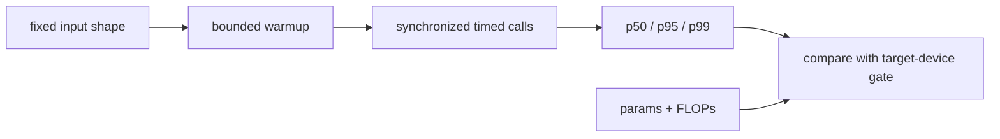

# Real-Time Vision — Edge Deployment

> A latency number is useful only when its warmup, input shape, device, and tail percentile are recorded with it.

**Type:** Build
**Languages:** Python, Rust
**Prerequisites:** Phase 4 Lesson 04 (Image Classification)
**Time:** ~45 minutes

## Learning Objectives

- Measure a bounded forward pass with warmup, device synchronization, and p50/p95/p99 percentiles.
- Distinguish parameter count and a multiply/add FLOP estimate from a quality or wall-clock guarantee.
- Explain why grouped/depthwise convolution changes the FLOP calculation.
- Compare two identical-contract local backbones while keeping the input shape fixed.
- Compile the stdlib-only Rust companion and read its deterministic fixture output without treating it as a device SLA.

## The Problem

An edge decision has at least three independent gates: the model must fit in memory, finish within the tail-latency budget, and meet the task-quality threshold. A workstation measurement can demonstrate the measurement procedure, but it cannot establish a phone, camera, or accelerator SLA. This lesson therefore ships a small offline fixture rather than pretending that an uninstalled deployment runtime is available.

## Build It

The executable Build-It artifact is the stdlib-only Rust companion. It applies a depthwise 3×3 pass and a pointwise 1×1 pass over a fixed `160×160×3` tensor, measures warmup/timing percentiles, and has five inline tests. This makes the convolution and measurement ideas runnable even when no ML framework is installed.

The optional Python Use-It artifact compares `TinyDenseBackbone` and `TinyDepthwiseBackbone`. Both accept `(N, 3, H, W)` and return ten logits. The only architectural change is the first feature extractor: the dense model uses two ordinary convolutions, while the second uses a three-channel depthwise convolution followed by a pointwise mix.

The Python `measure_latency` path validates a four-dimensional positive shape, `warmup >= 0`, and `iters > 0`. It calls the model without gradients, synchronizes CUDA/MPS when requested, sorts the timed calls, and reports four finite fields. `flops_estimate` counts two operations per multiply/add and uses `c_in_per_group`, so a depthwise layer is not charged as if every output saw every input channel.

```bash
cd phases/04-computer-vision/15-real-time-edge/code
python3 main.py
```

When PyTorch is unavailable, the Python command still prints a deterministic shape/FLOP/fixture-percentile plan and exits successfully; the Rust command remains the substantive Build-It benchmark. The Python numbers are a planning fixture, not a device benchmark.

The Rust companion implements the same idea with a depthwise 3×3 pass followed by a pointwise 1×1 pass over a fixed `160×160×3` tensor. It has no crates beyond the standard library:

```bash
rustc --edition 2021 -O main.rs -o /tmp/lesson-edge
/tmp/lesson-edge
rustc --edition 2021 --test main.rs -o /tmp/lesson-edge-tests
/tmp/lesson-edge-tests
```

## Use It

Compile/run the Rust Build-It path first, then use the Python module to compare the two rows returned by `compare_backbones(resolution=16, warmup=0, iters=2)`. The `params` and `flops` fields are deterministic for a given architecture; the timing fields are observations and may vary between runs. Keep `input_shape=(1,3,16,16)` fixed when comparing them. Try `iters=0`, a zero dimension, and `device="tpu"`; each Python call must fail before a timing loop starts.

## Ship It

Use `outputs/prompt-edge-deployment-planner.md` as a handoff template. It asks for the target device, input shape, p95 gate, and task-quality gate without inventing a latency value. The reusable `skill-latency-profiler` mirrors the same warmup/percentile contract with stdlib `tracemalloc`; it does not import a deployment runtime.

## Measurement Notes



- **Warmup** removes the first-call path from the reported sample; it does not make the model faster.
- **Percentiles** expose the tail. `p95_ms` is the smallest recorded value at or above the 95th percentile of the sorted sample according to the fixture's index rule.
- **FLOPs** describe the counted operations in these Conv2d/Linear modules. They omit unsupported operators and memory traffic, so they are not milliseconds.
- **Quantization, export, and runtime compilation** are follow-up integration work. This lesson does not claim an INT8 accuracy delta or an ONNX/TensorRT result without those tools and a calibration/evaluation set.

## Exercises

1. Run `compare_backbones(resolution=16, warmup=0, iters=4)` twice. Record the identical `params`/`flops` fields and the changing timing fields.
2. Verify the grouped-convolution calculation by comparing `flops_estimate(nn.Conv2d(4,4,3,padding=1,groups=4), (1,4,5,5))` with `2*1*4*3*3*5*5 = 1800`.
3. Change only `resolution` from 16 to 32. Explain why the convolutional FLOPs grow with spatial area while the linear head count does not.
4. Compile the Rust tests and identify which five tests cover shape indexing, PRNG bounds, FLOP positivity, and percentile boundaries. Do not copy their local milliseconds into a production SLA.

## Reference Solution

A complete solution shows two rows from `compare_backbones`, with stable integer parameter/FLOP counts and explicitly labelled local timing observations. The padded grouped-convolution hand calculation is 1800 operations for the stated fixture. Invalid `iters`, dimensions, and devices raise `ValueError` before a model call. The Rust binary reports p50/p95/p99 after three ignored warmups and its inline test binary passes five tests. None of these outputs establishes accuracy, memory, power, or a target-device latency guarantee.

## Further Reading

- [MobileNetV1](https://arxiv.org/abs/1704.04861) — the depthwise-separable convolution idea used by the Rust fixture.
- [PyTorch CUDA synchronization](https://pytorch.org/docs/stable/generated/torch.cuda.synchronize.html) — why asynchronous device work needs an explicit boundary around a timer.
- [Rust `Instant`](https://doc.rust-lang.org/std/time/struct.Instant.html) — the standard-library timer used by `main.rs`.
