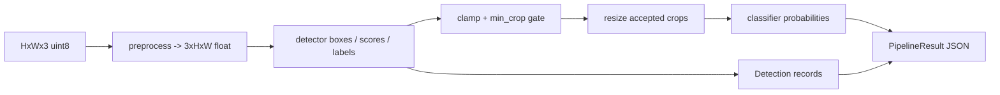

# Build a Complete Vision Pipeline — Capstone

> A pipeline is a sequence of contracts: pixels become a tensor, boxes become crops, and predictions become validated JSON.

**Type:** Build
**Languages:** Python
**Prerequisites:** Phase 4 Lessons 01–15
**Time:** ~75 minutes

## Learning Objectives

- Validate an RGB input and convert HWC `uint8` pixels into a CHW tensor in `[0,1]`.
- Run the complete detector/crop/classifier seam with NumPy before introducing a framework.
- Preserve detector box coordinates while clamping them to the image before cropping.
- Skip crops below a declared `min_crop` without losing the original detection record.
- Encode detections, classifications, and timing as a deterministic dataclass-based JSON contract.
- Benchmark preprocessing, detection, classification, and total time without hiding an empty-crop path.

## The Problem

Model demos often stop at a tensor. A usable vision service needs to state what happens at every boundary: malformed pixels, an out-of-bounds box, a crop too small for a classifier, an unknown class ID, and an image with no usable crops. The local capstone makes those decisions inspectable without downloading weights or importing a service framework.

## Build It

`numpy_pipeline` is the Build-It path. `numpy_preprocess` converts HWC pixels to CHW floats, `numpy_detect` emits three deterministic boxes with scores `[0.92, 0.85, 0.71]`, and `numpy_classify_crop` turns channel means into a small softmax-like class score. The same detector/crop policy is exposed through `VisionPipeline` and `StubClassifier` for the optional Torch Use-It path. Both paths return the dataclasses `Detection`, `Classification`, and `PipelineResult`. `run` clamps every box to the `(H,W)` image boundary, records it, and only resizes crops whose integer width and height meet `min_crop` (16 by default). Classifications retain the detector index so a downstream consumer can join the two lists.

The Python standard library supplies JSON serialization and NumPy supplies the executable Build-It fixture. PyTorch supplies only the optional tensor Use-It path. The canonical command is bounded and still computes the NumPy pipeline when PyTorch is not installed:

```bash
cd phases/04-computer-vision/16-vision-pipeline-capstone/code
python3 main.py
```

The output reports three detections, three accepted classifications at the default gate, and the four `PipelineResult` JSON fields. It is a local fixture result, not evidence that a particular detector or classifier is production-ready.



## Use It

The framework-free call is enough to inspect the full contract:

```python
import numpy as np
from main import numpy_pipeline

result = numpy_pipeline(np.zeros((64, 96, 3), dtype=np.uint8), image_id="camera-0001")
print(result.to_json())
```

When PyTorch is available, compare that output with the optional `VisionPipeline` implementation:

```python
import numpy as np
from main import StubClassifier, StubDetector, VisionPipeline

pipe = VisionPipeline(StubDetector(), StubClassifier(), [f"class_{i}" for i in range(10)])
result = pipe.run(np.zeros((64, 96, 3), dtype=np.uint8), image_id="camera-0001")
print(result.to_json())
```

Try a float image in `[0,1]`, an HWC array with two channels, and a tensor containing `2.0`. Only the first two valid representations are accepted; the failures are explicit rather than silent normalization changes. Set `min_crop=40` to observe three detection records and no classifications.

`benchmark` returns p50/p95 for `preprocess`, `detect`, `classify`, and `total` on the Torch path. The stage numbers are observations on the current machine and should be compared only under the same fixture and shape.

## Ship It

Use `outputs/prompt-vision-service-shape-reviewer.md` to review a future service at the same boundaries. Use `outputs/skill-pipeline-budget-planner.md` to assign a p95 budget only after measuring the real target. A web endpoint, JPEG decoder, and model-serving runtime are integration layers outside this stdlib/NumPy/PyTorch lesson; do not represent them as implemented here.

## Exercises

1. Run the canonical command and validate the JSON with `json.loads`. Check that every detection box has positive width/height and lies within `96×64`.
2. Run with `min_crop=40`. Explain why the detections remain present while classifications become an empty list.
3. Pass a float HWC array containing `0.5` and verify the tensor contains `0.5`; then pass a float value outside `[0,1]` and record the `ValueError`.
4. Call `benchmark(pipe, num_runs=2, image_size=(16,20))`. Record all four stage keys and explain why total time is not the sum of independently measured medians.
5. Create a `Detection((1,2,1,4),0.5,0)` and a score of `1.1`; both must fail the dataclass contract.

## Reference Solution

The NumPy reference run emits three clamped detection records and three classifications. With the default `min_crop=16`, each fixture box is large enough to produce a classification; with `min_crop=40`, no crop qualifies but the detection list is unchanged. `PipelineResult.to_json()` contains exactly the four top-level fields. The optional Torch benchmark exposes four stage names and finite non-negative p50/p95 values. Malformed shape, range, score, and box inputs fail before a response is serialized.

## Further Reading

- [PyTorch `interpolate`](https://pytorch.org/docs/stable/generated/torch.nn.functional.interpolate.html) — the resize operation used for accepted crops.
- [Python `dataclasses`](https://docs.python.org/3/library/dataclasses.html) — the stdlib record type used instead of a validation framework.
