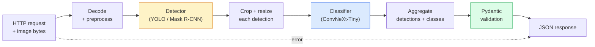

# Build a Complete Vision Pipeline — Capstone

> A production vision system is a chain of models and rules stitched with data contracts. The pieces are already in this phase; the capstone wires them together end-to-end.

**Type:** Build
**Languages:** Python
**Prerequisites:** Phase 4 Lessons 01-15
**Time:** ~120 minutes

## Learning Objectives

- Design a production vision pipeline that detects objects, classifies them, and emits structured JSON — with every failure path handled
- Plug a detector (Mask R-CNN or YOLO), a classifier (ConvNeXt-Tiny), and a data contract (Pydantic) into one service
- Benchmark the end-to-end pipeline and identify the first bottleneck (usually preprocessing, then the detector)
- Ship a minimal FastAPI service that accepts an image upload, runs the pipeline, and returns detections with classifications

## The Problem

Individual vision models are useful; vision products are chains of them. A retail shelf audit is a detector plus a product classifier plus a price-OCR pipeline. Autonomous driving is a 2D detector plus a 3D detector plus a segmenter plus a tracker plus a planner. A medical pre-screen is a segmenter plus a region classifier plus a clinician UI.

Wiring those chains is the part that separates a ML prototype from a product. Every interface between models is a new place for bugs. Every coordinate transform, every normalisation, every mask resize is a silent-failure candidate. A pipeline is as strong as its weakest interface.

This capstone sets up the minimum viable pipeline: detection + classification + structured output + a serving layer. Everything else in Phase 4 slots into this skeleton: swap Mask R-CNN for YOLOv8, add a OCR head, add a segmentation branch, add a tracker. The architecture is stable; the pieces are pluggable.

## The Concept

### The pipeline



Seven stages. The two model stages are expensive; the five other stages are where the bugs live.

### Data contracts with Pydantic

Every model boundary becomes a typed object. This turns silent failures into loud ones.

```
Detection(
    box: tuple[float, float, float, float],   # (x1, y1, x2, y2), absolute pixels
    score: float,                              # [0, 1]
    class_id: int,                             # from detector's label map
    mask: Optional[list[list[int]]],           # RLE-encoded if present
)

PipelineResult(
    image_id: str,
    detections: list[Detection],
    classifications: list[Classification],
    inference_ms: float,
)
```

When a detector returns boxes in `(cx, cy, w, h)` instead of `(x1, y1, x2, y2)`, Pydantic's validation fails at the boundary and you find out immediately instead of debugging a downstream crop that silently returns empty regions.

### Where latency goes

Three truths hold in nearly every vision pipeline:

1. **Preprocessing is often the biggest single block.** Decoding JPEGs, converting colour spaces, resizing — these are CPU-bound and easy to forget.
2. **The detector dominates GPU time.** 70-90% of GPU time is in the detection forward pass.
3. **Postprocessing (NMS, RLE encode/decode) is cheap on GPU, expensive on CPU.** Always profile with the actual target.

Knowing the distribution is what turns optimisation into a prioritised list.

### Failure modes

- **Empty detections** — return empty list, do not crash. Log.
- **Out-of-bounds boxes** — clamp to image size before cropping.
- **Tiny crops** — skip classification for boxes smaller than the classifier's minimum input.
- **Corrupt upload** — 400 response with a specific error code, not 500.
- **Model load failure** — fail at service startup, not at first request.

A production pipeline handles each of these without writing generic `try/except` that hides the failure. Every failure gets a named code and a response.

### Batching

A production service serves multiple clients. Batching detections and classifications across requests multiplies throughput. The trade-off: extra latency from waiting for a batch to fill. Typical setup: collect requests for up to 20ms, batch together, process, distribute responses. `torchserve` and `triton` do this natively; small services with predictable load roll their own micro-batcher.


## Use It

Production templates converge to the same structure, plus:

- **Model versioning** — always log the model name and weights hash in the response.
- **Per-request trace IDs** — log every stage timing for every request so you can correlate slow responses with stages.
- **Fallback path** — if the classifier times out, return detections without classifications rather than failing the whole request.
- **Safety filters** — NSFW / PII filters run after classification, before the response leaves the service.
- **Batch endpoint** — a `/detect_batch` accepting a list of image URLs for bulk processing.

For production serving, `torchserve`, `Triton Inference Server`, and `BentoML` handle batching, versioning, metrics, and health checks out of the box. Running `FastAPI` directly is fine for prototypes and small-scale products.

## Ship It

This lesson produces:

- `outputs/prompt-vision-service-shape-reviewer.md` — a prompt that reviews a vision service's code for contract/response shape violations and names the first breaking bug.
- `outputs/skill-pipeline-budget-planner.md` — a skill that, given target latency and throughput, assigns a time budget to every pipeline stage and flags which stage will miss its budget first.


## Key Terms

| Term | What people say | What it actually means |
|------|----------------|----------------------|
| Pipeline | "The system" | An ordered chain of preprocessing, inference, and postprocessing steps with a typed interface between each pair |
| Data contract | "The schema" | Pydantic / dataclass definitions that every stage input and output conforms to; catches integration bugs at the boundary |
| Preprocessing | "Before the model" | Decoding, colour conversion, resizing, normalising; usually the biggest CPU time sink |
| Postprocessing | "After the model" | NMS, mask resize, threshold, RLE encode; cheap on GPU, expensive on CPU |
| Microbatcher | "Collect then forward" | Aggregator that waits a fixed window for multiple requests, runs a single batched forward pass |
| Trace ID | "Request id" | Per-request identifier logged at every stage so slow requests can be traced end-to-end |
| Failure code | "Named error" | Specific error code per failure class instead of generic 500; enables client retry logic |
| Health check | "Readiness probe" | Cheap endpoint that reports whether the service can answer; loadbalancers rely on this |

## Further Reading

- [Full Stack Deep Learning — Deploying Models](https://fullstackdeeplearning.com/course/2022/lecture-5-deployment/) — the canonical overview of production ML deployment
- [BentoML docs](https://docs.bentoml.com) — serving framework with batching, versioning, and metrics
- [torchserve docs](https://pytorch.org/serve/) — PyTorch's official serving library
- [NVIDIA Triton Inference Server](https://developer.nvidia.com/triton-inference-server) — high-throughput serving with batching and multi-model support
