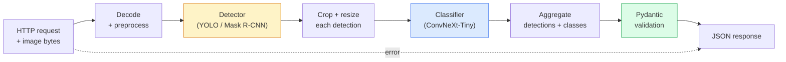

# Build a Complete Vision Pipeline — Capstone

> A production vision system is a chain of models and rules stitched with data contracts. The pieces are already in this phase; the capstone wires them together end-to-end.

**Type:** Build
**Languages:** Python
**Prerequisites:** Phase 4 Lessons 01-15
**Time:** ~120 minutes

## Learning Objectives

- Design a production vision pipeline that detects objects, classifies them, and emits structured JSON — with every failure path handled
- Plug a detector (Mask R-CNN or YOLO), a classifier (ConvNeXt-Tiny), and a data contract (Pydantic) into one service
- Benchmark the end-to-end pipeline and identify the first bottleneck (usually preprocessing, then the detector)
- Ship a minimal FastAPI service that accepts an image upload, runs the pipeline, and returns detections with classifications

## The Problem

Individual vision models are useful; vision products are chains of them. A retail shelf audit is a detector plus a product classifier plus a price-OCR pipeline. Autonomous driving is a 2D detector plus a 3D detector plus a segmenter plus a tracker plus a planner. A medical pre-screen is a segmenter plus a region classifier plus a clinician UI.

Wiring those chains is the part that separates a ML prototype from a product. Every interface between models is a new place for bugs. Every coordinate transform, every normalisation, every mask resize is a silent-failure candidate. A pipeline is as strong as its weakest interface.

This capstone sets up the minimum viable pipeline: detection + classification + structured output + a serving layer. Everything else in Phase 4 slots into this skeleton: swap Mask R-CNN for YOLOv8, add a OCR head, add a segmentation branch, add a tracker. The architecture is stable; the pieces are pluggable.

## The Concept

### The pipeline



Seven stages. The two model stages are expensive; the five other stages are where the bugs live.

### Data contracts with Pydantic

Every model boundary becomes a typed object. This turns silent failures into loud ones.

```
Detection(
    box: tuple[float, float, float, float],   # (x1, y1, x2, y2), absolute pixels
    score: float,                              # [0, 1]
    class_id: int,                             # from detector's label map
    mask: Optional[list[list[int]]],           # RLE-encoded if present
)

PipelineResult(
    image_id: str,
    detections: list[Detection],
    classifications: list[Classification],
    inference_ms: float,
)
```

When a detector returns boxes in `(cx, cy, w, h)` instead of `(x1, y1, x2, y2)`, Pydantic's validation fails at the boundary and you find out immediately instead of debugging a downstream crop that silently returns empty regions.

### Where latency goes

Three truths hold in nearly every vision pipeline:

1. **Preprocessing is often the biggest single block.** Decoding JPEGs, converting colour spaces, resizing — these are CPU-bound and easy to forget.
2. **The detector dominates GPU time.** 70-90% of GPU time is in the detection forward pass.
3. **Postprocessing (NMS, RLE encode/decode) is cheap on GPU, expensive on CPU.** Always profile with the actual target.

Knowing the distribution is what turns optimisation into a prioritised list.

### Failure modes

- **Empty detections** — return empty list, do not crash. Log.
- **Out-of-bounds boxes** — clamp to image size before cropping.
- **Tiny crops** — skip classification for boxes smaller than the classifier's minimum input.
- **Corrupt upload** — 400 response with a specific error code, not 500.
- **Model load failure** — fail at service startup, not at first request.

A production pipeline handles each of these without writing generic `try/except` that hides the failure. Every failure gets a named code and a response.

### Batching

A production service serves multiple clients. Batching detections and classifications across requests multiplies throughput. The trade-off: extra latency from waiting for a batch to fill. Typical setup: collect requests for up to 20ms, batch together, process, distribute responses. `torchserve` and `triton` do this natively; small services with predictable load roll their own micro-batcher.


## Build It

Reconstruct **Build a Complete Vision Pipeline — Capstone** by following `Detection` on an 8x8 synthetic image. Run `python3 main.py` and verify that the reported height/width or feature-map shape changes predictably, without inventing pixels.

## Use It

Call `Detection` from a small caller with an 8x8 synthetic image. Compare its result with the demo output, and record the input contract and the one field a downstream user should rely on.

## Ship It

Hand off `outputs/prompt-vision-service-shape-reviewer.md` with the command `python3 main.py`, the accepted input shape (an 8x8 synthetic image), the expected observable result, and a failure note for malformed inputs.

## Further Reading

- [Full Stack Deep Learning — Deploying Models](https://fullstackdeeplearning.com/course/2022/lecture-5-deployment/) — the canonical overview of production ML deployment
- [BentoML docs](https://docs.bentoml.com) — serving framework with batching, versioning, and metrics
- [torchserve docs](https://pytorch.org/serve/) — PyTorch's official serving library
- [NVIDIA Triton Inference Server](https://developer.nvidia.com/triton-inference-server) — high-throughput serving with batching and multi-model support

## Exercises

This lab follows `Detection` and `Classification` on a controlled fixture; write down the value before changing the input.

1. **Trace the canonical fixture.** From `code/`, run `python3 main.py` using an 8x8 synthetic image. Follow `Detection`, `Classification`, `PipelineResult`. Expect the reported height/width or feature-map shape changes predictably, without inventing pixels; capture the first printed shape, metric, status, or summary field and state which part supports **Design a production vision pipeline that detects objects, classifies them, and emits structured JSON — with every failure path handled**.
2. **Change the controlled parameter.** Repeat the command after changing only the center-pixel value: use the same image with one bright center pixel. Predict the direction of the change, then compare the two output values. Explain why **Plug a detector (Mask R-CNN or YOLO), a classifier (ConvNeXt-Tiny), and a data contract (Pydantic) into one service** says the other inputs should stay fixed.
3. **Exercise the guard.** Feed the implementation a 1x1 image with all values zero. Before running it, write down whether the relevant function should return an empty value, a zero-sized result, or a validation error. Check the observed status against **Benchmark the end-to-end pipeline and identify the first bottleneck (usually preprocessing, then the detector)** and record the exception text if the code rejects the case.
4. **Prepare the artifact for reuse.** Open `outputs/prompt-vision-service-shape-reviewer.md` and add a worked example using an 8x8 synthetic image. Include the input contract, one expected output field, and a named acceptance check for **Ship a minimal FastAPI service that accepts an image upload, runs the pipeline, and returns detections with classifications**; note what the demo cannot establish.

## Reference Solution

A checkable result for **Build a Complete Vision Pipeline — Capstone** should contain:

- the `python3 main.py` output for an 8x8 synthetic image, with `Detection`, `Classification`, `PipelineResult` traced to the value or shape that supports **Design a production vision pipeline that detects objects, classifies them, and emits structured JSON — with every failure path handled**;
- a before/after comparison for the center-pixel value, where the same image with one bright center pixel changes the observation in the direction predicted by **Plug a detector (Mask R-CNN or YOLO), a classifier (ConvNeXt-Tiny), and a data contract (Pydantic) into one service**;
- a recorded result for a 1x1 image with all values zero that matches the implementation’s validation or empty-result contract and explains the evidence for **Benchmark the end-to-end pipeline and identify the first bottleneck (usually preprocessing, then the detector)**; and
- an updated `outputs/prompt-vision-service-shape-reviewer.md` example with a concrete input, expected output field, and acceptance check tied to **Ship a minimal FastAPI service that accepts an image upload, runs the pipeline, and returns detections with classifications**.

Run the lesson tests after the demo. If the boundary behaves differently from the prediction, keep the actual exception or output and explain the implementation path that produced it.
