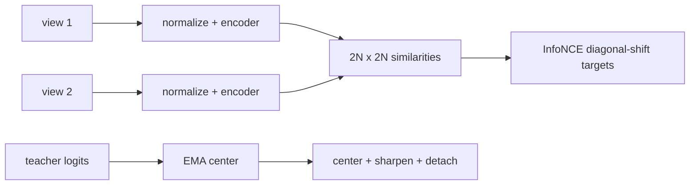

# Self-Supervised Vision — SimCLR, DINO, MAE

> The pretext signal changes, but the engineering question stays concrete: what tensor is the target, and what state is updated?

**Type:** Build
**Languages:** Python
**Prerequisites:** Phase 4 Lesson 14 (Vision Transformers)
**Time:** ~45 minutes

## Learning Objectives

- Derive the symmetric InfoNCE target layout for two batches of paired views.
- Compute normalized InfoNCE, masking, and teacher probabilities with NumPy before using Torch.
- Explain why unit-normalization and a positive temperature are part of the local loss contract.
- Generate a deterministic visible/masked patch partition and count both sides.
- Distinguish a DINO-style student log-probability from a centered, sharpened, detached teacher probability.
- Update a teacher center with a bounded EMA and validate its feature width.

## The Problem

Self-supervised methods replace human labels with a relation that can be generated from an image: two views should agree, a teacher should provide a stable target, or masked patches should be reconstructed. The names SimCLR, DINO, and MAE describe families; this lesson implements only the numerical seams that can be checked without a dataset or checkpoint.

## Build It

The NumPy Build-It path exposes the same seams as `numpy_info_nce`, `numpy_mask_indices`, `numpy_dino_teacher`, and `numpy_update_centre`. `numpy_info_nce` takes two finite `(N,D)` arrays with `N >= 2`, normalizes each row with a scale-stable norm, concatenates them into `2N` rows, masks the diagonal, and targets row `i` at `i+N` (and vice versa). `tau` must be finite and strictly positive, the temperature-scaled similarities must be representable, and the final loss must remain finite; otherwise the helper raises `ValueError`. `numpy_update_centre` computes column means with scaling so repeated `1e308` logits do not overflow. `numpy_mask_indices(196, 0.75, seed=0)` returns 49 sorted visible indices and 147 sorted masked indices, with no overlap and deterministic replay.

The optional Torch path mirrors these contracts in `info_nce`, `random_mask_indices`, and `DinoHead`.

`DinoHead` has one projection shared by the local student and teacher views. The student returns `log_softmax(projection / temp)`. The teacher subtracts the EMA center, divides by its own temperature, returns `softmax`, and detaches the result. `update_centre` consumes finite `(N,out_dim)` teacher logits and updates the registered buffer; it does not update projection weights.

```bash
cd phases/04-computer-vision/17-self-supervised-vision/code
python3 main.py
```

Without PyTorch the command still prints a NumPy InfoNCE value, a 4/12 mask partition, and a teacher row sum of 1.000; only the optional Torch Use-It path is skipped. It does not claim a pretrained feature result.



## Use It

Start with the framework-free calculation:

```python
import numpy as np
from main import numpy_info_nce, numpy_mask_indices, numpy_dino_teacher

rng = np.random.default_rng(4)
z = rng.normal(size=(4, 8))
print(numpy_info_nce(z, z))
print(numpy_mask_indices(16, mask_ratio=0.5, seed=4))
print(numpy_dino_teacher(rng.normal(size=(2, 6))).sum(axis=1))
```

When PyTorch is available, use the corresponding module API:

```python
import torch
from main import DinoHead, info_nce, random_mask_indices

torch.manual_seed(4)
z1, z2 = torch.randn(4, 8), torch.randn(4, 8)
print(info_nce(z1, z2).item())
visible, masked = random_mask_indices(16, mask_ratio=0.5, seed=4)
head = DinoHead(in_dim=8, out_dim=6)
print(visible.tolist(), masked.tolist(), head.teacher(torch.randn(2, 8)).shape)
```

The local output compares aligned pairs, prints the MAE partition, and verifies that teacher rows sum to one. These are fixture observations; they do not establish a batch-size threshold, pretraining quality, or transfer accuracy.

## Ship It

Use `outputs/prompt-ssl-pretraining-picker.md` to record the pretext task, batch/queue design, temperature, checkpoint provenance, and downstream evaluation. Use `outputs/skill-linear-probe-runner.md` as a conceptual linear-probe checklist; the local lesson does not download a checkpoint or run an external dataset.

## Exercises

1. For `z1,z2` with shape `(4,8)`, inspect the `8×8` similarity matrix and verify targets `[4,5,6,7,0,1,2,3]`.
2. Compare `info_nce(z,z)` with `info_nce(z,torch.roll(z,1,0))` at `tau=0.1`; explain why the paired diagonal is favored.
3. Run `random_mask_indices(16, 0.75, seed=4)` twice and verify the partition. Try ratios `1.0`, `-0.1`, and `True`; each is rejected.
4. Update a `DinoHead(in_dim=4,out_dim=3,momentum=0.5)` with a `(5,3)` tensor and calculate the first center as half the batch mean. Confirm that a wrong width fails.
5. Use `torch.autograd` to check that the student output has a gradient path while the teacher output does not.

## Reference Solution

The NumPy and Torch InfoNCE target order is the diagonal shifted by `N`; row-normalization makes the score a cosine similarity. The 196-patch, 75%-mask fixture keeps 49 and masks 147. A valid NumPy teacher row sums to one, while the Torch teacher also has `requires_grad=False`; its center changes by `(1-momentum) * batch_mean` on the first update from zero. Invalid temperatures, ratios, patch counts, and feature widths fail explicitly.

## Further Reading

- [SimCLR](https://arxiv.org/abs/2002.05709) — contrastive views and temperature-scaled similarities.
- [DINO](https://arxiv.org/abs/2104.14294) — teacher/student centering and sharpening.
- [MAE](https://arxiv.org/abs/2111.06377) — masked patch reconstruction.
