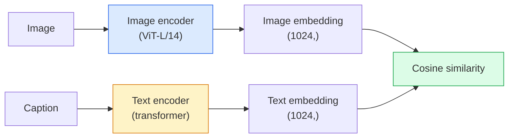

# Open-Vocabulary Vision — CLIP

> Train an image encoder and a text encoder together so that matching (image, caption) pairs land at the same point in a shared space. That is the whole trick.

**Type:** Build
**Languages:** Python
**Prerequisites:** Phase 4 Lesson 14 (ViT), Phase 4 Lesson 17 (Self-Supervised)
**Time:** ~45 minutes

## Learning Objectives

- Explain CLIP's two-tower architecture and contrastive training objective
- Use a pretrained CLIP (or SigLIP) for zero-shot classification without any task-specific training
- Implement zero-shot classification from scratch: encode class prompts, compute cosine similarity, take argmax
- Distinguish CLIP, SigLIP, OpenCLIP, and LLaVA/LLaMA-vision models — what each is for in 2026

## The Problem

Traditional classifiers are closed-vocabulary: a 1000-class ImageNet model can only predict 1000 labels. Every new category requires labelled data and a retrained head.

CLIP (Radford et al., OpenAI 2021) showed that training on 400M (image, caption) pairs scraped from the web produces a model that can classify into any set of categories at inference, described purely in natural language. You give it a new class by writing a sentence.

That capability — zero-shot transfer — is why every modern vision system starts with a CLIP-family checkpoint. Detection (Grounding DINO, OWL-ViT), segmentation (CLIPSeg, SAM), retrieval, content moderation, VLMs, and text-to-image generation all build on CLIP-style joint embeddings.

## The Concept

### Two towers



Both encoders end with a linear projection to the same embedding dimension (512 for CLIP-B/32, 1024 for CLIP-L/14). L2-normalise and compute cosine similarity.

### The objective

Given a batch of N (image, caption) pairs, build an NxN similarity matrix. Train both encoders so the diagonal (matching pairs) has high similarity and off-diagonals (non-matching) have low similarity.

```
sim_matrix = image_embeddings @ text_embeddings.T / tau

loss_i2t = cross_entropy(sim_matrix,       targets=arange(N))
loss_t2i = cross_entropy(sim_matrix.T,     targets=arange(N))
loss = (loss_i2t + loss_t2i) / 2
```

Symmetric because both image-to-text and text-to-image retrieval should work. `tau` (temperature) is typically learned as a scalar parameter, initialised to 0.07.

### SigLIP: a better loss

SigLIP (Zhai et al., 2023) replaced the softmax with per-pair sigmoid:

```
loss = mean over pairs of log(1 + exp(-y_ij * sim_ij))
y_ij = +1 if matching, -1 otherwise
```

Per-pair loss removes the batch-level normalisation that CLIP requires. SigLIP trains better at small batch sizes and matches or exceeds CLIP at equal data.

### Zero-shot classification

Given a trained CLIP:

1. For each class, compose a prompt: "a photo of a {class}".
2. Encode all class prompts with the text encoder -> `T` shape (C, d).
3. Encode the test image -> `I` shape (1, d).
4. Similarity = `I @ T.T` shape (1, C).
5. Argmax -> predicted class.

Prompt engineering matters. OpenAI published 80 prompt templates for ImageNet ("a photo of a {}", "a blurry photo of a {}", "a sketch of a {}", ...). Average the embeddings of all templates per class for an extra 1-3% top-1 accuracy.

### Where CLIP-style models are used in 2026

- **Zero-shot classification** — direct use.
- **Image retrieval** — encode all images once, embed query at inference.
- **Text-conditioned detection** — Grounding DINO, OWL-ViT wrap a CLIP text tower around a detector.
- **Text-conditioned segmentation** — CLIPSeg; SAM uses text-prompt inputs via CLIP.
- **VLMs** — LLaVA, Qwen-VL, InternVL wire a CLIP-family vision encoder into an LLM.
- **Text-to-image gen** — Stable Diffusion, DALL-E 3 condition on CLIP text embeddings.

Once you have a shared embedding space, every vision+language task becomes a distance computation.


## Further Reading

- [CLIP: Learning Transferable Visual Models from Natural Language Supervision (Radford et al., 2021)](https://arxiv.org/abs/2103.00020)
- [SigLIP: Sigmoid Loss for Language-Image Pre-Training (Zhai et al., 2023)](https://arxiv.org/abs/2303.15343)
- [OpenCLIP](https://github.com/mlfoundations/open_clip) — the community codebase
- [DINOv2 vs CLIP vs MAE: a features comparison](https://huggingface.co/blog/dinov2) — HF guide with side-by-side use cases

## Exercises

1. **Establish a baseline.** Run the lesson demo, then capture the inputs, outputs, and one invariant that demonstrates this objective: Explain CLIP's two-tower architecture and contrastive training objective.
2. **Change one variable.** Modify a single input or parameter and use the resulting evidence to investigate this objective: Use a pretrained CLIP (or SigLIP) for zero-shot classification without any task-specific training.
3. **Probe an edge case.** Predict the result before running it, compare prediction with observation, and explain the discrepancy while applying this objective: Implement zero-shot classification from scratch: encode class prompts, compute cosine similarity, take argmax.

## Reference Solution

Use the canonical [main.py](../code/main.py) as the executable baseline. A complete solution records a successful run, identifies the invariant tied to “Explain CLIP's two-tower architecture and contrastive training objective,” and changes only one variable for the comparison. The edge-case result must distinguish the prediction from the observation, explain the cause using “Implement zero-shot classification from scratch: encode class prompts, compute cosine similarity, take argmax,” and cite a repeatable check rather than relying on visual inspection alone.
