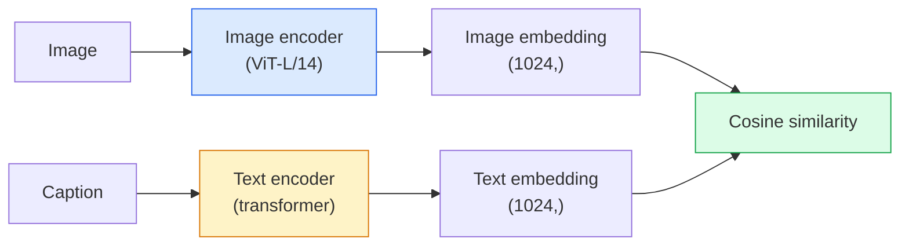

# Open-Vocabulary Vision — CLIP

> Train an image encoder and a text encoder together so that matching (image, caption) pairs land at the same point in a shared space. That is the whole trick.

**Type:** Build + Use
**Languages:** Python
**Prerequisites:** Phase 4 Lesson 14 (ViT), Phase 4 Lesson 17 (Self-Supervised)
**Time:** ~45 minutes

## Learning Objectives

- Explain CLIP's two-tower architecture and contrastive training objective
- Use a pretrained CLIP (or SigLIP) for zero-shot classification without any task-specific training
- Implement zero-shot classification from scratch: encode class prompts, compute cosine similarity, take argmax
- Distinguish CLIP, SigLIP, OpenCLIP, and LLaVA/LLaMA-vision models — what each is for in 2026

## The Problem

Traditional classifiers are closed-vocabulary: a 1000-class ImageNet model can only predict 1000 labels. Every new category requires labelled data and a retrained head.

CLIP (Radford et al., OpenAI 2021) showed that training on 400M (image, caption) pairs scraped from the web produces a model that can classify into any set of categories at inference, described purely in natural language. You give it a new class by writing a sentence.

That capability — zero-shot transfer — is why every modern vision system starts with a CLIP-family checkpoint. Detection (Grounding DINO, OWL-ViT), segmentation (CLIPSeg, SAM), retrieval, content moderation, VLMs, and text-to-image generation all build on CLIP-style joint embeddings.

## The Concept

### Two towers



Both encoders end with a linear projection to the same embedding dimension (512 for CLIP-B/32, 1024 for CLIP-L/14). L2-normalise and compute cosine similarity.

### The objective

Given a batch of N (image, caption) pairs, build an NxN similarity matrix. Train both encoders so the diagonal (matching pairs) has high similarity and off-diagonals (non-matching) have low similarity.

```
sim_matrix = image_embeddings @ text_embeddings.T / tau

loss_i2t = cross_entropy(sim_matrix,       targets=arange(N))
loss_t2i = cross_entropy(sim_matrix.T,     targets=arange(N))
loss = (loss_i2t + loss_t2i) / 2
```

Symmetric because both image-to-text and text-to-image retrieval should work. `tau` (temperature) is typically learned as a scalar parameter, initialised to 0.07.

### SigLIP: a better loss

SigLIP (Zhai et al., 2023) replaced the softmax with per-pair sigmoid:

```
loss = mean over pairs of log(1 + exp(-y_ij * sim_ij))
y_ij = +1 if matching, -1 otherwise
```

Per-pair loss removes the batch-level normalisation that CLIP requires. SigLIP trains better at small batch sizes and matches or exceeds CLIP at equal data.

### Zero-shot classification

Given a trained CLIP:

1. For each class, compose a prompt: "a photo of a {class}".
2. Encode all class prompts with the text encoder -> `T` shape (C, d).
3. Encode the test image -> `I` shape (1, d).
4. Similarity = `I @ T.T` shape (1, C).
5. Argmax -> predicted class.

Prompt engineering matters. OpenAI published 80 prompt templates for ImageNet ("a photo of a {}", "a blurry photo of a {}", "a sketch of a {}", ...). Average the embeddings of all templates per class for an extra 1-3% top-1 accuracy.

### Where CLIP-style models are used in 2026

- **Zero-shot classification** — direct use.
- **Image retrieval** — encode all images once, embed query at inference.
- **Text-conditioned detection** — Grounding DINO, OWL-ViT wrap a CLIP text tower around a detector.
- **Text-conditioned segmentation** — CLIPSeg; SAM uses text-prompt inputs via CLIP.
- **VLMs** — LLaVA, Qwen-VL, InternVL wire a CLIP-family vision encoder into an LLM.
- **Text-to-image gen** — Stable Diffusion, DALL-E 3 condition on CLIP text embeddings.

Once you have a shared embedding space, every vision+language task becomes a distance computation.


## Use It

OpenCLIP is the community default in 2026:

```python
import open_clip
import torch
from PIL import Image

model, _, preprocess = open_clip.create_model_and_transforms("ViT-B-32", pretrained="laion2b_s34b_b79k")
tokenizer = open_clip.get_tokenizer("ViT-B-32")

image = preprocess(Image.open("dog.jpg")).unsqueeze(0)
text = tokenizer(["a photo of a dog", "a photo of a cat", "a photo of a car"])

with torch.no_grad():
    image_features = model.encode_image(image)
    text_features = model.encode_text(text)
    image_features = image_features / image_features.norm(dim=-1, keepdim=True)
    text_features = text_features / text_features.norm(dim=-1, keepdim=True)
    probs = (100.0 * image_features @ text_features.T).softmax(dim=-1)

print(probs)
```

SigLIP is newer, trains better at small scales, and is preferred for new work: `google/siglip-base-patch16-224`. Hugging Face ships both.

## Ship It

This lesson produces:

- `outputs/prompt-zero-shot-class-picker.md` — a prompt that designs class templates for zero-shot CLIP given a list of classes and a domain.
- `outputs/skill-image-text-retriever.md` — a skill that builds an image embedding index with any CLIP checkpoint, supports query-by-text and query-by-image.


## Key Terms

| Term | What people say | What it actually means |
|------|----------------|----------------------|
| Two-tower | "Dual encoder" | Separate image and text encoders ending in a shared-dim projection head |
| Zero-shot | "No task-specific training" | Classify into classes described only by text at inference; no labels touched |
| Temperature / logit_scale | "tau" | Learned scalar that scales the similarity matrix before softmax |
| Prompt template | "A photo of a {}" | Natural-language wrapper around class names; averaging many templates boosts zero-shot accuracy |
| CLIP | "Image+text model" | The 2021 OpenAI model; vocabulary of the field in 2026 |
| SigLIP | "Sigmoid CLIP" | Swaps softmax for per-pair sigmoid; trains better at small batches |
| OpenCLIP | "Open reproduction" | Community-trained CLIP variants on LAION; production default for open-source pipelines |
| VLM | "Vision-language model" | A CLIP-family encoder plus an LLM, trained to answer questions about images |

## Further Reading

- [CLIP: Learning Transferable Visual Models from Natural Language Supervision (Radford et al., 2021)](https://arxiv.org/abs/2103.00020)
- [SigLIP: Sigmoid Loss for Language-Image Pre-Training (Zhai et al., 2023)](https://arxiv.org/abs/2303.15343)
- [OpenCLIP](https://github.com/mlfoundations/open_clip) — the community codebase
- [DINOv2 vs CLIP vs MAE: a features comparison](https://huggingface.co/blog/dinov2) — HF guide with side-by-side use cases
