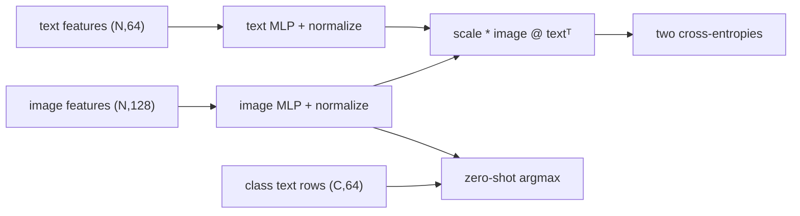

# Open-Vocabulary Vision — CLIP

> A two-tower model turns a list of text prompts into a candidate set; the score is only meaningful if both sides share a normalized space.

**Type:** Build
**Languages:** Python
**Prerequisites:** Phase 4 Lesson 14 (Vision Transformers), Phase 4 Lesson 17 (Self-Supervised Vision)
**Time:** ~45 minutes

## Learning Objectives

- Trace image and text projections into a shared normalized embedding dimension.
- Build normalized similarity, symmetric cross-entropy, and class routing with NumPy first.
- Derive the symmetric image-to-text/text-to-image cross-entropy target for paired rows.
- Use a positive logit scale without confusing it with a probability or a temperature parameter.
- Perform zero-shot selection by comparing each image row with one text row per candidate class.
- Separate this local synthetic fixture from a tokenizer, checkpoint, image decoder, or pretrained accuracy claim.

## The Problem

A closed classifier fixes its label head at training time. A CLIP-style two-tower model instead accepts a candidate list at inference: one image encoder and one text encoder project into the same space, and a similarity matrix ranks the candidates. The local lesson makes that matrix and its contracts executable without a tokenizer or downloaded weights.

## Build It

The NumPy Build-It path uses `numpy_row_normalize`, `numpy_similarity`, `numpy_clip_loss`, and `numpy_zero_shot_classify`: rows are normalized with a scale-stable norm, an `N×N` cosine matrix is scaled, both cross-entropies use diagonal pair targets, and each image routes to one supplied class name. The optional `TwoTower(img_in=128, txt_in=64, emb=64)` maps each input row through a small MLP and L2-normalizes the result; its Torch `clip_loss` and `zero_shot_classify` mirror the NumPy contracts.

```bash
cd phases/04-computer-vision/18-open-vocab-clip/code
python3 main.py
```

The command first prints the NumPy symmetric loss and four deterministic zero-shot labels. If PyTorch is available it then trains briefly on seeded synthetic prototype features. It does not load a CLIP checkpoint, tokenize natural language, decode pixels, or establish a real-world accuracy number; without PyTorch only the optional Use-It path is skipped.



## Use It

The framework-free seam is directly inspectable:

```python
import numpy as np
from main import numpy_clip_loss, numpy_zero_shot_classify

features = np.eye(4)
print(numpy_clip_loss(features, features, 2.0))
print(numpy_zero_shot_classify(features, features, ["red", "blue", "green", "yellow"]))
```

When PyTorch is available, compare it with the two-tower Use-It path:

```python
import torch
from main import TwoTower, clip_loss, zero_shot_classify

model = TwoTower(img_in=4, txt_in=3, emb=5)
images, texts = torch.randn(4, 4), torch.randn(4, 3)
i, t, scale = model(images, texts)
print(clip_loss(i, t, scale))
print(zero_shot_classify(model, torch.randn(2, 4), torch.randn(3, 3), ["red", "blue", "green"]))
```

Changing the number of class-text rows changes the candidate set, not the image encoder. A missing name, a zero vector, mismatched widths, or a singleton training batch is rejected explicitly.

## Ship It

Use `outputs/prompt-zero-shot-class-picker.md` to record prompt rows, checkpoint provenance, candidate-set coverage, and a held-out evaluation. Use `outputs/skill-image-text-retriever.md` for a pure in-memory similarity baseline; it deliberately does not import a tokenizer, image decoder, approximate-index library, or model hub.

## Exercises

1. With `N=4`, verify that the diagonal of the similarity matrix is the paired target in both directions.
2. Compare `clip_loss(torch.eye(4), torch.eye(4), 2.0)` with a row-rolled text matrix and explain the difference.
3. Run zero-shot selection with three class rows, then add a fourth. Check that output names always come from the supplied list.
4. Try a zero image row, mismatched batch sizes, a non-positive scale, and a name-list length mismatch. Record each validation error.
5. Explain why the local `log(8)` random-batch baseline is a sanity check for eight candidates, not a pretrained CLIP score.

## Reference Solution

Encoded rows have unit norm, so their dot product is cosine similarity. Both NumPy and Torch losses use paired diagonal targets in both directions and require at least two rows. Both zero-shot helpers return exactly one supplied class name per image row. Invalid shapes, zero vectors, scales, and class-name counts fail before an argmax result is emitted. Any synthetic training count is reproducible under the local seed but says nothing about a natural-image benchmark.

## Further Reading

- [CLIP](https://arxiv.org/abs/2103.00020) — symmetric contrastive image/text training.
- [SigLIP](https://arxiv.org/abs/2303.15343) — a different pairwise sigmoid objective; not implemented in this fixture.
