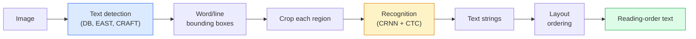

# OCR & Document Understanding

> OCR is a three-stage pipeline — detect text boxes, recognise the characters, then lay them out. Every modern OCR system reorders these stages or merges them.

**Type:** Build
**Languages:** Python
**Prerequisites:** Phase 4 Lesson 06 (Detection), Phase 7 Lesson 02 (Self-Attention)
**Time:** ~45 minutes

## Learning Objectives

- Trace the classical OCR pipeline (detect -> recognise -> layout) and the modern end-to-end alternatives (Donut, Qwen-VL-OCR)
- Implement CTC (Connectionist Temporal Classification) loss for sequence-to-sequence OCR training
- Use PaddleOCR or EasyOCR for production document parsing without training
- Distinguish OCR, layout parsing, and document understanding — and pick the right tool per task

## The Problem

Images full of text are everywhere: receipts, invoices, IDs, scanned books, forms, whiteboards, signs, screenshots. Extracting structured data from them — not just the characters, but "this is the total amount" — is one of the highest-value applied-vision problems.

The field splits into three skill layers:

1. **OCR proper**: turn pixels into text.
2. **Layout parsing**: group OCR output into regions (title, body, table, header).
3. **Document understanding**: extract structured fields ("invoice_total = $42.50") from layout.

Each layer has classical and modern approaches, and the gap between "I want text from an image" and "I need the total amount from this receipt" is bigger than most teams realise.

## The Concept

### The classical pipeline



- **Text detection** produces per-line or per-word quadrilaterals.
- **Recognition** crops each region to a fixed height, runs a CNN + BiLSTM + CTC to produce a character sequence.
- **Layout** rebuilds reading order (top-to-bottom, left-to-right for Latin; different for Arabic, Japanese).

### CTC in one paragraph

OCR recognition produces a variable-length sequence from a fixed-length feature map. CTC (Graves et al., 2006) lets you train this without character-level alignment. The model outputs a distribution over (vocab + blank) at every time step; CTC loss marginalises over all alignments that reduce to the target text after merging repeats and removing blanks.

```
raw output: "h h h _ _ e e l l _ l l o _ _"
after merge repeats and remove blanks: "hello"
```

CTC is the reason CRNN worked in 2015 and still trains most production OCR models in 2026.

### Modern end-to-end models

- **Donut** (Kim et al., 2022) — a ViT encoder + a text decoder; reads an image and emits JSON directly. No text detector, no layout module.
- **TrOCR** — ViT + transformer decoder for line-level OCR.
- **Qwen-VL-OCR / InternVL** — full vision-language models fine-tuned for OCR tasks; best accuracy in 2026 on complex documents.
- **PaddleOCR** — classical DB + CRNN pipeline in a mature production package; still the open-source workhorse.

End-to-end models need more data and compute but skip the error accumulation of multi-stage pipelines.

### Layout parsing

For structured documents, run a layout detector (LayoutLMv3, DocLayNet) that labels each region: Title, Paragraph, Figure, Table, Footnote. Reading order then becomes "iterate through regions in layout order, concatenate."

For forms, use **Key-Value extraction** models (Donut for visually-rich documents, LayoutLMv3 for plain scans). They take image + detected text + positions and predict structured key-value pairs.

### Evaluation metrics

- **Character Error Rate (CER)** — Levenshtein distance / length of reference. Lower is better. Production target: < 2% on clean scans.
- **Word Error Rate (WER)** — same at the word level.
- **F1 on structured fields** — for key-value tasks; measures whether `{invoice_total: 42.50}` appears correctly.
- **Edit distance on JSON** — for end-to-end document parsing; the Donut paper introduced normalised tree edit distance.


## Further Reading

- [CRNN (Shi et al., 2015)](https://arxiv.org/abs/1507.05717) — the original CNN+RNN+CTC architecture
- [CTC (Graves et al., 2006)](https://www.cs.toronto.edu/~graves/icml_2006.pdf) — the original CTC paper; densely packed with the algorithmic ideas
- [Donut (Kim et al., 2022)](https://arxiv.org/abs/2111.15664) — OCR-free document understanding transformer
- [PaddleOCR](https://github.com/PaddlePaddle/PaddleOCR) — the open-source production OCR stack
