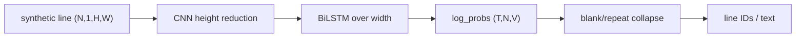

# OCR & Document Understanding

> Recognition, layout, and meaning are different contracts; CTC only solves the line-recognition alignment problem.

**Type:** Build
**Languages:** Python
**Prerequisites:** Phase 4 Lesson 06 (Object Detection)
**Time:** ~45 minutes

## Learning Objectives

- Explain how a CTC blank and repeat-collapse turn framewise IDs into a line string.
- Implement the greedy decoder and a log-space CTC forward dynamic program with NumPy first.
- Validate `(T,N,V)` log probabilities, flattened targets, and per-example CTC lengths before calling the loss.
- Build a fixed-height synthetic line and read its width as the recognizer's time-axis budget.
- Trace a compact CNN–BiLSTM–CTC recognizer without confusing it with text detection or layout parsing.
- Separate local deterministic regression results from claims about a production OCR stack or document fields.

## The Problem

An OCR product may detect text regions, recognize each crop, restore reading order, and extract fields. The local artifact implements only line recognition: a synthetic grayscale line becomes a time-major log-probability tensor and a CTC decoder turns it into IDs. Naming the omitted stages prevents a recognizer score from being mistaken for document understanding.

## Build It

`VOCAB[0]` is the blank. The NumPy Build-It path uses `numpy_build_batch`, `numpy_ctc_greedy_decode`, and `numpy_ctc_loss`: `numpy_ctc_loss` walks the blank-interleaved target trellis in log space and rejects an input length below `target_length + adjacent_repeat_count`. `synthetic_line("abc", height=32, char_width=8)` returns a `(32,24)` float image. `numpy_build_batch(["abc","xy"], max_len=3)` pads images to `(2,1,32,48)`, concatenates target IDs to a one-dimensional vector, and returns target lengths `[3,2]`.

The optional Torch Use-It path adds `TinyCRNN` and `ctc_loss`. It reduces height with pooling, treats the remaining width as time, and returns `(T,N,V)` log probabilities. Both loss paths check that every input length is between `1` and `T`, target lengths sum to the flattened target count, targets do not contain blank IDs, and repeated adjacent targets have the extra-frame requirement.

```bash
cd phases/04-computer-vision/19-ocr-document-understanding/code
python3 main.py
```

The demo first builds `(2,1,32,48)` NumPy lines, decodes `[0,11,11,0,12,0]` as `[11,12]`, and evaluates a finite log-space CTC loss. If PyTorch is available it then trains briefly on seeded strings such as `abc7` and `xy45`; otherwise only that optional Use-It path is skipped. This is not a CER claim and not an image detector.



## Use It

The framework-free Build-It path is:

```python
import numpy as np
from main import numpy_build_batch, numpy_ctc_greedy_decode

images, targets, lengths = numpy_build_batch(["abc", "xy"], max_len=3)
print(images.shape, targets.tolist(), lengths.tolist())
```

Use the Torch recognizer when the optional dependency is available:

```python
import torch
from main import VOCAB, TinyCRNN, build_batch, ctc_loss, greedy_ctc_decode

images, targets, target_lengths = build_batch(["abc", "xy"], max_len=3)
model = TinyCRNN(hidden=8, feat=4)
log_probs = model(images)
input_lengths = torch.full((2,), log_probs.shape[0], dtype=torch.long)
loss = ctc_loss(log_probs, targets, input_lengths, target_lengths)
print(log_probs.shape, float(loss), VOCAB[0])
```

Construct logits whose winning IDs are `[blank, 3, 3, blank, 3, 4]`; the decoder returns `[3,3,4]`, because a repeated character separated by a blank is not the same as an adjacent repeat.

## Ship It

Use `outputs/skill-ctc-decoder.md` for the decoder boundary and `outputs/prompt-ocr-stack-picker.md` to specify detection, recognition, layout, and field-evaluation requirements separately. The outputs do not import a package or assert a current provider ranking; a production choice needs a held-out document set, script coverage, and a latency gate.

## Exercises

1. Verify `VOCAB.index("a") == 11` and that `build_batch(["abc","xy"], max_len=3)` returns the stated shapes and lengths.
2. Feed the decoder a hand-built `(6,1,V)` log-probability tensor with IDs `[0,3,3,0,3,4]`; explain the resulting `[3,3,4]`.
3. Make `input_lengths` exceed `T`, put a blank in `targets`, change the target-length sum, and give `[3,3]` only two input frames. Each should raise `ValueError` before a loss calculation; repeated adjacent labels need one extra frame.
4. Pass an empty string, an uppercase character, and `max_len=2` to the builders; record the explicit errors.
5. Compare the recognizer's `(T,N,V)` output with the input `(N,1,H,W)` and identify which axis becomes CTC time.

## Reference Solution

The blank is ID 0; adjacent duplicate IDs collapse, while duplicates separated by blank remain. The NumPy batch fixture has shape `(2,1,32,48)`, target IDs `[11,12,13,34,35]`, and lengths `[3,2]`; its log-space loss rejects both target-length overflow and the extra-frame requirement for adjacent repeats. A valid Torch CRNN output is time-major `(T,2,37)` for the default vocabulary. `zero_infinity=True` remains a numerical guard after validation, not permission to accept an invalid training example. No local result measures production CER, layout quality, or field F1.

## Further Reading

- [CTC](https://www.cs.toronto.edu/~graves/icml_2006.pdf) — alignment marginalization and blank/repeat semantics.
- [CRNN](https://arxiv.org/abs/1507.05717) — the CNN–recurrent recognition pattern.
