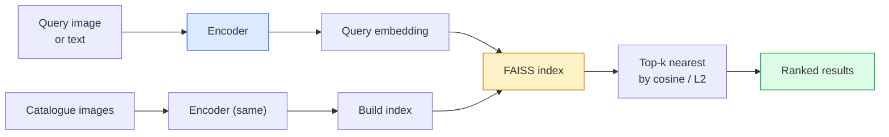

# Image Retrieval & Metric Learning

> A retrieval system ranks candidates by a distance in embedding space. Metric learning is the discipline of shaping that space so the distances mean what you want.

**Type:** Build
**Languages:** Python
**Prerequisites:** Phase 4 Lesson 14 (ViT), Phase 4 Lesson 18 (CLIP)
**Time:** ~45 minutes

## Learning Objectives

- Explain triplet, contrastive, and proxy-based metric learning losses and pick the right one for a given dataset
- Implement L2-normalisation and cosine similarity correctly and audit the difference between "same item" and "same class" retrieval
- Build a FAISS index, query it by text and by image, and report recall@K for a held-out query set
- Use DINOv2, CLIP, and SigLIP as off-the-shelf embedding backbones and know when each wins

## The Problem

Retrieval is everywhere in production vision: duplicate detection, reverse image search, visual search ("find similar products"), face re-identification, person re-ID for surveillance, instance-level matching for e-commerce. The product question is always the same: "given this query image, rank my catalogue."

Two design decisions shape the whole system. The embedding — what model produces the vectors. The index — how to find nearest neighbours at scale. Both are commodity in 2026 (DINOv2 for the embedding, FAISS for the index), which raises the bar: the hard part is defining *what counts as similar* for your application, then shaping the embedding space so the distances match.

That shaping is metric learning. It is a small but high-leverage discipline.

## The Concept

### Retrieval at a glance



### The four loss families

| Loss | Requires | Pros | Cons |
|------|----------|------|------|
| **Contrastive** | (anchor, positive) + negatives | Simple, works with any pair label | Slow to converge without many negatives |
| **Triplet** | (anchor, positive, negative) | Intuitive; direct margin control | Hard-triplet mining is expensive |
| **NT-Xent / InfoNCE** | Pairs + batch-mined negatives | Scales to large batches | Needs big batch or momentum queue |
| **Proxy-based (ProxyNCA)** | Class labels only | Fast, stable, no mining | Can overfit to proxies on small datasets |

For most production use cases, start with a pretrained backbone and only add a metric-learning fine-tune if the off-the-shelf embeddings underperform on your test set.

### Triplet loss formally

```
L = max(0, ||f(a) - f(p)||^2 - ||f(a) - f(n)||^2 + margin)
```

Pull anchor `a` close to positive `p`, push it away from negative `n`, with a `margin` that ensures a gap. The three-image structure generalises to any similarity ordering.

Mining matters: easy triplets (`n` already far from `a`) contribute zero loss; only hard triplets teach the network. Semi-hard mining (`n` further than `p` but within margin) is the 2016 FaceNet recipe and still dominates.

### Cosine similarity vs L2

Two metrics, two conventions:

- **Cosine**: angle between vectors. Requires L2-normalised embeddings.
- **L2**: Euclidean distance. Works on raw or normalised embeddings, but is usually paired with L2-normalised + squared L2.

For most modern nets the two are equivalent: `||a - b||^2 = 2 - 2 cos(a, b)` when `||a|| = ||b|| = 1`. Pick the convention that matches your embedding training; mixing them silently changes what "nearest" means.

### Recall@K

The standard retrieval metric:

```
recall@K = fraction of queries where at least one correct match is in the top K results
```

Report recall@1, @5, @10 side by side. A recall@10 above 0.95 with recall@1 below 0.5 means the embedding space has the right structure but the ranking is noisy — try longer fine-tunes or a re-ranking step.

For duplicate detection, precision@K matters more because every false positive is a user-visible mistake. For visual search, recall@K is the product signal.

### FAISS in one paragraph

Facebook AI Similarity Search. The de-facto library for nearest-neighbour search. Three index choices:

- `IndexFlatIP` / `IndexFlatL2` — brute force, exact, no training. Use up to ~1M vectors.
- `IndexIVFFlat` — partition into K cells, search only the closest few cells. Approximate, fast, needs training data.
- `IndexHNSW` — graph-based, fastest for many queries, large index size.

For 100k vectors you probably want `IndexFlatIP` on cosine similarity. For 10M you want `IndexIVFFlat`. For 100M+ combined with product quantisation (`IndexIVFPQ`).

### Instance-level vs category-level retrieval

Two very different problems with the same name:

- **Category-level** — "find cats in my catalogue." Class-conditional similarity; off-the-shelf CLIP / DINOv2 embeddings work well.
- **Instance-level** — "find *this exact product* in my catalogue." Needs fine-grained discrimination between visually similar objects of the same class; off-the-shelf embeddings under-perform; fine-tuning with metric learning matters.

Always ask which one you are solving before picking a model.


## Build It

Reconstruct **Image Retrieval & Metric Learning** by following `triplet_loss` on tokens=["red","fox"]. Run `python3 main.py` and verify that the attention/embedding shape follows the token count and each valid attention row remains normalized.

## Use It

Call `triplet_loss` from a small caller with tokens=["red","fox"]. Compare its result with the demo output, and record the input contract and the one field a downstream user should rely on.

## Ship It

Hand off `outputs/prompt-retrieval-loss-picker.md` with the command `python3 main.py`, the accepted input shape (tokens=["red","fox"]), the expected observable result, and a failure note for malformed inputs.

## Further Reading

- [FaceNet: A Unified Embedding for Face Recognition (Schroff et al., 2015)](https://arxiv.org/abs/1503.03832) — the triplet loss / semi-hard mining paper
- [In Defense of the Triplet Loss for Person Re-Identification (Hermans et al., 2017)](https://arxiv.org/abs/1703.07737) — practical guide to triplet fine-tuning
- [FAISS documentation](https://github.com/facebookresearch/faiss/wiki) — every index, every trade-off
- [SMoT: Metric Learning Taxonomy (Kim et al., 2021)](https://arxiv.org/abs/2010.06927) — survey of modern losses and their connections

## Exercises

This lab follows `triplet_loss` and `semi_hard_negatives` on a controlled fixture; write down the value before changing the input.

1. **Trace the canonical fixture.** From `code/`, run `python3 main.py` using tokens=["red","fox"]. Follow `triplet_loss`, `semi_hard_negatives`, `recall_at_k`. Expect the attention/embedding shape follows the token count and each valid attention row remains normalized; capture the first printed shape, metric, status, or summary field and state which part supports **Explain triplet, contrastive, and proxy-based metric learning losses and pick the right one for a given dataset**.
2. **Change the controlled parameter.** Repeat the command after changing only the token sequence: use tokens=["red","fox","runs"]. Predict the direction of the change, then compare the two output values. Explain why **Implement L2-normalisation and cosine similarity correctly and audit the difference between "same item" and "same class" retrieval** says the other inputs should stay fixed.
3. **Exercise the guard.** Feed the implementation tokens=[]. Before running it, write down whether the relevant function should return an empty value, a zero-sized result, or a validation error. Check the observed status against **Build a FAISS index, query it by text and by image, and report recall@K for a held-out query set** and record the exception text if the code rejects the case.
4. **Prepare the artifact for reuse.** Open `outputs/prompt-retrieval-loss-picker.md` and add a worked example using tokens=["red","fox"]. Include the input contract, one expected output field, and a named acceptance check for **Use DINOv2, CLIP, and SigLIP as off-the-shelf embedding backbones and know when each wins**; note what the demo cannot establish.

## Reference Solution

A checkable result for **Image Retrieval & Metric Learning** should contain:

- the `python3 main.py` output for tokens=["red","fox"], with `triplet_loss`, `semi_hard_negatives`, `recall_at_k` traced to the value or shape that supports **Explain triplet, contrastive, and proxy-based metric learning losses and pick the right one for a given dataset**;
- a before/after comparison for the token sequence, where tokens=["red","fox","runs"] changes the observation in the direction predicted by **Implement L2-normalisation and cosine similarity correctly and audit the difference between "same item" and "same class" retrieval**;
- a recorded result for tokens=[] that matches the implementation’s validation or empty-result contract and explains the evidence for **Build a FAISS index, query it by text and by image, and report recall@K for a held-out query set**; and
- an updated `outputs/prompt-retrieval-loss-picker.md` example with a concrete input, expected output field, and acceptance check tied to **Use DINOv2, CLIP, and SigLIP as off-the-shelf embedding backbones and know when each wins**.

Run the lesson tests after the demo. If the boundary behaves differently from the prediction, keep the actual exception or output and explain the implementation path that produced it.
