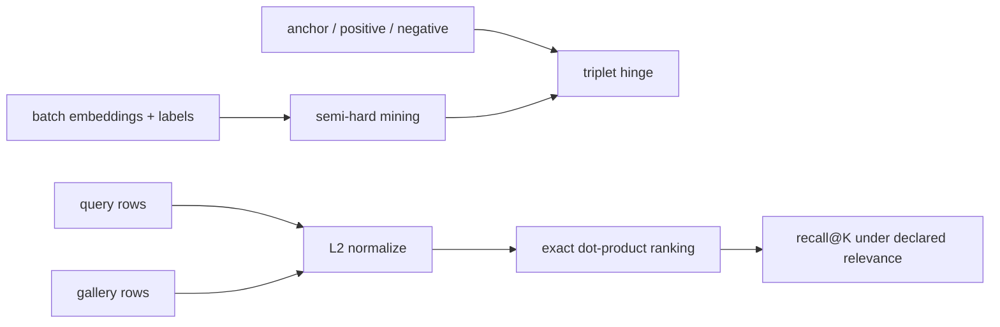

# Image Retrieval & Metric Learning

> Retrieval quality starts with a relevance definition, then makes the distance function obey it.

**Type:** Build
**Languages:** Python
**Prerequisites:** Phase 4 Lesson 17 (Self-Supervised Vision), Phase 4 Lesson 18 (Open-Vocabulary CLIP)
**Time:** ~45 minutes

## Learning Objectives

- Compute a triplet hinge and identify when a margin violation contributes zero.
- Build triplet loss, mining, and exact Recall@K with NumPy before using Torch.
- Mine the nearest same-class positive and a different-class semi-hard or fallback negative from a batch.
- Normalize query and gallery embeddings before exact cosine-similarity ranking.
- Calculate recall@K while distinguishing same-class relevance from exact-instance relevance.
- Validate batch shapes, labels, finite values, and the legal range of `k` before ranking.

## The Problem

The phrase “similar image” is underspecified. Category retrieval may treat any image of a bicycle as relevant; instance retrieval may require the exact bicycle. Metric learning can shape the embedding, but evaluation must state the relevance label and exclude malformed or self-generated cases. The local lesson uses six seeded prototype classes and an exact in-memory search so every distance and index is inspectable.

## Build It

The NumPy Build-It path exposes `numpy_triplet_loss`, `numpy_semi_hard_negatives`, and `numpy_recall_at_k`. `numpy_triplet_loss(a,p,n,margin)` computes `relu(d(a,p) - d(a,n) + margin).mean()` with scale-stable Euclidean distances; an unrepresentable distance or hinge is rejected rather than returned as `NaN`/`inf`. The miner requires at least two examples per class and two classes, chooses the nearest same-class positive, then prefers a different-class negative with `d_an > d_ap` and finite gap `d_an - d_ap < margin`; if none exists it falls back to the closest different-class row. Recall normalizes both matrices with a scale-stable norm, checks `1 <= k <= gallery_rows`, ranks by dot product, and asks whether any top-k label equals the query label.

The optional Torch `Encoder`, `triplet_loss`, `semi_hard_negatives`, and `recall_at_k` mirror those local contracts.

```bash
cd phases/04-computer-vision/20-image-retrieval-metric/code
python3 main.py
```

The demo first prints a NumPy triplet value, mined positive/negative indices, and Recall@1 = 1.000 for a four-row fixture. If PyTorch is available it then trains a small encoder and prints recall@1, @5, and @10. These values are local regression observations, not an ImageNet or product benchmark; without PyTorch only the optional Use-It path is skipped.



## Use It

Start with exact NumPy retrieval:

```python
import numpy as np
from main import numpy_recall_at_k

query = np.array([[10.0, 0.0], [0.0, 10.0]])
gallery = np.array([[1.0, 0.0], [0.0, 1.0], [-1.0, 0.0]])
print(numpy_recall_at_k(query, gallery, np.array([0, 1]), np.array([0, 1, 2]), k=1))
```

Use the Torch encoder path when the optional dependency is available:

```python
import torch
from main import recall_at_k

query = torch.tensor([[10.0, 0.0], [0.0, 10.0]])
gallery = torch.tensor([[1.0, 0.0], [0.0, 1.0], [-1.0, 0.0]])
print(recall_at_k(query, gallery, torch.tensor([0, 1]), torch.tensor([0, 1, 2]), k=1))
```

The result is `1.0` because each top-1 gallery row has the query's class label. Change the labels to exact IDs when the product asks for same-instance retrieval; a same-class hit is then not enough.

## Ship It

Use `outputs/prompt-retrieval-loss-picker.md` to record the relevance definition, supervision type, and held-out split. Use `outputs/skill-recall-at-k-runner.md` for the exact normalized-matrix baseline. An approximate index is a separate optimization; it must preserve the same ranking contract and be evaluated against the exact baseline.

## Exercises

1. Calculate `0.4 - 0.7 + 0.2 = -0.1` and verify that the triplet contribution is zero.
2. Mine `emb=[[0,0],[.1,0],[1,0],[1.1,0]]` with labels `[0,0,1,1]` and margin 1.0. Check that positives are `[1,0,3,2]`, share labels, and negative indices do not.
3. Compare recall@1 and recall@2 for the two-query fixture; explain why adding a gallery row can change the result without changing embeddings.
4. Try `k=0`, `k=gallery_size+1`, mismatched embedding widths, empty queries, and non-integer labels. Record the explicit errors.
5. State whether your real evaluation is category-level or instance-level and name the ID used to prevent accidental self-retrieval.

## Reference Solution

The triplet hinge is zero when the negative is at least the margin farther than the positive. Both miners choose the nearest same-class positive, return a different-class negative, and use a closest fallback when no semi-hard row exists. The exact NumPy recall fixture normalizes vectors, returns 1.0 for the aligned two-query example, and rejects illegal `k` or zero/empty matrices; the Torch path adds the same shape checks. A production score still needs a named gallery, query split, and relevance annotation.

## Further Reading

- [FaceNet](https://arxiv.org/abs/1503.03832) — triplet loss and semi-hard negative mining.
- [In Defense of the Triplet Loss](https://arxiv.org/abs/1703.07737) — practical metric-learning choices.
