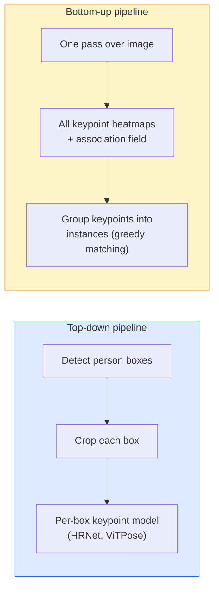

# Keypoint Detection & Pose Estimation

> A pose is a set of ordered keypoints. A keypoint detector is a heatmap regressor. Everything else is bookkeeping.

**Type:** Build
**Languages:** Python
**Prerequisites:** Phase 4 Lesson 06 (Detection), Phase 4 Lesson 07 (U-Net)
**Time:** ~45 minutes

## Learning Objectives

- Distinguish top-down and bottom-up pose estimation and state when each is used
- Regress heatmaps for K keypoints with a Gaussian-per-keypoint target and extract keypoint coordinates at inference
- Explain Part Affinity Fields (PAFs) and how bottom-up pipelines associate keypoints into instances
- Use MediaPipe Pose or MMPose for production keypoint estimation and understand their output format

## The Problem

Keypoint tasks hide under many names: human pose (17 body joints), face landmarks (68 or 478 points), hand (21 points), animal pose, robotic object pose, medical anatomy landmarks. Every one of them shares the same structure: detect K discrete points on an object and output their (x, y) coordinates.

Pose estimation is the foundation of motion capture, fitness apps, sports analytics, gesture control, animation, AR try-on, and robotic grasping. The 2D case is mature; 3D pose (estimating joint positions in world coordinates from a single camera) is the current research frontier.

The engineering question is scale. A single-image, single-person pose is a 20ms problem. Multi-person pose in a crowd at 30 fps is a different problem with different architectures.

## The Concept

### Top-down vs bottom-up



- **Top-down** — detect people first, then run a per-person keypoint model on each crop. Highest accuracy; scales linearly with number of people.
- **Bottom-up** — one forward pass predicts all keypoints plus an association field; group them. Constant time regardless of crowd size.

Top-down (HRNet, ViTPose) is the accuracy leader; bottom-up (OpenPose, HigherHRNet) is the throughput leader for crowded scenes.

### Heatmap regression

Instead of regressing `(x, y)` directly, predict an `H x W` heatmap per keypoint with a Gaussian blob centred at the true location.

```
target[k, y, x] = exp(-((x - cx_k)^2 + (y - cy_k)^2) / (2 sigma^2))
```

At inference, the argmax of each heatmap is the predicted keypoint location.

Why heatmaps work better than direct regression: the network's spatial structure (conv feature map) aligns naturally with spatial output. Gaussian targets also regularise — a small localisation error produces a small loss, not zero.

### Sub-pixel localisation

Argmax gives integer coordinates. For sub-pixel precision, refine by fitting a parabola to the argmax and its neighbours, or use the well-known offset `(dx, dy) = 0.25 * (heatmap[y, x+1] - heatmap[y, x-1], ...)` direction.

### Part Affinity Fields (PAFs)

OpenPose's trick for bottom-up association. For each pair of connected keypoints (e.g. left shoulder to left elbow), predict a 2-channel field that encodes the unit vector pointing from one to the other. To associate a shoulder with its elbow, integrate the PAF along the line connecting candidate pairs; the pair with the highest integral is matched.

```
For each connection (limb):
  PAF channels: 2 (unit vector x, y)
  Line integral: sum over sample points of (PAF . line_direction)
  Higher integral = stronger match
```

Elegant and scales to arbitrary crowd sizes without per-person crops.

### COCO keypoints

The standard body-pose dataset: 17 keypoints per person, PCK (Percentage of Correct Keypoints) and OKS (Object Keypoint Similarity) as metrics. OKS is the keypoint analogue of IoU and is what COCO mAP@OKS reports.

### 2D vs 3D

- **2D pose** — image coordinates; solved at production quality (MediaPipe, HRNet, ViTPose).
- **3D pose** — world / camera coordinates; still active research. Common approaches:
  - Lift 2D predictions to 3D with a small MLP (VideoPose3D).
  - Direct 3D regression from image (PyMAF, MHFormer).
  - Multi-view setups (CMU Panoptic) for ground truth.


## Further Reading

- [OpenPose (Cao et al., 2017)](https://arxiv.org/abs/1812.08008) — bottom-up with PAFs; still the best writeup of the approach
- [HRNet (Sun et al., 2019)](https://arxiv.org/abs/1902.09212) — the top-down reference architecture
- [ViTPose (Xu et al., 2022)](https://arxiv.org/abs/2204.12484) — plain ViT as a pose backbone; current SOTA on many benchmarks
- [MediaPipe Pose](https://developers.google.com/mediapipe/solutions/vision/pose_landmarker) — production real-time pose; the fastest deployed stack in 2026

## Exercises

1. **Establish a baseline.** Run the lesson demo, then capture the inputs, outputs, and one invariant that demonstrates this objective: Distinguish top-down and bottom-up pose estimation and state when each is used.
2. **Change one variable.** Modify a single input or parameter and use the resulting evidence to investigate this objective: Regress heatmaps for K keypoints with a Gaussian-per-keypoint target and extract keypoint coordinates at inference.
3. **Probe an edge case.** Predict the result before running it, compare prediction with observation, and explain the discrepancy while applying this objective: Explain Part Affinity Fields (PAFs) and how bottom-up pipelines associate keypoints into instances.

## Reference Solution

Use the canonical [main.py](../code/main.py) as the executable baseline. A complete solution records a successful run, identifies the invariant tied to “Distinguish top-down and bottom-up pose estimation and state when each is used,” and changes only one variable for the comparison. The edge-case result must distinguish the prediction from the observation, explain the cause using “Explain Part Affinity Fields (PAFs) and how bottom-up pipelines associate keypoints into instances,” and cite a repeatable check rather than relying on visual inspection alone.
