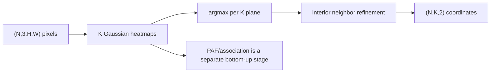

# Keypoint Detection & Pose Estimation

> A heatmap makes a coordinate prediction spatial: the peak is the joint, and the target construction is part of the contract.

**Type:** Build
**Languages:** Python
**Prerequisites:** Phase 4 Lesson 06 (Object Detection), Phase 4 Lesson 07 (Semantic Segmentation)
**Time:** ~45 minutes

## Learning Objectives

- Construct a finite Gaussian target at a valid integer or sub-pixel coordinate.
- Decode and refine NumPy heatmaps before using the optional Torch network.
- Preserve the `(N,3,H,W) -> (N,K,H,W)` shape through a compact keypoint head.
- Decode flattened heatmap argmax indices as `(x,y)` rather than swapping axes.
- Apply a bounded first-difference sub-pixel offset only when neighboring pixels exist.
- Generate a reproducible four-point fixture while separating it from multi-person and 3-D pose claims.

## The Problem

Top-down pose first detects people and predicts keypoints per crop; bottom-up pose predicts all keypoint heatmaps and then associates them with an extra relation such as a Part Affinity Field. This lesson implements the heatmap half of a top-down-style toy task. It does not implement person detection, PAF grouping, a real camera pipeline, or a 3-D pose model.

## Build It

`gaussian_heatmap(size,cx,cy,sigma)` requires a finite positive `sigma` whose square is also representable and positive, plus a coordinate inside the `size×size` grid. The NumPy Build-It path uses `numpy_heatmap_to_coords` and `numpy_subpixel_refine` to decode `(N,K,H,W)` arrays, uses `idx // W` for y and `idx % W` for x, and adds at most ±0.25 along each interior axis. The optional `TinyKeypointNet` accepts non-empty NCHW tensors with three channels and H/W divisible by four, then returns K heatmap channels at the original spatial size.

`make_synthetic_sample` requires `size >= 24` so four-pixel markers and the sampling interval `[10, size-10)` are both valid. Pass an explicit `np.random.Generator` when reproducibility matters.

```bash
cd phases/04-computer-vision/21-keypoint-pose/code
python3 main.py
```

The demo first decodes the four NumPy target heatmaps and prints argmax/sub-pixel local errors (both 0.000px for the integer fixture). If PyTorch is available it then trains briefly on eight-sample batches; otherwise only that optional Use-It path is skipped.



## Use It

The framework-free decoder is:

```python
import numpy as np
from main import make_synthetic_sample, numpy_heatmap_to_coords

_, targets, points = make_synthetic_sample(24, np.random.default_rng(3))
print(numpy_heatmap_to_coords(targets[None])[0], points)
```

When PyTorch is available, compare it with the network and Torch decoder:

```python
import numpy as np
import torch
from main import TinyKeypointNet, gaussian_heatmap, heatmap_to_coords, make_synthetic_sample

heatmap = gaussian_heatmap(16, 5, 7)
print(np.unravel_index(int(heatmap.argmax()), heatmap.shape)[::-1])
model = TinyKeypointNet(num_keypoints=4, base=4)
print(model(torch.zeros(2, 3, 16, 20)).shape)
_, targets, points = make_synthetic_sample(24, np.random.default_rng(3))
print(targets.shape, points.shape, heatmap_to_coords(torch.from_numpy(targets[None])).shape)
```

## Ship It

Use `outputs/skill-heatmap-to-coords.md` for the decoder and confidence boundary. Use `outputs/prompt-pose-stack-picker.md` to state whether an external top-down/bottom-up stack, calibrated multi-view setup, or this local heatmap fixture is appropriate. Do not copy the four-point error into a human-pose or 3-D performance claim.

## Exercises

1. Verify that `gaussian_heatmap(16,5,7)` has its maximum at `(x=5,y=7)` and that `sigma=0`, `cx=16`, and `cy=nan` are rejected.
2. Feed `heatmap_to_coords` a tensor with a single peak at `[y=2,x=4]`; confirm the result is `[4,2]`.
3. Put the peak at `(0,0)` and at an interior point with an asymmetric neighbor. Check that the border receives no offset and the interior offset is bounded by 0.25.
4. Generate `make_synthetic_sample(24, np.random.default_rng(3))` twice and compare all three arrays. Try size 23 and `rng="seed"`.
5. Run the model with `(2,3,16,20)` and then with a height not divisible by four; explain why the latter is rejected before a convolution.

## Reference Solution

The Gaussian peak is at the requested coordinate, NumPy decoding preserves `(N,K,2)`, and the optional model preserves `(N,K,H,W)`; both decoders return x before y. Interior refinement uses the sign of neighbor differences and never changes a border coordinate. The 24×24 synthetic sample has shapes `(3,24,24)`, `(4,24,24)`, and `(4,2)` and is reproducible under the same generator seed. These checks do not measure OKS, multi-person association, or 3-D depth.

## Further Reading

- [OpenPose](https://arxiv.org/abs/1812.08008) — bottom-up keypoint association with Part Affinity Fields.
- [COCO keypoint evaluation](https://cocodataset.org/#keypoints-eval) — OKS-based evaluation terminology.
