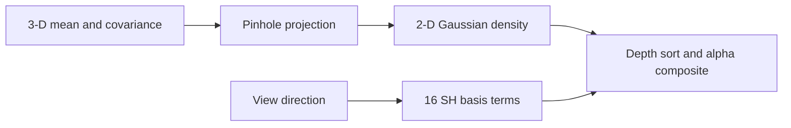

# 3D Gaussian Splatting: Projection and Compositing

> Turn one 3-D Gaussian into a camera-space ellipse, then composite a few ellipses into an image.

**Type:** Build
**Languages:** Python
**Prerequisites:** 01-image-fundamentals, 02-convolutions-from-scratch
**Time:** ~45 minutes

## Learning Objectives

- Derive the pinhole Jacobian used to propagate a 3-D covariance into image space.
- Evaluate a normalized 2-D Gaussian without relying on a renderer.
- Composite depth-sorted colors with front-to-back transmittance.
- Evaluate degree-three real spherical-harmonic basis functions for view-dependent color.
- State which guarantees belong to this small NumPy fixture and which require a production renderer.

## Build It

`code/main.py` is an offline, NumPy-first slice of the representation. `project_gaussian` accepts
`mean_3d=(x,y,z)`, a positive-definite `3x3` covariance, and `(fx,fy,cx,cy)`. With

```text
u = fx*x/z + cx,       v = fy*y/z + cy
J = [[fx/z, 0, -fx*x/z²], [0, fy/z, -fy*y/z²]],
Σ₂ = J Σ₃ Jᵀ,
```

the returned mean and covariance describe the local image ellipse. A non-positive camera depth,
non-finite input, or non-positive-definite covariance is rejected before a matrix inverse.

`eval_2d_gaussian` returns `(G,H,W)` normalized densities. `rasterise_2d` sorts splats by depth and
updates `T <- T(1-α)` after adding `Tα colour`; it returns both the RGB image and residual `T`.
`make_target` is a deterministic two-shape fixture, not a claim about reconstruction quality.

The degree-three basis has 16 terms. `eval_sh_degree_3` expects coefficients `(N,16,3)` and
non-zero directions `(N,3)`; directions are normalized before evaluation.



## Use It

Run `python3 code/main.py` from the lesson directory. The demo prints a projected center,
covariance trace, image shape, residual-transmittance range, SH shape, and target mean. It writes
no files and downloads no weights. A GPU rasterizer can consume the same projected means/covariances,
but matching its performance or visibility rules is outside this local artifact.

## Ship It

The reusable handoff is the `(image, residual_transmittance)` pair. Keep the camera convention,
depth ordering, opacity range `[0,1]`, and covariance-positive-definite checks with it. Persisting
millions of splats, compression, and view-dependent training need a separate storage and profiling
contract; the fixture does not estimate those costs.

## Exercises

1. Call `project_gaussian([1,2,4], eye(3), [8,10,2,3])` and verify the image mean is `(4,8)`.
2. Render two identical ellipses with depths `2` and `1`, red/blue colors, and opacity `.5`.
   Which channel dominates at the center, and what happens to residual transmittance?
3. Pass a singular covariance, a camera point with `z=0`, and an opacity `1.1`. Record the
   exception type and explain why each guard protects a later numerical operation.

## Reference Solution

For the first fixture, `u=8*1/4+2=4` and `v=10*2/4+3=8`; the implementation returns that direct
pinhole calculation. In the compositing test,
depth `1` is processed first, so its blue contribution is `0.5`; the later red contribution is
weighted by the remaining transmittance, so residual transmittance is lower than one wherever the
splats have density. Singular covariance, non-positive depth, and out-of-range opacity each raise
`ValueError`, rather than allowing `inv`, division, or alpha updates to produce misleading output.
