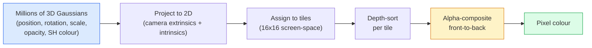

# 3D Gaussian Splatting from Scratch

> A scene is a cloud of millions of 3D Gaussians. Each one has a position, orientation, scale, opacity, and a colour that depends on viewing direction. Rasterise them, backprop through the rasterisation, done.

**Type:** Build
**Languages:** Python
**Prerequisites:** Phase 4 Lesson 13 (3D Vision & NeRF), Phase 1 Lesson 12 (Tensor Operations), Phase 4 Lesson 10 (Diffusion basics optional)
**Time:** ~90 minutes

## Learning Objectives

- Explain why 3D Gaussian Splatting replaced NeRF as the production default for photorealistic 3D reconstruction in 2026
- State the six per-Gaussian parameters (position, rotation quaternion, scale, opacity, spherical harmonics colour, optional feature) and how many floats each contributes
- Implement a 2D Gaussian splatting rasterizer from scratch using `alpha` compositing, then show how the 3D case projects to the same loop
- Use `nerfstudio`, `gsplat`, or `SuperSplat` to reconstruct a scene from 20-50 photos and export to the `KHR_gaussian_splatting` glTF extension or the OpenUSD 26.03 `UsdVolParticleField3DGaussianSplat` schema

## The Problem

A NeRF stores a scene as the weights of an MLP. Every rendered pixel is hundreds of MLP queries along a ray. Training takes hours, rendering takes seconds, and the weights cannot be edited — if you want to move a chair inside a scene, you have to retrain.

3D Gaussian Splatting (Kerbl, Kopanas, Leimkühler, Drettakis, SIGGRAPH 2023) replaced all of that. A scene is an explicit set of 3D Gaussians. Rendering is GPU rasterisation at 100+ fps. Training takes minutes. Editing is direct: translate a subset of Gaussians and you have moved the chair. By 2026 the Khronos Group has ratified a glTF extension for Gaussian splats, OpenUSD 26.03 ships a Gaussian splat schema, Zillow and Apartments.com render real estate with them, and most new research papers on 3D reconstruction are variants on the core 3DGS idea.

The mental model is simple, the math has enough moving parts that most introductions start at rasterisation and skip past the projections and spherical harmonics. This lesson builds the whole thing — a 2D version first, then the 3D extension.

## The Concept

### What a Gaussian carries

One 3D Gaussian is a parametric blob in space with these attributes:

```
position         mu         (3,)    centre in world coordinates
rotation         q          (4,)    unit quaternion encoding orientation
scale            s          (3,)    log-scales per axis (exponentiated at render time)
opacity          alpha      (1,)    post-sigmoid opacity [0, 1]
SH coefficients  c_lm       (3 * (L+1)^2,)   view-dependent colour
```

Rotation + scale build a 3x3 covariance: `Sigma = R S S^T R^T`. That is the shape of the Gaussian in 3D. Spherical harmonics let the colour change with viewing direction — specular highlights, subtle sheen, view-dependent glow — without storing per-view textures. With SH degree 3 you get 16 coefficients per colour channel, 48 floats per Gaussian for colour alone.

A scene typically has 1-5 million Gaussians. Each stores roughly 60 floats (3 + 4 + 3 + 1 + 48 + misc). That is 240 MB for a five-million-Gaussian scene — far smaller than the equivalent point cloud with per-point texture, and an order of magnitude smaller than a NeRF's MLP weights re-rendered at high resolution.

### Rasterisation, not ray marching



Five steps, all GPU-friendly. No MLP query per pixel. A single RTX 3080 Ti renders 6 million splats at 147 fps.

### The projection step

The 3D Gaussian at world position `mu` with 3D covariance `Sigma` projects to a 2D Gaussian at screen position `mu'` with 2D covariance `Sigma'`:

```
mu' = project(mu)
Sigma' = J W Sigma W^T J^T          (2 x 2)

W = viewing transform (rotation + translation of camera)
J = Jacobian of the perspective projection at mu'
```

The 2D Gaussian's footprint is an ellipse whose axes are the eigenvectors of `Sigma'`. Every pixel inside that ellipse receives the Gaussian's contribution, weighted by `exp(-0.5 * (p - mu')^T Sigma'^-1 (p - mu'))`.

### The alpha-compositing rule

For one pixel, the Gaussians that cover it are sorted back-to-front (or equivalently front-to-back with inverted formula). Colour is composited with the same equation as every semi-transparent rasteriser since the 1980s:

```
C_pixel = sum_i alpha_i * T_i * c_i

T_i = prod_{j < i} (1 - alpha_j)       transmittance up to i
alpha_i = opacity_i * exp(-0.5 * d^T Sigma'^-1 d)   local contribution
c_i = eval_SH(SH_i, view_direction)    view-dependent colour
```

This is **the same equation as NeRF's volumetric render**, just over an explicit sparse set of Gaussians instead of dense samples along a ray. That identity is why rendered quality matches NeRF — both are integrating the same radiance-field equation.

### Why this is differentiable

Every step — projection, tile assignment, alpha compositing, SH evaluation — is differentiable with respect to the Gaussian parameters. Given a ground-truth image, compute rendered pixel loss, backprop through the rasteriser, update all `(mu, q, s, alpha, c_lm)` by gradient descent. Over ~30,000 iterations the Gaussians find their right positions, scales, and colours.

### Densification and pruning

A fixed set of Gaussians cannot cover a complex scene. Training includes two adaptive mechanisms:

- **Clone** a Gaussian at its current position when its gradient magnitude is high but its scale is small — the reconstruction needs more detail here.
- **Split** a large-scale Gaussian into two smaller ones when its gradient is high — one big Gaussian is too smooth to fit the region.
- **Prune** Gaussians whose opacity drops below a threshold — they are not contributing.

Densification runs every N iterations. A scene typically grows from ~100k initial Gaussians (seeded from SfM points) to 1-5M at the end of training.

### Spherical harmonics in one paragraph

View-dependent colour is a function `c(direction)` on the unit sphere. Spherical harmonics are the sphere's Fourier basis. Truncate at degree `L` and you get `(L+1)^2` basis functions per channel. Evaluating the colour for a new view is a dot product between the learned SH coefficients and the basis evaluated at the viewing direction. Degree 0 = one coefficient = constant colour. Degree 3 = 16 coefficients = enough to capture Lambertian shading, specular, and mild reflection. SD Gaussian Splatting papers use degree 3 by default.

### The 2026 production stack

```
1. Capture         smartphone / DJI drone / handheld scanner
2. SfM / MVS       COLMAP or GLOMAP derives camera poses + sparse points
3. Train 3DGS      nerfstudio / gsplat / inria official / PostShot (~10-30 min on RTX 4090)
4. Edit            SuperSplat / SplatForge (clean floaters, segment)
5. Export          .ply -> glTF KHR_gaussian_splatting or .usd (OpenUSD 26.03)
6. View            Cesium / Unreal / Babylon.js / Three.js / Vision Pro
```

### 4D and generative variants

- **4D Gaussian Splatting** — Gaussians are functions of time; used for volumetric video (Superman 2026, A$AP Rocky's "Helicopter").
- **Generative splats** — text-to-splat models (Marble by World Labs) that hallucinate entire scenes.
- **3D Gaussian Unscented Transform** — NVIDIA NuRec's variant for autonomous driving simulation.


## Further Reading

- [3D Gaussian Splatting for Real-Time Radiance Field Rendering (Kerbl et al., SIGGRAPH 2023)](https://repo-sam.inria.fr/fungraph/3d-gaussian-splatting/) — the original paper
- [gsplat (Meta/nerfstudio)](https://github.com/nerfstudio-project/gsplat) — production-quality CUDA rasteriser
- [nerfstudio Splatfacto](https://docs.nerf.studio/nerfology/methods/splat.html) — reference training recipe
- [Khronos KHR_gaussian_splatting extension](https://github.com/KhronosGroup/glTF/blob/main/extensions/2.0/Khronos/KHR_gaussian_splatting/README.md) — the 2026 portable format
- [OpenUSD 26.03 release notes](https://openusd.org/release/) — `UsdVolParticleField3DGaussianSplat` schema
- [THE FUTURE 3D State of Gaussian Splatting 2026](https://www.thefuture3d.com/blog-0/2026/4/4/state-of-gaussian-splatting-2026) — industry overview
