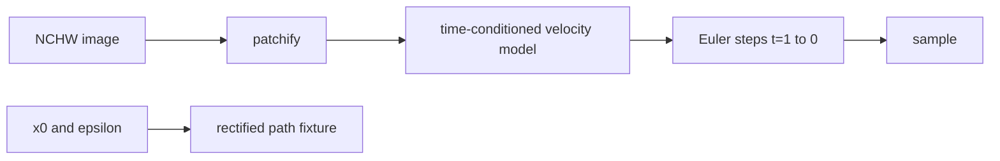

# Diffusion Transformers and Rectified Flow

> Make patch tokens and a straight probability-flow path explicit before choosing a transformer.

**Type:** Build
**Languages:** Python
**Prerequisites:** 02-convolutions-from-scratch, 10-image-generation-diffusion
**Time:** ~40 minutes

## Learning Objectives

- Convert an NCHW image into reversible, non-overlapping patch tokens.
- Compute sinusoidal time features with an explicit even-width contract.
- Derive `x_t=(1-t)x_0+tε` and its constant velocity `ε-x_0`.
- Integrate a supplied velocity field from `t=1` to `t=0` with bounded Euler steps.
- Separate this deterministic equation fixture from an unimplemented model or checkpoint.

## Build It

The NumPy implementation in `code/main.py` has no model download or framework requirement.
`patchify(image, p)` accepts finite `(N,C,H,W)` arrays only when `H` and `W` are divisible by
`p`; `unpatchify` proves the inverse ordering. For a batch of two images, `p=2` and a `4x4`
canvas produce four tokens per image, each with `4C` values.

For a finite batch, `rectified_flow_path` broadcasts one `t` per item and computes

```text
x_t = (1 - t) x_0 + t ε
v_t = ε - x_0.
```

At `t=0` the point is `x_0`; at `t=1` it is `ε`. `euler_reverse_sample` calls a caller-supplied
velocity function at `1, 1-Δt, ...` and subtracts `Δt v`. It validates shape and finiteness on
every step, so a bad model cannot silently turn a sample into NaNs.



## Use It

Run `python3 code/main.py`. The offline demo reports blob shape, token shape, exact round-trip
error, path values at `.25/.75`, and a constant-velocity Euler endpoint. A DiT implementation can
replace the supplied function, but attention depth, training, and sample quality are not implied by
this small equation-level artifact.

## Ship It

The handoff is a patch convention plus a `(point, velocity)` pair. Record image shape and patch
size beside tokens; otherwise an equal-length token array can be reshaped into the wrong canvas.
Record the number of Euler steps with any generated sample because discretization changes the
trajectory even when the velocity field is unchanged.

## Exercises

1. Patchify a `(2,3,4,4)` array with `p=2`, unpatchify it, and assert maximum absolute error `0`.
2. Evaluate the path between all-zero `x_0` and all-one `ε` at `t=.25` and `.75`; check both
   values and the constant velocity.
3. Use a velocity function that returns a wrong shape and verify the sampler raises `ValueError`.

## Reference Solution

The patch fixture has shape `(2,4,12)` and is exactly invertible. Its path values are `.25` and
`.75`, while every velocity entry is `1`. A constant velocity of one, integrated backward from
one for four steps, reaches zero. Non-divisible image axes, odd embedding widths, out-of-range
times, and wrong velocity shapes are contract errors, not alternate sampling modes.
