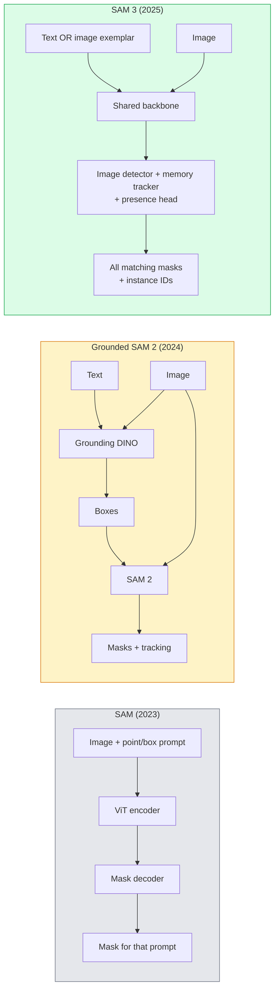

# SAM 3 & Open-Vocabulary Segmentation

> Give a model a text prompt and an image and get masks for every matching object. SAM 3 made that a single forward pass.

**Type:** Use + Build
**Languages:** Python
**Prerequisites:** Phase 4 Lesson 07 (U-Net), Phase 4 Lesson 08 (Mask R-CNN), Phase 4 Lesson 18 (CLIP)
**Time:** ~60 minutes

## Learning Objectives

- Distinguish SAM (visual prompts only), Grounded SAM / SAM 2 (detector + SAM), and SAM 3 (native text prompts via Promptable Concept Segmentation)
- Explain the SAM 3 architecture: shared backbone + image detector + memory-based video tracker + presence head + decoupled detector-tracker design
- Use Hugging Face `transformers` SAM 3 integration for text-prompted detection, segmentation, and video tracking
- Pick between SAM 3, Grounded SAM 2, YOLO-World, and SAM-MI based on latency, concept complexity, and deployment target

## The Problem

The 2023 SAM was a visual-prompt-only model: you click a point or draw a box and it returns a mask. For "give me all the oranges in this photo" you needed a detector (Grounding DINO) to produce boxes, then SAM to segment each. Grounded SAM turned this into a pipeline, but it was a cascade of two frozen models with inevitable error accumulation.

SAM 3 (Meta, Nov 2025, ICLR 2026) collapsed the cascade. It accepts a short noun phrase or an image exemplar as prompt and returns all matching masks and instance IDs in a single forward pass. That is **Promptable Concept Segmentation (PCS)**. Combined with the March 2026 Object Multiplex update (SAM 3.1), it tracks multiple instances of the same concept through video efficiently.

This lesson is about the structural shift this represents. 2D seg, detection, and text-image grounding have merged into one model. The production question is no longer "which pipeline do I chain together" but "which promptable model handles my use case end-to-end."

## The Concept

### The three generations

### Promptable Concept Segmentation

A "concept prompt" is a short noun phrase (`"yellow school bus"`, `"striped red umbrella"`, `"hand holding a mug"`) or an image exemplar. The model returns segmentation masks for every instance in the image that matches the concept, plus a unique instance ID per match.

This differs from classic visual-prompt SAM in three ways:

1. No per-instance prompting required — one text prompt returns all matches.
2. Open-vocabulary — the concept can be anything describable in natural language.
3. Returns multiple instances at once rather than one mask per prompt.

### Key architectural pieces

- **Shared backbone** — a single ViT processes the image. Both the detector head and the memory-based tracker read from it.
- **Presence head** — predicts whether the concept is present in the image at all. Decouples "is this here?" from "where is it?". Reduces false positives on absent concepts.
- **Decoupled detector-tracker** — image-level detection and video-level tracking have separate heads so they do not interfere.
- **Memory bank** — stores per-instance features across frames for video tracking (same mechanism SAM 2 used).

### Training at scale

SAM 3 was trained on **4 million unique concepts** generated by a data engine that iteratively annotates and corrects using AI + human review. The new **SA-CO benchmark** contains 270K unique concepts, 50x larger than prior benchmarks. SAM 3 reaches 75-80% of human performance on SA-CO and doubles existing systems on image + video PCS.

### SAM 3.1 Object Multiplex

March 2026 update: **Object Multiplex** introduces a shared-memory mechanism for joint tracking of many instances of the same concept at once. Previously, tracking N instances meant N separate memory banks. Multiplex collapses that into one shared memory with per-instance queries. Result: substantially faster multi-object tracking without sacrificing accuracy.

### Where Grounded SAM still matters in 2026

- When you need a specific open-vocabulary detector swapped in (DINO-X, Florence-2).
- When the SAM 3 license (gated on HF) is a blocker.
- When you need more control over the detector threshold than SAM 3 exposes.
- For research / ablation work on the detector component.

Modular pipelines still have a place. For most production work, SAM 3 is the simpler answer.

### YOLO-World vs SAM 3

- **YOLO-World** — open-vocabulary detector only (no masks). Real-time. Best when you need boxes at high fps.
- **SAM 3** — full segmentation + tracking. Slower but richer output.

Production split: YOLO-World for fast detection-only pipelines (robotics navigation, fast dashboards), SAM 3 for anything that needs masks or tracking.

### SAM-MI efficiency

SAM-MI (2025-2026) addresses SAM's decoder bottleneck. Key ideas:

- **Sparse point prompting** — uses a few well-chosen points instead of dense prompts; reduces decoder calls by 96%.
- **Shallow mask aggregation** — merges rough mask predictions into one sharper mask.
- **Decoupled mask injection** — decoder receives pre-computed mask features instead of re-running.

Result: ~1.6× speedup over Grounded-SAM on open-vocabulary benchmarks.

### Output format for the three models

All return the same general structure (boxes + labels + scores + masks + IDs), which is helpful — your pipeline downstream does not have to branch on which model ran.

## Further Reading

- [SAM 3: Segment Anything with Concepts (arXiv 2511.16719)](https://arxiv.org/abs/2511.16719)
- [SAM 3.1 Object Multiplex (Meta AI, March 2026)](https://ai.meta.com/blog/segment-anything-model-3/)
- [SAM 3 model page on Hugging Face](https://huggingface.co/facebook/sam3)
- [Grounded SAM 2 tutorial (PyImageSearch)](https://pyimagesearch.com/2026/01/19/grounded-sam-2-from-open-set-detection-to-segmentation-and-tracking/)
- [Ultralytics SAM 3 docs](https://docs.ultralytics.com/models/sam-3/)
- [SAM3-I: Instruction-aware SAM (arXiv 2512.04585)](https://arxiv.org/abs/2512.04585)
