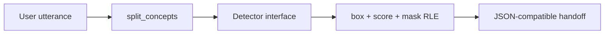

# Open-Vocabulary Segmentation Contracts

> Keep a text prompt, instance mask, box, and score aligned even when the detector is a stub.

**Type:** Build
**Languages:** Python
**Prerequisites:** 04-image-classification, 07-semantic-segmentation-unet
**Time:** ~35 minutes

## Learning Objectives

- Split explicit concept separators without destroying multi-word noun phrases.
- Encode and decode non-empty binary masks with a checked row-major RLE format.
- State the fields and numerical ranges of an instance detection record.
- Use a backend interface so a deterministic local stub and a model have the same handoff.
- Reject malformed masks, boxes, scores, and image shapes before serialization.

## Build It

`split_concepts` treats commas, semicolon, `and`, `or`, and `&` as explicit separators. It does not
split `yellow school bus`, because whitespace alone is not a separator. Empty prompts and empty
segments are errors.

`rle_encode` stores a row-major binary mask as `valuexcount;...`. `rle_decode` requires a positive
`(height,width)`, values `0/1`, positive counts, and an exact total of `height*width`. The strict
length check matters: a truncated mask cannot be mistaken for a correctly aligned crop.

Each `ConceptDetection` contains a non-empty `concept`, non-negative `instance_id`, finite
`(x1,y1,x2,y2)` with positive width and height, a score in `[0,1]`, and an RLE string. The
`StubOpenVocabSeg` creates two rectangular instances per concept so the full serialization path is
observable without an image library or checkpoint.

## Use It

From the lesson directory, run `python3 code/main.py`. It prints the two concepts, four detections,
one serialized record, mask area, and self-IoU. The stub is a contract fixture; it does not claim to
implement SAM or to locate objects in arbitrary images. A real backend can implement `detect` and
retain the same validation and handoff.

## Ship It

Store the original image shape beside each `mask_rle`; RLE alone has no shape. Keep the concept and
instance ID when filtering by score so downstream overlays cannot silently merge two objects.
Scores are detector confidence values, not calibrated probabilities in this lesson.

## Exercises

1. Split `cats, dogs and balloons` and `yellow school bus`; write down the resulting lists.
2. Encode a `[[0,1,1],[0,0,1]]` mask and decode it with shape `(2,3)`. Then decode a truncated
   string and explain why the exact cell count must fail.
3. Run `run_multi_concept` on `cats; dogs` and verify two detections per concept with non-empty
   masks and positive-area boxes.

## Reference Solution

The first prompt yields three concepts and the noun phrase remains one item. The six-cell mask
round-trips exactly; an RLE with only two cells raises `ValueError`. The two-concept stub returns
four records, each carrying its concept, distinct instance ID, valid box, score, and an RLE that
decodes to a non-empty mask. This is the complete local contract, independent of model quality.
