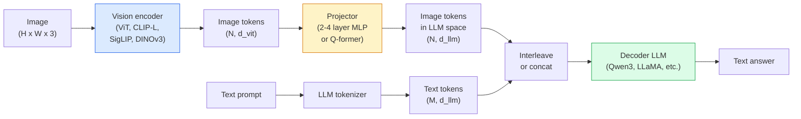

# Vision-Language Models — The ViT-MLP-LLM Pattern

> A vision encoder converts an image into tokens. An MLP projector maps those tokens into the LLM's embedding space. A language model does the rest. That pattern — ViT-MLP-LLM — is every production VLM in 2026.

**Type:** Build
**Languages:** Python
**Prerequisites:** Phase 4 Lesson 14 (ViT), Phase 4 Lesson 18 (CLIP), Phase 7 Lesson 02 (Self-Attention)
**Time:** ~75 minutes

## Learning Objectives

- State the ViT-MLP-LLM architecture and explain what each of the three components contributes
- Compare Qwen3-VL, InternVL3.5, LLaVA-Next, and GLM-4.6V on parameter count, context length, and benchmark performance
- Explain DeepStack: why multi-level ViT features tighten vision-language alignment better than a single last-layer feature
- Measure VLM hallucination in production with Cross-Modal Error Rate (CMER) and act on the signal

## The Problem

CLIP (Phase 4 Lesson 18) gives you a shared embedding space for images and text, which is enough for zero-shot classification and retrieval. It cannot answer "how many red cars are in this image?" because CLIP does not generate text — it only scores similarities.

Vision-Language Models (VLMs) — Qwen3-VL, InternVL3.5, LLaVA-Next, GLM-4.6V — bolt a CLIP-family image encoder to a full language model. The model sees an image plus a question and generates an answer. In 2026 open-source VLMs rival or beat GPT-5 and Gemini-2.5-Pro on multimodal benchmarks (MMMU, MMBench, DocVQA, ChartQA, MathVista, OSWorld).

The trio of pieces (ViT, projector, LLM) is the standard. The differences between models are in which ViT, which projector, which LLM, the training data, and the alignment recipe. Once you understand the pattern, swapping any component is mechanical.

## The Concept

### The ViT-MLP-LLM architecture



1. **Vision encoder** — a pretrained ViT (CLIP-L/14, SigLIP, DINOv3, or a fine-tuned variant). Produces patch tokens.
2. **Projector** — a small module (2-4 layer MLP, or a Q-former) that maps vision tokens into the LLM's embedding dimension. This is where most of the fine-tuning happens.
3. **LLM** — a decoder-only language model (Qwen3, Llama, Mistral, GLM, InternLM). Reads the vision + text tokens in sequence, generates text.

All three pieces are trainable in principle. In practice, the vision encoder and LLM stay mostly frozen while the projector trains — a few billion parameters of signal for cheap.

### DeepStack

Vanilla projection uses only the last ViT layer. DeepStack (Qwen3-VL) samples features from multiple ViT depths and stacks them. Deeper layers carry high-level semantics; shallower layers carry fine-grained spatial and textural information. Feeding both into the LLM closes the gap between "what does the image contain" (semantics) and "where exactly" (spatial grounding).

### Three training stages

Modern VLMs train in stages:

1. **Alignment** — freeze ViT and LLM. Train only the projector on image-caption pairs. Teaches the projector to map vision space into language space.
2. **Pre-training** — unfreeze everything. Train on large-scale interleaved image-text data (500M+ pairs). Builds the model's visual knowledge.
3. **Instruction tuning** — fine-tune on curated (image, question, answer) triples. Teaches conversational behaviour and task formats. This is what turns a "vision-aware LM" into a usable assistant.

Most LoRA fine-tunes target stage 3 with a small labelled dataset.

### Model family comparison (early 2026)

| Model | Params | Vision encoder | LLM | Context | Strengths |
|-------|--------|----------------|-----|---------|-----------|
| Qwen3-VL-235B-A22B (MoE) | 235B (22B active) | custom ViT + DeepStack | Qwen3 | 256K | General SOTA, GUI agent |
| Qwen3-VL-30B-A3B (MoE) | 30B (3B active) | custom ViT + DeepStack | Qwen3 | 256K | Smaller MoE alternative |
| Qwen3-VL-8B (dense) | 8B | custom ViT | Qwen3 | 128K | Production dense default |
| InternVL3.5-38B | 38B | InternViT-6B | Qwen3 + GPT-OSS | 128K | Strong MMBench / MMVet |
| InternVL3.5-241B-A28B | 241B (28B active) | InternViT-6B | Qwen3 | 128K | Competitive with GPT-4o |
| LLaVA-Next 72B | 72B | SigLIP | Llama-3 | 32K | Open, easy to fine-tune |
| GLM-4.6V | ~70B | custom | GLM | 64K | Open-source, strong OCR |
| MiniCPM-V-2.6 | 8B | SigLIP | MiniCPM | 32K | Edge-friendly |

### Visual agents

Qwen3-VL-235B reaches top global performance on OSWorld — a benchmark for **visual agents** that operate GUIs (desktop, mobile, web). The model sees a screenshot, understands the UI, and emits actions (click, type, scroll). Combined with tools, it closes the loop on common desktop tasks. This is what most 2026 "AI PC" demos run under the hood.

### Agentic capabilities + RoPE variants

VLMs need to know **when** a frame is in a video. Qwen3-VL evolved from T-RoPE (temporal rotary position embeddings) to **text-based time alignment** — explicit timestamp text tokens interleaved with video frames. The model sees "`<timestamp 00:32>` frame, prompt" and can reason about temporal relationships.

### The alignment problem

12% of image-text pairs in a crawled dataset contain descriptions not fully grounded in the image. A VLM trained on this silently learns to hallucinate — fabricate objects, misread numbers, invent relationships. In production this is the dominant failure mode.

Skywork.ai introduced the **Cross-Modal Error Rate (CMER)** to track it:

```
CMER = fraction of outputs where the text confidence is high but the image-text similarity (via a CLIP-family checker) is low
```

High CMER means the model is confidently saying things not grounded in the image. Monitoring CMER and treating it as a production KPI cut hallucination rate by ~35% in their deployment. The trick is not "fix the model" but "route high-CMER outputs to human review."

### Fine-tuning with LoRA / QLoRA

Full fine-tuning of a 70B VLM is out of reach for most teams. LoRA (rank 16-64) on attention + projector layers, or QLoRA with 4-bit base weights, fits on a single A100 / H100. Cost: 5,000-50,000 examples, $100-$5,000 in compute, 2-10 hours of training.

### Spatial reasoning is still weak

Current VLMs score 50-60% on spatial reasoning benchmarks (above-below, left-right, counting, distance). If your use case depends on "which object is on top of which," validate heavily — generic VLM performance is below human. Better-than-VLM alternatives for pure spatial tasks: a specialised keypoint / pose estimator, a depth model, or a detection model with box geometry post-processed.


## Further Reading

- [Qwen3-VL Technical Report (arXiv 2511.21631)](https://arxiv.org/abs/2511.21631)
- [InternVL3.5 Advancing Open-Source Multimodal Models (arXiv 2508.18265)](https://arxiv.org/html/2508.18265v1)
- [LLaVA-Next series](https://llava-vl.github.io/blog/2024-05-10-llava-next-stronger-llms/)
- [BentoML: Best Open-Source VLMs 2026](https://www.bentoml.com/blog/multimodal-ai-a-guide-to-open-source-vision-language-models)
- [MMMU: Multi-discipline Multimodal Understanding benchmark](https://mmmu-benchmark.github.io/)
- [VLMs in manufacturing (Robotics Tomorrow, March 2026)](https://www.roboticstomorrow.com/story/2026/03/when-machines-learn-to-see-like-experts-the-rise-of-vision-language-models-in-manufacturing/26335/)

## Exercises

1. **Establish a baseline.** Run the lesson demo, then capture the inputs, outputs, and one invariant that demonstrates this objective: State the ViT-MLP-LLM architecture and explain what each of the three components contributes.
2. **Change one variable.** Modify a single input or parameter and use the resulting evidence to investigate this objective: Compare Qwen3-VL, InternVL3.5, LLaVA-Next, and GLM-4.6V on parameter count, context length, and benchmark performance.
3. **Probe an edge case.** Predict the result before running it, compare prediction with observation, and explain the discrepancy while applying this objective: Explain DeepStack: why multi-level ViT features tighten vision-language alignment better than a single last-layer feature.

## Reference Solution

Use the canonical [main.py](../code/main.py) as the executable baseline. A complete solution records a successful run, identifies the invariant tied to “State the ViT-MLP-LLM architecture and explain what each of the three components contributes,” and changes only one variable for the comparison. The edge-case result must distinguish the prediction from the observation, explain the cause using “Explain DeepStack: why multi-level ViT features tighten vision-language alignment better than a single last-layer feature,” and cite a repeatable check rather than relying on visual inspection alone.
