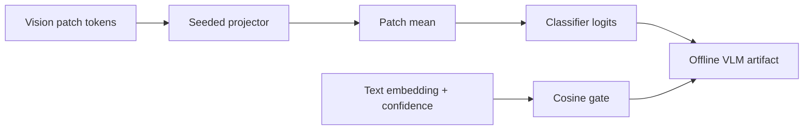

# Vision-Language Models: Projection and Routing

> Make the bridge from visual patch features to language-space decisions measurable before using a VLM.

**Type:** Build
**Languages:** Python
**Prerequisites:** 14-vision-transformers, 05-nlp-foundations-to-advanced
**Time:** ~40 minutes

## Learning Objectives

- Project a `(batch, patches, vision_width)` tensor into a chosen language width.
- Mean-pool projected patches without changing the batch dimension.
- Compute numerically stable multiclass cross-entropy with integer targets.
- Concatenate same-grid intermediate features as a DeepStack-style seam.
- Gate high-confidence, low-similarity image/text pairs with a reproducible CMER fixture.

## Build It

`project_visual_tokens` creates a deterministic seeded linear bridge. For `(N,P,32)` tokens and
`output_dim=64`, the result is `(N,P,64)`; the function does not pretend to be a trained projector.
`mean_pool_tokens` maps that to `(N,64)`. `classify_logits` then applies a finite affine head.

`cross_entropy_loss` uses a row maximum before `logsumexp`, so a correct class logit of `1000` does
not overflow. Targets must be integer class IDs in `[0,C)`, not strings, booleans, or fractional
labels. `deepstack_features` concatenates layers only when batch and patch grids agree.

For the monitoring seam, `_row_normalize` scales by the largest absolute coordinate before taking a
norm. `cross_modal_error_rate` flags `similarity < sim_threshold` only when confidence is above
`conf_threshold`; it returns the fraction of flagged pairs, not a claim about hallucination rates.

## Use It

Run `python3 code/main.py`. The demo prints token/projected/pooled shapes, a stable CE value,
DeepStack width, and CMER for four deliberately chosen embedding pairs. A pretrained multimodal
model can replace the seeded matrices, but no checkpoint, tokenizer, or network is required for
this lesson's Build-It path.

## Ship It

Pass the projected tensor with its `(N,P,D)` shape and the class-label mapping. Log the thresholds
alongside CMER; changing `.25` or `.8` changes the alert definition. Treat CMER as a routing signal
for review, not as a calibrated safety score.

## Exercises

1. Project `(2,4,32)` tokens into width `64` and verify the shape; repeat with the same seed.
2. Evaluate CE for logits `[[0,0],[2,0]]` and labels `[0,1]` using the max-shift equation.
3. Build four unit vectors where two high-confidence text vectors oppose their image vectors.
   Verify CMER is `0.5` when the other two pairs align.

## Reference Solution

Projection produces `(2,4,64)` and identical seeds produce identical values. The CE fixture is the
mean of `log(2)` and `log(exp(2)+1)`, because the second example selects the zero logit. In the
CMER fixture two of four pairs have cosine similarity `-1` and confidence `.9`, so exactly half are
flagged. A zero embedding, mismatched feature grid, or out-of-range target is rejected before a
misleading score is emitted.
