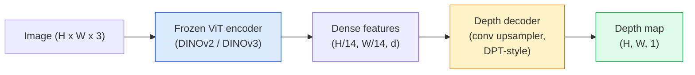

# Monocular Depth & Geometry Estimation

> A depth map is a single-channel image where each pixel is a distance from the camera. Predicting it from one RGB frame used to be impossible without stereo or LiDAR. In 2026 a frozen ViT encoder plus a lightweight head gets within a few percent of ground truth.

**Type:** Build + Use
**Languages:** Python
**Prerequisites:** Phase 4 Lesson 14 (ViT), Phase 4 Lesson 17 (Self-Supervised Vision), Phase 4 Lesson 07 (U-Net)
**Time:** ~60 minutes

## Learning Objectives

- Distinguish relative and metric depth and state which one each production model (MiDaS, Marigold, Depth Anything V3, ZoeDepth) solves
- Use Depth Anything V3 (DINOv2 backbone) to predict depth for arbitrary single images with no calibration
- Explain why monocular depth works at all from a single image (perspective cues, texture gradients, learned priors) and what it cannot recover (absolute scale, occluded geometry)
- Lift 2D detections to 3D points using a depth map and pinhole camera intrinsics

## The Problem

Depth is the missing axis in 2D computer vision. Given RGB, you know where things appear in the image plane; you do not know how far they are. Depth sensors (stereo rigs, LiDAR, time-of-flight) solve this directly but are expensive, fragile, and limited in range.

Monocular depth estimation — predicting depth from a single RGB frame — used to produce blurry, unreliable output. By 2026 large pretrained encoders changed that: Depth Anything V3 uses a frozen DINOv2 backbone and produces depth maps that generalise across indoor, outdoor, medical, and satellite domains. Marigold reframes depth as a conditional diffusion problem. ZoeDepth regresses true metric distances.

Depth is also the bridge between 2D detection and 3D understanding: multiply a detected box's pixels by depth and you lift the 2D object into a 3D point cloud. That is the core of every AR occlusion system, every obstacle-avoidance pipeline, and every "pick up the cup" robot.

## The Concept

### Relative vs metric depth

- **Relative depth** — ordered `z` values without a real-world unit. "Pixel A is closer than pixel B, but the ratio of distances is not anchored to metres."
- **Metric depth** — absolute distance in metres from the camera. Requires the model to have learnt the statistical relationship between image cues and real distance.

MiDaS and Depth Anything V3 produce relative depth. Marigold produces relative depth. ZoeDepth, UniDepth, and Metric3D produce metric depth. Metric models are sensitive to camera intrinsics; relative models are not.

### The encoder-decoder pattern



Depth Anything V3 freezes the encoder and trains only the DPT-style decoder. The encoder provides rich features; the decoder interpolates them back to image resolution and regresses depth.

### Why a single image produces depth at all

A 2D image contains many monocular cues that correlate with depth:

- **Perspective** — parallel lines in 3D converge in 2D.
- **Texture gradient** — surfaces far away have smaller, denser texture.
- **Occlusion order** — nearer objects occlude farther ones.
- **Size constancy** — known objects (cars, humans) give approximate scale.
- **Atmospheric perspective** — distant objects appear hazier and bluer in outdoor scenes.

A ViT trained on billions of images internalises these cues. With enough data and a strong backbone, monocular depth hits reasonable accuracy without any explicit 3D supervision.

### What monocular depth cannot do

- **Absolute metric scale** without intrinsics or a known object in the scene. The network can predict "the cup is twice as far as the spoon" without knowing whether the cup is 1 m or 10 m away.
- **Occluded geometry** — the back of a chair is unseen and cannot be inferred reliably.
- **Truly untextured / reflective surfaces** — mirrors, glass, uniform walls. The network reports plausible but wrong depth.

### Depth Anything V3 in 2026

- Vanilla DINOv2 ViT-L/14 as encoder (frozen).
- DPT decoder.
- Trained on posed image pairs from diverse sources (no explicit depth supervision needed beyond photometric consistency).
- Predicts spatially consistent geometry from **an arbitrary number of visual inputs, with or without known camera poses**.
- SOTA across monocular depth, any-view geometry, visual rendering, camera pose estimation.

This is the drop-in model to call when you need depth in 2026.

### Marigold — diffusion for depth

Marigold (Ke et al., CVPR 2024) reframes depth estimation as conditional image-to-image diffusion. Conditioning: RGB. Target: depth map. Uses a pretrained Stable Diffusion 2 U-Net as backbone. Output depth maps are exceptionally sharp at object boundaries. Trade-off: slower inference than feed-forward models (10-50 denoising steps).

### Intrinsics and the pinhole camera

To lift a pixel `(u, v)` with depth `d` to a 3D point `(X, Y, Z)` in camera coordinates:

```
fx, fy, cx, cy = camera intrinsics
X = (u - cx) * d / fx
Y = (v - cy) * d / fy
Z = d
```

Intrinsics come from EXIF metadata, a calibration pattern, or a monocular intrinsics estimator (Perspective Fields, UniDepth). Without intrinsics, you can still render a point cloud by assuming a 60-70° FOV and moderate-resolution principals — usable for visualisation, not for measurement.

### Evaluation

Two standard metrics:

- **AbsRel** (absolute relative error): `mean(|d_pred - d_gt| / d_gt)`. Lower is better. 0.05-0.1 for production models.
- **delta < 1.25** (threshold accuracy): fraction of pixels where `max(d_pred/d_gt, d_gt/d_pred) < 1.25`. Higher is better. 0.9+ for SOTA.

For relative depth (Depth Anything V3, MiDaS), evaluation uses scale-and-shift invariant versions of both metrics.


## Further Reading

- [Depth Anything V3 paper page](https://depth-anything.github.io/) — SOTA monocular depth with DINOv2 encoder
- [Marigold (Ke et al., CVPR 2024)](https://marigoldmonodepth.github.io/) — diffusion-based depth estimation
- [UniDepth (Piccinelli et al., 2024)](https://arxiv.org/abs/2403.18913) — metric depth with intrinsics
- [MiDaS v3.1 (Intel ISL)](https://github.com/isl-org/MiDaS) — the canonical relative-depth baseline
- [DINOv3 blog post (Meta)](https://ai.meta.com/blog/dinov3-self-supervised-vision-model/) — the encoder family that lifts depth accuracy
