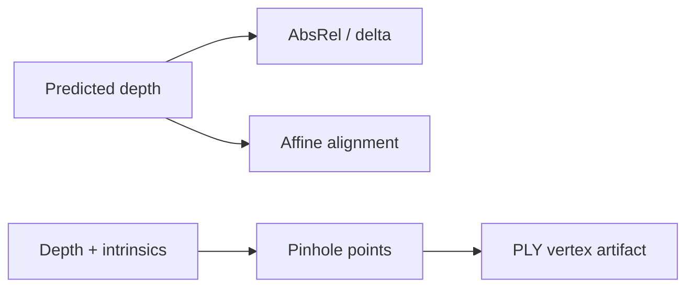

# Monocular Depth: Metrics and Camera Geometry

> Separate scale-sensitive depth metrics from the pinhole geometry used to export a point cloud.

**Type:** Build
**Languages:** Python
**Prerequisites:** 01-image-fundamentals, 20-image-retrieval-metric
**Time:** ~35 minutes

## Learning Objectives

- Compute absolute-relative error with a positive-depth contract.
- Apply the strict `< threshold` rule for delta accuracy.
- Fit an affine scale and shift to expose monocular scale ambiguity.
- Derive `x=(u-cx)z/fx` and `y=(v-cy)z/fy` for a pinhole camera.
- Export a finite `(H,W,3)` point cloud without an image or mesh dependency.

## Build It

`abs_rel_error(pred,target)` computes the mean `|pred-target|/target`; both arrays must be equal,
non-empty, finite, and strictly positive. `delta_accuracy` checks

```text
max(pred/target, target/pred) < threshold,
```

so a ratio exactly `1.25` is not counted when the default threshold is `1.25`. A boolean mask may
select valid pixels, but it must match the depth shape and select at least one value.

`align_scale_shift` solves `a*pred+b≈target` by least squares and returns an array shaped like the
original prediction. At least two distinct prediction values are required; this is an alignment
diagnostic, not a learned metric-invariant model.

For intrinsics `(fx,fy,cx,cy)`, each pixel `(u,v)` with depth `z` maps to
`((u-cx)z/fx, (v-cy)z/fy, z)`. `depth_to_point_cloud` returns that formula at every pixel and
`write_ply` writes a small ASCII artifact with an explicit vertex count.



## Use It

Run `python3 code/main.py` from the lesson directory. It reports raw and aligned metrics, point-
cloud shape/ranges, and a temporary PLY path. It uses a synthetic plane and rectangle, so the
numbers demonstrate contracts rather than benchmark a monocular model.

## Ship It

Keep the target-depth validity mask and camera intrinsics beside any exported PLY. Do not compare
raw and aligned scores as if they answer the same question: alignment removes a two-parameter
scale/shift discrepancy, while raw AbsRel measures it.

## Exercises

1. For target `[[4,2]]` and prediction `[[5,2]]`, calculate AbsRel and the default delta result.
2. Check that prediction `5` versus target `4` fails a strict `1.25` threshold.
3. Use `depth=[[2]]` and `(fx,fy,cx,cy)=(4,4,0,0)` and verify the exported point is `(0,0,2)`.

## Reference Solution

The first fixture has errors `.25` and `0`, so AbsRel is `.125`; both ratios are below `1.25`.
The exact ratio `5/4=1.25` is excluded by `<`. Affine alignment recovers the target for a
synthetic `3*depth+.7` prediction when the values vary. A non-positive depth, zero focal length,
shape mismatch, or constant prediction for alignment raises `ValueError` before division or a
rank-deficient solve.
