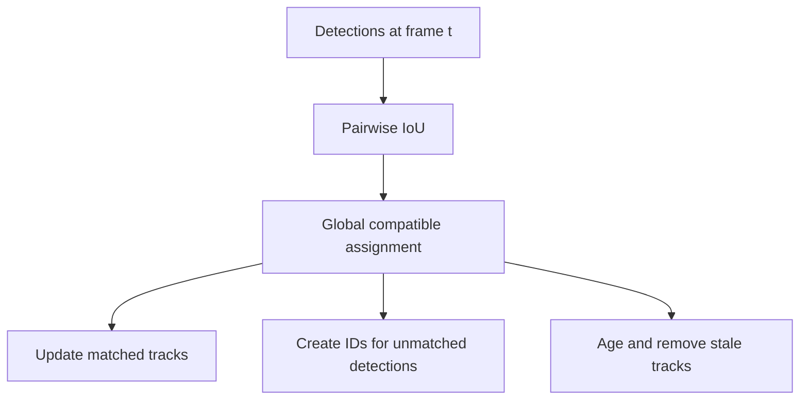

# Multi-Object Tracking: IoU Association and Lifecycle

> Match detections to tracks, age missing objects, and measure identity continuity with explicit rules.

**Type:** Build
**Languages:** Python
**Prerequisites:** 06-object-detection-yolo, 20-image-retrieval-metric
**Time:** ~40 minutes

## Learning Objectives

- Compute pairwise IoU for valid half-open `xyxy` boxes.
- Explain why association maximizes total compatible IoU rather than matching each row greedily.
- Implement deterministic new-track, update, unmatched, and `max_age` transitions.
- Distinguish detection errors from identity switches in simple MOT metrics.
- State the limits of a bounded assignment solver without a motion model.

## Build It

`bbox_iou` rejects non-finite or zero-area boxes and returns an `(N,M)` matrix; empty detection
sets produce a correctly shaped zero matrix. `SimpleTracker` accepts a matching only when IoU is at
least `iou_threshold`. For up to ten tracks/detections, `_assignment` uses a small dynamic program
to maximize total IoU while permitting unmatched rows; larger matrices use a documented deterministic
greedy fallback to keep the offline demo bounded.

The lifecycle is intentionally observable: an unmatched detection creates the next positive ID; an
unmatched existing track remains until `frame-last_frame > max_age`; a matched track increments
`hits`. Frames must be non-decreasing. There is no Kalman prediction, appearance embedding, or
occlusion reasoning in this artifact.

## Use It

Run `python3 code/main.py`. The synthetic stream contains moving boxes and controlled dropouts.
The demo prints active IDs, ID switches, MOTA, and IDF1. These metrics are local fixture measurements;
they are not a claim about a production tracker or a benchmark leaderboard.

## Ship It

Persist each frame's `(track_id, bbox)` output with the frame number. Configure `iou_threshold` and
`max_age` in the same record: changing either changes when an object receives a new identity. Use
MOTA/IDF1 only with a declared IoU threshold and ground-truth timeline.

## Exercises

1. Compute IoU for identical `0,0,2,2` boxes and for the same box against `3,3,4,4`.
2. Feed one box at frames `0` and `1`, then a nearby box. Verify the ID remains stable.
3. Set `max_age=0`, miss one frame, and verify the next detection receives a new ID.
4. Compare the two possible pairings for IoU matrix `[[.9,.8],[.85,.1]]`; the global sum chooses
   `.8+.85`, not `.9+.1`.

## Reference Solution

The identical-box IoU is `1`, and the disjoint-box IoU is `0`. The two-row matrix is globally best
matched by `(row0,col1)` and `(row1,col0)`, total `1.65`. With `max_age=0`, a missing frame removes
the old track before the next detection is created. A perfect replay of the ground-truth boxes has
MOTA and IDF1 equal to `1`; a switch is counted only when the same ground-truth ID is later paired
with a different tracker ID.
