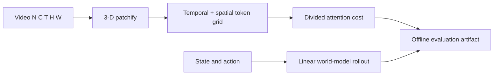

# World Models and Video Diffusion: Temporal Contracts

> Make video patch geometry, attention cost, and a small action-conditioned rollout inspectable.

**Type:** Build
**Languages:** Python
**Prerequisites:** 12-video-understanding, 10-image-generation-diffusion
**Time:** ~40 minutes

## Learning Objectives

- Patchify and unpatchify an `(N,C,T,H,W)` video without changing token order.
- Count joint and divided temporal/spatial attention pairs from explicit patch sizes.
- Explain why exact divisibility is part of a video-token interface.
- Roll a finite linear state model forward from actions with a declared transition.
- Separate a local dynamics fixture from a trained video-diffusion world model.

## Build It

`patchify_video` groups `(patch_t,patch_h,patch_w)` consecutive values and returns
`(N, tokens, C*patch_t*patch_h*patch_w)` plus `(T_tokens,H_tokens,W_tokens)`. `unpatchify_video`
reconstructs the original shape. All axes must be positive and exactly divisible; silently dropping
the last frame would make an action and its predicted frame disagree.

For token grid `(T',S')`, joint self-attention has `(T'S')²` pairs. Divided attention computes
`S'T'² + T'S'²`: temporal attention at each spatial location, then spatial attention at each time.
`divided_attention_cost` returns both counts so the trade-off can be checked rather than asserted.

`rollout_linear_world_model` implements `s[t+1]=A s[t]+B a[t]`, including the initial state. The
default `A` is identity and `B` maps matching leading action/state coordinates; passing matrices
makes the dynamics explicit. `video_consistency_error` is a finite MSE for comparing predicted and
target clips.

## Use It

Run `python3 code/main.py`. It prints a reversible video shape, token grid, joint/divided pair
counts, a three-step state rollout, and zero consistency error for the round-trip. The lesson does
not download a video model or claim physical plausibility; a learned checkpoint can be evaluated
against these shape and error contracts later.

## Ship It

Persist the video shape and three patch sizes beside token files. Persist `A`, `B`, and the action
coordinate convention beside rollout traces. A rollout can be numerically valid while semantically
wrong if those conventions are omitted.

## Exercises

1. Patchify a `(1,2,4,4,4)` array with `2x2x2` patches and verify grid `(2,2,2)` and exact inverse.
2. For `T=H=W=4` and patch sizes `2`, compute eight tokens, `64` joint pairs, and `80` divided
   pairs.
3. Roll `[0,0]` with actions `[1,0]`, `[0,2]` under the default model and list all three states.
4. Pass five frames with a temporal patch of two and record why the contract rejects them.

## Reference Solution

The patch fixture yields `(1,8,16)` tokens and reconstructs with maximum error `0`. Its attention
counts are `8²=64` jointly and `4*2² + 2*4² = 48` when temporal tokens are `2` and spatial tokens
are `4`. The default rollout produces `[0,0]`, `[1,0]`, `[1,2]`; an indivisible temporal axis
raises `ValueError` before any frame is dropped.
