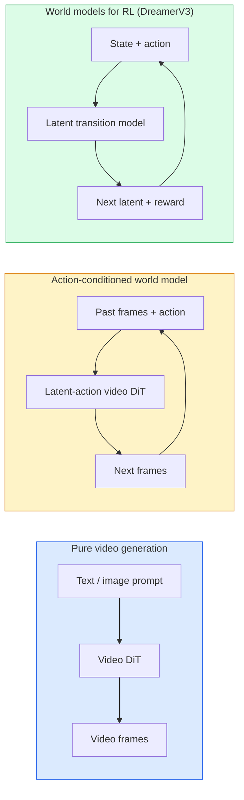

# World Models & Video Diffusion

> A video model that predicts the next seconds of a scene is a world simulator. Condition that prediction on actions and you have a learned game engine.

**Type:** Build
**Languages:** Python
**Prerequisites:** Phase 4 Lesson 10 (Diffusion), Phase 4 Lesson 12 (Video Understanding), Phase 4 Lesson 23 (DiT + Rectified Flow)
**Time:** ~75 minutes

## Learning Objectives

- Explain the difference between a pure video generation model (Sora 2) and an action-conditioned world model (Genie 3, DreamerV3)
- Describe a video DiT: spatio-temporal patches, 3D position encoding, joint attention across (T, H, W) tokens
- Trace how a world model plugs into robotics: VLM plans → video model simulates → inverse dynamics emits actions
- Pick between Sora 2, Genie 3, Runway GWM-1 Worlds, Wan-Video, and HunyuanVideo for a given use case (creative video, interactive sim, autonomous-driving synthesis)

## The Problem

Video generation and world modelling converged in 2026. A model that can generate a coherent minute of video has, in some sense, learned how the world moves: object permanence, gravity, causality, style. If you condition that prediction on actions (walk left, open the door), the video model becomes a learnable simulator that can replace a game engine, a driving simulator, or a robotics environment.

The stakes are concrete. Genie 3 generates playable environments from a single image. Runway GWM-1 Worlds synthesises infinite explorable scenes. Sora 2 produces minute-long videos with synchronised audio and modelled physics. NVIDIA Cosmos-Drive, Wayve Gaia-2, and Tesla DrivingWorld generate realistic driving video for autonomous-vehicle training data. The world-model paradigm is quietly taking over sim-to-real for robotics.

This lesson is the "big picture" lesson for Phase 4. It connects image generation, video understanding, and agentic reasoning into the architecture pattern dominant research is moving toward.

## The Concept

### Three families of world-modelling



- **Sora 2** is pure video generation conditioned on prompts. No action interface. You cannot "steer" it mid-rollout.
- **Genie 3**, **GWM-1 Worlds**, **Mirage / Magica** are action-conditioned world models. Infer latent actions from observed video, then condition future frame predictions on actions. Interactive — you press keys or move a camera and the scene responds.
- **DreamerV3** and the classic RL world-model family predict in a latent space with explicit action conditioning, trained on a reward signal. Less visual; more useful for sample-efficient RL.

### Video DiT architecture

```
Video latent:          (C, T, H, W)
Patchify (spatial):    grid of P_h x P_w patches per frame
Patchify (temporal):   group P_t frames into a temporal patch
Resulting tokens:      (T / P_t) * (H / P_h) * (W / P_w) tokens
```

Positional encoding is 3D: a rotary or learned embedding per (t, h, w) coordinate. Attention can be:

- **Full joint** — all tokens attend to all tokens. O(N^2) with N tokens. Prohibitive for long videos.
- **Divided** — alternate temporal attention (same spatial position, across time: `(H*W) * T^2`) and spatial attention (same timestep, across space: `T * (H*W)^2`). Used by TimeSformer and most video DiTs.
- **Window** — local windows in (t, h, w). Used by Video Swin.

Every 2026 video diffusion model uses one of these three patterns plus AdaLN conditioning (Lesson 23) and rectified flow.

### Conditioning on actions: latent action models

Genie learns a **latent action** per frame by discriminatively predicting the action between a pair of consecutive frames. The model's decoder then conditions on the inferred latent action — not on explicit keyboard keys. At inference, a user can specify a latent action (or sample one from a fresh prior) and the model generates the next frame consistent with that action.

Sora skips the action interface entirely. Its decoder predicts next spacetime tokens from past spacetime tokens. Prompt conditions the start; nothing steers it mid-generation.

### Physical plausibility

Sora 2's 2026 release explicitly advertised **physical plausibility**: weight, balance, object permanence, cause-and-effect. Measured by the team via hand-rated plausibility scores; the model visibly improves on dropped objects, characters colliding, and failures-on-purpose (a missed jump) versus Sora 1.

Plausibility remains the dominant failure mode. 2024-2025 videos of people eating spaghetti or drinking from glasses revealed the model's lack of persistent object representation. 2026 models (Sora 2, Runway Gen-5, HunyuanVideo) reduce but do not eliminate these.

### Autonomous driving world models

Driving world models generate realistic road scenes conditioned on trajectories, bounding boxes, or navigation maps. Usage:

- **Cosmos-Drive-Dreams** (NVIDIA) — generates minutes of driving video for RL training.
- **Gaia-2** (Wayve) — trajectory-conditioned scene synthesis for policy evaluation.
- **DrivingWorld** (Tesla) — simulates varied weather, time-of-day, traffic conditions.
- **Vista** (ByteDance) — reactive driving scene synthesis.

They replace expensive real-world data collection for corner cases — pedestrian jaywalks at night, icy intersections, unusual vehicle types — that would otherwise require millions of miles of driving.

### Robotics stack: VLM + video model + inverse dynamics

The emerging three-component robotics loop:

1. **VLM** parses the goal ("pick up the red cup"), plans a high-level action sequence.
2. **Video generation model** simulates what executing each action would look like — predicts observations N frames ahead.
3. **Inverse dynamics model** extracts the concrete motor commands that would produce those observations.

This replaces reward shaping and sample-heavy RL. The world model does the imagination; the inverse dynamics closes the loop on actuation. Genie Envisioner is one instantiation; many research groups are converging on this structure.

### Evaluation

- **Visual quality** — FVD (Fréchet Video Distance), user studies.
- **Prompt alignment** — CLIPScore per frame, VQA-style evaluation.
- **Physical plausibility** — hand-rated on a benchmark suite (Sora 2's internal benchmark, VBench).
- **Controllability** (for interactive world models) — action → observation consistency; can you go back to a prior state?

### Model landscape in 2026

| Model | Use | Parameters | Output | License |
|-------|-----|------------|--------|---------|
| Sora 2 | text-to-video, audio | — | 1-min 1080p + audio | API only |
| Runway Gen-5 | text/image-to-video | — | 10s clips | API |
| Runway GWM-1 Worlds | interactive world | — | infinite 3D rollout | API |
| Genie 3 | interactive world from image | 11B+ | playable frames | research preview |
| Wan-Video 2.1 | open text-to-video | 14B | high-quality clips | non-commercial |
| HunyuanVideo | open text-to-video | 13B | 10s clips | permissive |
| Cosmos / Cosmos-Drive | autonomous driving sim | 7-14B | driving scenes | NVIDIA open |
| Magica / Mirage 2 | AI-native game engine | — | modifiable worlds | product |


## Build It

Reconstruct **World Models & Video Diffusion** by following `VideoPatch3D` on tokens=["red","fox"]. Run `python3 main.py` and verify that the attention/embedding shape follows the token count and each valid attention row remains normalized.

## Use It

Call `VideoPatch3D` from a small caller with tokens=["red","fox"]. Compare its result with the demo output, and record the input contract and the one field a downstream user should rely on.

## Ship It

Hand off `outputs/prompt-video-model-picker.md` with the command `python3 main.py`, the accepted input shape (tokens=["red","fox"]), the expected observable result, and a failure note for malformed inputs.

## Further Reading

- [Sora technical report (OpenAI)](https://openai.com/index/video-generation-models-as-world-simulators/)
- [Genie: Generative Interactive Environments (Bruce et al., 2024)](https://arxiv.org/abs/2402.15391) — latent action world models
- [TimeSformer (Bertasius et al., 2021)](https://arxiv.org/abs/2102.05095) — divided attention for video transformers
- [DreamerV3 (Hafner et al., 2023)](https://arxiv.org/abs/2301.04104) — world models for RL
- [Cosmos-Drive-Dreams (NVIDIA, 2025)](https://research.nvidia.com/labs/toronto-ai/cosmos-drive-dreams/) — driving world model
- [Top 10 Video Generation Models 2026 (DataCamp)](https://www.datacamp.com/blog/top-video-generation-models)
- [From Video Generation to World Model — survey repo](https://github.com/ziqihuangg/Awesome-From-Video-Generation-to-World-Model/)

## Exercises

This lab follows `VideoPatch3D` and `forward` on a controlled fixture; write down the value before changing the input.

1. **Trace the canonical fixture.** From `code/`, run `python3 main.py` using tokens=["red","fox"]. Follow `VideoPatch3D`, `forward`, `DividedAttentionBlock`. Expect the attention/embedding shape follows the token count and each valid attention row remains normalized; capture the first printed shape, metric, status, or summary field and state which part supports **Explain the difference between a pure video generation model (Sora 2) and an action-conditioned world model (Genie 3, DreamerV3)**.
2. **Change the controlled parameter.** Repeat the command after changing only the token sequence: use tokens=["red","fox","runs"]. Predict the direction of the change, then compare the two output values. Explain why **Describe a video DiT: spatio-temporal patches, 3D position encoding, joint attention across (T, H, W) tokens** says the other inputs should stay fixed.
3. **Exercise the guard.** Feed the implementation tokens=[]. Before running it, write down whether the relevant function should return an empty value, a zero-sized result, or a validation error. Check the observed status against **Trace how a world model plugs into robotics: VLM plans → video model simulates → inverse dynamics emits actions** and record the exception text if the code rejects the case.
4. **Prepare the artifact for reuse.** Open `outputs/prompt-video-model-picker.md` and add a worked example using tokens=["red","fox"]. Include the input contract, one expected output field, and a named acceptance check for **Pick between Sora 2, Genie 3, Runway GWM-1 Worlds, Wan-Video, and HunyuanVideo for a given use case (creative video, interactive sim, autonomous-driving synthesis)**; note what the demo cannot establish.

## Reference Solution

A checkable result for **World Models & Video Diffusion** should contain:

- the `python3 main.py` output for tokens=["red","fox"], with `VideoPatch3D`, `forward`, `DividedAttentionBlock` traced to the value or shape that supports **Explain the difference between a pure video generation model (Sora 2) and an action-conditioned world model (Genie 3, DreamerV3)**;
- a before/after comparison for the token sequence, where tokens=["red","fox","runs"] changes the observation in the direction predicted by **Describe a video DiT: spatio-temporal patches, 3D position encoding, joint attention across (T, H, W) tokens**;
- a recorded result for tokens=[] that matches the implementation’s validation or empty-result contract and explains the evidence for **Trace how a world model plugs into robotics: VLM plans → video model simulates → inverse dynamics emits actions**; and
- an updated `outputs/prompt-video-model-picker.md` example with a concrete input, expected output field, and acceptance check tied to **Pick between Sora 2, Genie 3, Runway GWM-1 Worlds, Wan-Video, and HunyuanVideo for a given use case (creative video, interactive sim, autonomous-driving synthesis)**.

Run the lesson tests after the demo. If the boundary behaves differently from the prediction, keep the actual exception or output and explain the implementation path that produced it.
