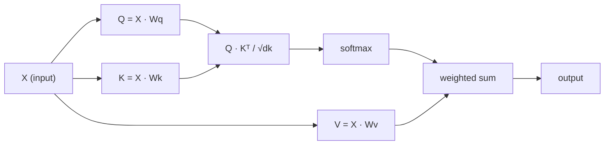

# Self-Attention from Scratch

> Attention is a lookup table where every word asks "who matters to me?" - and learns the answer.

**Type:** Build
**Languages:** Rust, Julia
**Prerequisites:** Phase 3 (Deep Learning Core), Phase 5 Lesson 10 (Sequence-to-Sequence)
**Time:** ~90 minutes

## Learning Objectives

- Implement scaled dot-product self-attention from scratch in Rust and Julia using only their standard libraries, including query/key/value projections and the softmax-weighted sum
- Build a multi-head attention layer that splits heads, computes parallel attention, and concatenates results
- Trace how the attention matrix captures token relationships and explain why scaling by sqrt(d_k) prevents softmax saturation
- Apply causal masking to convert bidirectional attention into autoregressive (decoder-style) attention

## The Problem

RNNs process sequences one token at a time. By the time you reach token 50, the information from token 1 has been squeezed through 50 compression steps. Long-range dependencies get crushed into a fixed-size hidden state - a bottleneck that no amount of LSTM gating fully solves.

The 2014 Bahdanau attention paper showed the fix: let the decoder look back at every encoder position and decide which ones matter for the current step. But it was still bolted onto an RNN. The 2017 "Attention Is All You Need" paper asked a sharper question: what if attention is the *only* mechanism? No recurrence. No convolution. Just attention.

Self-attention lets every position in a sequence attend to every other position in a single parallel step. That is what makes transformers fast, scalable, and dominant.

## The Concept

### The Database Lookup Analogy

Think of attention as a soft database lookup:

```
Traditional database:
  Query: "capital of France"  -->  exact match  -->  "Paris"

Attention:
  Query: "capital of France"  -->  similarity to ALL keys  -->  weighted blend of ALL values
```

Every token generates three vectors:
- **Query (Q)**: "What am I looking for?"
- **Key (K)**: "What do I contain?"
- **Value (V)**: "What information do I provide if selected?"

The dot product between a query and all keys produces attention scores. High score means "this key matches my query." Those scores weight the values. The output is a weighted sum of values.

### Q, K, V Computation

Each token embedding gets projected through three learned weight matrices:

```
Input embeddings (sequence of n tokens, each d-dimensional):

  X = [x1, x2, x3, ..., xn]       shape: (n, d)

Three weight matrices:

  Wq  shape: (d, dk)
  Wk  shape: (d, dk)
  Wv  shape: (d, dv)

Projections:

  Q = X @ Wq    shape: (n, dk)      each token's query
  K = X @ Wk    shape: (n, dk)      each token's key
  V = X @ Wv    shape: (n, dv)      each token's value
```

Visually, for one token:

```
             Wq
  x_i ------[*]------> q_i    "What am I looking for?"
       |
       |     Wk
       +----[*]------> k_i    "What do I contain?"
       |
       |     Wv
       +----[*]------> v_i    "What do I offer?"
```

### The Attention Matrix

Once you have Q, K, V for all tokens, attention scores form a matrix:

```
Scores = Q @ K^T    shape: (n, n)

              k1    k2    k3    k4    k5
        +-----+-----+-----+-----+-----+
   q1   | 2.1 | 0.3 | 0.1 | 0.8 | 0.2 |   <- how much q1 attends to each key
        +-----+-----+-----+-----+-----+
   q2   | 0.4 | 1.9 | 0.7 | 0.1 | 0.3 |
        +-----+-----+-----+-----+-----+
   q3   | 0.2 | 0.6 | 2.3 | 0.5 | 0.1 |
        +-----+-----+-----+-----+-----+
   q4   | 0.9 | 0.1 | 0.4 | 1.7 | 0.6 |
        +-----+-----+-----+-----+-----+
   q5   | 0.1 | 0.3 | 0.2 | 0.5 | 2.0 |
        +-----+-----+-----+-----+-----+

Each row: one token's attention over the entire sequence
```

Watch one query at a time sweep the keys: each row scores every token, softmax turns the scores into weights, and the context vector is the weighted blend of values.

```figure
attention-matrix
```

### Why Scale?

The dot products grow with dimension dk. If dk = 64, dot products can be in the range of tens, pushing softmax into regions where gradients vanish. The fix: divide by sqrt(dk).

```
Scaled scores = (Q @ K^T) / sqrt(dk)
```

This keeps values in a range where softmax produces useful gradients.

### Softmax Turns Scores into Weights

Softmax converts raw scores into a probability distribution across each row:

```
Raw scores for q1:   [2.1, 0.3, 0.1, 0.8, 0.2]
                            |
                         softmax
                            |
Attention weights:   [0.52, 0.09, 0.07, 0.14, 0.08]   (sums to ~1.0)
```

Now each token has a set of weights saying how much to attend to every other token.

### Weighted Sum of Values

The final output for each token is a weighted sum of all value vectors:

```
output_i = sum( attention_weight[i][j] * v_j  for all j )

For token 1:
  output_1 = 0.52 * v1 + 0.09 * v2 + 0.07 * v3 + 0.14 * v4 + 0.08 * v5
```

### Full Pipeline



Formula in one line:

```
Attention(Q, K, V) = softmax( Q @ K^T / sqrt(dk) ) @ V
```


## Build It

Reconstruct **Self-Attention from Scratch** by following `softmax_rows` on tokens=["red","fox"]. Run `rustc --edition 2021 main.rs -o /tmp/lesson && /tmp/lesson` and verify that the attention/embedding shape follows the token count and each valid attention row remains normalized.

## Use It

Call `softmax_rows` from a small caller with tokens=["red","fox"]. Compare its result with the demo output, and record the input contract and the one field a downstream user should rely on.

## Ship It

Hand off `outputs/prompt-attention-explainer.md` with the command `rustc --edition 2021 main.rs -o /tmp/lesson && /tmp/lesson`, the accepted input shape (tokens=["red","fox"]), the expected observable result, and a failure note for malformed inputs.

## Further Reading

- [Attention Is All You Need (Vaswani et al., 2017)](https://arxiv.org/abs/1706.03762) - the original transformer paper
- [The Illustrated Transformer (Jay Alammar)](https://jalammar.github.io/illustrated-transformer/) - best visual walkthrough of the full architecture
- [The Annotated Transformer (Harvard NLP)](https://nlp.seas.harvard.edu/annotated-transformer/) - line-by-line PyTorch implementation with explanations

## Exercises

Work from the smallest fixture that the Self-Attention from Scratch demo already understands, then make one deliberate change and record what moved.

1. **Run the smallest fixture.** From `code/`, run `rustc --edition 2021 main.rs -o /tmp/lesson && /tmp/lesson` using tokens=["red","fox"]. Follow `softmax_rows`, `scaled_dot_product_attention`, `SelfAttention`. Expect the attention/embedding shape follows the token count and each valid attention row remains normalized; capture the first printed shape, metric, status, or summary field and state which part supports **Implement scaled dot-product self-attention from scratch in Rust and Julia using only their standard libraries, including query/key/value projections and the softmax-weighted sum**.
2. **Perturb one field.** Repeat the command after changing only the token sequence: use tokens=["red","fox","runs"]. Predict the direction of the change, then compare the two output values. Explain why **Build a multi-head attention layer that splits heads, computes parallel attention, and concatenates results** says the other inputs should stay fixed.
3. **Check the failure boundary.** Feed the implementation tokens=[]. Before running it, write down whether the relevant function should return an empty value, a zero-sized result, or a validation error. Check the observed status against **Trace how the attention matrix captures token relationships and explain why scaling by sqrt(d_k) prevents softmax saturation** and record the exception text if the code rejects the case.
4. **Make the result repeatable.** Open `outputs/prompt-attention-explainer.md` and add a worked example using tokens=["red","fox"]. Include the input contract, one expected output field, and a named acceptance check for **Apply causal masking to convert bidirectional attention into autoregressive (decoder-style) attention**; note what the demo cannot establish.

## Reference Solution

A checkable result for **Self-Attention from Scratch** should contain:

- the `rustc --edition 2021 main.rs -o /tmp/lesson && /tmp/lesson` output for tokens=["red","fox"], with `softmax_rows`, `scaled_dot_product_attention`, `SelfAttention` traced to the value or shape that supports **Implement scaled dot-product self-attention from scratch in Rust and Julia using only their standard libraries, including query/key/value projections and the softmax-weighted sum**;
- a before/after comparison for the token sequence, where tokens=["red","fox","runs"] changes the observation in the direction predicted by **Build a multi-head attention layer that splits heads, computes parallel attention, and concatenates results**;
- a recorded result for tokens=[] that matches the implementation’s validation or empty-result contract and explains the evidence for **Trace how the attention matrix captures token relationships and explain why scaling by sqrt(d_k) prevents softmax saturation**; and
- an updated `outputs/prompt-attention-explainer.md` example with a concrete input, expected output field, and acceptance check tied to **Apply causal masking to convert bidirectional attention into autoregressive (decoder-style) attention**.

Run the lesson tests after the demo. If the boundary behaves differently from the prediction, keep the actual exception or output and explain the implementation path that produced it.
## Guided Demo

Use the [10–15 minute guided demo](demo.md) to predict an invariant, run the canonical entrypoint, change one variable, and probe a failure case.
