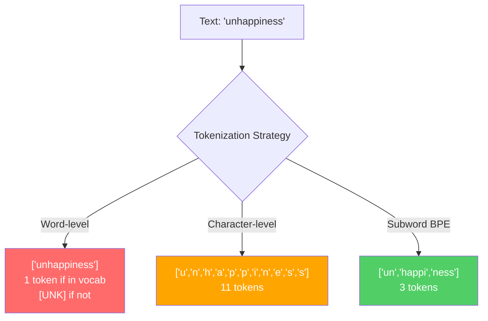
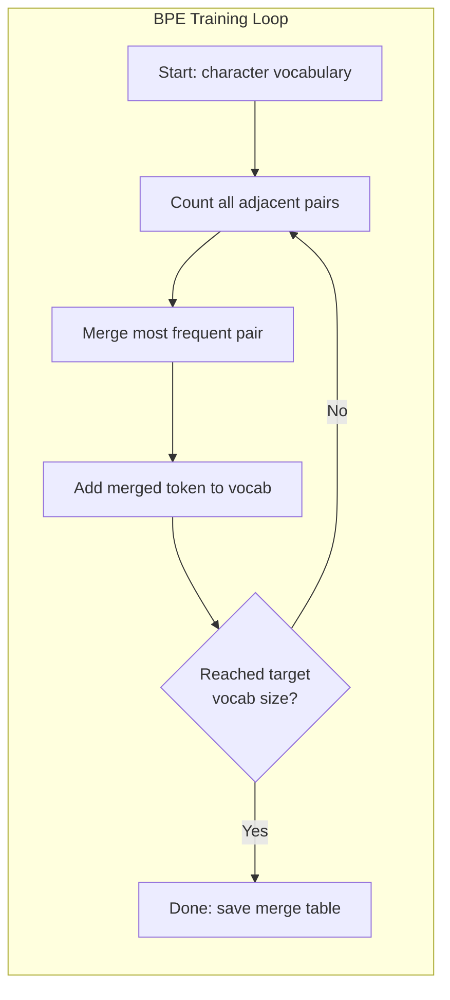
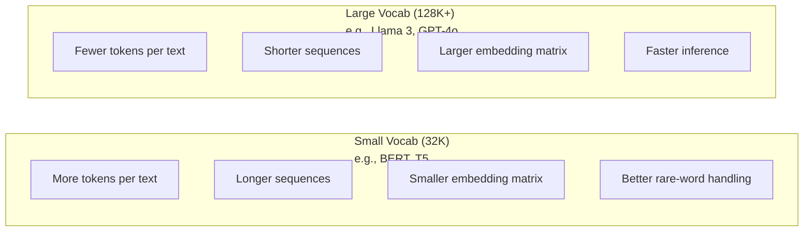

# Tokenizers: BPE, WordPiece, SentencePiece

> Your LLM does not read English. It reads integers. The tokenizer decides whether those integers carry meaning or waste it.

**Type:** Build
**Languages:** Python
**Prerequisites:** Phase 05 (NLP Foundations)
**Time:** ~90 minutes

## Learning Objectives

- Implement BPE, WordPiece, and Unigram tokenization algorithms from scratch and compare their merge strategies
- Explain how vocabulary size affects model efficiency: too small creates long sequences, too large wastes embedding parameters
- Analyze tokenization artifacts across languages and code, identifying where specific tokenizers break down
- Use the tiktoken and sentencepiece libraries to tokenize text and inspect the resulting token IDs

## The Problem

Your LLM does not read English. It does not read any language. It reads numbers.

The gap between "Hello, world!" and [15496, 11, 995, 0] is the tokenizer. Every word, every space, every punctuation mark must be converted into an integer before a model can process it. This conversion is not neutral. It bakes assumptions into the model that cannot be undone later.

Get this wrong and your model wastes capacity encoding common words with multiple tokens. "unfortunately" becomes four tokens instead of one. Your 128K context window just shrank by 75% for text heavy in multi-syllable words. Get it right and the same context window holds twice as much meaning. The difference between "this model handles code well" and "this model chokes on Python" often comes down to how the tokenizer was trained.

Every API call you make to GPT-4 or Claude is priced per token. Every token your model generates costs compute. The fewer tokens required to represent an output, the faster the end-to-end inference. Tokenization is not preprocessing. It is architecture.

## The Concept

### Three Approaches That Failed (and One That Won)

There are three obvious ways to convert text to numbers. Two of them do not work at scale.

**Word-level tokenization** splits on spaces and punctuation. "The cat sat" becomes ["The", "cat", "sat"]. Simple. But what about "tokenization"? Or "GPT-4o"? Or a German compound word like "Geschwindigkeitsbegrenzung"? Word-level requires a massive vocabulary to cover every word in every language. Miss a word and you get the dreaded `[UNK]` token -- the model's way of saying "I have no idea what this is." English alone has over a million word forms. Add code, URLs, scientific notation, and 100 other languages and you need an infinite vocabulary.

**Character-level tokenization** goes the other direction. "hello" becomes ["h", "e", "l", "l", "o"]. Vocabulary is tiny (a few hundred characters). No unknown tokens ever. But sequences become extremely long. A sentence that would be 10 word-level tokens becomes 50 character-level tokens. The model must learn that "t", "h", "e" together mean "the" -- burning attention capacity on something a human learns at age three.

**Subword tokenization** finds the sweet spot. Common words stay whole: "the" is one token. Rare words decompose into meaningful pieces: "unhappiness" becomes ["un", "happi", "ness"]. Vocabulary stays manageable (30K to 128K tokens). Sequences stay short. Unknown tokens essentially disappear because any word can be built from subword pieces.

Every modern LLM uses subword tokenization. GPT-2, GPT-4, BERT, Llama 3, Claude -- all of them. The question is which algorithm.



### BPE: Byte Pair Encoding

BPE is a greedy compression algorithm repurposed for tokenization. The idea is simple enough to fit on an index card.

Start with individual characters. Count every adjacent pair in the training corpus. Merge the most frequent pair into a new token. Repeat until you reach your target vocabulary size.

```figure
tokenizer-bpe
```

Here is BPE running on a tiny corpus with the words "lower", "lowest", and "newest":

```
Corpus (with word frequencies):
  "lower"  x5
  "lowest" x2
  "newest" x6

Step 0 -- Start with characters:
  l o w e r       (x5)
  l o w e s t     (x2)
  n e w e s t     (x6)

Step 1 -- Count adjacent pairs:
  (e,s): 8    (s,t): 8    (l,o): 7    (o,w): 7
  (w,e): 13   (e,r): 5    (n,e): 6    ...

Step 2 -- Merge most frequent pair (w,e) -> "we":
  l o we r        (x5)
  l o we s t      (x2)
  n e we s t      (x6)

Step 3 -- Recount and merge (e,s) -> "es":
  l o we r        (x5)
  l o we s t      (x2)    <- 'es' only forms from 'e'+'s', not 'we'+'s'
  n e we s t      (x6)    <- wait, the 'e' before 'we' and 's' after 'we'

Actually tracking this precisely:
  After "we" merge, remaining pairs:
  (l,o): 7   (o,we): 7   (we,r): 5   (we,s): 8
  (s,t): 8   (n,e): 6    (e,we): 6

Step 3 -- Merge (we,s) -> "wes" or (s,t) -> "st" (tied at 8, pick first):
  Merge (we,s) -> "wes":
  l o we r        (x5)
  l o wes t       (x2)
  n e wes t       (x6)

Step 4 -- Merge (wes,t) -> "west":
  l o we r        (x5)
  l o west        (x2)
  n e west        (x6)

...continue until target vocab size reached.
```

The merge table is the tokenizer. To encode new text, apply merges in the order they were learned. The training corpus determines which merges exist, and that choice permanently shapes what the model sees.



### Byte-Level BPE (GPT-2, GPT-3, GPT-4)

Standard BPE operates on Unicode characters. Byte-level BPE operates on raw bytes (0-255). This gives you a base vocabulary of exactly 256, handles any language or encoding, and never produces an unknown token.

GPT-2 introduced this approach. The base vocabulary covers every possible byte. BPE merges build on top of that. OpenAI's tiktoken library implements byte-level BPE with these vocabulary sizes:

- GPT-2: 50,257 tokens
- GPT-3.5/GPT-4: ~100,256 tokens (cl100k_base encoding)
- GPT-4o: 200,019 tokens (o200k_base encoding)

### WordPiece (BERT)

WordPiece looks similar to BPE but picks merges differently. Instead of raw frequency, it maximizes the likelihood of the training data:

```
BPE merge criterion:      count(A, B)
WordPiece merge criterion: count(AB) / (count(A) * count(B))
```

BPE asks: "Which pair appears most often?" WordPiece asks: "Which pair appears together more often than you would expect by chance?" This subtle difference produces different vocabularies. WordPiece favors merges where co-occurrence is surprising, not just frequent.

WordPiece also uses a "##" prefix for continuation subwords:

```
"unhappiness" -> ["un", "##happi", "##ness"]
"embedding"   -> ["em", "##bed", "##ding"]
```

The "##" prefix tells you this piece continues a previous token. BERT uses WordPiece with a vocabulary of 30,522 tokens. Every BERT variant -- DistilBERT, RoBERTa's tokenizer is actually BPE, but BERT itself is WordPiece.

### SentencePiece (Llama, T5)

SentencePiece treats the input as a raw stream of Unicode characters, including whitespace. No pre-tokenization step. No language-specific rules about word boundaries. This makes it genuinely language-agnostic -- it works on Chinese, Japanese, Thai, and other languages where spaces do not separate words.

SentencePiece supports two algorithms:
- **BPE mode**: same merge logic as standard BPE, applied to raw character sequences
- **Unigram mode**: starts with a large vocabulary and iteratively removes tokens that least affect the overall likelihood. The reverse of BPE -- prune instead of merge.

Llama 2 uses SentencePiece BPE with a vocabulary of 32,000 tokens. T5 uses SentencePiece Unigram with 32,000 tokens. Note: Llama 3 switched to a tiktoken-based byte-level BPE tokenizer with 128,256 tokens.

### Vocabulary Size Tradeoffs

This is a real engineering decision with measurable consequences.



Concrete numbers. For a 128K vocabulary with 4,096-dimensional embeddings, the embedding matrix alone is 128,000 x 4,096 = 524 million parameters. For a 32K vocabulary, it is 131 million parameters. That is a 400M parameter difference from the tokenizer choice alone.

But larger vocabularies compress text more aggressively. The same English paragraph that takes 100 tokens with a 32K vocabulary might take 70 tokens with a 128K vocabulary. That means 30% fewer forward passes during generation. For a model serving millions of requests, that is a direct reduction in compute cost.

The trend is clear: vocabulary sizes are growing. GPT-2 used 50,257. GPT-4 uses ~100K. Llama 3 uses 128K. GPT-4o uses 200K.

| Model | Vocab Size | Tokenizer Type | Avg Tokens per English Word |
|-------|-----------|----------------|---------------------------|
| BERT | 30,522 | WordPiece | ~1.4 |
| GPT-2 | 50,257 | Byte-level BPE | ~1.3 |
| Llama 2 | 32,000 | SentencePiece BPE | ~1.4 |
| GPT-4 | ~100,256 | Byte-level BPE | ~1.2 |
| Llama 3 | 128,256 | Byte-level BPE (tiktoken) | ~1.1 |
| GPT-4o | 200,019 | Byte-level BPE | ~1.0 |

### The Multilingual Tax

Tokenizers trained primarily on English are brutal to other languages. Korean text in GPT-2's tokenizer averages 2-3 tokens per word. Chinese can be worse. This means a Korean user effectively has a context window that is half the size of an English user's -- paying the same price for less information density.

This is why Llama 3 quadrupled its vocabulary from 32K to 128K. More tokens dedicated to non-English scripts means fairer compression across languages.


## Build It

Reconstruct **Tokenizers: BPE, WordPiece, SentencePiece** by following `BPETokenizer` on tokens=["red","fox"]. Run `python3 main.py` and verify that the attention/embedding shape follows the token count and each valid attention row remains normalized.

## Use It

Call `BPETokenizer` from a small caller with tokens=["red","fox"]. Compare its result with the demo output, and record the input contract and the one field a downstream user should rely on.

## Ship It

Hand off `outputs/prompt-tokenizer-analyzer.md` with the command `python3 main.py`, the accepted input shape (tokens=["red","fox"]), the expected observable result, and a failure note for malformed inputs.

## Further Reading

- [Sennrich et al., 2016 -- "Neural Machine Translation of Rare Words with Subword Units"](https://arxiv.org/abs/1508.07909) -- the paper that introduced BPE for NLP, turning a 1994 compression algorithm into the foundation of modern tokenization
- [Kudo & Richardson, 2018 -- "SentencePiece: A simple and language independent subword tokenizer"](https://arxiv.org/abs/1808.06226) -- language-agnostic tokenization that made multilingual models practical
- [OpenAI tiktoken repository](https://github.com/openai/tiktoken) -- production BPE implementation in Rust with Python bindings, used by GPT-3.5/4/4o
- [Hugging Face Tokenizers documentation](https://huggingface.co/docs/tokenizers) -- production-grade tokenizer training with Rust performance

## Exercises

This lab follows `BPETokenizer` and `train` on a controlled fixture; write down the value before changing the input.

1. **Trace the canonical fixture.** From `code/`, run `python3 main.py` using tokens=["red","fox"]. Follow `BPETokenizer`, `train`, `encode`. Expect the attention/embedding shape follows the token count and each valid attention row remains normalized; capture the first printed shape, metric, status, or summary field and state which part supports **Implement BPE, WordPiece, and Unigram tokenization algorithms from scratch and compare their merge strategies**.
2. **Change the controlled parameter.** Repeat the command after changing only the token sequence: use tokens=["red","fox","runs"]. Predict the direction of the change, then compare the two output values. Explain why **Explain how vocabulary size affects model efficiency: too small creates long sequences, too large wastes embedding parameters** says the other inputs should stay fixed.
3. **Exercise the guard.** Feed the implementation tokens=[]. Before running it, write down whether the relevant function should return an empty value, a zero-sized result, or a validation error. Check the observed status against **Analyze tokenization artifacts across languages and code, identifying where specific tokenizers break down** and record the exception text if the code rejects the case.
4. **Prepare the artifact for reuse.** Open `outputs/prompt-tokenizer-analyzer.md` and add a worked example using tokens=["red","fox"]. Include the input contract, one expected output field, and a named acceptance check for **Use the tiktoken and sentencepiece libraries to tokenize text and inspect the resulting token IDs**; note what the demo cannot establish.

## Reference Solution

A checkable result for **Tokenizers: BPE, WordPiece, SentencePiece** should contain:

- the `python3 main.py` output for tokens=["red","fox"], with `BPETokenizer`, `train`, `encode` traced to the value or shape that supports **Implement BPE, WordPiece, and Unigram tokenization algorithms from scratch and compare their merge strategies**;
- a before/after comparison for the token sequence, where tokens=["red","fox","runs"] changes the observation in the direction predicted by **Explain how vocabulary size affects model efficiency: too small creates long sequences, too large wastes embedding parameters**;
- a recorded result for tokens=[] that matches the implementation’s validation or empty-result contract and explains the evidence for **Analyze tokenization artifacts across languages and code, identifying where specific tokenizers break down**; and
- an updated `outputs/prompt-tokenizer-analyzer.md` example with a concrete input, expected output field, and acceptance check tied to **Use the tiktoken and sentencepiece libraries to tokenize text and inspect the resulting token IDs**.

Run the lesson tests after the demo. If the boundary behaves differently from the prediction, keep the actual exception or output and explain the implementation path that produced it.
## Guided Demo

Use the [10–15 minute guided demo](demo.md) to predict an invariant, run the canonical entrypoint, change one variable, and probe a failure case.
