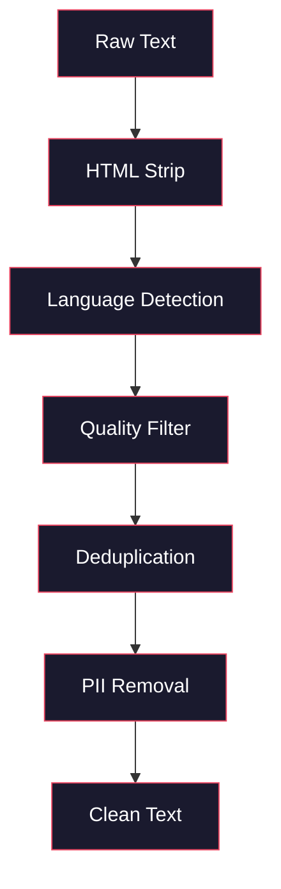
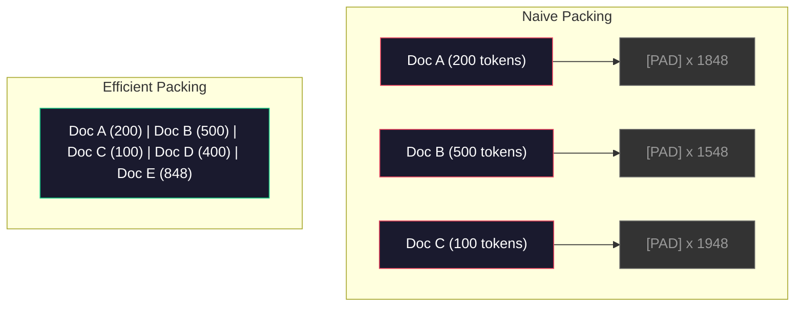

# Data Pipelines for Pre-Training

> The model is a mirror. It reflects whatever data you feed it. Feed it garbage, it reflects garbage with perfect fluency.

**Type:** Build
**Languages:** Python
**Prerequisites:** Phase 10, Lessons 01-02 (Tokenizers, Building a Tokenizer)
**Time:** ~90 minutes

## Learning Objectives

- Build a streaming data pipeline that tokenizes, chunks, shuffles, and batches terabytes of text without loading it all into memory
- Implement data quality filters (deduplication, language detection, content filtering) used in real pre-training pipelines
- Create fixed-length training sequences with proper attention masks and document boundary handling
- Profile pipeline throughput to ensure the dataloader keeps up with GPU training speed

## The Problem

You have a tokenizer. Now you need data.

Not a dataset. Not a CSV file. Terabytes of text -- cleaned, deduplicated, filtered for quality, tokenized into fixed-length sequences, and served in randomized batches fast enough that your 8-GPU cluster never waits for the next batch.

Most people think training an LLM is about the model architecture. It is not. Llama 3 used 15.6 trillion tokens. GPT-3 used 300 billion. DeepSeek-V2 used 8.1 trillion. The architecture across all three is roughly the same: stacked transformer blocks with attention and feedforward layers. The difference in output quality comes overwhelmingly from the data.

The Chinchilla paper from DeepMind made this precise. For a given compute budget, there is an optimal ratio of model parameters to training tokens. Chinchilla showed that most models in 2022 were dramatically undertrained -- they had too many parameters for the amount of data they saw. A 70B parameter model trained on 1.4 trillion tokens (Chinchilla-optimal) outperformed a 280B model trained on 300 billion tokens (Gopher).

Your data pipeline determines whether your model learns language or learns noise.

## The Concept

### Where the Data Comes From

Every large language model is trained on a mix of sources. The exact composition is a closely guarded secret for most labs, but we know enough to understand the categories.

| Source | Size | Quality | Used By |
|--------|------|---------|---------|
| Common Crawl | ~250 TB raw | Low (needs heavy filtering) | GPT-3, Llama, most open models |
| Wikipedia | ~20 GB | High | Every major LLM |
| GitHub code | ~1 TB+ | Medium (lots of duplicates, dead code) | StarCoder, CodeLlama, DeepSeek-Coder |
| Books (BookCorpus, Pile) | ~100 GB | High | GPT-2, GPT-3, early models |
| Academic papers (arXiv, S2ORC) | ~100 GB | High for STEM | Llama, Galactica |
| StackOverflow, Reddit | ~100 GB | Medium | Llama, Falcon |
| Curated web (C4, RefinedWeb) | ~5 TB | Medium-High (pre-filtered) | T5, Falcon |

Llama 3 disclosed its data mix: roughly 50% web data, 25% code, 13% books and academic papers, 8% math data, and 4% multilingual web data. The total was 15.6 trillion tokens from sources exceeding 5 TB of raw text.

The ratio matters as much as the total size. Too much web data and the model becomes a Reddit parrot. Too little code and it cannot program. Too little math and it fails at reasoning. Getting this mix right is one of the hardest parts of training an LLM, and there is no formula -- it requires experimentation and evaluation.

### Data Cleaning

Raw web data is filthy. A typical Common Crawl dump contains:

- HTML tags and JavaScript
- Boilerplate headers, footers, navigation menus
- Duplicate pages (exact and near-duplicate)
- Machine-generated spam
- Personally identifiable information (PII)
- Low-quality text (lists of keywords, SEO spam)
- Non-text content encoded as text

Cleaning this is not optional. It is the difference between a model that generates coherent paragraphs and one that outputs HTML tags mixed with product listings.



Each step eliminates a category of noise:

**HTML stripping:** Remove all markup. Keep only the visible text content. Libraries like `trafilatura` or `readability` extract article content while discarding navigation, ads, and boilerplate.

**Language detection:** Use fastText's language identification model (lid.176.bin) to classify each document. Filter to your target languages. A document classified as English with less than 0.8 confidence probably is not clean English.

**Quality filtering:** This is where it gets interesting. RefinedWeb (the dataset behind Falcon) uses a perplexity-based filter: train a small language model on Wikipedia, then score each document. High perplexity means the document is unlike Wikipedia -- likely spam, keyword lists, or machine-generated content. Documents with perplexity above a threshold get removed.

**Deduplication:** The single most impactful cleaning step. Common Crawl contains enormous numbers of duplicated pages -- legal disclaimers, cookie notices, terms of service. Training on duplicates wastes compute and can cause the model to memorize and regurgitate specific passages verbatim.

**PII removal:** Names, email addresses, phone numbers, social security numbers. Regex-based detection for structured PII, NER models for names in context.

### Deduplication with MinHash

Exact deduplication is easy: hash each document, remove duplicates. But near-duplicates are the real problem. Two copies of the same news article with slightly different ads around it are near-duplicates. The content is 95% identical, but byte-for-byte they differ.

MinHash + Locality-Sensitive Hashing (LSH) solves this efficiently.


The idea:

1. **Shingling:** Convert each document into a set of n-grams (e.g., 5-grams of words or characters). "the quick brown fox" with 3-word shingles becomes {"the quick brown", "quick brown fox"}.

2. **MinHash:** For each document's shingle set, compute k hash values. Each hash value is the minimum hash across all shingles under a different hash function. This creates a fixed-size "signature" that approximates the Jaccard similarity between any two documents.

3. **LSH:** Group documents into buckets based on bands of their MinHash signature. Documents in the same bucket are candidate near-duplicates. This avoids comparing every pair -- you only compare candidates.

4. **Verify:** For each candidate pair, compute exact Jaccard similarity. Remove one copy if similarity exceeds a threshold (typically 0.8).

The Llama team reported removing approximately 38% of their web data through deduplication. That is not a small number. More than a third of Common Crawl is duplicate or near-duplicate content.

### Sequence Packing

Your model expects fixed-length input sequences. Your documents are variable length. Some are 50 tokens. Some are 50,000 tokens.

Naive approach: pad every document to the maximum sequence length. This wastes enormous compute on padding tokens that contribute nothing to learning.

Better approach: pack multiple documents into a single sequence, separated by end-of-sequence tokens. A 2048-token sequence might contain three short documents concatenated with [EOS] tokens between them.



The attention mask must be set correctly. Tokens from Document A should not attend to tokens from Document B within the same packed sequence. This requires a block-diagonal attention mask.

Long documents get truncated or split into chunks at sequence boundaries. The split point matters: splitting mid-sentence forces the model to see incomplete thoughts. Some pipelines align splits to paragraph or sentence boundaries when possible.

### The Chinchilla Scaling Law

For a fixed compute budget C (measured in FLOPs), the optimal model size N and dataset size D follow:

```
N_opt ~ C^0.5
D_opt ~ C^0.5
```

In practice, this means you should scale model size and dataset size roughly equally. A model with 10x more parameters needs roughly 10x more training tokens to reach the same loss.

| Model | Parameters | Training Tokens | Chinchilla-Optimal? |
|-------|-----------|----------------|-------------------|
| GPT-3 | 175B | 300B | No (undertrained 3-4x) |
| Chinchilla | 70B | 1.4T | Yes (by design) |
| Llama 2 | 70B | 2T | Overtrained (intentionally) |
| Llama 3 | 70B | 15T | Heavily overtrained |

Llama 3 deliberately violates the Chinchilla law. Meta found that overtraining on more data -- far beyond the compute-optimal ratio -- produces better models for inference. The extra training cost is paid once, but the smaller model is cheaper to serve forever. This is sometimes called the "inference-optimal" scaling approach, and it has become the industry standard since 2024.


## Further Reading

- [Hoffmann et al., 2022 -- Training Compute-Optimal Large Language Models (Chinchilla)](https://arxiv.org/abs/2203.15556) -- the paper that changed how we think about data scale
- [Penedo et al., 2023 -- The RefinedWeb Dataset for Falcon LLM](https://arxiv.org/abs/2306.01116) -- how to filter Common Crawl to high quality
- [Touvron et al., 2023 -- Llama 2: Open Foundation and Fine-Tuned Chat Models](https://arxiv.org/abs/2307.09288) -- data pipeline details for Llama 2
- [Lee et al., 2022 -- Deduplicating Training Data Makes Language Models Better](https://arxiv.org/abs/2107.06499) -- why deduplication matters more than you think
- [Broder, 1997 -- On the Resemblance and Containment of Documents](https://ieeexplore.ieee.org/document/666900) -- the original MinHash paper
- [Meta, 2024 -- Llama 3 Technical Report](https://arxiv.org/abs/2407.21783) -- 15.6T tokens, data mixing ratios, filtering pipeline
