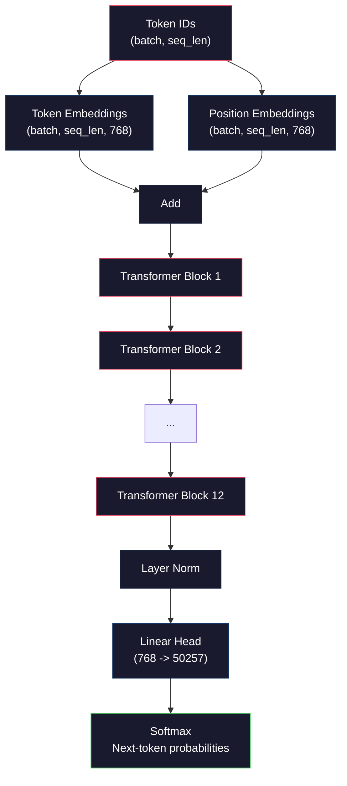
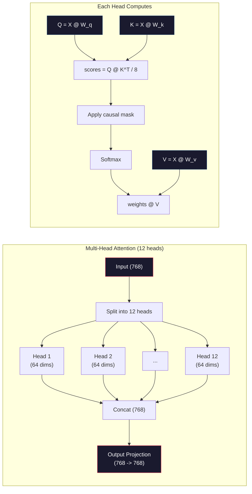
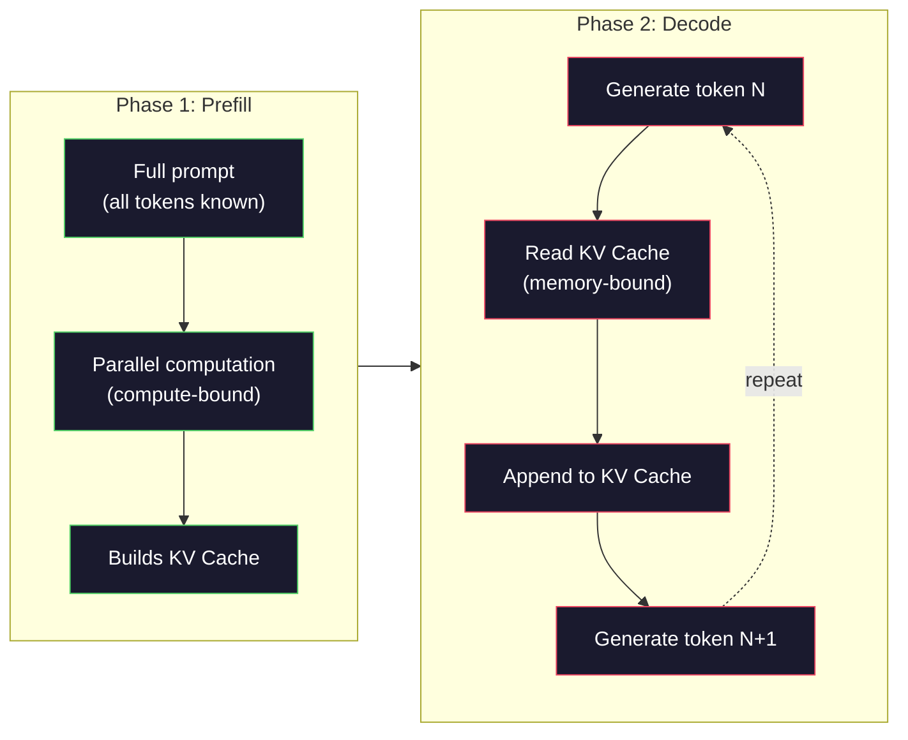

# Pre-Training a Mini GPT (124M Parameters)

> GPT-2 Small has 124 million parameters. That's 12 transformer layers, 12 attention heads, and 768-dimensional embeddings. You can train it from scratch on a single GPU in a few hours. Most people never do this. They use pre-trained checkpoints. But if you don't train one yourself, you don't actually understand what's happening inside the model you're building products on.

**Type:** Build
**Languages:** Python, Rust
**Prerequisites:** Phase 10, Lessons 01-03 (Tokenizers, Building a Tokenizer, Data Pipelines)
**Time:** ~120 minutes

## Learning Objectives

- Implement the full GPT-2 architecture (124M parameters) from scratch: token embeddings, positional embeddings, transformer blocks, and the language model head
- Train a GPT model on a text corpus using next-token prediction with cross-entropy loss
- Implement autoregressive text generation with temperature sampling and top-k/top-p filtering
- Monitor training loss curves and validate that the model learns coherent language patterns

## The Problem

You know what a transformer is. You have read the diagrams. You can recite "attention is all you need" and draw boxes labeled "Multi-Head Attention" on a whiteboard.

None of that means you understand what happens when a model generates text.

There are 124,438,272 parameters in GPT-2 Small (with weight tying). Every single one of them was set by running a training loop: forward pass, compute loss, backward pass, update weights. Twelve transformer blocks. Twelve attention heads per block. A 768-dimensional embedding space. A vocabulary of 50,257 tokens. Every time the model generates a token, all 124 million parameters participate in a single matrix multiplication chain that takes a sequence of token IDs and produces a probability distribution over the next token.

If you have never built this yourself, you are working with a black box. You can use the API. You can fine-tune. But when something goes wrong -- when the model hallucinates, when it repeats itself, when it refuses to follow instructions -- you have no mental model for *why*.

This lesson builds GPT-2 Small from scratch. Not in PyTorch. In numpy. Every matrix multiplication is visible. Every gradient is computed by your code. You will see exactly how 124 million numbers conspire to predict the next word.

## The Concept

### The GPT Architecture

GPT is an autoregressive language model. "Autoregressive" means it generates one token at a time, each conditioned on all previous tokens. The architecture is a stack of transformer decoder blocks.

Here is the full computation graph from token IDs to next-token probabilities:

1. Token IDs come in. Shape: (batch_size, seq_len).
2. Token embedding lookup. Each ID maps to a 768-dimensional vector. Shape: (batch_size, seq_len, 768).
3. Position embedding lookup. Each position (0, 1, 2, ...) maps to a 768-dimensional vector. Same shape.
4. Add token embeddings + position embeddings.
5. Pass through 12 transformer blocks.
6. Final layer normalization.
7. Linear projection to vocabulary size. Shape: (batch_size, seq_len, vocab_size).
8. Softmax to get probabilities.

That is the entire model. No convolutions. No recurrence. Just embeddings, attention, feedforward networks, and layer norms stacked 12 times.



### The Transformer Block

Each of the 12 blocks follows the same pattern. Pre-norm architecture (GPT-2 uses pre-norm, not post-norm like the original transformer):

1. LayerNorm
2. Multi-Head Self-Attention
3. Residual connection (add input back)
4. LayerNorm
5. Feed-Forward Network (MLP)
6. Residual connection (add input back)

The residual connections are critical. Without them, gradients vanish by the time they reach block 1 during backpropagation. With them, gradients can flow directly from the loss to any layer through the "skip" path. This is why you can stack 12, 32, or even 96 blocks (GPT-4 is rumored to use 120).

### Attention: The Core Mechanism

Self-attention lets every token look at every previous token and decide how much to attend to each one. Here is the math.

For each token position, compute three vectors from the input:
- **Query (Q)**: "What am I looking for?"
- **Key (K)**: "What do I contain?"
- **Value (V)**: "What information do I carry?"

```
Q = input @ W_q    (768 -> 768)
K = input @ W_k    (768 -> 768)
V = input @ W_v    (768 -> 768)

attention_scores = Q @ K^T / sqrt(d_k)
attention_scores = mask(attention_scores)   # causal mask: -inf for future positions
attention_weights = softmax(attention_scores)
output = attention_weights @ V
```

The causal mask is what makes GPT autoregressive. Position 5 can attend to positions 0-5 but not 6, 7, 8, and so on. This prevents the model from "cheating" by looking at future tokens during training.

**Multi-head attention** splits the 768-dimensional space into 12 heads of 64 dimensions each. Each head learns a different attention pattern. One head might track syntactic relationships (subject-verb agreement). Another might track semantic similarity (synonyms). Another might track positional proximity (nearby words). The outputs from all 12 heads are concatenated and projected back to 768 dimensions.



The division by sqrt(d_k) -- sqrt(64) = 8 -- is scaling. Without it, the dot products grow large for high-dimensional vectors, pushing softmax into regions where gradients are nearly zero. This was one of the key insights in the original "Attention Is All You Need" paper.

### KV Cache: Why Inference Is Fast

During training, you process the entire sequence at once. During inference, you generate one token at a time. Without optimization, generating token N requires recomputing attention for all N-1 previous tokens. That is O(N^2) per generated token, or O(N^3) total for a sequence of length N.

KV Cache solves this. After computing K and V for each token, store them. When generating token N+1, you only need to compute Q for the new token and look up the cached K and V from all previous tokens. This reduces per-token cost from O(N) to O(1) for the K and V computation. The attention score calculation is still O(N) because you attend to all previous positions, but you avoid redundant matrix multiplications on the input.

For GPT-2 with 12 layers and 12 heads, the KV cache stores 2 (K + V) x 12 layers x 12 heads x 64 dims = 18,432 values per token. For a 1024-token sequence, that is about 75MB in FP32. For Llama 3 405B with 128 layers, the KV cache for a single sequence can exceed 10GB. This is why long-context inference is memory-bound.

### Prefill vs Decode: Two Phases of Inference

When you send a prompt to an LLM, inference happens in two distinct phases.

**Prefill** processes your entire prompt in parallel. All tokens are known, so the model can compute attention for all positions simultaneously. This phase is compute-bound -- the GPU is doing matrix multiplications at full throughput. For a 1000-token prompt on an A100, prefill takes roughly 20-50ms.

**Decode** generates tokens one at a time. Each new token depends on all previous tokens. This phase is memory-bound -- the bottleneck is reading the model weights and KV cache from GPU memory, not the matrix math itself. The GPU's compute cores sit mostly idle waiting for memory reads. For GPT-2, each decode step takes about the same time regardless of how many FLOPs the matmuls require, because memory bandwidth is the constraint.

This distinction matters for production systems. Prefill throughput scales with GPU compute (more FLOPS = faster prefill). Decode throughput scales with memory bandwidth (faster memory = faster decode). That is why NVIDIA's H100 focused on memory bandwidth improvements over the A100 -- it directly speeds up token generation.



### The Training Loop

Training an LLM is next-token prediction. Given tokens [0, 1, 2, ..., N-1], predict tokens [1, 2, 3, ..., N]. The loss function is cross-entropy between the model's predicted probability distribution and the actual next token.

One training step:

1. **Forward pass**: Run the batch through all 12 blocks. Get logits (pre-softmax scores) for each position.
2. **Compute loss**: Cross-entropy between logits and target tokens (the input shifted by one position).
3. **Backward pass**: Compute gradients for all 124M parameters using backpropagation.
4. **Optimizer step**: Update weights. GPT-2 uses Adam with learning rate warmup and cosine decay.

The learning rate schedule matters more than you might expect. GPT-2 warms up from 0 to the peak learning rate over the first 2,000 steps, then decays following a cosine curve. Starting with a high learning rate causes the model to diverge. Keeping a constant high rate causes oscillation in later training. The warmup-then-decay pattern is used by every major LLM.

### GPT-2 Small: The Numbers

| Component | Shape | Parameters |
|-----------|-------|------------|
| Token embeddings | (50257, 768) | 38,597,376 |
| Position embeddings | (1024, 768) | 786,432 |
| Per-block attention (W_q, W_k, W_v, W_out) | 4 x (768, 768) | 2,359,296 |
| Per-block FFN (up + down) | (768, 3072) + (3072, 768) | 4,718,592 |
| Per-block LayerNorms (2x) | 2 x 768 x 2 | 3,072 |
| Final LayerNorm | 768 x 2 | 1,536 |
| **Total per block** | | **7,080,960** |
| **Total (12 blocks)** | | **85,054,464 + 39,383,808 = 124,438,272** |

The output projection (logits head) shares weights with the token embedding matrix. This is called weight tying -- it reduces the parameter count by 38M and improves performance because it forces the model to use the same representation space for input and output.


## Further Reading

- [Radford et al., 2019 -- "Language Models are Unsupervised Multitask Learners" (GPT-2)](https://cdn.openai.com/better-language-models/language_models_are_unsupervised_multitask_learners.pdf) -- the GPT-2 paper that introduced the 124M to 1.5B parameter family
- [Vaswani et al., 2017 -- "Attention Is All You Need"](https://arxiv.org/abs/1706.03762) -- the original transformer paper with scaled dot-product attention and multi-head attention
- [Llama 3 Technical Report](https://arxiv.org/abs/2407.21783) -- how Meta scaled the GPT architecture to 405B parameters with 16K GPUs
- [Pope et al., 2022 -- "Efficiently Scaling Transformer Inference"](https://arxiv.org/abs/2211.05102) -- the paper that formalized prefill vs decode and KV cache analysis
