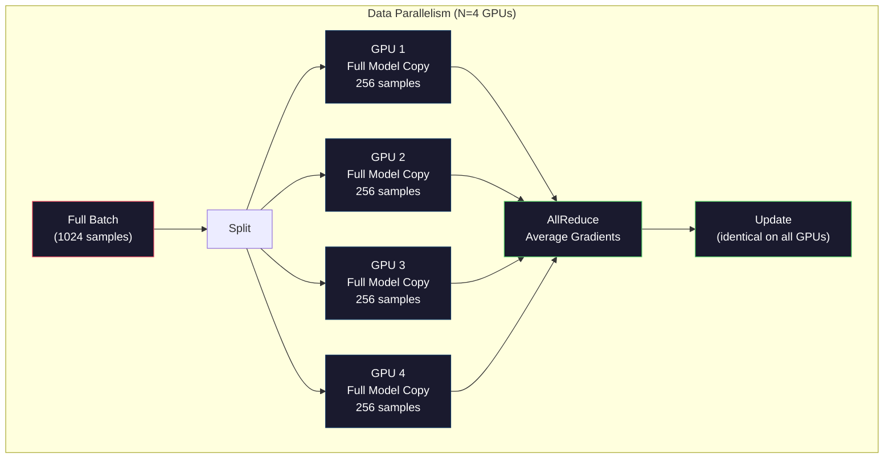
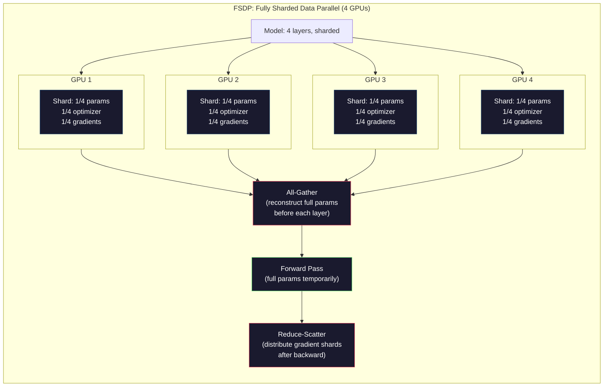
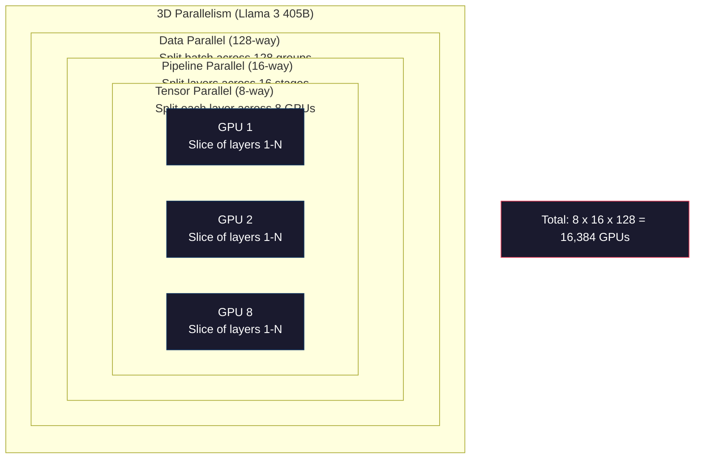

# Scaling: Distributed Training, FSDP, DeepSpeed

> Your 124M model trained on one GPU. Now try 7 billion parameters. The model doesn't fit in memory. The data takes weeks on a single machine. Distributed training isn't optional at scale. It's the only path forward.

**Type:** Build
**Languages:** Python
**Prerequisites:** Phase 10, Lesson 04 (Pre-Training a Mini GPT)
**Time:** ~120 minutes

## Learning Objectives

- Explain the three types of parallelism (data, tensor, pipeline) and when each is necessary based on model and cluster size
- Implement data-parallel training using PyTorch DDP with gradient synchronization across multiple GPUs
- Calculate the memory budget for a given model size (weights + optimizer states + gradients + activations) to determine the minimum hardware
- Configure FSDP or DeepSpeed ZeRO stages to shard model states across GPUs and fit models that exceed single-GPU memory

## The Problem

A 7B parameter model in FP16 needs 14GB just for the weights. Adam optimizer stores two additional copies of every parameter (first and second moment estimates). That is another 28GB. Gradients during backpropagation add 14GB more. You are at 56GB before a single activation is stored.

An NVIDIA A100 has 80GB of memory.

56GB out of 80GB consumed. That leaves 24GB for activations -- the intermediate values computed during the forward pass that must be kept alive for backpropagation. For a 2048-token sequence with a 4096-dimensional model, a single layer's activations use about 64MB. With 32 layers, you need 2GB per sample. A batch size of 8 requires 16GB. You have 24GB. A batch size of 12 blows up.

Now try 70B parameters. Weights alone: 140GB in FP16. Does not fit on one GPU. You need at least 2 A100s (2 x 80GB = 160GB) just to hold the weights. Add optimizer states and gradients and you need far more: 3+ GPUs minimum, and realistically 8-16 depending on sharding strategy.

Llama 3 405B was trained on 16,384 NVIDIA H100 GPUs. The training run cost an estimated $100 million in compute. DeepSeek V3 trained a comparable model for roughly $5.6 million by being clever about architecture (Mixture of Experts means only a fraction of parameters activate per token) and training efficiency.

This lesson covers the four strategies that make large-scale training possible: data parallelism, tensor parallelism, pipeline parallelism, and fully sharded data parallelism. You will simulate each one in pure Python to understand the mechanics before ever touching a distributed training framework.

## The Concept

### Why Distribution is Required

Here is the memory math for real models. Every number is calculated, not estimated.

| Model | Params | Weights (FP16) | Adam States | Gradients (FP16) | Total (no activations) |
|-------|--------|----------------|-------------|------------------|----------------------|
| GPT-2 Small | 124M | 248 MB | 992 MB | 248 MB | 1.5 GB |
| Llama 3 8B | 8B | 16 GB | 64 GB | 16 GB | 96 GB |
| Llama 3 70B | 70B | 140 GB | 560 GB | 140 GB | 840 GB |
| Llama 3 405B | 405B | 810 GB | 3,240 GB | 810 GB | 4,860 GB |

The "Adam States" column is the killer. Adam stores a running mean (m) and a running variance (v) for every parameter, both in FP32. For a 70B model, that is 70B x 4 bytes x 2 = 560GB. The optimizer alone needs seven A100s.

A single H100 has 80GB. Llama 3 405B needs at least 61 H100s to hold the weights, optimizer, and gradients. Add activations and the number grows further. Meta used 16,384 GPUs not because they wanted to -- because they had to.

### Data Parallelism

The simplest distributed strategy. Copy the entire model to N GPUs. Split each training batch into N equal parts. Each GPU runs a forward and backward pass on its shard of the data. After the backward pass, average the gradients across all GPUs. Every GPU updates its copy of the weights with the same averaged gradients, keeping all copies in sync.

**The good:** Linear throughput scaling. N GPUs process N times more data per step. Communication is limited to gradient averaging, which overlaps with computation.

**The bad:** Every GPU holds a complete copy of the model, optimizer states, and gradients. For a 70B model, each GPU needs 840GB. Data parallelism does nothing to reduce per-GPU memory. It only reduces training time.

**The math:** Effective batch size = per_gpu_batch_size x N. For N=64 GPUs with per-GPU batch of 16, the effective batch is 1,024. Llama 3 used an effective batch size of 16 million tokens per step.

### Tensor Parallelism

Split individual layers across GPUs. A single matrix multiplication is divided among GPUs, each computing part of the result.

Consider a weight matrix of shape (8192, 8192) in a feedforward layer. With 4-way tensor parallelism, each GPU holds a (8192, 2048) shard. Each GPU multiplies the input by its shard, producing a partial result. The partial results are combined (via all-reduce or all-gather) to produce the full output.

**The good:** Reduces per-GPU memory for model weights. A 70B model split across 8 GPUs means each GPU holds ~8.75B parameters worth of weights.

**The bad:** Requires fast inter-GPU communication after every layer. The all-reduce after each matmul adds latency. This works well with NVLink (900 GB/s between GPUs on the same node) but poorly across nodes connected by InfiniBand (400 Gb/s, about 50 GB/s). Tensor parallelism is almost always limited to within a single node (8 GPUs).

**Real usage:** Megatron-LM pioneered tensor parallelism. Llama 3 405B uses 8-way tensor parallelism within each node.

### Pipeline Parallelism

Split the model by layers. GPU 1 runs layers 1-8. GPU 2 runs layers 9-16. GPU 3 runs layers 17-24. GPU 4 runs layers 25-32. Data flows through the pipeline: GPU 1 computes its layers and sends activations to GPU 2, which computes its layers and sends to GPU 3, and so on.

**The good:** Minimal communication between GPUs -- just the activations at layer boundaries, which are small compared to gradients or weights. Works across nodes because bandwidth requirements are low.

**The bad:** Pipeline bubbles. When GPU 4 is computing the forward pass on micro-batch 1, GPUs 1, 2, and 3 are idle (they have already forwarded their portion). During backward pass, the pattern reverses. With naive pipelining, GPU utilization is only 1/N for N pipeline stages.

**GPipe and PipeDream** solve the bubble problem by splitting the batch into micro-batches. GPU 1 starts on micro-batch 2 as soon as it finishes forwarding micro-batch 1. This overlaps computation across pipeline stages. With M micro-batches and N stages, the bubble fraction drops to (N-1)/M. Use M=16 micro-batches with N=4 stages and the bubble is 3/16 = 18.75% idle time.

### FSDP: Fully Sharded Data Parallel

FSDP combines the scalability of data parallelism with the memory efficiency of sharding. Instead of each GPU holding a complete copy of the model, each GPU holds only 1/N of the parameters, gradients, and optimizer states.

Before a layer's forward pass, FSDP runs an **all-gather** to collect the full parameters from all GPUs into each GPU's memory. After the forward pass, each GPU discards the non-local parameters. During backward, the all-gather runs again to reconstruct parameters for gradient computation. After the backward pass, a **reduce-scatter** distributes gradient shards so each GPU only stores 1/N of the gradients.

**The math for a 70B model on 8 GPUs:**

| Component | Without FSDP | With FSDP |
|-----------|-------------|-----------|
| Weights (FP16) | 140 GB per GPU | 17.5 GB per GPU |
| Adam States (FP32) | 560 GB per GPU | 70 GB per GPU |
| Gradients (FP16) | 140 GB per GPU | 17.5 GB per GPU |
| **Total** | **840 GB per GPU** | **105 GB per GPU** |

Without FSDP, you cannot fit a 70B model on a single 80GB GPU. With FSDP on 8 GPUs, each GPU uses 105GB -- wait, that still does not fit. You need at least 16 GPUs to get under 80GB per GPU, or you combine FSDP with activation checkpointing (recompute activations during backward instead of storing them).

The communication cost is higher than vanilla data parallelism because of the all-gather before each layer. But the memory savings make previously impossible training runs possible.

### DeepSpeed ZeRO

DeepSpeed's ZeRO (Zero Redundancy Optimizer) is conceptually identical to FSDP but was developed independently by Microsoft. It defines three stages, each sharding more aggressively:

| Stage | Shards | Memory Savings | Communication |
|-------|--------|---------------|---------------|
| ZeRO-1 | Optimizer states only | ~4x reduction | Same as data parallel |
| ZeRO-2 | + Gradients | ~8x reduction | Slightly more |
| ZeRO-3 | + Parameters | ~Nx reduction (N GPUs) | All-gather per layer |

ZeRO-3 is equivalent to FSDP. The naming is different, the mechanism is the same. PyTorch added FSDP as a native implementation after DeepSpeed proved the concept.

DeepSpeed also introduced ZeRO-Offload (offload optimizer states to CPU RAM, which is cheaper and larger) and ZeRO-Infinity (offload to NVMe SSDs). These trade compute speed for memory capacity -- the offloaded operations are slower but free up GPU memory.

### Mixed Precision Training

Modern training uses multiple floating-point formats simultaneously:

- **Forward pass**: FP16 or BF16 (16-bit). Half the memory of FP32. Matmuls run 2x faster on tensor cores.
- **Master weights**: FP32 (32-bit). Maintained by the optimizer for numerical precision during weight updates.
- **Loss scaling**: Multiply the loss by a large constant before backward pass to prevent FP16 gradients from underflowing to zero. Divide by the same constant before the optimizer step.

BF16 (Brain Float 16) has the same exponent range as FP32 (8 exponent bits) but reduced precision (7 mantissa bits vs FP32's 23). It rarely needs loss scaling because it can represent the same range of values. FP16 has 5 exponent bits and 10 mantissa bits -- it can represent fine-grained values but overflows/underflows at extreme magnitudes.

Google's TPUs use BF16 natively. NVIDIA's A100 and H100 support both FP16 and BF16. The industry has largely moved to BF16 because it eliminates loss scaling headaches.

**Memory comparison for a 7B model:**

| Precision | Weights | Optimizer | Gradients | Total |
|-----------|---------|-----------|-----------|-------|
| FP32 everywhere | 28 GB | 56 GB | 28 GB | 112 GB |
| Mixed (BF16 + FP32 master) | 14 GB | 56 GB | 14 GB | 84 GB |

Mixed precision saves 28GB on this model. The optimizer states stay in FP32 regardless -- this is where most of the memory goes.

### Megatron-LM and 3D Parallelism

Real large-scale training combines all three parallelisms:

- **Data parallelism** across groups of nodes (scale batch size)
- **Tensor parallelism** within a node (split layers across 8 GPUs)
- **Pipeline parallelism** across nodes (split layer groups across machines)

Llama 3 405B on 16,384 H100s:
- 8-way tensor parallelism within each node (8 GPUs per node)
- 16-way pipeline parallelism across nodes (16 pipeline stages)
- 128-way data parallelism across the remaining dimension (16,384 / 8 / 16 = 128)

This 3D decomposition (8 x 16 x 128 = 16,384) is how you scale to thousands of GPUs. Each GPU sees a different data shard (data parallel), holds one slice of each layer (tensor parallel), and computes a different set of layers (pipeline parallel).

DeepSeek V3 took a different approach. Their Mixture of Experts architecture activates only 37B out of 671B parameters per token. This means each GPU only needs to compute (and store activations for) the active parameters. They trained on 2,048 H800 GPUs -- less than 1/8 of Meta's GPU count -- for $5.6M vs Meta's estimated $100M.

## Build It

Reconstruct **Scaling: Distributed Training, FSDP, DeepSpeed** by following `simulate_data_parallelism` on x=0.5 with the demo defaults. Run `python3 main.py` and verify that the update or loss change agrees with the gradient sign; a zero gradient produces no accidental jump.

## Use It

Call `simulate_data_parallelism` from a small caller with x=0.5 with the demo defaults. Compare its result with the demo output, and record the input contract and the one field a downstream user should rely on.

## Ship It

Hand off `outputs/prompt-distributed-training-planner.md` with the command `python3 main.py`, the accepted input shape (x=0.5 with the demo defaults), the expected observable result, and a failure note for malformed inputs.

## Further Reading

- [Rajbhandari et al., 2020 -- "ZeRO: Memory Optimizations Toward Training Trillion Parameter Models"](https://arxiv.org/abs/1910.02054) -- the DeepSpeed ZeRO paper that defined the three sharding stages
- [Shoeybi et al., 2020 -- "Megatron-LM: Training Multi-Billion Parameter Language Models Using Model Parallelism"](https://arxiv.org/abs/1909.08053) -- NVIDIA's tensor parallelism for transformers
- [Narayanan et al., 2021 -- "Efficient Large-Scale Language Model Training on GPU Clusters Using Megatron-LM"](https://arxiv.org/abs/2104.04473) -- 3D parallelism combining data, tensor, and pipeline
- [Zhao et al., 2023 -- "PyTorch FSDP: Experiences on Scaling Fully Sharded Data Parallel"](https://arxiv.org/abs/2304.11277) -- PyTorch's native FSDP implementation
- [Llama 3 Technical Report](https://arxiv.org/abs/2407.21783) -- 16,384 GPU training with 3D parallelism details
- [DeepSeek-V3 Technical Report](https://arxiv.org/abs/2412.19437) -- how MoE architecture reduces training cost by an order of magnitude

## Exercises

This lab follows `simulate_data_parallelism` and `simulate_tensor_parallelism` on a controlled fixture; write down the value before changing the input.

1. **Trace the canonical fixture.** From `code/`, run `python3 main.py` using x=0.5 with the demo defaults. Follow `simulate_data_parallelism`, `simulate_tensor_parallelism`, `simulate_pipeline_parallelism`. Expect the update or loss change agrees with the gradient sign; a zero gradient produces no accidental jump; capture the first printed shape, metric, status, or summary field and state which part supports **Explain the three types of parallelism (data, tensor, pipeline) and when each is necessary based on model and cluster size**.
2. **Change the controlled parameter.** Repeat the command after changing only the learning rate: use the same run with learning rate 0.1 instead of 0.01. Predict the direction of the change, then compare the two output values. Explain why **Implement data-parallel training using PyTorch DDP with gradient synchronization across multiple GPUs** says the other inputs should stay fixed.
3. **Exercise the guard.** Feed the implementation a zero gradient or an already-minimized point. Before running it, write down whether the relevant function should return an empty value, a zero-sized result, or a validation error. Check the observed status against **Calculate the memory budget for a given model size (weights + optimizer states + gradients + activations) to determine the minimum hardware** and record the exception text if the code rejects the case.
4. **Prepare the artifact for reuse.** Open `outputs/prompt-distributed-training-planner.md` and add a worked example using x=0.5 with the demo defaults. Include the input contract, one expected output field, and a named acceptance check for **Configure FSDP or DeepSpeed ZeRO stages to shard model states across GPUs and fit models that exceed single-GPU memory**; note what the demo cannot establish.

## Reference Solution

A checkable result for **Scaling: Distributed Training, FSDP, DeepSpeed** should contain:

- the `python3 main.py` output for x=0.5 with the demo defaults, with `simulate_data_parallelism`, `simulate_tensor_parallelism`, `simulate_pipeline_parallelism` traced to the value or shape that supports **Explain the three types of parallelism (data, tensor, pipeline) and when each is necessary based on model and cluster size**;
- a before/after comparison for the learning rate, where the same run with learning rate 0.1 instead of 0.01 changes the observation in the direction predicted by **Implement data-parallel training using PyTorch DDP with gradient synchronization across multiple GPUs**;
- a recorded result for a zero gradient or an already-minimized point that matches the implementation’s validation or empty-result contract and explains the evidence for **Calculate the memory budget for a given model size (weights + optimizer states + gradients + activations) to determine the minimum hardware**; and
- an updated `outputs/prompt-distributed-training-planner.md` example with a concrete input, expected output field, and acceptance check tied to **Configure FSDP or DeepSpeed ZeRO stages to shard model states across GPUs and fit models that exceed single-GPU memory**.

Run the lesson tests after the demo. If the boundary behaves differently from the prediction, keep the actual exception or output and explain the implementation path that produced it.
