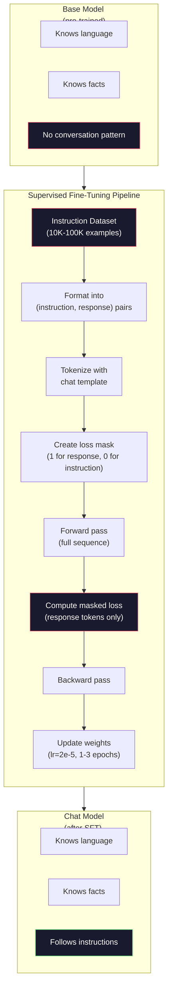

# Instruction Tuning (SFT)

> A base model predicts the next token. That's it. It doesn't follow instructions, answer questions, or refuse harmful requests. SFT is the bridge between a token predictor and a useful assistant. Every model you've ever talked to -- Claude, GPT, Llama Chat -- went through this step.

**Type:** Build
**Languages:** Python
**Prerequisites:** Phase 10, Lesson 04 (Pre-Training a Mini GPT)
**Time:** ~90 minutes

## Learning Objectives

- Implement supervised fine-tuning (SFT) that converts a base language model into an instruction-following assistant
- Format training data using chat templates with system, user, and assistant roles, and mask loss on non-assistant tokens
- Explain why SFT is necessary: base models continue text rather than answer questions
- Evaluate SFT quality by comparing base model vs fine-tuned model responses on a held-out instruction set

## The Problem

You trained a model in Lesson 04. It can predict the next token given a sequence. Feed it "The transformer architecture" and it might continue with "has revolutionized natural language processing." That's impressive for a next-token predictor.

Now try this: feed it "What is the capital of France?" A base model doesn't answer "Paris." It continues the pattern. It might produce "What is the capital of Germany? What is the capital of Spain?" because it learned from documents that contain lists of questions. Or it might produce "is a question that many people ask" because that's a plausible next-token continuation. The model has no concept of *answering*. It only knows *continuing*.

This is the gap between GPT-3 (base model, released June 2020) and ChatGPT (instruction-tuned, released November 2022). Same architecture. Same pre-training. The difference is 20,000 to 100,000 carefully crafted (instruction, response) pairs that taught the model to follow the conversation pattern.

Stanford Alpaca proved you don't need millions of examples. In March 2023, they fine-tuned Llama 7B on just 52,000 instruction-response pairs generated by GPT-3.5. Total cost: $600. The result was a chatbot that could follow instructions, answer questions, and hold conversations. Not as good as ChatGPT, but shockingly close for $600 and a few hours of training.

Meta's Llama 2 Chat used only ~27,000 high-quality examples for its initial SFT stage. The key insight: quality matters more than quantity. 27,000 examples written by skilled annotators beat 1 million noisy examples scraped from the internet.

## The Concept

### What SFT Actually Does

Supervised Fine-Tuning continues the same training loop from pre-training -- forward pass, compute loss, backward pass, update weights -- but on a different kind of data. Instead of raw text, you train on structured conversations:

```json
{
  "system": "You are a helpful assistant.",
  "user": "What is the capital of France?",
  "assistant": "The capital of France is Paris."
}
```

The model already knows that Paris is the capital of France. It learned this during pre-training on Wikipedia, textbooks, and web pages. SFT doesn't teach the model new facts. It teaches the model a new *behavior*: when you see a question, produce an answer. When you see an instruction, produce a completion. When you see a harmful request, produce a refusal.

Think of it this way. Pre-training gives the model knowledge. SFT gives the model manners.

### Data Formats

Three formats dominate the industry. Each encodes the same information -- who said what -- with different delimiters.

**Alpaca Format** (Stanford, March 2023):

```json
{
  "instruction": "Summarize the following article in 3 sentences.",
  "input": "The European Central Bank raised interest rates...",
  "output": "The ECB increased rates by 25 basis points..."
}
```

Simple and widely used. The `input` field is optional -- many instructions don't need additional context. Stanford released 52,000 examples in this format, generated by GPT-3.5 for $600. This kicked off the open-source instruction tuning movement.

**ShareGPT Format** (community, 2023):

```json
{
  "conversations": [
    {"from": "system", "value": "You are a helpful assistant."},
    {"from": "human", "value": "What causes tides?"},
    {"from": "gpt", "value": "Tides are caused by the gravitational pull of the Moon..."},
    {"from": "human", "value": "How often do they occur?"},
    {"from": "gpt", "value": "Most coastal areas experience two high tides and two low tides per day..."}
  ]
}
```

Supports multi-turn conversations. The "from" field uses "human" and "gpt" by convention, regardless of the actual model. Vicuna was trained on 70,000 ShareGPT conversations scraped from user-shared ChatGPT transcripts.

**ChatML Format** (OpenAI, used by many open-source models):

```
<|im_start|>system
You are a helpful assistant.<|im_end|>
<|im_start|>user
What is the capital of France?<|im_end|>
<|im_start|>assistant
The capital of France is Paris.<|im_end|>
```

Uses special tokens (`<|im_start|>`, `<|im_end|>`) to delimit roles. These tokens are added to the tokenizer's vocabulary during fine-tuning. Qwen, Yi, and many other models use ChatML.

All three formats accomplish the same thing: they tell the model "this is the instruction, this is the response, learn this pattern."

### Why It Works

The model already knows language from pre-training. It has seen billions of examples of questions followed by answers, instructions followed by completions, and conversations between people. The patterns are already encoded in the weights.

SFT concentrates this latent ability. Instead of the model needing to figure out from context whether it should answer a question or continue a document, SFT explicitly trains on the conversation pattern. After a few thousand examples, the model learns: when you see the assistant role marker, produce a helpful response.

This is why 27,000 examples is enough. You're not teaching the model English. You're not teaching it facts about the world. You're teaching it one simple behavior: respond to instructions. The knowledge was already there.

### The Masked Loss

This is the most important technical detail in SFT, and most tutorials skip it.

During pre-training, you compute loss on every token. The model learns to predict every next token in the sequence. During SFT, you only compute loss on the *response* tokens. The instruction tokens are there for context, but the model is not penalized for "predicting" them incorrectly.

Why? Because you don't want the model to learn to *generate* instructions. You want it to learn to *respond to* instructions. If you compute loss on the instruction tokens, you're training the model to predict "What is the capital of France?" as if it's the one asking the question. That wastes gradient signal and can confuse the model about its role.

In practice, you create a loss mask: 1 for response tokens, 0 for instruction tokens. Multiply the per-token loss by this mask before averaging.

```
Tokens:    [SYS] You are helpful [USER] What is the capital? [ASST] Paris is the capital [EOS]
Loss mask:   0    0    0     0      0     0   0  0     0       1     1    1   1     1      1
```

Only the tokens after `[ASST]` contribute to the loss. The model sees the full conversation during the forward pass (it needs the instruction to produce the right response) but only updates its weights based on how well it predicted the response.

### Training Hyperparameters

SFT uses dramatically different hyperparameters than pre-training. You're not training from scratch. You're adjusting a model that already works.

| Parameter | Pre-Training (Llama 2 7B) | SFT (Llama 2 Chat) |
|-----------|---------------------------|---------------------|
| Learning rate | 3e-4 (peak) | 2e-5 |
| Epochs | 1 (single pass over data) | 2 |
| Batch size | 4M tokens | 64 examples |
| Warmup steps | 2,000 | 0-100 |
| Weight decay | 0.1 | 0.0-0.1 |
| Data size | 2T tokens | 27,000 examples |

The learning rate is 15x lower for SFT. This is critical. A high learning rate during fine-tuning destroys the pre-trained knowledge. The model "forgets" what it learned and overfits to the small fine-tuning dataset. This is catastrophic forgetting.

Two epochs means the model sees each training example twice. More than 3 epochs on a small dataset leads to memorization -- the model starts reproducing training examples verbatim instead of generalizing.

### Catastrophic Forgetting

Fine-tuning can destroy general capabilities. Train too long on instruction-following data and the model loses its ability to write code, do math, or produce creative text. It becomes very good at the specific format of its training data and terrible at everything else.

Three mitigations:

1. **Low learning rate.** 1e-5 to 5e-5. Smaller updates mean less destruction of pre-trained features.

2. **Short training.** 1-3 epochs. Stop before the model overfits.

3. **Mix in pre-training data.** Llama 2 Chat mixed a small percentage (2-5%) of raw pre-training data into the SFT dataset. This "reminds" the model of its general capabilities while learning the new instruction-following behavior.

### Real Numbers

Fine-tuning a 7B model on 10,000 high-quality instruction pairs takes approximately 1 hour on a single NVIDIA A100 80GB GPU. Here's the math:

- 10,000 examples x 512 tokens average = 5.12M tokens
- 2 epochs = 10.24M tokens total
- A100 throughput for 7B model fine-tuning: ~3,000 tokens/second
- 10.24M / 3,000 = ~3,400 seconds = ~57 minutes

For our mini GPT (4 layers, 128 dims), training is nearly instant. The point is understanding the mechanics, not the scale.




## Further Reading

- [Ouyang et al., 2022 -- "Training language models to follow instructions with human feedback" (InstructGPT)](https://arxiv.org/abs/2203.02155) -- the paper that introduced instruction tuning + RLHF at OpenAI
- [Taori et al., 2023 -- "Stanford Alpaca: An Instruction-following LLaMA Model"](https://github.com/tatsu-lab/stanford_alpaca) -- 52K instruction examples for $600, proving SFT works on small datasets
- [Touvron et al., 2023 -- "Llama 2: Open Foundation and Fine-Tuned Chat Models"](https://arxiv.org/abs/2307.09288) -- Meta's SFT + RLHF pipeline with 27K high-quality examples
- [Chiang et al., 2023 -- "Vicuna: An Open-Source Chatbot Impressing GPT-4"](https://lmsys.org/blog/2023-03-30-vicuna/) -- training on 70K ShareGPT conversations
- [Zhou et al., 2023 -- "LIMA: Less Is More for Alignment"](https://arxiv.org/abs/2305.11206) -- proving that 1,000 carefully curated examples can match SFT on much larger datasets
