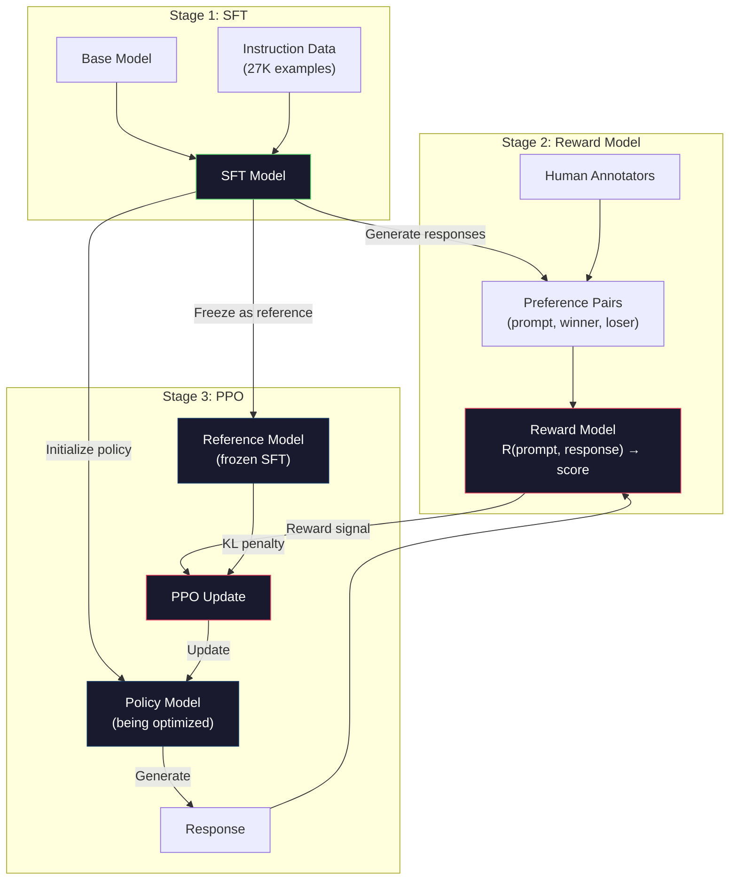
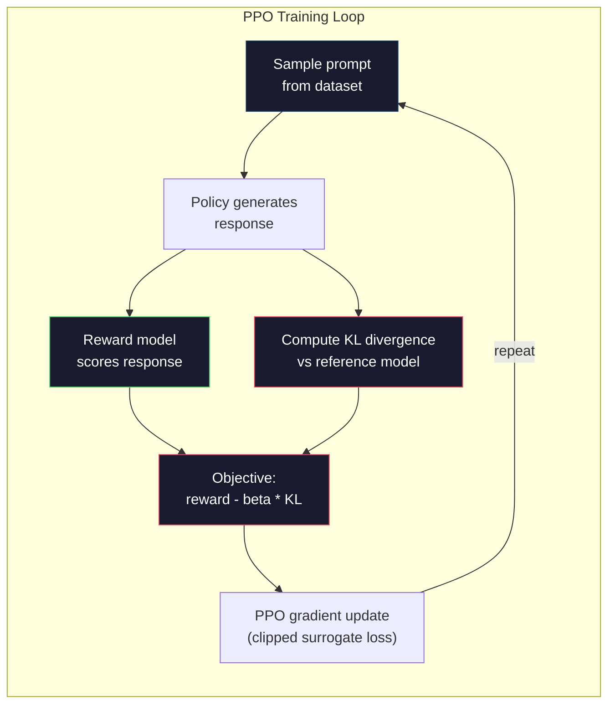

# RLHF: Reward Model + PPO

> SFT teaches the model to follow instructions. But it doesn't teach the model which response is BETTER. Two grammatically correct, factually accurate answers can differ enormously in helpfulness. RLHF is how you encode human judgment into the model's behavior. It's what makes Claude helpful and GPT polite.

**Type:** Build
**Languages:** Python
**Prerequisites:** Phase 10, Lesson 06 (Instruction Tuning / SFT)
**Time:** ~90 minutes

## Learning Objectives

- Build a reward model that scores response quality from human preference pairs (chosen vs rejected)
- Implement the PPO training loop that optimizes a language model policy against the reward model with a KL penalty
- Explain why RLHF requires three models (SFT, reward, policy) and how the KL constraint prevents reward hacking
- Evaluate the effect of RLHF by comparing response quality before and after preference optimization

## The Problem

Ask a model "Explain quantum computing" and it might produce:

**Response A:** "Quantum computing uses qubits that can exist in superposition, meaning they can be 0, 1, or both simultaneously. This allows quantum computers to process certain calculations exponentially faster than classical computers. Key algorithms include Shor's algorithm for factoring large numbers and Grover's algorithm for searching unsorted databases."

**Response B:** "Quantum computing is a type of computing that uses quantum mechanical phenomena. It was first proposed in the 1980s. Richard Feynman suggested that quantum systems could be simulated by quantum computers. The field has grown significantly since then. Many companies are now working on quantum computers. IBM, Google, and others have made progress. Quantum supremacy was claimed by Google in 2019."

Both responses are factually correct. Both are grammatically sound. Both follow the instruction. But Response A is clearly better. It's more concise, more informative, and better structured. A human would pick A every time.

SFT can't capture this distinction. It trains the model on "correct" responses, but it has no mechanism for saying "this response is better than that one." It treats every training example as equally good. If both A and B appeared in the SFT dataset, the model would learn from both equally.

RLHF solves this. It trains a reward model to predict which response a human would prefer, then uses that reward signal to push the language model toward higher-quality outputs. InstructGPT (the precursor to ChatGPT) used RLHF to dramatically improve GPT-3's helpfulness, truthfulness, and harmlessness. OpenAI's internal evaluators preferred InstructGPT outputs over GPT-3 outputs 85% of the time, despite InstructGPT being 135x smaller (1.3B vs 175B parameters).

## The Concept

### The Three Stages

RLHF is not a single training run. It's a pipeline of three sequential stages, each building on the previous one.

**Stage 1: SFT.** Train a base model on instruction-response pairs (Lesson 06). This gives you a model that can follow instructions but doesn't know which responses are better than others.

**Stage 2: Reward Model.** Collect human preference data: show annotators two responses to the same prompt and ask "which is better?" Train a model to predict these preferences. The reward model takes (prompt, response) as input and outputs a scalar score.

**Stage 3: PPO.** Use the reward model to generate a training signal for the language model. The language model generates responses, the reward model scores them, and PPO updates the language model to produce higher-scoring responses. A KL divergence penalty prevents the language model from straying too far from the SFT checkpoint.



### The Reward Model

The reward model is a language model repurposed as a scorer. Take the SFT model, replace the language modeling head (which outputs a distribution over vocabulary) with a scalar head (which outputs a single number). The architecture is identical up to the final layer.

Input: a prompt concatenated with a response. Output: a single scalar reward score.

Training data is human preference pairs. For each prompt, annotators see two responses and pick the better one. This creates training triples: (prompt, preferred_response, rejected_response).

The loss function uses the Bradley-Terry model of pairwise preferences:

```
loss = -log(sigmoid(reward(preferred) - reward(rejected)))
```

This is the key equation. `sigmoid(reward(A) - reward(B))` gives the probability that response A is preferred over response B. The loss pushes the reward model to assign a higher score to the preferred response.

Why pairwise comparisons instead of absolute scores? Because humans are terrible at assigning absolute quality scores ("Is this response a 7.3 or a 7.5 out of 10?") but very good at relative comparisons ("Is A better than B?"). The Bradley-Terry model converts relative comparisons into a consistent absolute scoring system.

**InstructGPT numbers:** OpenAI collected 33,000 comparison pairs from 40 contractors. Each comparison took about 5 minutes. That's 2,750 hours of human labor for the reward model training data.

### PPO: Proximal Policy Optimization

PPO is a reinforcement learning algorithm. In RLHF, the "environment" is the reward model, the "agent" is the language model, and the "action" is generating a token.

The objective:

```
maximize: E[R(prompt, response)] - beta * KL(policy || reference)
```

The first term pushes the model to generate high-reward responses. The second term (KL divergence penalty) prevents the model from deviating too far from the SFT checkpoint.

Why the KL penalty? Without it, the model finds degenerate solutions. The reward model is trained on a finite dataset of human preferences. It has blind spots. The language model will exploit those blind spots -- finding outputs that score high on the reward model but are actually nonsensical. Classic examples:

- Repeating "I'm so helpful and harmless!" scores high on helpfulness/harmlessness reward models
- Producing verbose, formal-sounding but empty responses that pattern-match to "high quality"
- Exploiting specific phrases that happened to correlate with high reward in the training data

The KL penalty says: you can improve, but you can't become a completely different model. Stay close to the SFT version, which was already reasonable. Wander too far and the KL cost dominates the reward.

**InstructGPT numbers:** PPO training used lr=1.5e-5, KL coefficient beta=0.02, 256K episodes (prompt-response pairs), and 4 PPO epochs per batch. The entire RLHF pipeline took several days on a cluster of GPUs.



### The PPO Objective in Detail

PPO uses a "clipped surrogate objective" to prevent excessively large updates. The ratio between the new policy and old policy probabilities is clipped to the range [1 - epsilon, 1 + epsilon], where epsilon is typically 0.2.

```
ratio = pi_new(action | state) / pi_old(action | state)
clipped_ratio = clip(ratio, 1 - epsilon, 1 + epsilon)
loss = -min(ratio * advantage, clipped_ratio * advantage)
```

The advantage function estimates how much better the current response is compared to the expected quality. In RLHF:

```
advantage = reward(prompt, response) - baseline
```

The baseline is often the average reward over recent responses. A positive advantage means the response was better than average; a negative advantage means it was worse. PPO increases the probability of above-average responses and decreases the probability of below-average ones.

The clipping prevents catastrophic updates. If a single response gets an unusually high reward, the unclipped ratio could be very large, causing the model to dramatically shift toward that response. Clipping caps the update, maintaining training stability.

### Reward Hacking

The dark side of RLHF. The language model is optimizing against the reward model, which is an imperfect proxy for human preferences. As the language model gets better at maximizing reward, it starts exploiting the reward model's weaknesses.

Common failure modes:

| Failure | What happens | Why |
|---------|-------------|-----|
| Verbosity | Model produces longer and longer responses | Human annotators often preferred longer, more detailed responses, so the reward model assigns higher scores to length |
| Sycophancy | Model agrees with everything the user says | Annotators preferred responses that agreed with the premise of the question |
| Hedging | Model refuses to commit to an answer | Hedged responses ("This is a complex topic with many perspectives...") rarely get marked as wrong |
| Format gaming | Model uses bullet points and headers excessively | Formatted responses looked more "polished" to annotators |

Mitigation strategies: stronger KL penalty (prevents the model from straying far enough to exploit weaknesses), training the reward model on adversarial examples (patch known failure modes), and using multiple reward models with different architectures (harder to hack all simultaneously).

### Real RLHF Pipelines

| Model | Comparison Pairs | Annotators | RM Size | PPO Steps | KL Coeff |
|-------|-----------------|------------|---------|-----------|----------|
| InstructGPT | 33K | 40 | 6B | 256K | 0.02 |
| Llama 2 Chat | ~1M | undisclosed | 70B | undisclosed | 0.01 |
| Claude | undisclosed | undisclosed | undisclosed | undisclosed | undisclosed |
| Anthropic RLHF paper | 22K | 20 | 52B | 50K | 0.001 |

Anthropic's 2022 paper trained a 52B reward model on 22,000 comparisons. Larger reward models produce more reliable signals, which makes PPO training more stable. Using a small reward model to train a large language model is risky -- the reward model doesn't have enough capacity to capture the nuances of good vs bad responses.


## Further Reading

- [Ouyang et al., 2022 -- "Training language models to follow instructions with human feedback" (InstructGPT)](https://arxiv.org/abs/2203.02155) -- the paper that made RLHF practical for large language models
- [Schulman et al., 2017 -- "Proximal Policy Optimization Algorithms"](https://arxiv.org/abs/1707.06347) -- the original PPO paper from OpenAI
- [Bai et al., 2022 -- "Training a Helpful and Harmless Assistant with Reinforcement Learning from Human Feedback"](https://arxiv.org/abs/2204.05862) -- Anthropic's RLHF paper with detailed analysis of reward hacking and KL penalty
- [Stiennon et al., 2020 -- "Learning to summarize with human feedback"](https://arxiv.org/abs/2009.01325) -- RLHF applied to summarization, showing reward models can capture nuanced quality judgments
- [Christiano et al., 2017 -- "Deep reinforcement learning from human preferences"](https://arxiv.org/abs/1706.03741) -- the foundational work on learning reward functions from human comparisons

## Exercises

1. **Establish a baseline.** Run the lesson demo, then capture the inputs, outputs, and one invariant that demonstrates this objective: Build a reward model that scores response quality from human preference pairs (chosen vs rejected).
2. **Change one variable.** Modify a single input or parameter and use the resulting evidence to investigate this objective: Implement the PPO training loop that optimizes a language model policy against the reward model with a KL penalty.
3. **Probe an edge case.** Predict the result before running it, compare prediction with observation, and explain the discrepancy while applying this objective: Explain why RLHF requires three models (SFT, reward, policy) and how the KL constraint prevents reward hacking.

## Reference Solution

Use the canonical [main.py](../code/main.py) as the executable baseline. A complete solution records a successful run, identifies the invariant tied to “Build a reward model that scores response quality from human preference pairs (chosen vs rejected),” and changes only one variable for the comparison. The edge-case result must distinguish the prediction from the observation, explain the cause using “Explain why RLHF requires three models (SFT, reward, policy) and how the KL constraint prevents reward hacking,” and cite a repeatable check rather than relying on visual inspection alone.
