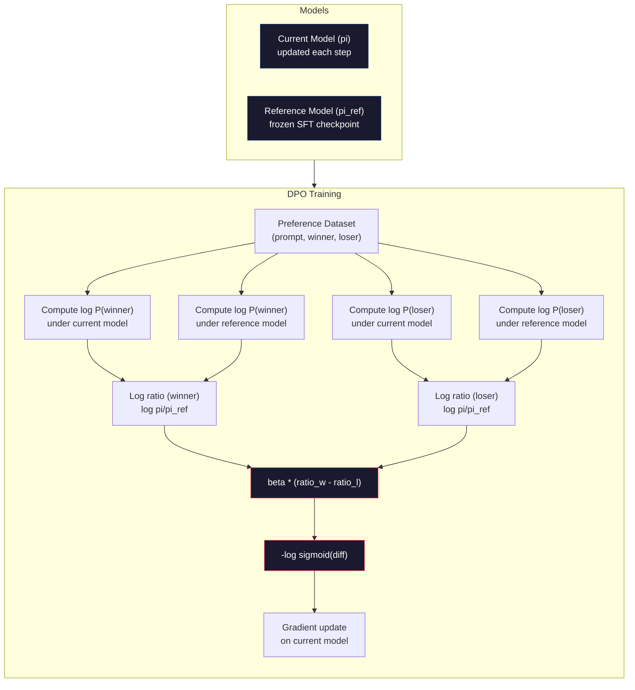

# DPO: Direct Preference Optimization

> RLHF works. It also requires training three models (SFT, reward model, policy), managing PPO's instability, and tuning a KL penalty. DPO asks: what if you could skip all of that? DPO directly optimizes the language model on preference pairs. No reward model. No PPO. One training loop. Same results.

**Type:** Build
**Languages:** Python (with numpy)
**Prerequisites:** Phase 10, Lesson 07 (RLHF)
**Time:** ~90 minutes

## Learning Objectives

- Implement DPO training that directly optimizes a language model on preference pairs without a separate reward model
- Derive the DPO loss function and explain how it implicitly represents a reward model through the policy's log probabilities
- Compare DPO vs RLHF in terms of training stability, compute cost, and number of models required
- Tune the beta parameter to control how far the trained policy diverges from the reference model

## The Problem

You built an RLHF pipeline in Lesson 07. Three stages. Three models. The SFT model, the reward model, and the policy model optimized with PPO. The reward model alone required thousands of human preference pairs and a separate training loop. PPO required careful tuning of the KL coefficient, learning rate, clip ratio, and number of epochs.

In practice, PPO training is notoriously unstable. Small hyperparameter changes cause the training to diverge. The reward model is an imperfect proxy for human preferences, and the policy finds ways to exploit its weaknesses. The KL penalty helps but requires its own tuning -- too low and you get reward hacking, too high and the model barely learns.

This complexity is why most open-source models struggled with RLHF for years after InstructGPT was published. The three-stage pipeline is fragile. Each stage has its own failure modes, and errors compound.

In May 2023, Rafael Rafailov, Archit Sharma, and colleagues at Stanford published "Direct Preference Optimization: Your Language Model is Secretly a Reward Model." The key insight: you don't need a separate reward model. The optimal reward function is mathematically determined by the language model's own token probabilities. You can skip the reward model entirely and optimize the language model directly on preference pairs.

DPO reduces RLHF to a single supervised learning step. One model. One loss function. One training loop. No reinforcement learning. Zephyr-7B, one of the first models to use DPO at scale, matched or beat models trained with full RLHF on several benchmarks. Meta used DPO as part of Llama 3's alignment pipeline. Anthropic has cited DPO-style methods in their alignment research.

## The Concept

### The Key Insight

RLHF optimizes this objective:

```
maximize: E[R(x, y)] - beta * KL(pi || pi_ref)
```

where R is the reward model, pi is the policy, pi_ref is the reference model, and beta is the KL coefficient.

The DPO paper showed that this objective has a closed-form optimal solution. For any reward function R, the optimal policy is:

```
pi*(y | x) = pi_ref(y | x) * exp(R(x, y) / beta) / Z(x)
```

where Z(x) is a normalizing constant. Rearranging:

```
R(x, y) = beta * log(pi*(y | x) / pi_ref(y | x)) + beta * log Z(x)
```

This is the breakthrough. The reward is expressed entirely in terms of the policy model's probabilities and the reference model's probabilities. You don't need to train a separate reward model. The reward is *implicit* in the probability ratio.

Substituting this into the Bradley-Terry preference model:

```
P(y_w > y_l | x) = sigmoid(R(x, y_w) - R(x, y_l))
                  = sigmoid(beta * (log pi(y_w|x)/pi_ref(y_w|x) - log pi(y_l|x)/pi_ref(y_l|x)))
```

The Z(x) terms cancel because both responses condition on the same prompt x. What's left is a function of only the policy model's log-probabilities and the reference model's log-probabilities on the preferred and rejected responses.

### The DPO Loss

```
L_DPO = -log(sigmoid(beta * (log pi(y_w|x)/pi_ref(y_w|x) - log pi(y_l|x)/pi_ref(y_l|x))))
```

Let's unpack each piece:

- **y_w** = preferred (winning) response
- **y_l** = rejected (losing) response
- **x** = prompt
- **pi** = current model (being trained)
- **pi_ref** = reference model (frozen SFT checkpoint)
- **beta** = temperature parameter controlling deviation from reference (typically 0.1 to 0.5)

The ratio `log pi(y|x) / pi_ref(y|x)` is the log-probability ratio. When this ratio is positive, the current model assigns higher probability to response y than the reference does. When negative, the current model assigns lower probability.

The DPO loss pushes the model to increase the log-probability ratio for preferred responses and decrease it for rejected responses. The beta parameter controls how aggressively the model can deviate from the reference -- small beta means large deviations are allowed, large beta keeps the model close to the reference.



### Why DPO is Simpler

| Aspect | RLHF (PPO) | DPO |
|--------|-----------|-----|
| Models to train | 3 (SFT + reward + policy) | 1 (policy only) |
| Training loops | 3 (SFT, RM training, PPO) | 2 (SFT, DPO) |
| Hyperparameters | lr, KL coeff, clip ratio, RM lr, epochs x3 | lr, beta, epochs |
| Reward model | Required (separate training) | Implicit in model probabilities |
| RL algorithm | PPO (complex, unstable) | Supervised learning (stable) |
| GPU memory | 3-4 models in memory during PPO | 2 models (current + reference) |
| Training stability | Sensitive to hyperparameters | Robust, similar to SFT |

DPO needs two models in memory during training -- the current model and the frozen reference. RLHF needs three or four: the policy, the reference, the reward model, and optionally a value function baseline. For a 70B model, each copy takes 140GB in FP16. The memory savings from eliminating the reward model are substantial.

### When DPO Beats RLHF

**Small datasets.** With 5,000-20,000 preference pairs, DPO often matches or exceeds RLHF. The reward model in RLHF needs enough data to generalize -- with limited data, it overfits and produces unreliable reward signals. DPO bypasses this problem by not needing a reward model at all.

**Limited compute.** DPO requires roughly one-third the compute of full RLHF (one training loop instead of three). For teams without large GPU clusters, this is the practical choice.

**Rapid iteration.** Want to try 10 different preference datasets to see which produces the best model? DPO lets you run each experiment in hours. RLHF requires retraining the reward model for each dataset.

### When RLHF Beats DPO

**Large-scale training.** At the scale of GPT-4 or Claude, RLHF's separate reward model can capture more nuanced preference signals. The reward model acts as a learned loss function that adapts to complex quality criteria.

**Complex reward signals.** When "better" involves multiple dimensions (helpfulness, harmlessness, honesty), a reward model can learn this multi-objective tradeoff. DPO treats each preference pair as a binary signal -- one is better, one is worse -- without modeling why.

**Iterative alignment.** RLHF pipelines can generate new responses with the current policy, have humans rate them, and retrain the reward model in an online loop. DPO works on a fixed dataset of preference pairs. Constitutional AI (Anthropic's approach) uses this iterative property of RLHF extensively.

### Beyond DPO: KTO, ORPO, SimPO

DPO inspired a family of simplified alignment methods.

**KTO (Kahneman-Tversky Optimization, 2024):** You don't even need pairs. KTO works with unpaired feedback -- just label each response as "good" or "bad" without comparing it to an alternative. This dramatically simplifies data collection. Instead of showing annotators two responses and asking "which is better?", you show one response and ask "is this good?" The loss function applies loss aversion from prospect theory: bad responses are penalized more than good responses are rewarded.

**ORPO (Odds Ratio Preference Optimization, 2024):** Combines SFT and alignment in a single training step. Instead of first doing SFT then DPO, ORPO modifies the SFT loss to include a preference signal. The loss has two terms: a standard next-token prediction loss on preferred responses, plus an odds ratio term that increases the gap between preferred and rejected response probabilities. One training loop instead of two.

**SimPO (Simple Preference Optimization, 2024):** Eliminates the reference model entirely. Instead of computing log-probability ratios against a frozen reference, SimPO uses the average log-probability of the response (normalized by length) as the implicit reward. This saves memory (no reference model needed) and simplifies training. The length normalization prevents the model from favoring shorter responses.

| Method | Year | Models in Memory | Needs Pairs? | Needs Reference? | Training Loops |
|--------|------|-----------------|-------------|-----------------|----------------|
| RLHF | 2022 | 3-4 | Yes (for RM) | Yes | 3 |
| DPO | 2023 | 2 | Yes | Yes | 2 |
| KTO | 2024 | 2 | No (unpaired) | Yes | 2 |
| ORPO | 2024 | 1 | Yes | No | 1 |
| SimPO | 2024 | 1 | Yes | No | 1 |

The trend is clear: each method eliminates one more piece of complexity. RLHF needed a reward model and PPO. DPO eliminated both. KTO eliminated paired data. ORPO eliminated the separate SFT stage. SimPO eliminated the reference model. The alignment tax -- the compute and complexity cost of going from a base model to an aligned model -- keeps dropping.

### Real DPO Deployments

**Zephyr-7B (HuggingFace, October 2023):** Mistral 7B base, SFT on UltraChat (200K examples), then DPO on UltraFeedback (60K preference pairs). Scored 6.47 on MT-Bench -- the highest 7B model at the time. For comparison, Llama 2 Chat 70B scored 6.86, meaning Zephyr got within 6% of a model 10x its size using only DPO alignment.

**Llama 3 (Meta, April 2024):** Used DPO after initial RLHF stages. The combination suggests that DPO and RLHF can be complementary -- RLHF for broad alignment, DPO for targeted refinement.

**Neural Magic / nm-chat (2024):** Applied DPO to multiple open-source models, consistently showing 5-15% improvement on alignment benchmarks over SFT-only baselines.


## Further Reading

- [Rafailov et al., 2023 -- "Direct Preference Optimization: Your Language Model is Secretly a Reward Model"](https://arxiv.org/abs/2305.18290) -- the DPO paper that simplified alignment from RLHF to supervised learning
- [Tunstall et al., 2023 -- "Zephyr: Direct Distillation of LM Alignment"](https://arxiv.org/abs/2310.16944) -- Zephyr-7B, showing DPO on UltraFeedback matches RLHF on benchmarks
- [Ethayarajh et al., 2024 -- "KTO: Model Alignment as Prospect Theoretic Optimization"](https://arxiv.org/abs/2402.01306) -- eliminating the need for paired preferences
- [Hong et al., 2024 -- "ORPO: Monolithic Preference Optimization without Reference Model"](https://arxiv.org/abs/2403.07691) -- combining SFT and alignment in one step
- [Meng et al., 2024 -- "SimPO: Simple Preference Optimization with a Reference-Free Reward"](https://arxiv.org/abs/2405.14734) -- eliminating the reference model entirely
- [Llama 3 Technical Report](https://arxiv.org/abs/2407.21783) -- Meta's alignment pipeline combining RLHF and DPO
