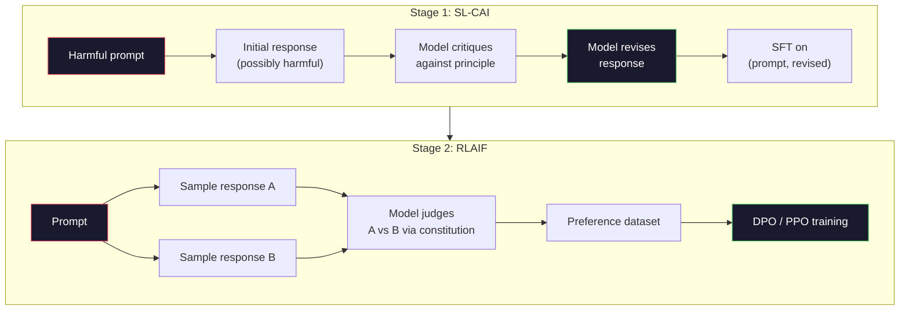
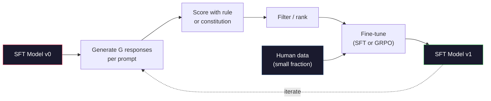

# Constitutional AI and Self-Improvement

> RLHF needs humans in the loop. Constitutional AI replaces most of them with the model itself. Write a list of principles, have the model critique its own outputs against those principles, and train on the critiques. DeepSeek-R1 pushed this further in 2025: let the model generate millions of reasoning traces, grade them with a rule, and run GRPO on the outcome. Most of the "alignment work" in a 2026 frontier model is the model alignment itself. This lesson builds both loops.

**Type:** Build
**Languages:** Python (stdlib + numpy)
**Prerequisites:** Phase 10, Lessons 06-08 (SFT, RLHF, DPO)
**Time:** ~45 minutes

## Learning Objectives

- Implement the Constitutional AI two-stage loop: self-critique plus self-revision, then preference training on the revised pairs
- Derive the GRPO objective (DeepSeek-R1's group-relative policy optimization) and contrast it with PPO's value-function baseline
- Generate verifiable reasoning traces with rule-based outcome rewards and score them without a separate reward model
- Decide when self-improvement beats human preference data and when it collapses into mode seeking

## The Problem

You built RLHF in Lesson 07 and DPO in Lesson 08. Both depend on the same expensive input: human preference pairs. Anthropic's InstructGPT-era pipeline used roughly 33,000 comparisons. Llama 2 Chat used over 1.5 million. Claude 3 used more. This data is slow, expensive, and biased toward whatever the annotators happened to believe on the day they were rating.

The 2022 Constitutional AI paper asked a simple question. What if the model generates the preference labels itself? Give it a list of written principles -- the "constitution" -- and have it critique its own responses. The critiques become the training signal.

In 2024, DeepSeek took the idea further. They showed that for any task with a verifiable outcome (math with a known answer, code that either passes tests or fails, a game that either wins or loses), you can skip the critic entirely. Generate many candidate solutions. Grade each one with a deterministic rule. Run a policy-gradient algorithm on the rewards. DeepSeek-R1 was trained this way with almost no human preference data and matched o1-class reasoning performance.

These two loops -- Constitutional AI for subjective behavior and rule-based RL for verifiable behavior -- are the dominant alignment recipes of 2026. The human preference budget that used to go into RLHF now pays for a much smaller step: picking the constitution and picking the reward rules.

## The Concept

### The Constitutional AI Loop

Bai et al. (2022) structured the pipeline in two stages.

**Stage 1: Supervised Learning from AI Feedback (SL-CAI).** Start with an SFT model that is helpful but possibly harmful. Prompt it with potentially harmful requests. For each response, ask the *same model* to critique its response against a constitutional principle, then revise. Fine-tune on the revised responses. The dataset is (prompt, revised_response) pairs.

**Stage 2: Reinforcement Learning from AI Feedback (RLAIF).** Sample pairs of responses. Ask the model which one better follows the constitution. The pairwise preferences train a reward model. Then run PPO or DPO on the model using that reward. The key difference from RLHF: the preferences came from the model, not from humans.



The constitution is the lever. Anthropic's original had 16 principles (later expanded). A principle reads like "Please choose the response that is least likely to be objectionable to anyone from a wide variety of cultural backgrounds." You pick the principle for each step, sometimes at random, sometimes based on the prompt category.

### What the Constitution Actually Does

The constitution moves the alignment contract from *data* to *text*. Changing behavior under RLHF means re-labeling thousands of pairs. Changing behavior under CAI means editing a paragraph. This is the main practical win.

It has a cost. The model's self-judgments are only as good as its starting calibration. If the SFT model has blind spots -- for instance, it cannot recognize manipulative phrasing -- the critique step inherits those blind spots. CAI compresses the alignment loop but cannot amplify signal past the base model's ceiling. This is why every production CAI pipeline still uses some human preference data, typically 5-10% the volume of pure RLHF.

### GRPO: Group-Relative Policy Optimization

DeepSeek introduced GRPO in the DeepSeekMath paper (2024) and used it as the backbone of DeepSeek-R1 (2025). GRPO is a variant of PPO that removes the value function.

Recall PPO's objective (from Lesson 07):

```
L_PPO = E[min(r(theta) * A, clip(r(theta), 1-eps, 1+eps) * A)]
```

where `A` is the advantage, typically estimated with GAE using a learned value network `V(s)`. The value network is a second model the same size as the policy. It doubles memory and introduces its own training loop.

GRPO throws out the value function. For each prompt, it samples a group of G responses (typically G=16 or 64). The reward for each response is computed, then normalized within the group:

```
A_i = (r_i - mean(r_1, ..., r_G)) / std(r_1, ..., r_G)
```

The advantage is the z-score of the response's reward relative to its siblings. No value function. The group acts as its own baseline.

```
L_GRPO = E[min(r(theta) * A_group, clip(r(theta), 1-eps, 1+eps) * A_group)] - beta * KL(pi || pi_ref)
```

The KL penalty against the reference model is still there, same as PPO. The clip ratio is still there. What's gone is the separate critic.

### Why GRPO Matters for Reasoning

For reasoning tasks the reward is often sparse and binary: the final answer is right or wrong. A value function trained on sparse binary rewards is a waste -- it cannot learn useful intermediate estimates because nearly every state has the same expected return until the final step. GRPO's group normalization gives you an immediate relative signal: among 16 attempts on the same math problem, which attempts were above average for this problem?

This is the exact shape of signal you get from rule-based rewards:

- **Math**: sympy or a symbolic checker decides if the final answer matches.
- **Code**: a test suite decides pass/fail.
- **Formatting**: a regex decides whether the answer is in the required XML tag.
- **Multi-step proofs**: a proof assistant (Lean, Coq) decides validity.

DeepSeek-R1-Zero was trained with only two rewards: accuracy on math benchmarks and format compliance (answer inside `<answer>` tags). No human preferences. No critic model. The "aha moment" the DeepSeek paper described -- the model spontaneously learning to self-check and backtrack -- emerged from GRPO on sparse rule rewards alone.

### Process Reward Models vs Outcome Reward Models

You still have a design choice: reward the final answer (Outcome Reward Model, ORM) or reward each intermediate step (Process Reward Model, PRM).

| Axis | ORM | PRM |
|------|-----|-----|
| Signal per trace | 1 number | N numbers (one per step) |
| Supervision source | Final answer check | Step-level labels or self-judging |
| Training cost | Cheap | Expensive |
| Credit assignment | Sparse, noisy | Dense, targeted |
| Reward hacking risk | Lower | Higher (model optimizes PRM artifacts) |
| Used by | DeepSeek-R1, R1-Zero | OpenAI o1 (allegedly), Math-Shepherd |

The 2024-2025 consensus was that ORMs plus GRPO scale better than PRMs. PRMs are more sample-efficient per token but require expensive step-labeled data and tend to collapse into shortcut behaviors (writing steps that look good to the PRM but don't advance the proof). For most teams, ORM + GRPO is the first thing to try.

### Self-Improvement: The Feedback Multiplier

Once you have the two-loop pattern (critique/revise and group-relative RL with rule rewards), you can chain them.

1. Start with an SFT model.
2. Generate many candidate responses per prompt.
3. Score them with a rule-based reward (for verifiable tasks) or a constitutional critic (for subjective tasks).
4. Keep the top candidates as new SFT data or as preference pairs.
5. Fine-tune. Go to step 2 with the improved model.

DeepSeek called this "rejection sampling fine-tuning" when applied after R1-Zero. Anthropic called an earlier version of this "constitutional AI distillation." The pattern is: each iteration amplifies the signal already in the model. It does not add new signal. If the model cannot solve problem class X at all, no amount of self-improvement will create that capability.

The danger is mode collapse. Self-generated data is always a narrower distribution than the training corpus. After 3-5 rounds of self-distillation, models typically lose diversity on creative tasks, become overconfident, and exhibit characteristic "AI voice" (repeated phrasings, formulaic structure). Production pipelines mix self-generated data with a small fraction of fresh human data to keep the distribution honest.



### When To Use What

- **Pure CAI**: Subjective behavior (tone, safety, refusal style). You have a well-defined constitution. You don't have clean verifiable outcomes.
- **GRPO + ORM**: Verifiable tasks (math, code, structured extraction). You can cheaply check correctness. Reward is sparse and binary.
- **DPO on self-generated pairs**: Hybrid. Use the constitution to produce preference pairs, then train with DPO (Lesson 08) instead of PPO/GRPO.
- **Full RLHF**: Still appropriate when you need multi-objective tradeoffs that neither a rule nor a short constitution can express.

Most 2026 frontier pipelines run all four. CAI for safety layers. GRPO for the reasoning post-training pass. DPO for the preference polish. Small RLHF passes for residual behaviors that resist the other methods.


## Further Reading

- [Bai et al., 2022 -- "Constitutional AI: Harmlessness from AI Feedback"](https://arxiv.org/abs/2212.08073) -- Anthropic's original CAI paper with the two-stage SL-CAI + RLAIF pipeline
- [Shao et al., 2024 -- "DeepSeekMath: Pushing the Limits of Mathematical Reasoning in Open Language Models"](https://arxiv.org/abs/2402.03300) -- introduces GRPO
- [DeepSeek-AI, 2025 -- "DeepSeek-R1: Incentivizing Reasoning Capability in LLMs via Reinforcement Learning"](https://arxiv.org/abs/2501.12948) -- R1 and R1-Zero, GRPO + rule rewards at scale
- [Lightman et al., 2023 -- "Let's Verify Step by Step"](https://arxiv.org/abs/2305.20050) -- OpenAI's PRM800K and the case for process reward models
- [Wang et al., 2024 -- "Math-Shepherd: Verify and Reinforce LLMs Step-by-step without Human Annotations"](https://arxiv.org/abs/2312.08935) -- auto-labeled PRM via Monte Carlo rollouts
- [Huang et al., 2024 -- "Large Language Models Cannot Self-Correct Reasoning Yet"](https://arxiv.org/abs/2310.01798) -- the skeptical counterpoint on self-improvement without external grounding
