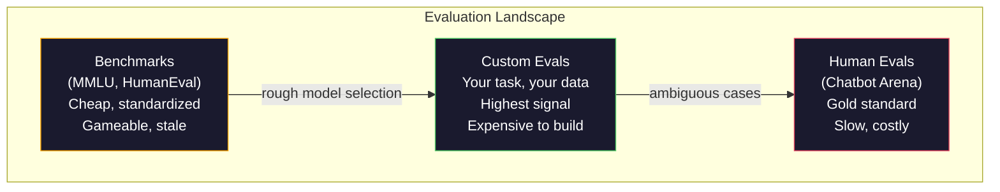
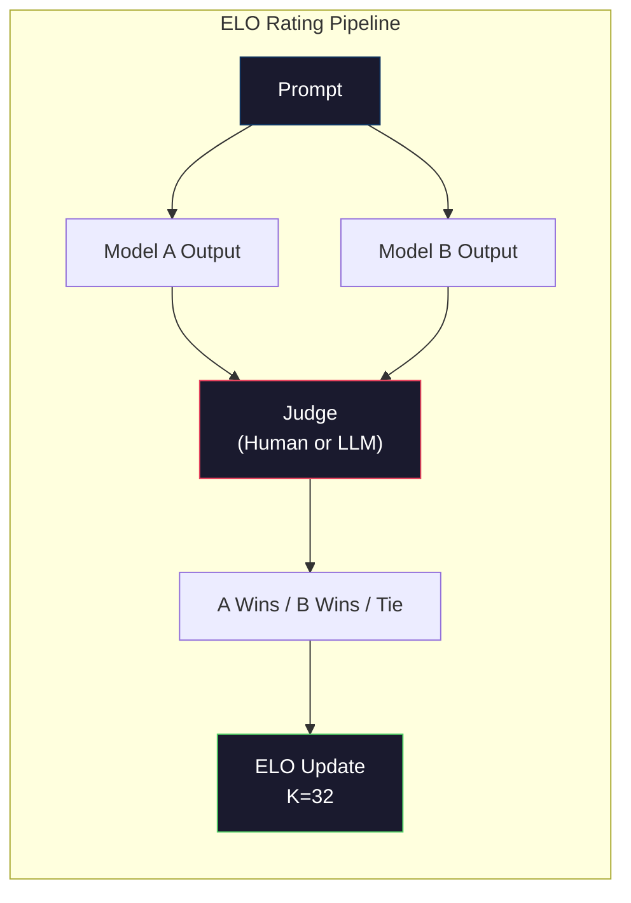

# Evaluation: Benchmarks, Evals, LM Harness

> Goodhart's Law: when a measure becomes a target, it ceases to be a good measure. Every frontier lab games benchmarks. MMLU scores go up while models still can't reliably count the number of R's in "strawberry." The only eval that matters is YOUR eval -- on YOUR task, with YOUR data.

**Type:** Build
**Languages:** Python
**Prerequisites:** Phase 10, Lessons 01-05 (LLMs from Scratch)
**Time:** ~90 minutes

## Learning Objectives

- Build a custom evaluation harness that runs multiple-choice and open-ended benchmarks against a language model
- Explain why standard benchmarks (MMLU, HumanEval) saturate and fail to differentiate frontier models
- Implement task-specific evals with proper metrics: exact match, F1, BLEU, and LLM-as-judge scoring
- Design a custom evaluation suite targeting your specific use case rather than relying solely on public leaderboards

## The Problem

MMLU was published in 2020 with 15,908 questions across 57 subjects. Within three years, frontier models saturated it. GPT-4 scored 86.4%. Claude 3 Opus scored 86.8%. Llama 3 405B scored 88.6%. The leaderboard compressed into a 3-point range where differences are statistical noise, not real capability gaps.

Meanwhile, those same models fail at tasks that a 10-year-old handles without thinking. Claude 3.5 Sonnet, scoring 88.7% on MMLU, initially could not count the letters in "strawberry" -- a task that requires zero world knowledge and zero reasoning, just character-level iteration. HumanEval tests code generation with 164 problems. Models score 90%+ on it while still producing code that crashes on edge cases any junior developer would catch.

The gap between benchmark performance and real-world reliability is the central problem of LLM evaluation. Benchmarks tell you how a model performs on the benchmark. They tell you almost nothing about how that model will perform on your specific task, with your specific data, under your specific failure modes. If you are building a customer support bot, MMLU is irrelevant. If you are building a code assistant, HumanEval only covers function-level generation -- it says nothing about debugging, refactoring, or explaining code across files.

You need custom evals. Not because benchmarks are useless -- they are useful for rough model selection -- but because the final evaluation must match your deployment conditions exactly.

## The Concept

### The Eval Landscape

There are three categories of evaluation, each with different cost and signal quality.

**Benchmarks** are standardized test suites. MMLU, HumanEval, SWE-bench, MATH, ARC, HellaSwag. You run a model against the benchmark and get a score. The advantage: everyone uses the same test, so you can compare models. The disadvantage: models and training data increasingly contaminate these benchmarks. Labs train on data that includes benchmark questions. Scores go up. Capability may not.

**Custom evals** are test suites you build for your specific use case. You define the inputs, the expected outputs, and the scoring function. A legal document summarizer gets evaluated on legal documents. A SQL generator gets evaluated on your database schema. These are expensive to create but they are the only evaluation that predicts production performance.

**Human evals** use paid annotators to judge model outputs on criteria like helpfulness, correctness, fluency, and safety. The gold standard for open-ended tasks where automated scoring fails. Chatbot Arena has collected over 2 million human preference votes across 100+ models. The downside: cost ($0.10-$2.00 per judgment) and speed (hours to days).



### Why Benchmarks Break

Three mechanisms cause benchmark scores to stop reflecting real capability.

**Data contamination.** Training corpora scrape the internet. Benchmark questions live on the internet. Models see the answers during training. This is not cheating in the traditional sense -- labs do not intentionally include benchmark data. But web-scale scraping makes it nearly impossible to exclude.

**Teaching to the test.** Labs optimize training mixtures for benchmark performance. If 5% of the training mix is MMLU-style multiple choice, the model learns the format and the answer distribution. MMLU is 4-way multiple choice. Models learn that the answer distribution is approximately uniform across A/B/C/D, which helps even when the model does not know the answer.

**Saturation.** When every frontier model scores 85-90% on a benchmark, the benchmark stops discriminating. The remaining 10-15% of questions may be ambiguous, mislabeled, or require obscure domain knowledge. Improving from 87% to 89% on MMLU may mean the model memorized two more obscure questions, not that it got smarter.

### Perplexity: A Quick Health Check

Perplexity measures how surprised a model is by a sequence of tokens. Formally, it is the exponentiated average negative log-likelihood:

```
PPL = exp(-1/N * sum(log P(token_i | context)))
```

A perplexity of 10 means the model is, on average, as uncertain as choosing uniformly among 10 options at each token position. Lower is better. GPT-2 gets a perplexity of ~30 on WikiText-103. GPT-3 gets ~20. Llama 3 8B gets ~7.

Perplexity is useful for comparing models on the same test set, but it has blind spots. A model can have low perplexity by being good at predicting common patterns while being terrible at rare but important patterns. It also says nothing about instruction following, reasoning, or factual accuracy. Use it as a sanity check, not a final verdict.

### LLM-as-Judge

Use a strong model to evaluate a weaker model's output. The idea is simple: ask GPT-4o or Claude Sonnet to rate a response on a 1-5 scale for correctness, helpfulness, and safety. This costs about $0.01 per judgment with GPT-4o-mini and correlates surprisingly well with human judgments -- around 80% agreement on most tasks.

The scoring prompt matters more than the model. A vague prompt ("Rate this response") produces noisy scores. A structured prompt with a rubric ("Score 5 if the answer is factually correct and cites a source, 4 if correct but unsourced, 3 if partially correct...") produces consistent, reproducible scores.

Failure modes: judge models exhibit position bias (prefer the first response in pairwise comparisons), verbosity bias (prefer longer responses), and self-preference (GPT-4 rates GPT-4 outputs higher than equivalent Claude outputs). Mitigations: randomize order, normalize for length, use a different judge than the model being evaluated.

### ELO Ratings from Pairwise Comparisons

Chatbot Arena's approach. Show two responses to the same prompt from different models. A human (or LLM judge) picks the better one. From thousands of these comparisons, compute an ELO rating for each model -- the same system used in chess.

ELO advantages: relative ranking is more reliable than absolute scoring, handles ties gracefully, and converges with fewer comparisons than scoring every output independently. As of early 2026, Chatbot Arena ranks show GPT-4o, Claude 3.5 Sonnet, and Gemini 1.5 Pro within 20 ELO points of each other at the top.



### Eval Frameworks

**lm-evaluation-harness** (EleutherAI): the standard open-source eval framework. Supports 200+ benchmarks. Run any Hugging Face model against MMLU, HellaSwag, ARC, etc. with one command. Used by the Open LLM Leaderboard.

**RAGAS**: evaluation framework specifically for RAG pipelines. Measures faithfulness (does the answer match the retrieved context?), relevance (is the retrieved context relevant to the question?), and answer correctness.

**promptfoo**: config-driven eval for prompt engineering. Define test cases in YAML, run against multiple models, get a pass/fail report. Useful for regression testing prompts -- make sure a prompt change does not break existing test cases.

### Building Custom Evals

The only eval that matters for production. The process:

1. **Define the task.** What exactly should the model do? Be precise. "Answer questions" is too vague. "Given a customer complaint email, extract the product name, issue category, and sentiment" is a task you can evaluate.

2. **Create test cases.** Minimum 50 for a prototype eval, 200+ for production. Each test case is an (input, expected_output) pair. Include edge cases: empty inputs, adversarial inputs, ambiguous inputs, inputs in other languages.

3. **Define scoring.** Exact match for structured outputs. BLEU/ROUGE for text similarity. LLM-as-judge for open-ended quality. F1 for extraction tasks. Combine multiple metrics with weights.

4. **Automate.** Every eval runs with one command. No manual steps. Store results in a format that enables comparison over time.

5. **Track over time.** An eval score is meaningless in isolation. You need the trendline. Did the score improve after the last prompt change? Did it regress after switching models? Version your eval alongside your prompts.

| Eval Type | Cost per judgment | Agreement with humans | Best for |
|-----------|------------------|----------------------|----------|
| Exact match | ~$0 | 100% (when applicable) | Structured output, classification |
| BLEU/ROUGE | ~$0 | ~60% | Translation, summarization |
| LLM-as-judge | ~$0.01 | ~80% | Open-ended generation |
| Human eval | $0.10-$2.00 | N/A (is the ground truth) | Ambiguous, high-stakes tasks |


## Use It

### lm-evaluation-harness (EleutherAI)

The standard tool for running benchmarks on any model.

```python
# pip install lm-eval
# Command line:
# lm_eval --model hf --model_args pretrained=meta-llama/Llama-3.1-8B --tasks mmlu --batch_size 8

# Python API:
# import lm_eval
# results = lm_eval.simple_evaluate(
#     model="hf",
#     model_args="pretrained=meta-llama/Llama-3.1-8B",
#     tasks=["mmlu", "hellaswag", "arc_easy"],
#     batch_size=8,
# )
# print(results["results"])
```

### promptfoo

Config-driven eval for prompt engineering. Define tests in YAML and run against multiple providers.

```yaml
# promptfoo.yaml
providers:
  - openai:gpt-4o-mini
  - anthropic:claude-3-haiku

prompts:
  - "Answer in one word: {{question}}"

tests:
  - vars:
      question: "What is the capital of France?"
    assert:
      - type: contains
        value: "Paris"
  - vars:
      question: "What is 2 + 2?"
    assert:
      - type: equals
        value: "4"
```

### RAGAS for RAG evaluation

```python
# pip install ragas
# from ragas import evaluate
# from ragas.metrics import faithfulness, answer_relevancy, context_precision
#
# result = evaluate(
#     dataset,
#     metrics=[faithfulness, answer_relevancy, context_precision],
# )
# print(result)
```

RAGAS measures what generic evals miss: whether the model's answer is grounded in the retrieved context, not just whether the answer is "correct" in the abstract.

## Ship It

This lesson produces `outputs/prompt-eval-designer.md` -- a reusable prompt that designs custom eval suites for any task. Give it a task description and it generates test cases, scoring functions, and a pass/fail threshold recommendation.

It also produces `outputs/skill-llm-evaluation.md` -- a decision framework for choosing the right evaluation strategy based on your task type, budget, and latency requirements.


## Key Terms

| Term | What people say | What it actually means |
|------|----------------|----------------------|
| MMLU | "The benchmark" | Massive Multitask Language Understanding -- 15,908 multiple choice questions across 57 subjects, saturated above 88% by 2025 |
| HumanEval | "Code eval" | 164 Python function-completion problems from OpenAI, tests only isolated function generation |
| SWE-bench | "Real coding eval" | 2,294 GitHub issues from 12 Python repos, measures end-to-end bug fixing including test generation |
| Perplexity | "How confused the model is" | exp(-avg(log P(token_i given context))) -- lower means the model assigns higher probability to the actual tokens |
| ELO rating | "Chess ranking for models" | A relative skill rating computed from pairwise win/loss records, used by Chatbot Arena to rank 100+ models |
| LLM-as-judge | "Using AI to grade AI" | A strong model scores a weaker model's outputs against a rubric, ~80% agreement with human judges at ~$0.01/judgment |
| Data contamination | "The model saw the test" | Training data includes benchmark questions, inflating scores without improving real capability |
| Eval suite | "A bunch of tests" | A versioned collection of (input, expected_output, scorer) triples that measure a specific capability |
| Pass rate | "What percentage it gets right" | Fraction of eval cases scoring above a threshold -- more actionable than mean score because it measures reliability |
| Chatbot Arena | "Model ranking website" | LMSYS platform with 2M+ human preference votes, producing the most trusted LLM leaderboard via ELO ratings |

## Further Reading

- [Hendrycks et al., 2021 -- "Measuring Massive Multitask Language Understanding"](https://arxiv.org/abs/2009.03300) -- the MMLU paper, still the most cited LLM benchmark despite its saturation
- [Chen et al., 2021 -- "Evaluating Large Language Models Trained on Code"](https://arxiv.org/abs/2107.03374) -- the HumanEval paper from OpenAI, established code generation evaluation methodology
- [Zheng et al., 2023 -- "Judging LLM-as-a-Judge"](https://arxiv.org/abs/2306.05685) -- systematic analysis of using LLMs to evaluate LLMs, including position bias and verbosity bias findings
- [LMSYS Chatbot Arena](https://chat.lmsys.org/) -- crowdsourced model comparison platform with 2M+ votes, the most trusted real-world LLM ranking
