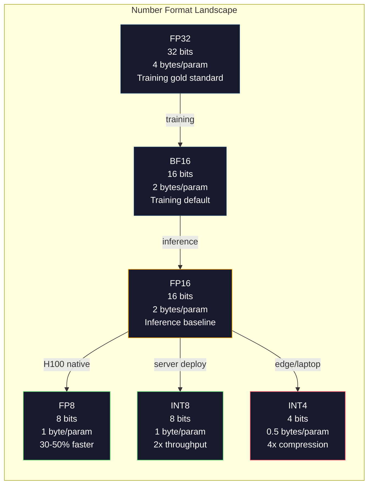
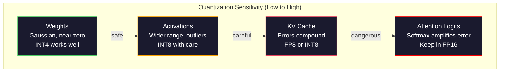
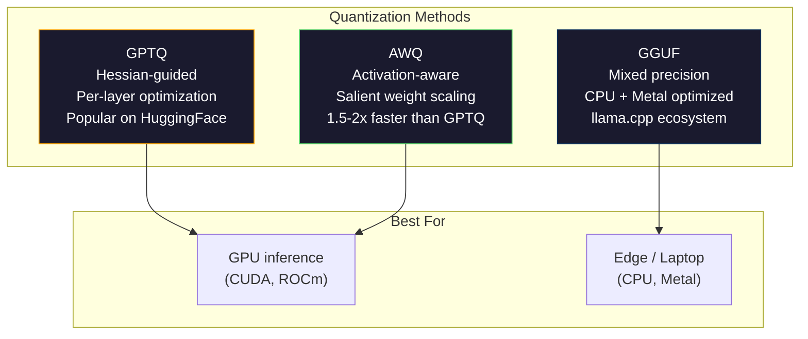

# Quantization: Making Models Fit

> A 70B model in FP16 needs 140GB. Two A100s just for weights. Quantize to FP8: one 80GB GPU. INT4: a MacBook.

**Type:** Build
**Languages:** Python (with numpy)
**Prerequisites:** Phase 10, Lessons 01-10 (LLMs from Scratch)
**Time:** ~120 minutes

## Learning Objectives

- Implement symmetric and asymmetric quantization from FP16 to INT8 and INT4, including per-tensor and per-channel scaling
- Calculate the memory savings from quantization and determine which precision fits a given GPU's VRAM
- Explain the difference between post-training quantization (PTQ) and quantization-aware training (QAT)
- Apply GPTQ or AWQ to quantize a real model and measure the accuracy-memory tradeoff on a benchmark

## The Problem

Llama 3 70B has 70 billion parameters. Each parameter is a 16-bit floating point number. That is 140 billion bytes. 140GB. A single A100 has 80GB of VRAM. You cannot even load the weights, let alone run inference, on a single GPU. You need two A100s at $2/hour each just to serve one model.

But 16 bits per parameter is wasteful. Most weights in a neural network cluster near zero. The full dynamic range of FP16 (from 0.000000059 to 65,504) is almost entirely unused. If you measure the actual distribution of weights in Llama 3 70B, 95% of them fall between -0.1 and +0.1. You are burning 16 bits to represent values that could fit in 4.

Quantization replaces high-precision numbers with lower-precision ones. FP16 to FP8 cuts memory in half. FP16 to INT4 cuts it to a quarter. That 140GB model becomes 35GB. It fits on a single consumer GPU. Push to 2-bit quantization (aggressive, lossy, but usable for some tasks) and the same model runs on a 16GB laptop.

The cost is accuracy. Every bit you remove destroys information. The question is how much accuracy you lose and where. A well-quantized INT4 model retains 95-99% of the original's quality on most benchmarks. A naive quantization to INT4 can destroy the model entirely. The difference is technique.

Community quantizations of Llama 3 to INT4 with GPTQ show roughly 1-2 perplexity points lost on WikiText. Mistral released FP8 checkpoints of Mixtral 8x22B with zero measurable quality loss on MMLU. The GGUF format powers llama.cpp, running 70B models on MacBooks with M-series chips. Quantization is not a hack. It is the standard deployment path for every model larger than 7B.

## The Concept

### Number Formats: What Each Bit Does

Every floating-point number has three parts: sign, exponent, and mantissa (also called significand). The sign is one bit. The exponent determines the range (how large or small the number can be). The mantissa determines the precision (how many decimal places you get).

```
FP32:  [1 sign] [8 exponent] [23 mantissa]  = 32 bits
FP16:  [1 sign] [5 exponent] [10 mantissa]  = 16 bits
BF16:  [1 sign] [8 exponent] [7  mantissa]  = 16 bits
FP8:   [1 sign] [4 exponent] [3  mantissa]  = 8  bits (E4M3)
FP8:   [1 sign] [5 exponent] [2  mantissa]  = 8  bits (E5M2)
INT8:  [1 sign] [7 value]                   = 8  bits (uniform steps)
INT4:  [1 sign] [3 value]                   = 4  bits (16 levels total)
```

**FP32** is full precision. 23 mantissa bits give you about 7 decimal digits of precision. Range: roughly 1.2 x 10^-38 to 3.4 x 10^38. Training used to happen exclusively in FP32. It still does for accumulation (running sums during matrix multiplication).

**FP16** halves the bits. 10 mantissa bits give about 3.3 decimal digits. The exponent shrinks to 5 bits, reducing the range dramatically (max value ~65,504). This is fine for weights (which cluster near zero) but dangerous for activations and gradients that can spike during training. FP16 training requires loss scaling to prevent underflow.

**BF16** (Brain Float 16) keeps the 8-bit exponent from FP32 but shrinks the mantissa to 7 bits. Same range as FP32, less precision than FP16. Google designed it specifically for deep learning. The intuition: range matters more than precision for neural networks. A gradient of 10^-20 that underflows to zero in FP16 survives in BF16. A weight of 0.07342 that rounds to 0.0734 in BF16 is close enough. Every modern training run uses BF16 or a BF16/FP32 mix.

**FP8** comes in two flavors. E4M3 (4 exponent, 3 mantissa) is used for weights and activations during inference. E5M2 (5 exponent, 2 mantissa) is used for gradients during training where range matters more than precision. FP8 inference on H100 GPUs achieves 30-50% speedup over FP16 with negligible quality loss.

**INT8** is an integer format. No exponent, no mantissa. Just 256 evenly spaced values from -128 to 127. You need a scale factor to map floating-point weights into this range. The advantage: integer arithmetic is faster and more power-efficient than floating-point. INT8 matrix multiplication on an A100 runs at 624 TOPS versus 312 TFLOPS for FP16.

**INT4** pushes further. Only 16 possible values. The scale factor does heavy lifting. Quality depends entirely on how you choose the scale and which weights you quantize. State-of-the-art INT4 methods (GPTQ, AWQ) retain 95%+ of original model quality.



### How Quantization Works

The core operation is simple. Take a tensor of floating-point values, find a scale factor, multiply, round to the nearest integer, and store the integers plus the scale factor.

**Quantize:**
```
scale = max(abs(tensor)) / max_int_value
quantized = round(tensor / scale)
```

**Dequantize:**
```
reconstructed = quantized * scale
```

For INT8 with a symmetric range (-127 to 127):
```
scale = max(abs(tensor)) / 127
quantized = clamp(round(tensor / scale), -128, 127)
```

The error is the rounding error. Each value can be off by at most `scale / 2`. The total error across a layer depends on how many weights you have and how sensitive the model is to perturbations in those weights.

**Per-tensor vs per-channel quantization.** Per-tensor uses one scale factor for the entire weight matrix. Simple but lossy: if one column has large values and another has small values, the small values lose most of their precision. Per-channel uses one scale factor per output channel (per row or column of the weight matrix). More overhead (you store N scale factors instead of 1) but dramatically better quality. Every production quantization method uses per-channel or finer granularity.

**Asymmetric quantization** adds a zero-point offset: `quantized = round(tensor / scale) + zero_point`. This handles distributions that are not centered at zero. ReLU activations, for example, are always non-negative. Symmetric quantization wastes half the integer range on negative values that never appear. Asymmetric quantization maps the actual range [min, max] to the full integer range.

### Sensitivity Hierarchy

Not everything in a model tolerates quantization equally. There is a clear hierarchy.

**Weights (most robust).** Model weights change slowly during training and follow a roughly Gaussian distribution centered near zero. They quantize well. INT8 weights with per-channel scales produce nearly lossless results. INT4 requires more sophisticated methods but works.

**Activations (moderate sensitivity).** Activations are the intermediate values flowing through the network during inference. They have wider dynamic range than weights and contain outliers. A single attention head might produce activation values 100x larger than the mean. These outliers are critical for model quality. Quantizing them naively destroys information. Solutions: keep outlier channels in higher precision (LLM.int8()), use per-token or per-channel activation scales.

**KV cache (high sensitivity).** The key-value cache stores attention states for all previous tokens. At long context lengths, the KV cache dominates memory. For a 70B model at 32K context, the KV cache alone is 40GB in FP16. Quantizing the KV cache to FP8 or INT8 saves massive memory but any error compounds across all future attention computations. The quality impact scales with sequence length.

**Attention logits (most sensitive).** The softmax in attention is highly sensitive to small changes in its inputs. A quantization error of 0.01 in a pre-softmax logit can shift the attention distribution meaningfully. Most quantization schemes keep attention computation in higher precision (FP16 or BF16) even when everything else is quantized.



### PTQ vs QAT

**Post-Training Quantization (PTQ)** quantizes an already-trained model. No retraining. You take the FP16 weights, compute scale factors, round, and deploy. Fast (minutes to hours) and cheap. Works well for INT8 and FP8. For INT4, naive PTQ often fails badly because rounding errors accumulate. Advanced PTQ methods (GPTQ, AWQ) use calibration data to minimize the quantization error.

**Quantization-Aware Training (QAT)** inserts fake quantization operations into the forward pass during training. The model learns to place its weights where rounding errors are small. Gradients flow through the fake quantization using the straight-through estimator (STE): pretend the rounding operation has gradient 1. QAT produces better INT4 and INT2 models than PTQ but requires a full training run. Google used QAT for Gemini's efficient serving. Meta used QAT for some Llama deployment targets.

| Aspect | PTQ | QAT |
|--------|-----|-----|
| Cost | Minutes to hours | Full training run |
| Quality at INT8 | Excellent (< 0.1% loss) | Excellent |
| Quality at INT4 | Good with GPTQ/AWQ (1-3% loss) | Better (< 1% loss) |
| Quality at INT2 | Poor | Usable for some tasks |
| Calibration data | 128-1024 examples | Full training dataset |
| When to use | Deployment, iteration | Maximum quality at low bit-width |

### GPTQ, AWQ, GGUF

**GPTQ (GPT Quantization)** is a one-shot PTQ method. It quantizes weights one layer at a time, using a small calibration dataset (128 examples is typical) to measure the Hessian (second-order information about how sensitive the output is to each weight). Weights that the Hessian says are important get quantized more carefully. GPTQ was the first method to make INT4 quantization practical for LLMs. The TheBloke on Hugging Face popularized GPTQ by releasing quantized versions of hundreds of models.

**AWQ (Activation-Aware Weight Quantization)** observes that a small fraction of weights (about 1%) are disproportionately important because they multiply with large activation values. AWQ identifies these salient weights using calibration data and scales them up before quantization (then scales the corresponding activations down). This keeps the important weights in a range where INT4 quantization is accurate. AWQ typically matches or slightly beats GPTQ quality while being 1.5-2x faster to apply.

**GGUF (GPT-Generated Unified Format)** is the file format used by llama.cpp and its ecosystem. It supports mixed quantization: different layers get different bit widths. The first and last layers (embedding and output head) are typically kept at higher precision. Middle layers get INT4 or INT3. GGUF files are self-contained: weights, tokenizer, metadata all in one file. The format is designed for CPU inference and Apple Silicon, where loading the entire model into memory and running matrix multiplications on the CPU or Metal GPU is the standard path. Q4_K_M is the most popular GGUF quantization variant, balancing quality and size.



### Quality Measurement

How do you know if your quantized model is still good?

**Perplexity.** The most common metric. Lower is better. Compute perplexity on a held-out dataset (WikiText-2 is standard) for both the original and quantized model. The delta tells you how much information the quantization destroyed. Rules of thumb: delta < 0.5 is excellent, 0.5-1.0 is good, 1.0-2.0 is acceptable for most tasks, > 2.0 means something went wrong.

**Task-specific benchmarks.** Run the quantized model on MMLU, HumanEval, GSM8K, or your custom eval suite. Compare against the original. Quantization affects different capabilities unevenly. Math and code tasks are more sensitive to precision loss than general knowledge.

**Output comparison.** Generate responses from both models on the same prompts and compare. LLM-as-judge (Lesson 10) works well here. Compute a win rate: what fraction of prompts does the quantized model match or beat the original on?

**Latency and throughput.** Quantization exists to make models faster and cheaper. Measure tokens per second, time to first token, and memory usage. A quantized model that is slower than the original is worse than useless.

| Model | Format | Size | Perplexity (WikiText-2) | MMLU | Tokens/sec (A100) |
|-------|--------|------|------------------------|------|-------------------|
| Llama 3 70B | FP16 | 140GB | 3.12 | 79.5% | 38 |
| Llama 3 70B | FP8 | 70GB | 3.14 | 79.3% | 55 |
| Llama 3 70B | GPTQ INT4 | 35GB | 4.32 | 77.8% | 72 |
| Llama 3 70B | AWQ INT4 | 35GB | 4.18 | 78.1% | 75 |
| Llama 3 70B | GGUF Q4_K_M | 40GB | 4.25 | 77.9% | 28 (CPU) |

The pattern: FP8 is nearly free. INT4 costs 1-2 MMLU points but doubles throughput and quarters memory. The tradeoff is worth it for almost every deployment.

### Real Numbers

FP16 to FP8 on H100: 30-50% inference speedup, < 0.1% quality loss. This is the no-brainer quantization. Every H100 deployment should use it.

FP16 to INT8 (LLM.int8()): 2x memory reduction, < 0.5% quality loss. The mixed-precision approach keeps outlier features in FP16 while quantizing everything else to INT8.

FP16 to INT4 (GPTQ/AWQ): 4x memory reduction, 1-3% quality loss depending on the model and method. Enables 70B models on a single 48GB GPU.

FP16 to INT4 (GGUF Q4_K_M): 3.5x memory reduction, 1-2% quality loss. Optimized for CPU inference. A 70B model at Q4_K_M is about 40GB and runs at 10-15 tokens/second on an M3 Max with 64GB.

FP16 to INT2: 8x memory reduction, 5-15% quality loss. Only viable for specific narrow tasks where you can tolerate degradation. Research frontier, not production-ready for general use.


## Use It

### Quantizing with AutoGPTQ

```python
# pip install auto-gptq transformers
# from auto_gptq import AutoGPTQForCausalLM, BaseQuantizeConfig
# from transformers import AutoTokenizer
#
# model_id = "meta-llama/Llama-3.1-8B"
# quantize_config = BaseQuantizeConfig(
#     bits=4,
#     group_size=128,
#     desc_act=False,
# )
#
# tokenizer = AutoTokenizer.from_pretrained(model_id)
# model = AutoGPTQForCausalLM.from_pretrained(model_id, quantize_config)
#
# calibration = [tokenizer(t, return_tensors="pt") for t in calibration_texts[:128]]
# model.quantize(calibration)
# model.save_quantized("llama-8b-gptq-int4")
```

### Quantizing with AutoAWQ

```python
# pip install autoawq
# from awq import AutoAWQForCausalLM
# from transformers import AutoTokenizer
#
# model_id = "meta-llama/Llama-3.1-8B"
# model = AutoAWQForCausalLM.from_pretrained(model_id)
# tokenizer = AutoTokenizer.from_pretrained(model_id)
#
# model.quantize(tokenizer, quant_config={"zero_point": True, "q_group_size": 128, "w_bit": 4})
# model.save_quantized("llama-8b-awq-int4")
```

### Converting to GGUF

```bash
# pip install llama-cpp-python
# python convert_hf_to_gguf.py meta-llama/Llama-3.1-8B --outtype q4_k_m --outfile llama-8b-q4km.gguf
# llama-server -m llama-8b-q4km.gguf -c 4096 -ngl 99
```

### Serving with vLLM

```python
# pip install vllm
# vllm serve model-awq --quantization awq --dtype half --max-model-len 8192
```

vLLM natively supports AWQ and GPTQ models. It handles the dequantization during matrix multiplication and uses paged attention for the KV cache. For FP8 on H100, add `--dtype float8_e4m3fn`.

## Ship It

This lesson produces `outputs/skill-quantization.md`, a decision framework for choosing the right quantization strategy. Given your model size, target hardware, and quality requirements, it tells you which format, method, and validation steps to use. It includes memory budget calculations, per-component precision recommendations, and deployment recipes for vLLM, llama.cpp, and TensorRT-LLM.


## Key Terms

| Term | What people say | What it actually means |
|------|----------------|----------------------|
| FP16 | "Half precision" | 16-bit float with 5 exponent bits and 10 mantissa bits, max value 65,504, standard inference format |
| BF16 | "Brain float" | 16-bit float with 8 exponent bits (same range as FP32) and 7 mantissa bits, designed by Google for training |
| FP8 | "Eight-bit float" | Two variants: E4M3 (inference, more precision) and E5M2 (training, more range), native on H100 |
| INT8 | "Eight-bit integer" | 256 uniformly spaced values from -128 to 127, needs a scale factor to map from floats |
| INT4 | "Four-bit integer" | 16 levels total, requires sophisticated methods (GPTQ, AWQ) to maintain quality |
| Per-channel quantization | "One scale per row" | Uses a separate scale factor for each output channel instead of one for the whole tensor, dramatically reduces error |
| GPTQ | "The Hessian method" | Post-training quantization using second-order information to minimize output error, one layer at a time |
| AWQ | "Activation-aware" | Scales salient weights (those multiplied by large activations) before quantization to protect them |
| GGUF | "The llama.cpp format" | Self-contained model file with mixed-precision layers, optimized for CPU and Apple Silicon inference |
| PTQ | "Quantize after training" | Convert a trained model's weights to lower precision without retraining, fast but limited at extreme compression |
| QAT | "Quantize during training" | Insert fake quantization into the forward pass so the model learns to tolerate rounding, better at INT4/INT2 |
| Calibration data | "The 128 examples" | A small dataset run through the model to compute activation statistics for setting scale factors |
| Scale factor | "The multiplier" | Converts between floating-point range and integer range: `float_val = int_val * scale` |
| Perplexity delta | "How much worse" | Difference in perplexity between original and quantized model, < 0.5 is excellent, > 2.0 is a problem |

## Further Reading

- [Frantar et al., 2022 -- "GPTQ: Accurate Post-Training Quantization for Generative Pre-trained Transformers"](https://arxiv.org/abs/2210.17323) -- the paper that made INT4 quantization practical for LLMs using Hessian-guided weight rounding
- [Lin et al., 2023 -- "AWQ: Activation-aware Weight Quantization for LLM Compression and Acceleration"](https://arxiv.org/abs/2306.00978) -- protecting salient weights by scaling before quantization, matching or beating GPTQ
- [Dettmers et al., 2022 -- "LLM.int8(): 8-bit Matrix Multiplication for Transformers at Scale"](https://arxiv.org/abs/2208.07339) -- mixed-precision INT8 that keeps outlier features in FP16, enabling INT8 inference without quality loss
- [Xiao et al., 2023 -- "SmoothQuant: Accurate and Efficient Post-Training Quantization for Large Language Models"](https://arxiv.org/abs/2211.10438) -- migrating quantization difficulty from activations to weights for W8A8 deployment
- [Micikevicius et al., 2022 -- "FP8 Formats for Deep Learning"](https://arxiv.org/abs/2209.05433) -- the NVIDIA/ARM/Intel paper defining E4M3 and E5M2 formats now native on H100
