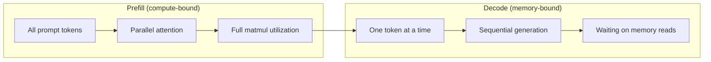
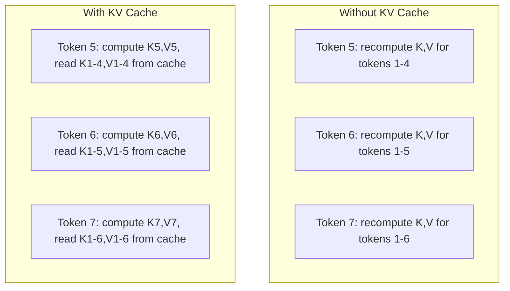
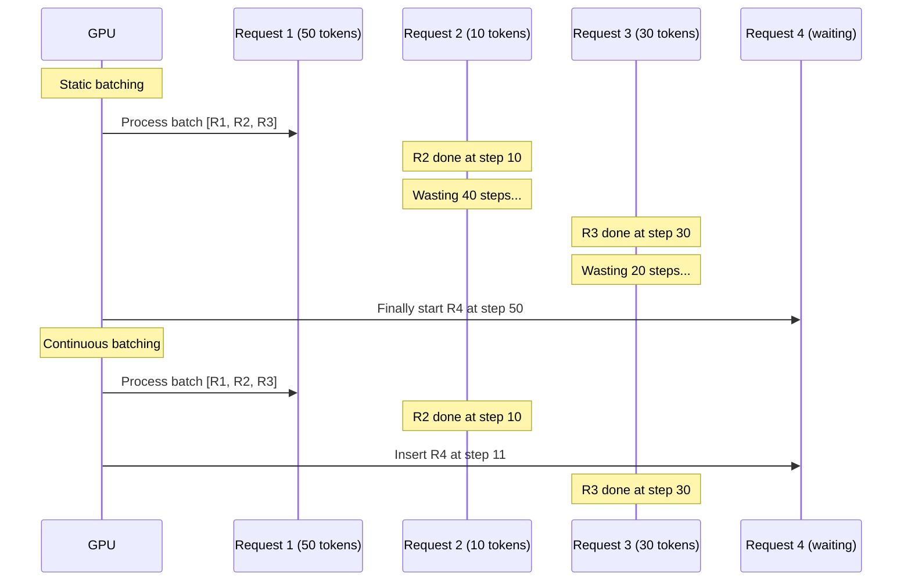
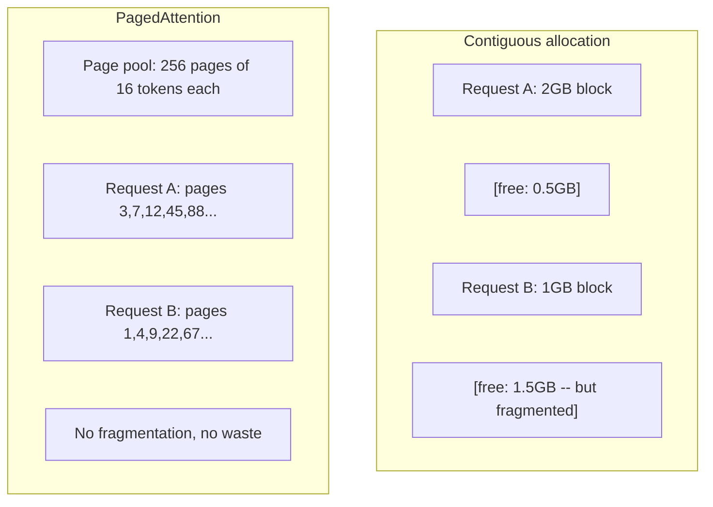
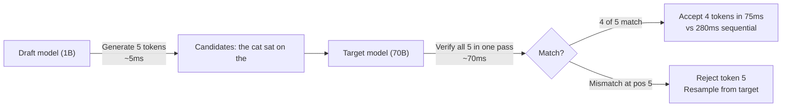

# Inference Optimization

> Two phases define LLM inference. Prefill processes your prompt in parallel -- compute-bound. Decode generates tokens one at a time -- memory-bound. Every optimization targets one or both.

**Type:** Build
**Languages:** Python, Rust
**Prerequisites:** Phase 10, Lessons 01-08 (Transformer architecture, attention)
**Time:** ~120 minutes

## Learning Objectives

- Implement KV-cache to eliminate redundant computation during autoregressive token generation
- Explain the prefill vs decode phases of LLM inference and why each has different bottlenecks (compute-bound vs memory-bound)
- Implement continuous batching and PagedAttention concepts to maximize GPU utilization under concurrent requests
- Compare inference optimization techniques (KV-cache, speculative decoding, flash attention) and their throughput/latency tradeoffs

## The Problem

You deploy Llama 3 70B on 4xA100 GPUs. A single user gets ~50 tokens per second. Feels fast. Then 100 users hit the endpoint simultaneously. Throughput drops to 3 tokens/second/user. Your $25,000/month GPU bill is serving responses slower than a human types.

The model itself does not change between 1 user and 100 users. Same weights, same architecture, same math. What changes is how you schedule the work. Naive inference wastes 90%+ of available GPU compute. A user waiting for token 47 holds an entire batch slot open while the GPU memory bus sits idle between matmuls. Meanwhile, a new user's 2,000-token prompt could fill that dead time with useful compute.

This is not a scaling problem. It is a scheduling problem. The techniques in this lesson -- KV caching, continuous batching, PagedAttention, speculative decoding, prefix caching -- are what separate a $25k/month inference bill from a $5k/month one serving the same traffic.

vLLM serving Llama 3 70B on 4xA100-80GB achieves ~50 tokens/second/user at low concurrency, and sustains 15-25 TPS/user at 100 concurrent requests through continuous batching and PagedAttention. Without these optimizations, the same hardware serves 5 TPS/user at that concurrency. Same GPUs, same model, 4x the throughput.

## The Concept

### Prefill vs Decode

Every LLM inference request has two distinct phases.

**Prefill** processes the entire input prompt. All tokens are known, so attention can be computed in parallel across the full sequence. This is a large matrix multiplication -- GPU cores stay busy. The bottleneck is compute: how many FLOPS your hardware can deliver per second. An A100 does 312 TFLOPS (BF16). Prefill for a 4,096-token prompt on a 70B model takes ~400ms on a single A100.

**Decode** generates output tokens one at a time. Each new token attends to all previous tokens, but only one token is produced per forward pass. The weight matrices are the same size as during prefill, but you are multiplying them by a single vector instead of a matrix. The GPU cores finish in microseconds, then wait for the next batch of weights to arrive from memory. The bottleneck is memory bandwidth: how fast you can stream model weights from HBM to the compute units. An A100 has 2 TB/s bandwidth. A 70B model in FP16 is 140 GB. Reading the full model once takes 70ms -- that is your floor for a single decode step.



The **ops:byte ratio** (also called arithmetic intensity) captures this tradeoff. It measures how many operations you perform per byte loaded from memory.

```
ops:byte ratio = FLOPs per token / bytes read from memory
```

During prefill with a batch of 4,096 tokens, you perform ~4,096 multiply-accumulate operations per weight loaded. The ratio is high -- you are compute-bound. During decode with batch size 1, you perform ~1 operation per weight loaded. The ratio is low -- you are memory-bound.

The fundamental insight: *decode is memory-bound because you read the entire model to produce a single token*. Every optimization below either reduces what you read, increases the batch of tokens processed per read, or avoids reads entirely.

### KV Cache

During attention, each token's query attends to every previous token's key and value vectors. Without caching, generating token N requires recomputing the key and value projections for all N-1 preceding tokens. Token 1 gets projected when generating token 2, then again for token 3, then again for token 4. By token 1,000, you have projected token 1 a total of 999 times.

The KV cache stores the key and value projections from all previous tokens. When generating token N, you only compute the key and value for token N, then concatenate them with the cached K/V from tokens 1 through N-1.



**Memory formula for KV cache:**

```
KV cache size = 2 * num_layers * num_kv_heads * head_dim * seq_len * bytes_per_param
```

For Llama 3 70B (80 layers, 8 KV heads with GQA, head_dim=128, BF16):

```
per token: 2 * 80 * 8 * 128 * 2 bytes = 327,680 bytes = 320 KB
at 4,096 tokens: 320 KB * 4,096 = 1.28 GB
at 128K tokens: 320 KB * 131,072 = 40 GB
```

A single 128K-context conversation for Llama 3 70B consumes 40 GB of KV cache -- half an A100's memory. With 100 concurrent users at 4K tokens each, KV cache alone requires 128 GB. This is why KV cache management is the central challenge of inference optimization.

### Continuous Batching

Static batching waits until a batch of N requests arrives, processes them together, and waits until *all* finish before accepting new requests. If one request needs 500 tokens and another needs 10, the short request sits idle for 490 decode steps after it finishes.

Continuous batching (also called iteration-level batching) inserts new requests into the batch as soon as any request completes. The batch is reevaluated at every decode step. A request that finishes after 10 tokens is immediately replaced by a waiting request.



The throughput improvement depends on how much output lengths vary. With uniform lengths, continuous batching matches static batching. With variable lengths (the common case), continuous batching can deliver 2-5x higher throughput because GPU slots never sit empty.

### PagedAttention

The KV cache for each request is a contiguous block of memory. As requests arrive and depart, memory fragments -- exactly like RAM fragmentation in operating systems. A 4K-token request needs 1.28 GB contiguous. Even if you have 2 GB free total, you might not have 1.28 GB *contiguous*. You either waste memory or reject the request.

PagedAttention (from vLLM) applies OS-style virtual memory to KV cache. Instead of allocating one contiguous block per request, it allocates fixed-size "pages" (typically 16 tokens each). Pages can be anywhere in physical GPU memory. A page table maps each request's logical sequence positions to physical page locations.



PagedAttention also enables **copy-on-write** for shared prefixes. If 50 requests share the same system prompt, the KV cache pages for that system prompt are stored once and referenced by all 50 requests. Only when a request diverges (different user messages) does it get its own pages. This cuts memory usage dramatically for applications with shared system prompts.

The [vLLM paper](https://arxiv.org/abs/2309.06180) reports memory waste below 4% with PagedAttention, compared with substantially higher waste in the baseline allocators it evaluated.

### Speculative Decoding

Decode is slow because it is sequential -- you generate one token, feed it back, generate the next. But what if you could guess the next 5 tokens cheaply, then verify them all at once?

Speculative decoding uses a small, fast **draft model** to generate K candidate tokens. The large **target model** then processes all K candidates in a single forward pass (which looks like a prefill -- parallel, compute-bound, efficient). If the target model agrees with the draft model's predictions, you accept all K tokens in the time of one target forward pass. If it disagrees at position j, you accept tokens 1 through j-1 and discard the rest.



The speedup depends on the **acceptance rate** -- how often the draft model's predictions match the target. For a Llama 3 8B drafting for Llama 3 70B, acceptance rates of 70-85% are typical on natural language. This translates to 2-3x decode speedup.

Three approaches to speculative decoding:

| Method | Draft source | Acceptance rate | Overhead |
|--------|-------------|-----------------|----------|
| Draft-target (Leviathan et al.) | Separate small model | 70-85% | Draft model memory |
| EAGLE (Li et al.) | Lightweight head on target | 75-90% | ~1% extra parameters |
| N-gram lookup | Token n-gram table | 40-60% | Negligible |

**EAGLE** trains a small autoregressive head on top of the target model's hidden states. It predicts the next token's embedding using the target model's second-to-last layer features. Because it operates on the target model's own representations (not a separate model's), it achieves higher acceptance rates with minimal extra memory. EAGLE-2 adds a dynamic draft tree that adjusts candidate count based on context.

**N-gram speculative decoding** maintains a table of n-gram continuations from the current context or a prebuilt corpus. If the draft matches what appeared before in the same conversation (repetitive patterns, code, structured output), it fires with zero neural network overhead. Acceptance rates are lower on average but the cost per speculation is essentially free.

Speculative decoding is *mathematically exact* -- the output distribution is identical to the target model's distribution. It is not an approximation. The verification step ensures that every accepted token has exactly the probability the target model would have assigned.

### Prefix Caching

Many requests share the same prefix. A chatbot system prompt. A RAG context block. A few-shot example set. Without prefix caching, every request recomputes the KV cache for these shared tokens from scratch.

Prefix caching stores the KV cache for common prefixes and reuses it across requests. When a new request arrives with a known prefix, the system copies (or references) the cached KV entries and only computes the KV for the unique suffix.

For a 2,000-token system prompt shared across all requests, prefix caching eliminates ~400ms of prefill per request. At 100 requests/second, that saves 40 seconds of GPU compute per second -- more than one GPU's worth of work.

SGLang's RadixAttention implements prefix caching with a radix tree (trie) that indexes prefixes by their token content. Any request matching a stored prefix gets its KV cache for free. The tree enables partial prefix matches -- if you share 1,500 of 2,000 prefix tokens with a cached entry, you reuse those 1,500 and recompute only 500.

### Inference Engines

Three engines dominate production LLM serving:

| Engine | Key innovation | Best for |
|--------|---------------|----------|
| vLLM | PagedAttention, continuous batching | General-purpose serving, highest compatibility |
| SGLang | RadixAttention (prefix caching), structured generation | Multi-turn chatbots, constrained decoding |
| TensorRT-LLM | NVIDIA kernel fusion, FP8 quantization | Maximum single-GPU throughput on NVIDIA hardware |

**vLLM** is the default starting point. It supports the widest range of models, runs on any GPU vendor (NVIDIA, AMD, Intel), and achieves strong throughput through PagedAttention + continuous batching. The OpenAI-compatible API means you can drop it in as a replacement for any OpenAI API call.

**SGLang** builds on the same foundations as vLLM but adds RadixAttention for prefix caching and a domain-specific language for structured LLM programs. If your workload involves multi-turn conversations, tool use, or constrained decoding (JSON output, regex-guided generation), SGLang often outperforms vLLM by 2-5x through prefix reuse.

**TensorRT-LLM** compiles models into optimized NVIDIA GPU kernels. It fuses operations (attention + linear + activation in one kernel), uses FP8 on H100 GPUs, and integrates with NVIDIA Triton Inference Server for production deployment. It achieves the highest single-GPU throughput on NVIDIA hardware but requires more setup and only works on NVIDIA GPUs.

Real-world numbers for Llama 3 70B (4xA100-80GB, BF16):

| Metric | vLLM | SGLang | TensorRT-LLM |
|--------|------|--------|---------------|
| Throughput (1 user) | ~50 TPS | ~55 TPS | ~65 TPS |
| Throughput (100 users) | ~2,500 total TPS | ~3,200 total TPS | ~3,000 total TPS |
| Time to first token | ~400ms | ~300ms (prefix hit) | ~350ms |
| Max context | 128K | 128K | 128K |

### The Ops:Byte Framework

You cannot optimize what you do not measure. The ops:byte ratio tells you whether you are compute-bound or memory-bound, which determines which optimizations matter.

```
Compute roof: peak FLOPS of the GPU
Memory roof:  peak bandwidth * ops:byte ratio
```

When ops:byte is low (decode, small batches), you hit the memory bandwidth roof. Adding more compute (higher clock, more cores) does not help. You need to reduce memory reads (quantization, KV cache compression) or increase the batch size to amortize reads across more useful work.

When ops:byte is high (prefill, large batches), you hit the compute roof. Memory bandwidth optimization does not help. You need faster GPUs, kernel fusion, or reduced precision to squeeze more FLOPS.

| Scenario | ops:byte | Bound | Optimize with |
|----------|----------|-------|---------------|
| Prefill, batch=1 | ~4,096 | Compute | Kernel fusion, FP8 |
| Decode, batch=1 | ~1 | Memory | Quantization, KV compression |
| Decode, batch=32 | ~32 | Memory | Larger batch, continuous batching |
| Decode, batch=256 | ~256 | Transitioning | Both matter |
| Decode, batch=1024 | ~1,024 | Compute | Kernel fusion, tensor parallelism |

The crossover point on A100 is around ops:byte = 156 (312 TFLOPS / 2 TB/s). Below 156, you are memory-bound. Above 156, you are compute-bound. Continuous batching pushes decode toward this crossover by packing more tokens per iteration.


## Further Reading

- Kwon et al., "Efficient Memory Management for Large Language Model Serving with PagedAttention" (2023) -- the vLLM paper that introduced paged KV cache management, now the industry standard for inference serving
- Leviathan et al., "Fast Inference from Transformers via Speculative Decoding" (2023) -- the foundational paper proving that draft-verify speculation produces exact target model distributions while achieving 2-3x speedup
- Li et al., "EAGLE: Speculative Sampling Requires Rethinking Feature Uncertainty" (2024) -- achieves higher acceptance rates by training a head on the target model's own features instead of using a separate draft model
- Zheng et al., "SGLang: Efficient Execution of Structured Language Model Programs" (2024) -- introduces RadixAttention for prefix caching and a programming model for multi-call LLM programs
- Williams et al., "Roofline: An Insightful Visual Performance Model for Multicore Architectures" (2009) -- the original roofline paper that formalized the ops:byte framework for reasoning about compute vs memory bottlenecks
