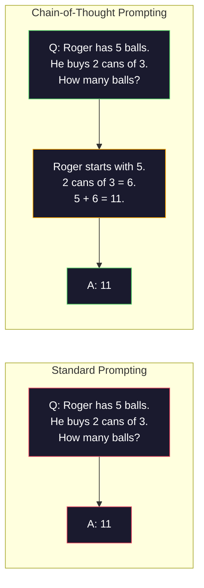
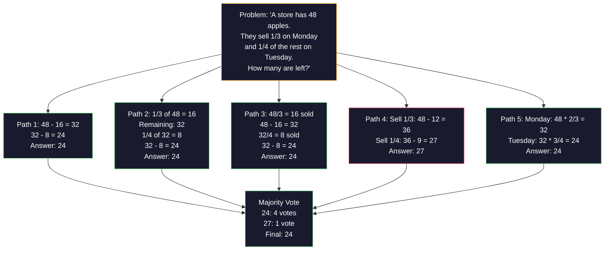
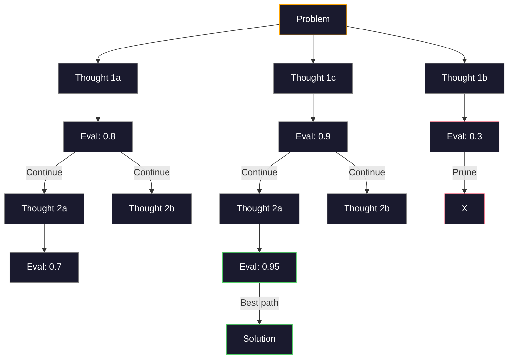

# Few-Shot, Chain-of-Thought, Tree-of-Thought

> Telling a model what to do is prompting. Showing it how to think is engineering. The gap between 78% and 91% accuracy on the same model, same task, same data is not a better model. It is a better reasoning strategy.

**Type:** Build
**Languages:** Python
**Prerequisites:** Lesson 11.01 (Prompt Engineering)
**Time:** ~45 minutes

## Learning Objectives

- Implement few-shot prompting by selecting and formatting example demonstrations that maximize task accuracy
- Apply chain-of-thought (CoT) reasoning to improve accuracy on multi-step problems like math word problems
- Build a tree-of-thought prompt that explores multiple reasoning paths and selects the best one
- Measure the accuracy improvement from zero-shot vs few-shot vs CoT on a standard benchmark

## The Problem

You build a math tutoring app. Your prompt says: "Solve this word problem." GPT-5 gets it right 94% of the time on GSM8K, the standard grade-school math benchmark. You think you already peaked. You do not — chain-of-thought still adds 3-4 points.

Add five words -- "Let's think step by step" -- and accuracy jumps to 91%. Add a few worked examples and it reaches 95%. Same model. Same temperature. Same API cost. The only difference is that you gave the model scratch paper.

This is not a hack. It is how reasoning works. Humans do not solve multi-step problems in one mental leap. Neither do transformers. When you force a model to generate intermediate tokens, those tokens become part of the context for the next token. Each reasoning step feeds the next. The model literally computes its way to the answer.

But "think step by step" is the beginning, not the end. What if you sampled five reasoning paths and took a majority vote? What if you let the model explore a tree of possibilities, evaluating and pruning branches? What if you interleaved reasoning with tool use? These are not hypotheticals. They are published techniques with measured improvements, and you will build all of them in this lesson.

## The Concept

### Zero-Shot vs Few-Shot: When Examples Beat Instructions

Zero-shot prompting gives the model a task and nothing else. Few-shot prompting gives it examples first.

Wei et al. (2022) measured this across 8 benchmarks. For simple tasks like sentiment classification, zero-shot and few-shot performed within 2% of each other. For complex tasks like multi-step arithmetic and symbolic reasoning, few-shot improved accuracy by 10-25%.

The intuition: examples are compressed instructions. Instead of describing the output format, you show it. Instead of explaining the reasoning process, you demonstrate it. The model pattern-matches on the examples more reliably than it interprets abstract instructions.


**When few-shot wins:** format-sensitive tasks, classification, structured extraction, domain-specific jargon, any task where the model needs to match a specific pattern.

**When zero-shot wins:** simple factual questions, creative tasks where examples constrain creativity, tasks where finding good examples is harder than writing good instructions.

See this hold outside math word problems too — an IT helpdesk support agent, with live calls. Every call below reuses this `lrn_llm` setup — run it once:

```python editable
import sys, json, types
lrn_llm = types.ModuleType("lrn_llm")
try:
    from pyodide.http import pyfetch as _pyfetch
    _IN_PYODIDE = True
except ImportError:
    import urllib.request as _urlreq
    _IN_PYODIDE = False
lrn_llm.API_BASE = "/api/llm"  # same-origin proxy; server injects the gateway key
lrn_llm.DEFAULT_MODEL = "azure/gpt-5.4-mini"
lrn_llm.API_KEY = ""  # optional; set in Step 0a

async def _lrn_call(messages, *, system=None, max_tokens=400, model=None):
    if system is not None:
        messages = [{"role": "system", "content": system}] + list(messages)
    payload = {"model": model or lrn_llm.DEFAULT_MODEL, "messages": messages,
               "max_completion_tokens": max_tokens}
    headers = {"content-type": "application/json"}
    _key = lrn_llm.API_KEY
    if _key:
        headers["Authorization"] = "Bearer " + _key
    url = lrn_llm.API_BASE.rstrip("/") + "/chat/completions"
    body = json.dumps(payload)
    if _IN_PYODIDE:
        r = await _pyfetch(url, method="POST", headers=headers, body=body)
        data = await r.json()
    else:
        req = _urlreq.Request(url, method="POST", headers=headers, data=body.encode("utf-8"))
        with _urlreq.urlopen(req, timeout=60) as r:
            data = json.loads(r.read())
    if "error" in data:
        raise RuntimeError("LLM error: " + str(data["error"]))
    return data

def _lrn_text(r):
    ch = (r or {}).get("choices") or []
    return (ch[0].get("message", {}) or {}).get("content", "") if ch else ""

async def _lrn_ping():
    r = await _lrn_call([{"role": "user", "content": "Reply with exactly: OK"}], max_tokens=5)
    return {"ok": _lrn_text(r).strip().upper().startswith("OK"), "model": r.get("model")}

lrn_llm.call = _lrn_call
lrn_llm.text = _lrn_text
lrn_llm.ping = _lrn_ping
print("✅ notebook ready · endpoint:", lrn_llm.API_BASE)
```

A small knowledge base of worked support examples, question/reasoning/answer triples:

```python editable
SUPPORT_EXAMPLES = [
    {
        "question": "How do I reset my VPN credentials if I've forgotten my password?",
        "reasoning": "First, I need to identify the system — VPN credentials are managed through the security portal. The user should go to the security portal at https://security.company.internal, click 'Forgot Password', verify their identity with their employee ID, and follow the email reset link. Alternative: contact the IT helpdesk directly at ext. 5555.",
        "answer": "Visit https://security.company.internal > Forgot Password > verify identity with employee ID > check email for reset link. Or contact IT ext. 5555."
    },
    {
        "question": "What is the process for requesting a new laptop as a contractor?",
        "reasoning": "Contractors go through a different approval process than full-time employees. The request must be submitted by the hiring manager, not the contractor. The manager logs into the asset request portal, submits a new hardware request, includes the contractor's duration of engagement, and marks it as contractor status. Procurement reviews within 3 business days. If urgent, email procurement@company.internal.",
        "answer": "Hiring manager must submit request at asset.company.internal > new hardware > select contractor > include end date > submit. Approval in 3 business days. Email procurement@company.internal for urgent requests."
    },
    {
        "question": "Can I use my personal cloud storage (Dropbox, Google Drive) for company documents?",
        "reasoning": "Company policy prohibits personal cloud storage for sensitive documents due to compliance requirements (GDPR, SOX). Non-sensitive docs like meeting notes are okay, but anything with customer data, financial info, or code must use company-approved storage: SharePoint, OneDrive, or Confluence. Check the data classification guide at compliance.company.internal.",
        "answer": "No for sensitive data (customer, financial, code). Personal cloud storage allowed only for non-sensitive docs (notes, drafts). Use SharePoint, OneDrive, or Confluence for company data. See compliance.company.internal for classification."
    }
]

print("Loaded 3 support examples from knowledge base.")
print(f"Example 1: {SUPPORT_EXAMPLES[0]['question'][:50]}...")
```

First, the zero-shot baseline — no examples, no reasoning:

```python editable
async def zero_shot_support(question):
    """Answer a support question with no examples, no reasoning."""
    system = "You are an IT support agent. Answer employee questions about company policies and procedures clearly and concisely."
    resp = await lrn_llm.call(
        [{"role": "user", "content": question}],
        system=system,
        max_tokens=200
    )
    return lrn_llm.text(resp)

# Test question
test_q = "What should I do if I forget my email password?"
zs_answer = await zero_shot_support(test_q)
print(f"Q: {test_q}")
print(f"\nZero-Shot Answer:\n{zs_answer}")
```

### Example Selection: Similar Beats Random

Not all examples are equal. Choosing examples similar to the target input outperforms random selection by 5-15% on classification tasks (Liu et al., 2022). Three principles:

1. **Semantic similarity**: pick examples closest to the input in embedding space
2. **Label diversity**: cover all output categories in your examples
3. **Difficulty matching**: match the complexity level of the target problem

The optimal number of examples for most tasks is 3-5. Below 3, the model does not have enough signal to extract the pattern. Above 5, you hit diminishing returns and waste context window tokens. For classification with many labels, use one example per label.

### Chain-of-Thought: Giving Models Scratch Paper

Chain-of-Thought (CoT) prompting was introduced by Wei et al. (2022) at Google Brain. The idea is simple: instead of asking the model for just the answer, ask it to show its reasoning steps first.



Why does this work mechanically? Each token a transformer generates becomes context for the next token. Without CoT, the model must compress all reasoning into the hidden state of a single forward pass. With CoT, the model externalizes intermediate computations as tokens. Each reasoning token extends the effective computation depth.

**GSM8K benchmarks (grade-school math, 8.5K problems):**

| Model | Zero-Shot | Zero-Shot CoT | Few-Shot CoT |
|-------|-----------|---------------|--------------|
| GPT-4o | 78% | 91% | 95% |
| GPT-5 | 94% | 97% | 98% |
| o4-mini (reasoning) | 97% | — | — |
| Claude Opus 4.7 | 93% | 97% | 98% |
| Gemini 3 Pro | 92% | 96% | 98% |
| Llama 4 Maverick | 80% | 89% | 94% |
| DeepSeek-V3.1 | 89% | 94% | 96% |

**Note on reasoning models.** Models like OpenAI's o-series (o3, o4-mini) and DeepSeek-R1 run chain-of-thought internally before emitting their answer. Adding "Let's think step by step" to a reasoning model is redundant and sometimes counterproductive — they have already done it.

Two flavors of CoT:

**Zero-shot CoT**: append "Let's think step by step" to the prompt. No examples needed. Kojima et al. (2022) showed this single sentence improves accuracy across arithmetic, commonsense, and symbolic reasoning tasks.

**Few-shot CoT**: provide examples that include reasoning steps. More effective than zero-shot CoT because the model sees the exact reasoning format you expect.

**When CoT hurts**: simple factual recall ("What is the capital of France?"), single-step classification, tasks where speed matters more than accuracy. CoT adds 50-200 tokens of reasoning overhead per query. For high-throughput, low-complexity tasks, that is wasted cost.

Now add the worked examples back in, plus a request to show reasoning — few-shot CoT on the same helpdesk question:

```python editable
async def few_shot_cot_support(question, examples=None):
    """Answer with few-shot examples and explicit reasoning steps."""
    if examples is None:
        examples = SUPPORT_EXAMPLES
    
    system = (
        "You are an IT support agent. For each question, show your reasoning step-by-step, "
        "then give a clear, concise final answer. Think about the policy or process involved."
    )
    
    # Build few-shot prompt
    example_text = ""
    for ex in examples[:2]:  # Use 2 examples
        example_text += f"Q: {ex['question']}\n"
        example_text += f"Reasoning: {ex['reasoning']}\n"
        example_text += f"A: {ex['answer']}\n\n"
    
    user_msg = example_text + f"Q: {question}\nReasoning:"
    
    resp = await lrn_llm.call(
        [{"role": "user", "content": user_msg}],
        system=system,
        max_tokens=300
    )
    return lrn_llm.text(resp)

fs_cot_answer = await few_shot_cot_support(test_q)
print(f"Q: {test_q}")
print(f"\nFew-Shot + CoT Answer:\n{fs_cot_answer}")
```

### Self-Consistency: Sample Many, Vote Once

Wang et al. (2023) introduced self-consistency. The insight: a single CoT path might contain reasoning errors. But if you sample N independent reasoning paths (using temperature > 0) and take the majority vote on the final answer, errors cancel out.



Self-consistency improved GSM8K accuracy from 56.5% (single CoT) to 74.4% with N=40 on the original PaLM 540B experiments. On GPT-5 the improvement is small (97% to 98%) because base accuracy is already saturated. The technique shines most on models with 60-85% base CoT accuracy -- the sweet spot where single-path errors are frequent but not systematic. For reasoning models (o-series, R1) self-consistency is subsumed by the built-in internal sampling.

The tradeoff: N samples means Nx the API cost and latency. In practice, N=5 captures most of the benefit. N=3 is the minimum for a meaningful vote. N > 10 has diminishing returns for most tasks.

Sample the same helpdesk question N=3 times and take the majority final answer:

```python editable
from collections import Counter

async def self_consistency_support(question, num_samples=3):
    """Generate multiple reasoning paths and pick the most common answer."""
    system = (
        "You are an IT support agent. For each question, show your reasoning step-by-step, "
        "then end with a FINAL ANSWER on the last line in the format: 'Final Answer: [answer]'"
    )
    
    example_text = ""
    for ex in SUPPORT_EXAMPLES[:2]:
        example_text += f"Q: {ex['question']}\n"
        example_text += f"Reasoning: {ex['reasoning']}\n"
        example_text += f"Final Answer: {ex['answer']}\n\n"
    
    user_msg = example_text + f"Q: {question}\nReasoning:"
    
    answers = []
    reasonings = []
    
    for i in range(num_samples):
        resp = await lrn_llm.call(
            [{"role": "user", "content": user_msg}],
            system=system,
            max_tokens=300
        )
        text = lrn_llm.text(resp)
        reasonings.append(text)
        
        # Extract final answer
        if "Final Answer:" in text:
            answer = text.split("Final Answer:")[-1].strip()
            answers.append(answer[:100])  # Store first 100 chars
        print(f"  Sample {i+1}: answer extracted")
    
    # Vote
    if answers:
        vote_counts = Counter(answers)
        best_answer = vote_counts.most_common(1)[0][0]
        confidence = vote_counts[best_answer] / len(answers)
    else:
        best_answer = "Could not extract answer"
        confidence = 0.0
    
    return best_answer, confidence, reasonings

print(f"Running self-consistency on: {test_q}")
best, conf, paths = await self_consistency_support(test_q, num_samples=3)
print(f"\nBest Answer (confidence {conf:.1%}):")
print(best)
```

### Tree-of-Thought: Branching Exploration

Yao et al. (2023) introduced Tree-of-Thought (ToT). Where CoT follows one linear reasoning path, ToT explores multiple branches and evaluates which are most promising before continuing.



ToT has three components:

1. **Thought generation**: produce multiple candidate next-steps
2. **State evaluation**: score each candidate (can use the LLM itself as evaluator)
3. **Search algorithm**: BFS or DFS through the tree, pruning low-scoring branches

On the Game of 24 task (combine 4 numbers using arithmetic to make 24), GPT-4 with standard prompting solves 7.3% of problems. With CoT, 4.0% (CoT actually hurts here because the search space is wide). With ToT, 74%.

ToT is expensive. Each node in the tree requires an LLM call. A tree with branching factor 3 and depth 3 requires up to 39 LLM calls. Use it only for problems where the search space is large but evaluatable -- planning, puzzle solving, creative problem-solving with constraints.

### ReAct: Thinking + Doing

Yao et al. (2022) combined reasoning traces with actions. The model alternates between thinking (generating reasoning) and acting (calling tools, searching, computing).

```mermaid
graph LR
    Q["Question:\nWhat is the\npopulation of the\ncountry where\nthe Eiffel Tower\nis located?"]
    T1["Thought: I need to\nfind which country\nhas the Eiffel Tower"]
    A1["Action: search\n'Eiffel Tower location'"]
    O1["Observation:\nParis, France"]
    T2["Thought: Now I need\nFrance's population"]
    A2["Action: search\n'France population 2024'"]
    O2["Observation:\n68.4 million"]
    T3["Thought: I have\nthe answer"]
    F["Answer:\n68.4 million"]

    Q --> T1 --> A1 --> O1 --> T2 --> A2 --> O2 --> T3 --> F

    style Q fill:#1a1a2e,stroke:#ffa500,color:#fff
    style T1 fill:#1a1a2e,stroke:#51cf66,color:#fff
    style A1 fill:#1a1a2e,stroke:#e94560,color:#fff
    style O1 fill:#1a1a2e,stroke:#808080,color:#fff
    style T2 fill:#1a1a2e,stroke:#51cf66,color:#fff
    style A2 fill:#1a1a2e,stroke:#e94560,color:#fff
    style O2 fill:#1a1a2e,stroke:#808080,color:#fff
    style T3 fill:#1a1a2e,stroke:#51cf66,color:#fff
    style F fill:#1a1a2e,stroke:#51cf66,color:#fff
```



ReAct outperforms pure CoT on knowledge-intensive tasks because it can ground its reasoning in real data. On HotpotQA (multi-hop question answering), ReAct with GPT-4 achieves 35.1% exact match vs 29.4% for CoT alone. The real power is that reasoning errors get corrected by observations -- the model can update its plan mid-execution.

ReAct is the foundation of modern AI agents. Every agent framework (LangChain, CrewAI, AutoGen) implements some variant of the Thought-Action-Observation loop. You will build full agents in Phase 14. This lesson covers the prompting pattern.

### Structured Prompting: XML Tags, Delimiters, Headers

As prompts get complex, structure prevents the model from confusing sections. Three approaches:

**XML tags** (works best with Claude, solid everywhere):
```
<context>
You are reviewing a pull request.
The codebase uses TypeScript and React.
</context>

<task>
Review the following diff for bugs, security issues, and style violations.
</task>

<diff>
{diff_content}
</diff>

<output_format>
List each issue with: file, line, severity (critical/warning/info), description.
</output_format>
```

**Markdown headers** (universal):
```
## Role
Senior security engineer at a fintech company.

## Task
Analyze this API endpoint for vulnerabilities.

## Input
{api_code}

## Rules
- Focus on OWASP Top 10
- Rate each finding: critical, high, medium, low
- Include remediation steps
```

**Delimiters** (minimal but effective):
```
---INPUT---
{user_text}
---END INPUT---

---INSTRUCTIONS---
Summarize the above in 3 bullet points.
---END INSTRUCTIONS---
```

### Prompt Chaining: Sequential Decomposition

Some tasks are too complex for a single prompt. Prompt chaining breaks them into steps, where the output of one prompt becomes the input of the next.


Chaining beats single-prompt for three reasons:

1. **Each step is simpler**: the model handles one focused task instead of juggling everything
2. **Intermediate outputs are inspectable**: you can validate and correct between steps
3. **Different steps can use different models**: use a cheap model for extraction, an expensive one for reasoning

### Performance Comparison

| Technique | Best For | GSM8K Accuracy (GPT-5) | API Calls | Token Overhead | Complexity |
|-----------|----------|------------------------|-----------|----------------|------------|
| Zero-Shot | Simple tasks | 94% | 1 | None | Trivial |
| Few-Shot | Format matching | 96% | 1 | 200-500 tokens | Low |
| Zero-Shot CoT | Quick reasoning boost | 97% | 1 | 50-200 tokens | Trivial |
| Few-Shot CoT | Maximum single-call accuracy | 98% | 1 | 300-600 tokens | Low |
| Self-Consistency (N=5) | High-stakes reasoning | 98.5% | 5 | 5x token cost | Medium |
| Reasoning model (o4-mini) | Drop-in CoT replacement | 97% | 1 | hidden (2-10x internal) | Trivial |
| Tree-of-Thought | Search/planning problems | N/A (74% on Game of 24) | 10-40+ | 10-40x token cost | High |
| ReAct | Knowledge-grounded reasoning | N/A (35.1% on HotpotQA) | 3-10+ | Variable | High |
| Prompt Chaining | Complex multi-step tasks | 96% (pipeline) | 2-5 | 2-5x token cost | Medium |

The right technique depends on three factors: accuracy requirement, latency budget, and cost tolerance. For most production systems, few-shot CoT with a 3-sample self-consistency fallback covers 90% of use cases.

Summarize the three techniques run above on the same helpdesk question:

```python editable
print("=" * 70)
print("TECHNIQUE COMPARISON")
print("=" * 70)
print(f"\nTest Question: {test_q}")
print("\nTechnique               | Calls | Reasoning? | Examples? | Cost")
print("-" * 70)
print("Zero-Shot              |   1   |     No     |     No    |  Low")
print("Few-Shot + CoT         |   1   |     Yes    |     Yes   |  Med")
print("Self-Consistency (N=3) |   3   |     Yes    |     Yes   |  High")
print("\nKey Insight from the lesson:")
print("  • Few-shot examples are COMPRESSED instructions")
print("  • CoT (reasoning steps) extends computation depth")
print("  • Self-consistency reduces answer variance on hard questions")
print("  • For IT support: accuracy >> latency (same as math problems)")
```

Now try it yourself — write your own IT support question and compare the zero-shot and few-shot-CoT answers:

```python editable
# TODO: Edit this question to test on your own IT support scenario
your_question = "How do I configure my email signature in Outlook?"

print(f"YOUR QUESTION: {your_question}\n")
print("Calling zero-shot approach...")
zs = await zero_shot_support(your_question)
print(f"Zero-Shot:\n{zs}\n")

print("Calling few-shot + CoT approach...")
fs = await few_shot_cot_support(your_question)
print(f"Few-Shot + CoT:\n{fs}\n")

print("\n" + "=" * 70)
print("REFLECTION:")
print("  1. Did the few-shot version include relevant domain knowledge?")
print("  2. Did the CoT approach show intermediate reasoning?")
print("  3. For IT support, which is more trustworthy?")
print("=" * 70)
```

## Further Reading

- [Chain-of-Thought Prompting Elicits Reasoning in Large Language Models](https://arxiv.org/abs/2201.11903) -- Wei et al. 2022. The original CoT paper from Google Brain. Read sections 2-3 for the core results.
- [Self-Consistency Improves Chain of Thought Reasoning in Language Models](https://arxiv.org/abs/2203.11171) -- Wang et al. 2023. The self-consistency paper. Table 1 has all the numbers you need.
- [Tree of Thoughts: Deliberate Problem Solving with Large Language Models](https://arxiv.org/abs/2305.10601) -- Yao et al. 2023. ToT paper. The Game of 24 results in section 4 are the highlight.
- [ReAct: Synergizing Reasoning and Acting in Language Models](https://arxiv.org/abs/2210.03629) -- Yao et al. 2022. The foundation of modern AI agents. Section 3 explains the Thought-Action-Observation loop.
- [Large Language Models are Zero-Shot Reasoners](https://arxiv.org/abs/2205.11916) -- Kojima et al. 2022. The "Let's think step by step" paper. Surprisingly effective for how simple it is.
- [DSPy: Compiling Declarative Language Model Calls into Self-Improving Pipelines](https://arxiv.org/abs/2310.03714) -- Khattab et al. 2023. Treats prompting as a compilation problem. Read if you want to move beyond manual prompt engineering.
- [OpenAI — Reasoning models guide](https://platform.openai.com/docs/guides/reasoning) -- vendor guidance on when chain-of-thought becomes an internal, priced-per-token "reasoning" mode versus a prompt-level trick.
- [Lightman et al., "Let's Verify Step by Step" (2023)](https://arxiv.org/abs/2305.20050) -- process reward models (PRM) that grade each step of a chain; the reasoning supervision signal that supersedes outcome-only rewards.
- [Snell et al., "Scaling LLM Test-Time Compute Optimally" (2024)](https://arxiv.org/abs/2408.03314) -- systematic study of CoT length, self-consistency sampling, and MCTS; where "think step by step" goes when accuracy matters more than latency.
