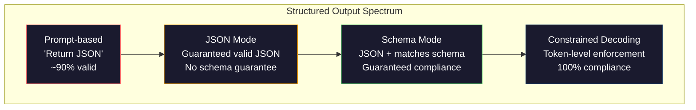
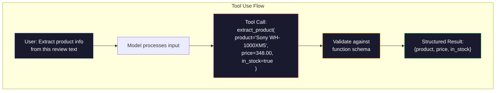

# Structured Outputs: JSON, Schema Validation, Constrained Decoding

> Your LLM returns a string. Your application needs JSON. That gap has crashed more production systems than any model hallucination. Structured output is the bridge between natural language and typed data. Get it right and your LLM becomes a reliable API. Get it wrong and you're parsing free-text with regex at 3am.

**Type:** Build
**Languages:** Python
**Prerequisites:** Phase 10, Lessons 01-05 (LLMs from Scratch)
**Time:** ~90 minutes
**Related:** Phase 5 · 20 (Structured Outputs & Constrained Decoding) covers the decoder-level theory (FSM/CFG logit processors, Outlines, XGrammar). This lesson focuses on the production SDK surface (OpenAI `response_format`, Anthropic tool use, Instructor) — read Phase 5 · 20 first if you want to understand what is happening below the API.

## Learning Objectives

- Implement JSON-mode and schema-constrained outputs using OpenAI and Anthropic API parameters
- Build a Pydantic validation layer that rejects malformed LLM outputs and retries with error feedback
- Explain how constrained decoding forces valid JSON at the token level without post-processing
- Design robust extraction prompts that reliably convert unstructured text into typed data structures

## The Problem

You ask an LLM: "Extract the product name, price, and availability from this text." It responds:

```
The product is the Sony WH-1000XM5 headphones, which cost $348.00 and are currently in stock.
```

That is a perfectly correct answer. It is also completely useless to your application. Your inventory system needs `{"product": "Sony WH-1000XM5", "price": 348.00, "in_stock": true}`. You need a JSON object with specific keys, specific types, and specific value constraints. You do not need a sentence.

The naive solution: add "Respond in JSON" to your prompt. This works 90% of the time. The other 10% the model wraps the JSON in markdown code fences, or adds a preamble like "Here's the JSON:", or produces syntactically invalid JSON because it closed a bracket early. Your JSON parser crashes. Your pipeline breaks. You add try/except and a retry loop. The retry sometimes produces different data. Now you have a consistency problem on top of a parsing problem.

This is not a prompt engineering problem. It is a decoding problem. The model generates tokens left to right. At each position, it picks the most likely next token from a vocabulary of 100K+ options. Most of those options would produce invalid JSON at any given position. If the model just emitted `{"price":`, the next token must be a digit, a quote (for string), `null`, `true`, `false`, or a negative sign. Anything else produces invalid JSON. Without constraints, the model might pick a perfectly reasonable English word that is catastrophically wrong syntactically.

## The Concept

### The Structured Output Spectrum

There are four levels of structured output control, each more reliable than the last.



**Prompt-based** ("Respond in valid JSON"): no enforcement. The model usually complies but sometimes does not. Reliability: ~90%. Failure mode: markdown fences, preamble text, truncated output, wrong structure.

**JSON mode**: the API guarantees the output is valid JSON. OpenAI's `response_format: { type: "json_object" }` enables this. The output will parse without errors. But it may not match your expected schema -- extra keys, wrong types, missing fields.

**Schema mode**: the API takes a JSON Schema and guarantees the output matches it. In 2026 every major provider supports this natively: OpenAI's `response_format: { type: "json_schema", json_schema: {...} }` (also as `tool_choice="required"`), Anthropic's tool use with `input_schema`, and Gemini's `response_schema` + `response_mime_type: "application/json"`. The output has the exact keys, types, and constraints you specified.

**Constrained decoding**: at each token position during generation, the decoder masks out all tokens that would produce invalid output. If the schema requires a number and the model is about to emit a letter, that token is set to probability zero. The model can only produce tokens that lead to valid output. This is what OpenAI's structured output mode and libraries like Outlines and Guidance implement under the hood.

### JSON Schema: The Contract Language

JSON Schema is how you tell the model (or validation layer) what shape the output must have. Every major structured output system uses it.

```json
{
  "type": "object",
  "properties": {
    "product": { "type": "string" },
    "price": { "type": "number", "minimum": 0 },
    "in_stock": { "type": "boolean" },
    "categories": {
      "type": "array",
      "items": { "type": "string" }
    }
  },
  "required": ["product", "price", "in_stock"]
}
```

This schema says: the output must be an object with a string `product`, a non-negative number `price`, a boolean `in_stock`, and an optional array of strings `categories`. Any output that does not match gets rejected.

Schemas handle the hard cases: nested objects, arrays with typed items, enums (constrain a string to specific values), pattern matching (regex on strings), and combinators (oneOf, anyOf, allOf for polymorphic outputs).

### The Pydantic Pattern

In Python, you do not write JSON Schema by hand. You define a Pydantic model and it generates the schema for you.

```python
from pydantic import BaseModel

class Product(BaseModel):
    product: str
    price: float
    in_stock: bool
    categories: list[str] = []
```

This produces the same JSON Schema as above. The Instructor library (and OpenAI's SDK) accept Pydantic models directly: pass the model class, get back a validated instance. If the LLM output does not match, Instructor retries automatically.

Pydantic isn't available here, but the checks it runs are just typed
comparisons — rebuild two of the failure modes from below (hallucinated type,
array length) without it:

```python fillin
schema = {
    "product": {"type": "string", "required": True},
    "price": {"type": "number", "minimum": 0, "required": True},
    "categories": {"type": "array", "maxItems": 3, "required": True},
}

def naive_validate(payload, schema):
    return [f for f in schema if schema[f]["required"] and f not in payload]

payload = {"product": 12345, "price": -10, "categories": ["a", "b", "c", "d"]}
print("naive:", naive_validate(payload, schema))  # [] -- all fields present, none of the violations caught

def strict_validate(payload, schema):
    errors = naive_validate(payload, schema)
    for field, sub in schema.items():
        if field not in payload:
            continue
        value = payload[field]
        if sub["type"] == "string" and not isinstance(value, {{blank:str}}):
            errors.append(f"{field}: expected string")
        if sub["type"] == "number" and value {{blank:<}} sub["minimum"]:
            errors.append(f"{field}: below minimum")
        if sub["type"] == "array" and len(value) {{blank:>}} sub["maxItems"]:
            errors.append(f"{field}: more than maxItems ({sub['maxItems']})")
    return errors

errors = strict_validate(payload, schema)
expected = ["product: expected string", "price: below minimum", "categories: more than maxItems (3)"]
if errors == expected:
    print("PASS")
else:
    print("WRONG:", errors)
```

### Function Calling / Tool Use

An alternative interface for the same problem. Instead of asking the model to produce JSON directly, you define "tools" (functions) with typed parameters. The model outputs a function call with structured arguments. OpenAI calls this "function calling." Anthropic calls it "tool use." The result is the same: structured data.



Tool use is preferred when the model needs to choose which function to call, not just fill in parameters. If you have 10 different extraction schemas and the model must pick the right one based on the input, tool use gives you both the schema selection and the structured output.

### Common Failure Modes

Even with schema enforcement, structured outputs can fail in subtle ways.

**Hallucinated values**: the output matches the schema but contains invented data. The model produces `{"price": 299.99}` when the text says $348. Schema validation cannot catch this -- the type is correct, the value is wrong.

**Enum confusion**: you constrain a field to `["in_stock", "out_of_stock", "preorder"]`. The model outputs `"available"` -- semantically correct, but not in the allowed set. Good constrained decoding prevents this. Prompt-based approaches do not.

**Nested object depth**: deeply nested schemas (4+ levels) produce more errors. Each level of nesting is another place where the model can lose track of structure.

**Array length**: the model may produce too many or too few items in an array. Schemas support `minItems` and `maxItems` but not all providers enforce them at the decoding level.

**Optional field omission**: the model omits fields that are technically optional but semantically important for your use case. Set them as required in the schema even if the data is sometimes missing -- force the model to produce `null` explicitly.


## Further Reading

- [OpenAI Structured Outputs Guide](https://platform.openai.com/docs/guides/structured-outputs) -- official documentation for JSON Schema-based constrained decoding in the OpenAI API
- [Willard & Louf, 2023 -- "Efficient Guided Generation for Large Language Models"](https://arxiv.org/abs/2307.09702) -- the Outlines paper, describing how to compile JSON Schemas into finite state machines for token-level constraints
- [Instructor documentation](https://python.useinstructor.com/) -- the standard library for getting structured outputs from any LLM with Pydantic validation and retries
- [Anthropic Tool Use Guide](https://docs.anthropic.com/en/docs/tool-use) -- how Claude implements structured output via tool use with JSON Schema input_schema
- [JSON Schema specification](https://json-schema.org/) -- the full spec for the schema language used by every major structured output system
- [Outlines library](https://github.com/outlines-dev/outlines) -- open-source constrained generation using regex and JSON Schema compiled to finite state machines
- [Dong et al., "XGrammar: Flexible and Efficient Structured Generation Engine for Large Language Models" (MLSys 2025)](https://arxiv.org/abs/2411.15100) -- the current state-of-the-art grammar engine; pushdown-automaton compilation that masks tokens at ~100 ns / token.
- [Beurer-Kellner et al., "Prompting Is Programming: A Query Language for Large Language Models" (LMQL)](https://arxiv.org/abs/2212.06094) -- the LMQL paper framing constrained decoding as a query language with type and value constraints.
- [Microsoft Guidance (framework docs)](https://github.com/guidance-ai/guidance) -- template-driven constrained generation; vendor-agnostic complement to Outlines and XGrammar.
