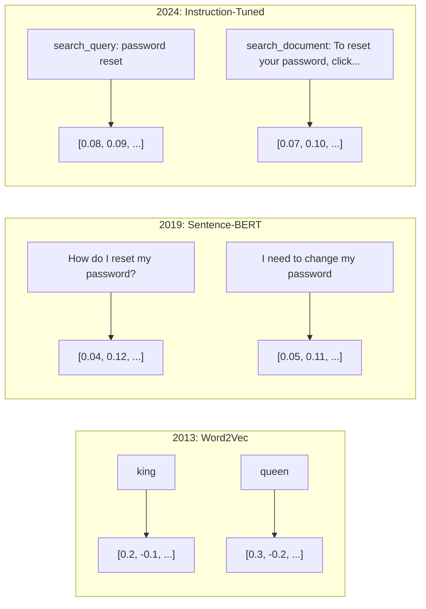
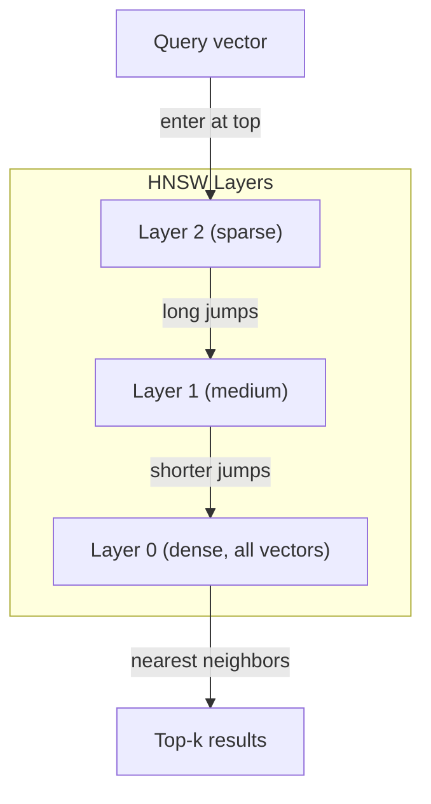
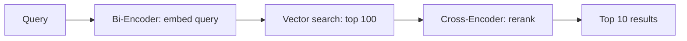

# Embeddings & Vector Representations

> Text is discrete. Math is continuous. Every time you ask an LLM to find "similar" documents, compare meanings, or search beyond keywords, you're relying on a bridge between these two worlds. That bridge is an embedding. If you don't understand embeddings, you don't understand modern AI. You just use it.

**Type:** Build
**Languages:** TypeScript
**Prerequisites:** Phase 11, Lesson 01 (Prompt Engineering)
**Time:** ~75 minutes
**Related:** Phase 5 · 22 (Embedding Models Deep Dive) covers dense vs sparse vs multi-vector, Matryoshka truncation, and per-axis model selection. This lesson focuses on the production pipeline (vector DBs, HNSW, similarity math). Read Phase 5 · 22 before picking a model.

## Learning Objectives

- Generate text embeddings using API providers and open-source models, and compute cosine similarity between them
- Explain why embeddings solve the vocabulary mismatch problem that keyword search cannot handle
- Build a semantic search index that retrieves documents by meaning rather than exact keyword match
- Evaluate embedding quality using retrieval benchmarks (precision@k, recall) and choose the right embedding model for your task

## The Problem

You have 10,000 support tickets. A customer writes "my payment didn't go through." You need to find similar past tickets. Keyword search finds tickets containing "payment" and "didn't go through." It misses "transaction failed," "charge was declined," and "billing error." These tickets describe the exact same problem with completely different words.

This is the vocabulary mismatch problem. Human language has dozens of ways to say the same thing. Keyword search treats each word as an independent symbol with no meaning. It cannot know that "declined" and "didn't go through" refer to the same concept.

You need a representation of text where meaning, not spelling, determines similarity. You need a way to place "my payment didn't go through" and "transaction was declined" close together in some mathematical space, while pushing "my payment arrived on time" far away despite sharing the word "payment."

That representation is an embedding.

## The Concept

### What Is an Embedding?

An embedding is a dense vector of floating-point numbers that represents the meaning of text. The word "dense" matters -- every dimension carries information, unlike sparse representations (bag-of-words, TF-IDF) where most dimensions are zero.

"The cat sat on the mat" becomes something like `[0.023, -0.041, 0.087, ..., 0.012]` -- a list of 768 to 3072 numbers depending on the model. These numbers encode meaning. You never inspect them directly. You compare them.

### The Word2Vec Breakthrough

In 2013, Tomas Mikolov and colleagues at Google published Word2Vec. The core insight: train a neural network to predict a word from its neighbors (or neighbors from a word), and the hidden layer weights become meaningful vector representations.

The famous result:

```
king - man + woman = queen
```

Vector arithmetic on word embeddings captures semantic relationships. The direction from "man" to "woman" is roughly the same as the direction from "king" to "queen." This was the moment the field realized that geometry could encode meaning.

Word2Vec produced 300-dimensional vectors. Each word got one vector regardless of context. "Bank" in "river bank" and "bank account" had the same embedding. This limitation drove the next decade of research.

### From Words to Sentences

Word embeddings represent single tokens. Production systems need to embed entire sentences, paragraphs, or documents. Four approaches emerged:

**Averaging**: take the mean of all word vectors in the sentence. Cheap, lossy, surprisingly decent for short text. Loses word order entirely -- "dog bites man" and "man bites dog" get identical embeddings.

**CLS token**: transformer models (BERT, 2018) output a special [CLS] token embedding that represents the entire input. Better than averaging but the [CLS] token was trained for next-sentence prediction, not similarity.

**Contrastive learning**: train the model explicitly to push similar pairs together and dissimilar pairs apart. Sentence-BERT (Reimers & Gurevych, 2019) used this approach and became the foundation for modern embedding models. Given "How do I reset my password?" and "I need to change my password," the model learns these should have nearly identical vectors.

**Instruction-tuned embeddings**: the latest approach. Models like E5 and GTE accept a task prefix ("search_query:", "search_document:") that tells the model what kind of embedding to produce. This lets one model serve multiple tasks.



### Modern Embedding Models

The market has settled into a handful of production-grade options (MTEB scores as of early 2026, MTEB v2):

| Model | Provider | Dimensions | MTEB | Context | Cost / 1M tokens |
|-------|----------|-----------|------|---------|------------------|
| Gemini Embedding 2 | Google | 3072 (Matryoshka) | 67.7 (retrieval) | 8192 | $0.15 |
| embed-v4 | Cohere | 1024 (Matryoshka) | 65.2 | 128K | $0.12 |
| voyage-4 | Voyage AI | 1024/2048 (Matryoshka) | 66.8 | 32K | $0.12 |
| text-embedding-3-large | OpenAI | 3072 (Matryoshka) | 64.6 | 8192 | $0.13 |
| text-embedding-3-small | OpenAI | 1536 (Matryoshka) | 62.3 | 8192 | $0.02 |
| BGE-M3 | BAAI | 1024 (dense+sparse+ColBERT) | 63.0 multilingual | 8192 | Open-weight |
| Qwen3-Embedding | Alibaba | 4096 (Matryoshka) | 66.9 | 32K | Open-weight |
| Nomic-embed-v2 | Nomic | 768 (Matryoshka) | 63.1 | 8192 | Open-weight |

MTEB (Massive Text Embedding Benchmark) v2 covers 100+ tasks across retrieval, classification, clustering, reranking, and summarization. Higher is better. By 2026, open-weight models (Qwen3-Embedding, BGE-M3) match or beat closed hosted models on most axes. Gemini Embedding 2 leads pure retrieval; Voyage/Cohere lead specific domains (finance, law, code). Always benchmark on your own queries before committing.

### Similarity Metrics

Given two embedding vectors, three ways to measure how similar they are:

**Cosine similarity**: the cosine of the angle between two vectors. Ranges from -1 (opposite) to 1 (identical direction). Ignores magnitude -- a 10-word sentence and a 500-word document can score 1.0 if they point the same direction. This is the default for 90% of use cases.

```
cosine_sim(a, b) = dot(a, b) / (||a|| * ||b||)
```

**Dot product**: the raw inner product of two vectors. Identical to cosine similarity when vectors are normalized (unit length). Faster to compute. OpenAI's embeddings are normalized, so dot product and cosine give the same ranking.

```
dot(a, b) = sum(a_i * b_i)
```

**Euclidean (L2) distance**: straight-line distance in the vector space. Smaller = more similar. Sensitive to magnitude differences. Use when the absolute position in space matters, not just the direction.

```
L2(a, b) = sqrt(sum((a_i - b_i)^2))
```

When to use which:

| Metric | Use when | Avoid when |
|--------|----------|------------|
| Cosine similarity | Comparing texts of different lengths; most retrieval tasks | Magnitude carries information |
| Dot product | Embeddings are already normalized; maximum speed | Vectors have varying magnitudes |
| Euclidean distance | Clustering; spatial nearest-neighbor problems | Comparing documents of wildly different lengths |

### Vector Databases and HNSW

A brute-force similarity search compares the query against every stored vector. At 1 million vectors with 1536 dimensions, that is 1.5 billion multiply-add operations per query. Too slow.

Vector databases solve this with Approximate Nearest Neighbor (ANN) algorithms. The dominant algorithm is HNSW (Hierarchical Navigable Small World):

1. Build a multi-layer graph of vectors
2. Top layers are sparse -- long-range connections between distant clusters
3. Bottom layers are dense -- fine-grained connections between nearby vectors
4. Search starts at the top layer, greedily descending to refine
5. Returns approximate top-k results in O(log n) time instead of O(n)

HNSW trades a small accuracy loss (typically 95-99% recall) for massive speed gains. At 10 million vectors, brute force takes seconds. HNSW takes milliseconds.

> **Kernbotschaft:** Brute-force search doesn't scale past roughly a million vectors. Every production vector database is some variant of this same trade -- a small, tunable accuracy loss bought with a graph or index structure, in exchange for O(log n) instead of O(n) search time.



Production options:

| Database | Type | Best for | Max scale |
|----------|------|----------|-----------|
| Pinecone | Managed SaaS | Zero-ops production | Billions |
| Weaviate | Open source | Self-hosted, hybrid search | 100M+ |
| Qdrant | Open source | High performance, filtering | 100M+ |
| ChromaDB | Embedded | Prototyping, local dev | 1M |
| pgvector | Postgres extension | Already using Postgres | 10M |
| FAISS | Library | In-process, research | 1B+ |

### Chunking Strategies

Documents are too long to embed as single vectors. A 50-page PDF covers dozens of topics -- its embedding becomes an average of everything, similar to nothing specific. You split documents into chunks and embed each one.

**Fixed-size chunking**: split every N tokens with M-token overlap. Simple and predictable. Works well when documents have no clear structure. A 512-token chunk with 50-token overlap: chunk 1 is tokens 0-511, chunk 2 is tokens 462-973.

**Sentence-based chunking**: split at sentence boundaries, grouping sentences until reaching the token limit. Each chunk is at least one complete sentence. Better than fixed-size because you never cut a thought in half.

**Recursive chunking**: try splitting at the largest boundary first (section headers). If still too large, try paragraph boundaries. Then sentence boundaries. Then character limits. This is LangChain's `RecursiveCharacterTextSplitter` and it works well for mixed-format corpora.

**Semantic chunking**: embed each sentence, then group consecutive sentences whose embeddings are similar. When the embedding similarity drops below a threshold, start a new chunk. Expensive (requires embedding every sentence individually) but produces the most coherent chunks.

| Strategy | Complexity | Quality | Best for |
|----------|-----------|---------|----------|
| Fixed-size | Low | Decent | Unstructured text, logs |
| Sentence-based | Low | Good | Articles, emails |
| Recursive | Medium | Good | Markdown, HTML, mixed docs |
| Semantic | High | Best | Critical retrieval quality |

The sweet spot for most systems: 256-512 token chunks with 50-token overlap.

### Bi-Encoders vs Cross-Encoders

A bi-encoder embeds the query and documents independently, then compares vectors. Fast -- you embed the query once and compare against pre-computed document embeddings. This is what you use for retrieval.

A cross-encoder takes the query and a document as a single input and outputs a relevance score. Slow -- it processes each query-document pair through the full model. But far more accurate because it can attend across query and document tokens simultaneously.

The production pattern: bi-encoder retrieves top-100 candidates, cross-encoder reranks them to top-10. This is the retrieve-then-rerank pipeline.

> **Kernbotschaft:** Don't pick one. Bi-encoders are cheap and find candidates fast; cross-encoders are expensive but rank accurately. Production retrieval runs both -- bi-encoder first, cross-encoder rerank on the shortlist.



Reranking models: Cohere Rerank 3.5 ($2 per 1000 queries), BGE-reranker-v2 (free, open source), Jina Reranker v2 (free, open source).

### Matryoshka Embeddings

Traditional embeddings are all-or-nothing. A 1536-dimensional vector uses 1536 floats. You cannot truncate to 256 dimensions without retraining.

Matryoshka Representation Learning (Kusupati et al., 2022) fixes this. The model is trained so that the first N dimensions capture the most important information, like a Russian nesting doll. Truncating a 1536-d Matryoshka embedding to 256 dimensions loses some accuracy but remains functional.

This is not a property of embeddings in general -- it is a property the training loss has to earn. A normally-trained embedding spreads meaning across all dimensions roughly evenly, so truncating it to the first 256 dimensions throws away information at random, no better than truncating any other 256 dimensions. Matryoshka training changes the loss function: instead of computing one loss on the full vector, it computes the same loss on several nested prefixes (say, the first 64, 128, 256, 512, and full 1536 dimensions) and sums them. Every nested term shares the earliest dimensions, so the only way to score well on all of them at once is to pack the most broadly useful signal into those early dimensions. Truncation only "just works" after a model has been trained this way -- it is the reward for the nested loss, not a free property of vectors.

> **Kernbotschaft:** Truncation is not the trick -- the nested multi-length training loss is. Truncating a model that was never trained with a Matryoshka loss (plain TF-IDF, a standard Sentence-BERT checkpoint) degrades far worse than truncating one that was.

OpenAI's text-embedding-3-small and text-embedding-3-large support Matryoshka truncation via the `dimensions` parameter. Requesting 256 dimensions instead of 1536 cuts storage by 6x with roughly 3-5% accuracy loss on MTEB benchmarks.

### Binary Quantization

A 1536-dimensional embedding stored as float32 uses 6,144 bytes. Multiply by 10 million documents: 61 GB just for vectors.

Binary quantization converts each float to a single bit: positive values become 1, negative values become 0. Storage drops from 6,144 bytes to 192 bytes -- a 32x reduction. Similarity is computed using Hamming distance (count differing bits), which CPUs can do in a single instruction.

The accuracy hit is around 5-10% on retrieval recall. The common pattern: binary quantization for the first-pass search over millions of vectors, then rescore the top-1000 with full-precision vectors. This gets you 95%+ of full-precision accuracy at 32x less memory.

> **Kernbotschaft:** Binary quantization alone costs 5-10% recall for 32x less memory. Pairing it with a full-precision rescore on the shortlist recovers most of that loss -- you get almost all the storage win with almost none of the accuracy cost.


## Further Reading

- Mikolov et al., "Efficient Estimation of Word Representations in Vector Space" (2013) -- the Word2Vec paper that started the embedding revolution with the king-queen analogy
- Reimers & Gurevych, "Sentence-BERT: Sentence Embeddings using Siamese BERT-Networks" (2019) -- how to train bi-encoders for sentence-level similarity, foundation of modern embedding models
- Kusupati et al., "Matryoshka Representation Learning" (2022) -- the technique behind variable-dimension embeddings that OpenAI adopted for text-embedding-3
- Malkov & Yashunin, "Efficient and Robust Approximate Nearest Neighbor using Hierarchical Navigable Small World Graphs" (2018) -- the HNSW paper, the algorithm behind most production vector search
- OpenAI Embeddings Guide (platform.openai.com/docs/guides/embeddings) -- practical reference for text-embedding-3 models including Matryoshka dimension reduction
- MTEB Leaderboard (huggingface.co/spaces/mteb/leaderboard) -- live benchmark comparing all embedding models across tasks and languages
- [Muennighoff et al., "MTEB: Massive Text Embedding Benchmark" (EACL 2023)](https://arxiv.org/abs/2210.07316) -- the benchmark defining 8 task categories (classification, clustering, pair classification, reranking, retrieval, STS, summarization, bitext mining) that the leaderboard reports; read before trusting any single MTEB score.
- [Sentence Transformers documentation](https://www.sbert.net/) -- canonical reference for bi-encoder vs cross-encoder, pooling strategies, and the ingest-split-embed-store RAG pipeline this lesson implements.

## Exercises

1. **Establish a baseline.** Run the lesson demo, then capture the inputs, outputs, and one invariant that demonstrates this objective: Generate text embeddings using API providers and open-source models, and compute cosine similarity between them.
2. **Change one variable.** Modify a single input or parameter and use the resulting evidence to investigate this objective: Explain why embeddings solve the vocabulary mismatch problem that keyword search cannot handle.
3. **Probe an edge case.** Predict the result before running it, compare prediction with observation, and explain the discrepancy while applying this objective: Build a semantic search index that retrieves documents by meaning rather than exact keyword match.

## Reference Solution

Use the canonical [main.ts](../code/main.ts) as the executable baseline. A complete solution records a successful run, identifies the invariant tied to “Generate text embeddings using API providers and open-source models, and compute cosine similarity between them,” and changes only one variable for the comparison. The edge-case result must distinguish the prediction from the observation, explain the cause using “Build a semantic search index that retrieves documents by meaning rather than exact keyword match,” and cite a repeatable check rather than relying on visual inspection alone.
