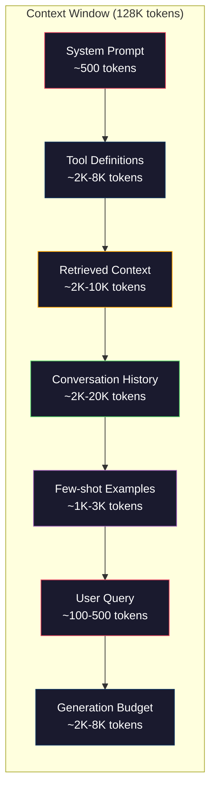
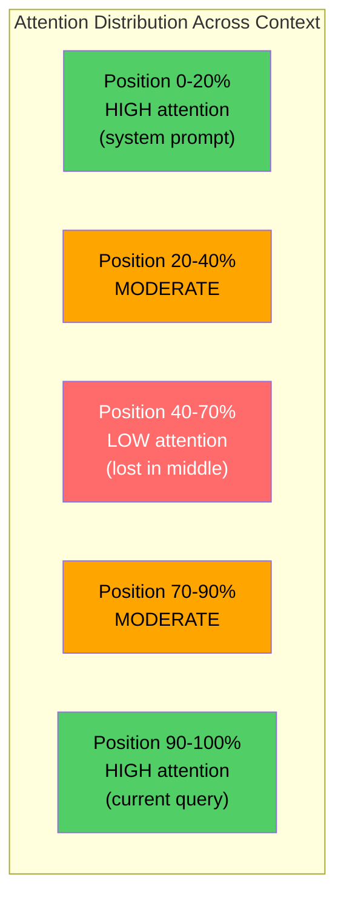
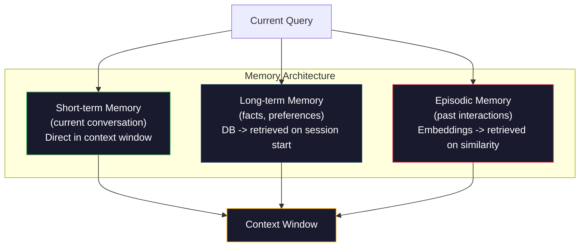

# Context Engineering: Windows, Budgets, Memory, and Retrieval

> Context engineering is what happens when prompt engineering grows up. The context window is everything that goes into the model: system instructions, retrieved documents, tool definitions, conversation history, few-shot examples, and the prompt itself. The job of a context engineer is to decide what goes in, what stays out, and in what order.

**Type:** Build
**Languages:** Python
**Prerequisites:** Phase 10 (LLMs from Scratch), Phase 11 Lesson 01-02
**Time:** ~90 minutes
**Related:** Phase 11 · 15 (Prompt Caching) — the cache-friendly layout is an extension of context engineering. Phase 5 · 28 (Long-Context Evaluation) for how to measure lost-in-the-middle with NIAH/RULER.

## Learning Objectives

- Calculate token budgets across all context window components (system prompt, tools, history, retrieved docs, generation headroom)
- Implement context window management strategies: truncation, summarization, and sliding window for conversation history
- Prioritize and order context components to maximize the model's attention on the most relevant information
- Build a context assembler that dynamically allocates tokens based on query type and available window space

## The Problem

Claude Opus 4.7 has a 200K token window (1M in beta). GPT-5 has 400K. Gemini 3 Pro has 2M. Llama 4 claims 10M. These numbers sound enormous until you fill them.

Here is a real breakdown for a coding assistant. System prompt: 500 tokens. Tool definitions for 50 tools: 8,000 tokens. Retrieved documentation: 4,000 tokens. Conversation history (10 turns): 6,000 tokens. Current user query: 200 tokens. Generation budget (max output): 4,000 tokens. Total: 22,700 tokens. That is only 18% of a 128K window.

But attention does not scale linearly with context length. A model with 128K tokens of context pays quadratic attention cost (O(n^2) in vanilla transformers, though most production models use efficient attention variants). More importantly, retrieval accuracy degrades. The "Needle in a Haystack" test shows that models struggle to find information placed in the middle of long contexts. Research by Liu et al. (2023) showed that LLMs retrieve information at the start and end of long contexts with near-perfect accuracy, but accuracy drops 10-20% for information placed in the middle (positions 40-70% of the context). This "lost-in-the-middle" effect varies by model but affects all current architectures.

The practical lesson: having 200K tokens available does not mean using 200K tokens is effective. A carefully curated 10K token context often outperforms a dumped 100K token context. Context engineering is the discipline of maximizing signal-to-noise ratio within the context window.

Every token you put in the window displaces a token that could carry more relevant information. Every irrelevant tool definition, every stale conversation turn, every chunk of retrieved text that does not answer the question -- each one makes the model slightly worse at the task.

## The Concept

### The Context Window is a Scarce Resource

Think of the context window as RAM, not disk. It is fast and directly accessible, but limited. You cannot fit everything. You must choose.

Each component competes for space. Adding more tool definitions means less room for conversation history. Adding more retrieved context means less room for few-shot examples. Context engineering is the art of allocating this budget to maximize task performance.

### Lost-in-the-Middle

The most important empirical finding in context engineering. Models attend better to information at the beginning and end of the context. Information in the middle gets lower attention scores and is more likely to be ignored.

Liu et al. (2023) tested this systematically. They placed a relevant document among 20 irrelevant documents at various positions and measured answer accuracy. When the relevant document was first or last, accuracy was 85-90%. When it was in the middle (position 10 of 20), accuracy dropped to 60-70%.

This has direct engineering implications:

- Put the most important information first (system prompt, critical instructions)
- Put the current query and most relevant context last (recency bias helps)
- Treat the middle of the context as the lowest-priority zone
- If you must include information in the middle, duplicate the key point at the end

### Context Components

**System prompt**: sets the persona, constraints, and behavioral rules. This goes first and stays constant across turns. Claude Code uses roughly 6,000 tokens for its system prompt including tool definitions and behavioral instructions. Keep it tight. Every word in the system prompt is repeated on every API call.

**Tool definitions**: each tool adds 50-200 tokens (name, description, parameter schema). 50 tools at 150 tokens each is 7,500 tokens before any conversation happens. Dynamic tool selection -- only including tools relevant to the current query -- can reduce this by 60-80%.

**Retrieved context**: documents from a vector database, search results, file contents. The quality of retrieval directly determines the quality of the response. Bad retrieval is worse than no retrieval -- it fills the window with noise and actively misleads the model.

**Conversation history**: every previous user message and assistant response. Grows linearly with conversation length. A 50-turn conversation at 200 tokens per turn is 10,000 tokens of history. Most of it is irrelevant to the current query.

**Few-shot examples**: input/output pairs that demonstrate the desired behavior. Two to three well-chosen examples often improve output quality more than thousands of tokens of instructions. But they cost space.

**Generation budget**: the tokens reserved for the model's response. If you fill the window to capacity, the model has no room to answer. Reserve at least 2,000-4,000 tokens for generation.

### Context Compression Strategies

**History summarization**: instead of keeping all previous turns verbatim, periodically summarize the conversation. "We discussed X, decided Y, and the user wants Z" in 100 tokens replaces 10 turns that took 2,000 tokens. Run summarization when history exceeds a threshold (e.g., 5,000 tokens).

**Relevance filtering**: score each retrieved document against the current query and drop documents below a threshold. If you retrieved 10 chunks but only 3 are relevant, discard the other 7. Better to have 3 highly relevant chunks than 10 mediocre ones.

**Tool pruning**: classify the user's query intent and only include tools relevant to that intent. A code question does not need calendar tools. A scheduling question does not need file system tools. This can reduce tool definitions from 8,000 tokens to 1,000.

**Recursive summarization**: for very long documents, summarize in stages. First summarize each section, then summarize the summaries. A 50-page document becomes a 500-token digest that captures the key points.

### Memory Systems

Context engineering spans three time horizons.

**Short-term memory**: the current conversation. Stored in the context window directly. Grows with each turn. Managed by summarization and truncation.

**Long-term memory**: facts and preferences that persist across conversations. "The user prefers TypeScript." "The project uses PostgreSQL." Stored in a database, retrieved on session start. Claude Code stores this in CLAUDE.md files. ChatGPT stores it in its memory feature.

**Episodic memory**: specific past interactions that might be relevant. "Last Tuesday, we debugged a similar issue in the auth module." Stored as embeddings, retrieved when the current conversation matches a past episode.

### Dynamic Context Assembly

The key insight: different queries need different context. A static system prompt + static tools + static history is wasteful. The best systems dynamically assemble context per query.

1. Classify the query intent
2. Select relevant tools (not all tools)
3. Retrieve relevant documents (not a fixed set)
4. Include relevant history turns (not all history)
5. Add few-shot examples that match the task type
6. Order everything by importance: critical first, important last, optional in the middle

This is what separates a good AI application from a great one. The model is the same. The context is the differentiator.

## Further Reading

- [Liu et al., 2023 -- "Lost in the Middle: How Language Models Use Long Contexts"](https://arxiv.org/abs/2307.03172) -- the definitive study on position-dependent attention.
- [Anthropic's Contextual Retrieval blog post](https://www.anthropic.com/news/contextual-retrieval) -- how Anthropic approaches context-aware chunk retrieval.
- [Simon Willison's "Context Engineering"](https://simonwillison.net/2025/Jun/27/context-engineering/) -- the blog post that named the discipline.
