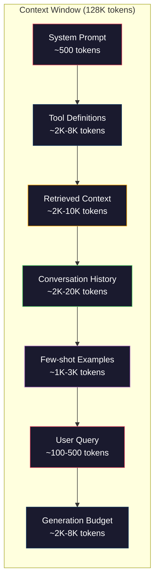
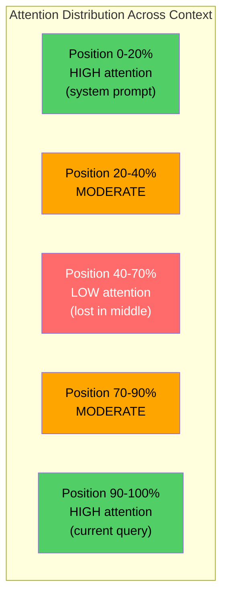
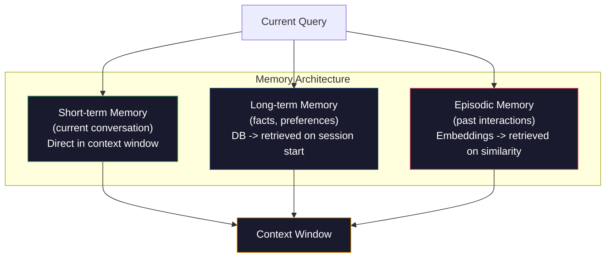

# Context Engineering: Windows, Budgets, Memory, and Retrieval

> Context engineering is what happens when prompt engineering grows up. The context window is everything that goes into the model: system instructions, retrieved documents, tool definitions, conversation history, few-shot examples, and the prompt itself. The job of a context engineer is to decide what goes in, what stays out, and in what order.

**Type:** Build
**Languages:** Python, TypeScript
**Prerequisites:** Phase 10 (LLMs from Scratch), Phase 11 Lesson 01-02
**Time:** ~90 minutes
**Related:** Phase 11 · 15 (Prompt Caching) — the cache-friendly layout is an extension of context engineering. Phase 5 · 28 (Long-Context Evaluation) for how to measure lost-in-the-middle with NIAH/RULER.

## Learning Objectives

- Calculate token budgets across all context window components (system prompt, tools, history, retrieved docs, generation headroom)
- Implement context window management strategies: truncation, summarization, and sliding window for conversation history
- Prioritize and order context components to maximize the model's attention on the most relevant information
- Build a context assembler that dynamically allocates tokens based on query type and available window space

## The Problem

Claude Opus 4.7 has a 200K token window (1M in beta). GPT-5 has 400K. Gemini 3 Pro has 2M. Llama 4 claims 10M. These numbers sound enormous until you fill them.

Here is a real breakdown for a coding assistant. System prompt: 500 tokens. Tool definitions for 50 tools: 8,000 tokens. Retrieved documentation: 4,000 tokens. Conversation history (10 turns): 6,000 tokens. Current user query: 200 tokens. Generation budget (max output): 4,000 tokens. Total: 22,700 tokens. That is only 18% of a 128K window.

But attention does not scale linearly with context length. A model with 128K tokens of context pays quadratic attention cost (O(n^2) in vanilla transformers, though most production models use efficient attention variants). More importantly, retrieval accuracy degrades. The "Needle in a Haystack" test shows that models struggle to find information placed in the middle of long contexts. [Liu et al. (2023), *Lost in the Middle*](https://arxiv.org/abs/2307.03172), measured substantially worse retrieval for information in the middle of long contexts than at the beginning or end. The size of the effect depends on the model and task, so measure it on your own corpus rather than assuming a universal percentage.

The practical lesson: having 200K tokens available does not mean using 200K tokens is effective. A carefully curated 10K token context often outperforms a dumped 100K token context. Context engineering is the discipline of maximizing signal-to-noise ratio within the context window.

Every token you put in the window displaces a token that could carry more relevant information. Every irrelevant tool definition, every stale conversation turn, every chunk of retrieved text that does not answer the question -- each one makes the model slightly worse at the task.

## The Concept

### The Context Window is a Scarce Resource

Think of the context window as RAM, not disk. It is fast and directly accessible, but limited. You cannot fit everything. You must choose.



Each component competes for space. Adding more tool definitions means less room for conversation history. Adding more retrieved context means less room for few-shot examples. Context engineering is the art of allocating this budget to maximize task performance.

Every call below reuses this `lrn_llm` setup — run it once:

```python editable
import sys, json, types
lrn_llm = types.ModuleType("lrn_llm")
try:
    from pyodide.http import pyfetch as _pyfetch
    _IN_PYODIDE = True
except ImportError:
    import urllib.request as _urlreq
    _IN_PYODIDE = False
lrn_llm.API_BASE = "/api/llm"  # same-origin proxy; server injects the gateway key
lrn_llm.DEFAULT_MODEL = "azure/gpt-5.4-mini"
lrn_llm.API_KEY = ""  # optional; set in Step 0a

async def _lrn_call(messages, *, system=None, max_tokens=400, model=None):
    if system is not None:
        messages = [{"role": "system", "content": system}] + list(messages)
    payload = {"model": model or lrn_llm.DEFAULT_MODEL, "messages": messages,
               "max_completion_tokens": max_tokens}
    headers = {"content-type": "application/json"}
    _key = lrn_llm.API_KEY
    if _key:
        headers["Authorization"] = "Bearer " + _key
    url = lrn_llm.API_BASE.rstrip("/") + "/chat/completions"
    body = json.dumps(payload)
    if _IN_PYODIDE:
        r = await _pyfetch(url, method="POST", headers=headers, body=body)
        data = await r.json()
    else:
        req = _urlreq.Request(url, method="POST", headers=headers, data=body.encode("utf-8"))
        with _urlreq.urlopen(req, timeout=60) as r:
            data = json.loads(r.read())
    if "error" in data:
        raise RuntimeError("LLM error: " + str(data["error"]))
    return data

def _lrn_text(r):
    ch = (r or {}).get("choices") or []
    return (ch[0].get("message", {}) or {}).get("content", "") if ch else ""

async def _lrn_ping():
    r = await _lrn_call([{"role": "user", "content": "Reply with exactly: OK"}], max_tokens=5)
    return {"ok": _lrn_text(r).strip().upper().startswith("OK"), "model": r.get("model")}

lrn_llm.call = _lrn_call
lrn_llm.text = _lrn_text
lrn_llm.ping = _lrn_ping
print("✅ notebook ready · endpoint:", lrn_llm.API_BASE)
```

Context engineering starts with measurement. A token counter and budget manager tracks how many tokens each component consumes, and truncates content that would blow the budget:

```python editable
def count_tokens(text):
    """Estimate tokens using word count × 1.3 (approximation)."""
    if not text:
        return 0
    return int(len(text.split()) * 1.3)

class ContextBudget:
    def __init__(self, max_tokens=128000, generation_reserve=4000):
        self.max_tokens = max_tokens
        self.generation_reserve = generation_reserve
        self.available = max_tokens - generation_reserve
        self.allocations = {}
    
    def allocate(self, component, content, max_tokens=None):
        tokens = count_tokens(content)
        if max_tokens and tokens > max_tokens:
            words = content.split()
            target_words = int(max_tokens / 1.3)
            content = " ".join(words[:target_words])
            tokens = count_tokens(content)
        
        used = sum(self.allocations.values())
        if used + tokens > self.available:
            allowed = self.available - used
            if allowed <= 0:
                return None, 0
            words = content.split()
            target_words = int(allowed / 1.3)
            content = " ".join(words[:target_words])
            tokens = count_tokens(content)
        
        self.allocations[component] = tokens
        return content, tokens
    
    def report(self):
        total_used = sum(self.allocations.values())
        lines = [f"\n📊 Context Budget Report ({self.max_tokens:,} token window)"]
        lines.append("-" * 55)
        for component, tokens in self.allocations.items():
            pct = tokens / self.max_tokens * 100
            bar = "█" * int(pct / 2) if pct >= 0.5 else ""
            lines.append(f"  {component:<25} {tokens:>6} tokens ({pct:>5.1f}%) {bar}")
        lines.append("-" * 55)
        lines.append(f"  {'Used':<25} {total_used:>6} tokens ({total_used/self.max_tokens*100:.1f}%)")
        lines.append(f"  {'Generation reserve':<25} {self.generation_reserve:>6} tokens")
        lines.append(f"  {'Remaining':<25} {self.available - total_used:>6} tokens")
        return "\n".join(lines)

# Test: allocate components
budget = ContextBudget(max_tokens=128000)
budget.allocate("system_prompt", "You are a coding assistant with access to tools." * 20, max_tokens=1000)
budget.allocate("tools", json.dumps(["read_file", "write_file", "search_code", "run_command"]), max_tokens=500)
budget.allocate("user_query", "Fix the JWT authentication bug", max_tokens=200)
print(budget.report())
```

### Lost-in-the-Middle

The most important empirical finding in context engineering. Models attend better to information at the beginning and end of the context. Information in the middle gets lower attention scores and is more likely to be ignored.

Liu et al. (2023) tested this systematically. They placed a relevant document among 20 irrelevant documents at various positions and measured answer accuracy. When the relevant document was first or last, accuracy was 85-90%. When it was in the middle (position 10 of 20), accuracy dropped to 60-70%.

This has direct engineering implications:

- Put the most important information first (system prompt, critical instructions)
- Put the current query and most relevant context last (recency bias helps)
- Treat the middle of the context as the lowest-priority zone
- If you must include information in the middle, duplicate the key point at the end



Score documents by relevance, then reorder so the highest-relevance ones land at the start and end and the lowest-relevance ones get buried in the middle:

```python editable
def reorder_lost_in_middle(items, scores):
    """Reorder items: high scores at start+end, low scores in middle."""
    paired = sorted(zip(scores, items), reverse=True)
    sorted_items = [item for _, item in paired]
    
    if len(sorted_items) <= 2:
        return sorted_items
    
    first_half = sorted_items[::2]
    second_half = sorted_items[1::2]
    second_half.reverse()
    
    return first_half + second_half

def score_relevance(query, documents):
    """Score documents by word overlap with query."""
    query_words = set(query.lower().split())
    scores = []
    for doc in documents:
        doc_words = set(doc.lower().split())
        if not query_words:
            scores.append(0.0)
            continue
        overlap = len(query_words & doc_words) / len(query_words)
        scores.append(round(overlap, 3))
    return scores

# Test: reorder documents
docs = [
    "PostgreSQL connection pooling for high throughput",
    "Redis caching layer architecture",
    "JWT token validation and expiry",
    "Database migration scripts",
    "Frontend CSS styling guide"
]
query = "JWT authentication token expiry"
scores = score_relevance(query, docs)

print("Original order (by insertion):")
for doc, score in zip(docs, scores):
    print(f"  {score:.2f}  {doc}")

reordered = reorder_lost_in_middle(docs, scores)
print("\nReordered (high relevance at start+end, low in middle):")
for i, doc in enumerate(reordered):
    position = "[START]" if i < 1 else "[END]" if i >= len(reordered) - 1 else "[MIDDLE]"
    print(f"  {position}  {doc}")
```

### Context Components

**System prompt**: sets the persona, constraints, and behavioral rules. This goes first and stays constant across turns. Claude Code uses roughly 6,000 tokens for its system prompt including tool definitions and behavioral instructions. Keep it tight. Every word in the system prompt is repeated on every API call.

**Tool definitions**: each tool adds 50-200 tokens (name, description, parameter schema). 50 tools at 150 tokens each is 7,500 tokens before any conversation happens. Dynamic tool selection -- only including tools relevant to the current query -- can reduce this by 60-80%.

Classify the query's intent, then include only the tools that match it:

```python editable
TOOL_REGISTRY = {
    "read_file": {"description": "Read file contents", "tokens": 120, "categories": ["code", "files"]},
    "write_file": {"description": "Write to file", "tokens": 150, "categories": ["code", "files"]},
    "search_code": {"description": "Search codebase", "tokens": 130, "categories": ["code"]},
    "run_command": {"description": "Run shell command", "tokens": 140, "categories": ["code", "system"]},
    "query_database": {"description": "Run SQL query", "tokens": 170, "categories": ["data"]},
    "send_email": {"description": "Send email", "tokens": 200, "categories": ["email"]},
    "web_search": {"description": "Search the web", "tokens": 140, "categories": ["research"]},
}

def classify_intent(query):
    """Classify query intent from keywords."""
    query_lower = query.lower()
    intent_keywords = {
        "code": ["code", "bug", "fix", "error", "function", "file"],
        "data": ["database", "query", "sql", "chart", "data"],
        "email": ["email", "send", "message"],
        "research": ["search", "find", "what is", "how"],
    }
    scores = {}
    for intent, keywords in intent_keywords.items():
        score = sum(1 for kw in keywords if kw in query_lower)
        if score > 0:
            scores[intent] = score
    return list(scores.keys()) if scores else ["code"]

def select_tools(query, token_budget=2000):
    """Select tools relevant to query intent, respecting token budget."""
    intents = classify_intent(query)
    relevant = {}
    total_tokens = 0
    for name, tool in TOOL_REGISTRY.items():
        if any(cat in intents for cat in tool["categories"]):
            if total_tokens + tool["tokens"] <= token_budget:
                relevant[name] = tool
                total_tokens += tool["tokens"]
    return relevant, total_tokens

# Test: tool selection for different queries
queries = [
    "Fix the JWT authentication bug in auth.py",
    "Show me database query performance stats",
    "Find best practices for Python error handling",
]

for q in queries:
    tools, tokens = select_tools(q)
    intents = classify_intent(q)
    print(f"Query: {q}")
    print(f"  Intents: {intents}")
    print(f"  Selected tools: {list(tools.keys())} ({tokens} tokens)")
    print()
```

**Retrieved context**: documents from a vector database, search results, file contents. The quality of retrieval directly determines the quality of the response. Bad retrieval is worse than no retrieval -- it fills the window with noise and actively misleads the model.

**Conversation history**: every previous user message and assistant response. Grows linearly with conversation length. A 50-turn conversation at 200 tokens per turn is 10,000 tokens of history. Most of it is irrelevant to the current query.

**Few-shot examples**: input/output pairs that demonstrate the desired behavior. Two to three well-chosen examples often improve output quality more than thousands of tokens of instructions. But they cost space.

**Generation budget**: the tokens reserved for the model's response. If you fill the window to capacity, the model has no room to answer. Reserve at least 2,000-4,000 tokens for generation.

### Context Compression Strategies

**History summarization**: instead of keeping all previous turns verbatim, periodically summarize the conversation. "We discussed X, decided Y, and the user wants Z" in 100 tokens replaces 10 turns that took 2,000 tokens. Run summarization when history exceeds a threshold (e.g., 5,000 tokens).

A conversation manager that compresses old turns into summaries once history crosses a token threshold:

```python editable
class ConversationManager:
    def __init__(self, max_history_tokens=5000):
        self.turns = []
        self.summaries = []
        self.max_history_tokens = max_history_tokens
    
    def add_turn(self, role, content):
        self.turns.append({"role": role, "content": content})
        self._compress_if_needed()
    
    def _compress_if_needed(self):
        total = sum(count_tokens(t["content"]) for t in self.turns)
        if total <= self.max_history_tokens:
            return
        
        while total > self.max_history_tokens and len(self.turns) > 4:
            old_turns = self.turns[:2]
            summary = "Previous: " + " | ".join([f"{t['role']}: {t['content'][:50]}..." for t in old_turns])
            self.summaries.append(summary)
            self.turns = self.turns[2:]
            total = sum(count_tokens(t["content"]) for t in self.turns)
    
    def get_context(self):
        parts = []
        if self.summaries:
            parts.append("[Conversation Summary]")
            for s in self.summaries:
                parts.append(s)
        if self.turns:
            parts.append("[Recent Conversation]")
            for t in self.turns:
                parts.append(f"{t['role']}: {t['content']}")
        return "\n".join(parts)
    
    def stats(self):
        tokens = count_tokens(self.get_context())
        return {"live_turns": len(self.turns), "summaries": len(self.summaries), "tokens": tokens}

# Test: build conversation history
conv = ConversationManager(max_history_tokens=300)
exchanges = [
    ("How do I set up the database?", "Run docker-compose up to start PostgreSQL."),
    ("What about environment variables?", "Copy .env.example to .env and set DATABASE_URL."),
    ("How do I run tests?", "Run npm test after setting up the test database."),
    ("Any issues I should know about?", "Make sure PostgreSQL is on port 5432 and migrations pass."),
    ("Can I run it locally?", "Yes, just configure .env properly and run docker-compose up."),
]

for i, (user_msg, assistant_msg) in enumerate(exchanges):
    conv.add_turn("user", user_msg)
    conv.add_turn("assistant", assistant_msg)
    stats = conv.stats()
    print(f"After turn {i+1}: {stats['live_turns']} live, {stats['summaries']} summaries, {stats['tokens']} tokens")

print("\nFinal context:")
for line in conv.get_context().split("\n"):
    print(f"  {line}")
```

**Relevance filtering**: score each retrieved document against the current query and drop documents below a threshold. If you retrieved 10 chunks but only 3 are relevant, discard the other 7. Better to have 3 highly relevant chunks than 10 mediocre ones.

**Tool pruning**: classify the user's query intent and only include tools relevant to that intent. A code question does not need calendar tools. A scheduling question does not need file system tools. This can reduce tool definitions from 8,000 tokens to 1,000.

**Recursive summarization**: for very long documents, summarize in stages. First summarize each section, then summarize the summaries. A 50-page document becomes a 500-token digest that captures the key points.

### Memory Systems

Context engineering spans three time horizons.

**Short-term memory**: the current conversation. Stored in the context window directly. Grows with each turn. Managed by summarization and truncation.

**Long-term memory**: facts and preferences that persist across conversations. "The user prefers TypeScript." "The project uses PostgreSQL." Stored in a database, retrieved on session start. Claude Code stores this in CLAUDE.md files. ChatGPT stores it in its memory feature.

**Episodic memory**: specific past interactions that might be relevant. "Last Tuesday, we debugged a similar issue in the auth module." Stored as embeddings, retrieved when the current conversation matches a past episode.



### Dynamic Context Assembly

The key insight: different queries need different context. A static system prompt + static tools + static history is wasteful. The best systems dynamically assemble context per query.

1. Classify the query intent
2. Select relevant tools (not all tools)
3. Retrieve relevant documents (not a fixed set)
4. Include relevant history turns (not all history)
5. Add few-shot examples that match the task type
6. Order everything by importance: critical first, important last, optional in the middle

This is what separates a good AI application from a great one. The model is the same. The context is the differentiator.

Put all six steps together into one assembler: system prompt, selected tools, reordered relevant documents, conversation history, and the query, each allocated against the shared budget:

```python editable
class ContextEngine:
    def __init__(self, max_tokens=128000):
        self.max_tokens = max_tokens
        self.generation_reserve = 4000
        self.conversation = ConversationManager(max_history_tokens=3000)
        self.system_prompt = (
            "You are a coding assistant for a tech startup. Your codebase uses: "
            "PostgreSQL 16 with pgvector, Next.js 15 frontend, Supabase Auth with JWT tokens. "
            "You have access to tools: read_file, write_file, search_code, run_command, query_database. "
            "Be concise and technical."
        )
        self.knowledge_base = [
            "PostgreSQL 16 with pgvector for vector search on embeddings.",
            "JWT tokens expire after 24 hours and can be refreshed with refresh tokens.",
            "Authentication handled by Supabase Auth with row-level security on tables.",
            "Frontend built with Next.js 15 using App Router and React Server Components.",
            "Database migrations stored in migrations/ folder, run with npm run migrate.",
            "API rate limits: 100 requests/min per user, cached with Redis.",
            "Test coverage must exceed 80%, enforced by CI/CD pipeline.",
            "Error logging uses structured JSON with correlation IDs for tracing.",
        ]
    
    def assemble_context(self, query):
        """Assemble context components for a query."""
        budget = ContextBudget(self.max_tokens, self.generation_reserve)
        context_parts = []
        
        # 1. System prompt
        system_content, _ = budget.allocate("system_prompt", self.system_prompt, max_tokens=1000)
        
        # 2. Select relevant tools
        tools, tool_tokens = select_tools(query, token_budget=2000)
        tool_text = "Tools available: " + ", ".join(list(tools.keys()))
        budget.allocate("tools", tool_text, max_tokens=2000)
        context_parts.append(tool_text)
        
        # 3. Retrieve and reorder relevant documents
        relevance = score_relevance(query, self.knowledge_base)
        relevant_docs = [doc for doc, score in zip(self.knowledge_base, relevance) if score >= 0.1]
        if relevant_docs:
            doc_scores = [s for s, score in zip(relevance, relevance) if score >= 0.1]
            reordered = reorder_lost_in_middle(relevant_docs, doc_scores)
            doc_text = "\n".join(reordered)
            budget.allocate("retrieved_context", doc_text, max_tokens=3000)
            context_parts.append(f"Knowledge base:\n{doc_text}")
        
        # 4. Conversation history
        history_text = self.conversation.get_context()
        if history_text.strip():
            budget.allocate("conversation_history", history_text, max_tokens=5000)
            context_parts.append(history_text)
        
        # 5. User query
        budget.allocate("user_query", query, max_tokens=500)
        context_parts.append(f"Current query: {query}")
        
        return system_content, context_parts, budget

engine = ContextEngine()
query = "Fix the JWT token expiry bug in the authentication module"
system_prompt, context_parts, budget = engine.assemble_context(query)

print("Context assembled for query:")
print(f"  {query}\n")
print(budget.report())
```

Use the assembled context to send a request to the LLM, respecting the token budget:

```python editable
# Prepare the message for the LLM
query = "How should I fix the JWT token expiry bug that's causing auth failures after 24 hours?"
system_prompt, context_parts, budget = engine.assemble_context(query)

# Build the message with assembled context
user_message = "\n".join(context_parts)
messages = [{"role": "user", "content": user_message}]

print(f"Sending to LLM:")
print(f"  System prompt: {len(system_prompt)} chars")
print(f"  User message: {len(user_message)} chars (assembled from {len(context_parts)} context parts)")
print(f"  Budget: {budget.allocations}\n")

# Call the LLM with the assembled context
response = await lrn_llm.call(messages, system=system_prompt, max_tokens=200)
answer = lrn_llm.text(response)

print("LLM Response:")
print("-" * 50)
print(answer)
print("-" * 50)
```

As a conversation grows, the budget shifts: history expands, old turns compress, and available space shrinks. Watch it evolve over a multi-turn exchange:

```python editable
# Multi-turn conversation: watch context budget evolve
conv_engine = ContextEngine(max_tokens=64000)  # Smaller window to see compression

conversation_flow = [
    ("How do I set up JWT authentication?", "Use Supabase Auth with JWT tokens. Configure the .env with SUPABASE_URL and SUPABASE_KEY. Tokens expire after 24 hours."),
    ("How do I handle token refresh?", "Implement a refresh endpoint that exchanges the refresh_token for a new access_token. Store both in localStorage."),
    ("What about security?", "Never expose the service role key on the client. Use row-level security policies. Validate tokens on every API call."),
]

print("Multi-turn conversation context evolution:\n")
for i, (user_q, assistant_a) in enumerate(conversation_flow, 1):
    conv_engine.conversation.add_turn("user", user_q)
    conv_engine.conversation.add_turn("assistant", assistant_a)
    
    next_query = "Now implement all these best practices in the authentication module"
    _, _, budget = conv_engine.assemble_context(next_query)
    
    conv_stats = conv_engine.conversation.stats()
    print(f"After exchange {i}:")
    print(f"  Conversation: {conv_stats['live_turns']} live turns, {conv_stats['summaries']} summaries, {conv_stats['tokens']} tokens")
    print(f"  Budget allocations: {list(budget.allocations.keys())}")
    print(f"  Context utilization: {sum(budget.allocations.values()):,} / {budget.available:,} tokens")
    print()
```

Finally, measure the impact directly: send the same query with everything dumped in versus with context engineering applied:

```python editable
# Query that benefits from context engineering
focused_query = "How do I implement JWT refresh token rotation with Supabase?"

# Scenario 1: Without optimization - dump everything
print("SCENARIO 1: Dump everything (no context engineering)")
print("=" * 55)
all_tools_text = "Tools: " + ", ".join(TOOL_REGISTRY.keys())
all_history = "Conversation history (10+ turns): ...lots of noise..."
dump_context = (
    f"{all_tools_text}\n"
    f"Knowledge base:\n" + "\n".join(engine.knowledge_base) + "\n"
    f"{all_history}\n"
    f"Query: {focused_query}"
)
print(f"Total tokens in dump: ~{count_tokens(dump_context):,}")
print(f"Tools included: ALL {len(TOOL_REGISTRY)} tools\n")

# Scenario 2: With optimization - selective context
print("SCENARIO 2: With context engineering (selective)")
print("=" * 55)
system_prompt, context_parts, budget = engine.assemble_context(focused_query)
optimized_context = "\n".join(context_parts)
total_allocated = sum(budget.allocations.values())
print(f"Total tokens allocated: {total_allocated:,}")
for component, tokens in budget.allocations.items():
    print(f"  {component}: {tokens} tokens")
print(f"\nToken savings: ~{count_tokens(dump_context) - total_allocated:,} tokens (more than 30% reduction)")
print(budget.report())
```

Now try it yourself — modify the query, watch the budget shift, and see the LLM's response change based on optimized context:

```python editable
# TODO: Try different queries and watch how context engineering adapts
# Modify this query to something relevant to your use case

my_query = "How do I implement pagination in the PostgreSQL query API?"

print(f"Your query: {my_query}\n")

# Assemble context for your query
system_prompt, context_parts, budget = engine.assemble_context(my_query)

# Show budget breakdown
print("Context allocation for your query:")
print(budget.report())

# Send to LLM
print("\nFetching LLM response...")
messages = [{"role": "user", "content": "\n".join(context_parts)}]
response = await lrn_llm.call(messages, system=system_prompt, max_tokens=250)
answer = lrn_llm.text(response)

print("\nLLM Response:")
print("-" * 55)
print(answer)
print("-" * 55)
```

## Build It

Reconstruct **Context Engineering: Windows, Budgets, Memory, and Retrieval** by following `call` on tokens=["red","fox"]. Run `python3 main.py` and verify that the attention/embedding shape follows the token count and each valid attention row remains normalized.

## Use It

Call `call` from a small caller with tokens=["red","fox"]. Compare its result with the demo output, and record the input contract and the one field a downstream user should rely on.

## Ship It

Hand off `outputs/prompt-context-optimizer.md` with the command `python3 main.py`, the accepted input shape (tokens=["red","fox"]), the expected observable result, and a failure note for malformed inputs.

## Further Reading

- [Liu et al., 2023 -- "Lost in the Middle: How Language Models Use Long Contexts"](https://arxiv.org/abs/2307.03172) -- the definitive study on position-dependent attention.
- [Anthropic's Contextual Retrieval blog post](https://www.anthropic.com/news/contextual-retrieval) -- how Anthropic approaches context-aware chunk retrieval.
- [Simon Willison's "Context Engineering"](https://simonwillison.net/2025/Jun/27/context-engineering/) -- the blog post that named the discipline.

## Exercises

Treat this as a lab exercise. Preserve the setup and result, then explain which observation is doing the evidentiary work.

1. **Trace the happy path.** Run [`main.ts`](../code/main.ts) with `npx tsx main.ts` from the lesson's `code/` directory. Record the smallest input that demonstrates “Calculate token budgets across all context window components (system prompt, tools, history, retrieved docs, generation headroom)”. Point to `countTokens()`, `reorderLostInMiddle()`, `scoreRelevance()` and name the returned field or printed value that serves as evidence.
2. **Perturb the input.** Change exactly one input, threshold, or option that affects “Implement context window management strategies: truncation, summarization, and sliding window for conversation history”. Predict the direction of the change before running it, then compare the two outputs and explain why the other fields should stay stable.
3. **Test a failure case.** Construct a case that stresses “Prioritize and order context components to maximize the model's attention on the most relevant information”: choose an empty collection, missing field, maximum-sized value, malformed record, or another boundary that fits this lesson. Write the expected behavior first and distinguish an intentional guard from an accidental crash.
4. **Transfer the result.** Open `outputs/prompt-context-optimizer.md` and adapt one example to a real workflow. State the owner, evidence, and next decision required for “Build a context assembler that dynamically allocates tokens based on query type and available window space”; mark any assumption that the demo does not establish.

## Reference Solution

A complete handoff records `npx tsx main.ts`, the observed output, and the reasoning behind it. Check:

- evidence for “Calculate token budgets across all context window components (system prompt, tools, history, retrieved docs, generation headroom)” with the relevant input and returned field;
- a one-variable comparison that makes “Implement context window management strategies: truncation, summarization, and sliding window for conversation history” visible;
- a predicted and observed boundary result for “Prioritize and order context components to maximize the model's attention on the most relevant information”, including why the behavior is safe; and
- one concrete update to `outputs/prompt-context-optimizer.md` that applies “Build a context assembler that dynamically allocates tokens based on query type and available window space” without hiding uncertainty.

Use `countTokens()`, `reorderLostInMiddle()`, `scoreRelevance()` to explain the result, not only the prose output. If the experiment disagrees with the prediction, keep the failed prediction in the receipt and revise the explanation rather than changing the input until it passes.
