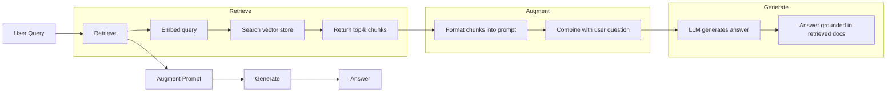
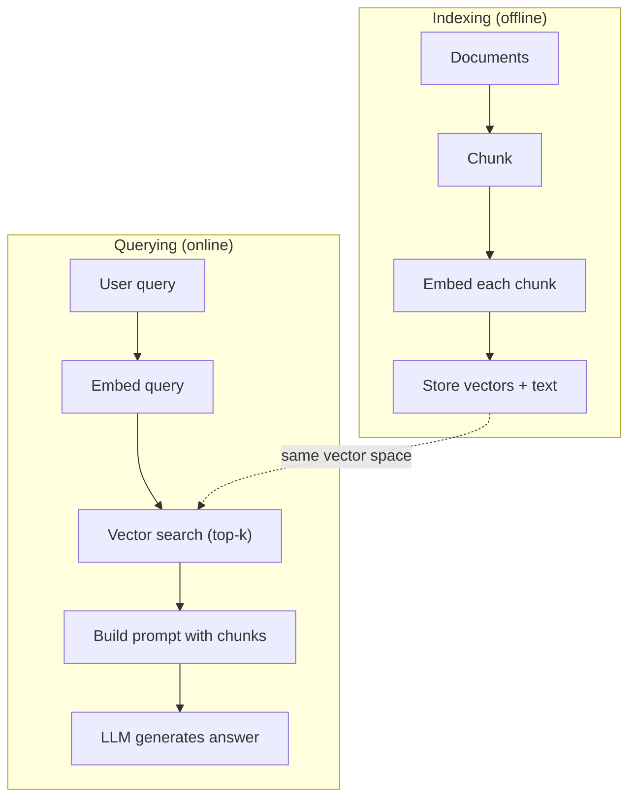

# RAG (Retrieval-Augmented Generation)

> Your LLM knows everything up to its training cutoff. It knows nothing about your company's docs, your codebase, or last week's meeting notes. RAG solves this by retrieving relevant documents and stuffing them into the prompt. It is the most deployed pattern in production AI.

**Type:** Build
**Languages:** Python
**Prerequisites:** Phase 10 (LLMs from Scratch), Phase 11 Lessons 01-05
**Time:** ~90 minutes
**Related:** Phase 5 · 23 (Chunking Strategies for RAG) for the six chunking algorithms and when each wins. Phase 5 · 22 (Embedding Models Deep Dive) for picking the embedder. Phase 11 · 07 (Advanced RAG) for hybrid search, reranking, and query transformation.

## Learning Objectives

- Build a complete RAG pipeline: document loading, chunking, embedding, vector storage, retrieval, and generation
- Implement semantic search using a vector database (ChromaDB, FAISS, or Pinecone) with proper indexing
- Explain why RAG is preferred over fine-tuning for knowledge-grounded applications (cost, freshness, attribution)
- Evaluate RAG quality using retrieval metrics (precision, recall) and generation metrics (faithfulness, relevance)

## The Problem

You build a chatbot for your company. A customer asks "What's the refund policy for enterprise plans?" The LLM responds with a generic answer about typical SaaS refund policies. The actual policy, buried in a 200-page internal wiki, says enterprise customers get a 60-day window with pro-rated refunds. The LLM has never seen this document. It cannot know what it was not trained on.

Fine-tuning is one solution. Take the LLM, train it on your internal docs, and deploy the updated model. This works but has serious problems. Fine-tuning costs thousands of dollars in compute. The model becomes stale the moment a document changes. You have no way to know which source the model drew from. And if the company acquires another product line next month, you fine-tune again.

RAG is the other solution. Leave the model untouched. When a question comes in, search your document store for relevant passages, paste them into the prompt before the question, and let the model answer using those passages as context. The document store can be updated in minutes. You can see exactly which documents were retrieved. The model itself never changes. This is why RAG is the dominant pattern in production: it's cheaper, fresher, more auditable, and works with any LLM.

## The Concept

### The RAG Pattern

The entire pattern fits in four steps:



Query -> Retrieve -> Augment prompt -> Generate. Every RAG system follows this pattern. The differences between production RAG systems are in the details of each step: how you chunk, how you embed, how you search, and how you construct the prompt.

### Why RAG Beats Fine-Tuning

| Concern | Fine-tuning | RAG |
|---------|------------|-----|
| Cost | $1,000-$100,000+ per training run | $0.01-$0.10 per query (embedding + LLM) |
| Freshness | Stale until retrained | Updated in minutes by re-indexing docs |
| Auditability | Cannot trace answer to source | Can show exact retrieved passages |
| Hallucination | Still hallucinates freely | Grounded in retrieved documents |
| Data privacy | Training data baked into weights | Documents stay in your vector store |

Fine-tuning changes the model's weights permanently. RAG changes the model's context temporarily. For most applications, temporary context is what you want.

The one case where fine-tuning wins: when you need the model to adopt a specific style, tone, or reasoning pattern that cannot be achieved through prompting alone. For factual knowledge retrieval, RAG wins every time.

### Embedding Models

An embedding model converts text into a dense vector. Similar texts produce vectors that are close together in this high-dimensional space. "How do I reset my password?" and "I need to change my password" produce nearly identical vectors despite sharing few words. "The cat sat on the mat" produces a very different vector.

Common embedding models (2026 lineup — see Phase 5 · 22 for full analysis):

| Model | Dimensions | Provider | Notes |
|-------|-----------|----------|-------|
| text-embedding-3-small | 1536 (Matryoshka) | OpenAI | Best price/performance for most use cases |
| text-embedding-3-large | 3072 (Matryoshka) | OpenAI | Higher accuracy, truncatable to 256/512/1024 |
| Gemini Embedding 2 | 3072 (Matryoshka) | Google | Top MTEB retrieval; 8K context |
| voyage-4 | 1024/2048 (Matryoshka) | Voyage AI | Domain variants (code, finance, law) |
| Cohere embed-v4 | 1024 (Matryoshka) | Cohere | Strong multilingual, 128K context |
| BGE-M3 | 1024 (dense + sparse + ColBERT) | BAAI (open-weight) | Three views from one model |
| Qwen3-Embedding | 4096 (Matryoshka) | Alibaba (open-weight) | Top open-weight retrieval score |
| all-MiniLM-L6-v2 | 384 | Open-weight (Sentence Transformers) | Prototyping baseline |

Use a hosted embedder (`text-embedding-3-small`, `voyage-4`, or your gateway's default). A TC does not roll their own. The rest of this lesson assumes a hosted embedder; if you're studying embeddings from first principles, see the Phase 2 NLP track.

### Vector Similarity

Given two vectors, how do you measure similarity? Three options:

**Cosine similarity**: the cosine of the angle between two vectors. Ranges from -1 (opposite) to 1 (identical). Ignores magnitude, only cares about direction. This is the default for RAG.

```
cosine_sim(a, b) = dot(a, b) / (||a|| * ||b||)
```

**Dot product**: the raw inner product. Larger vectors get higher scores. Useful when magnitude carries information (longer documents might be more relevant).

```
dot(a, b) = sum(a_i * b_i)
```

**L2 (Euclidean) distance**: straight-line distance in the vector space. Smaller distance = more similar. Sensitive to magnitude differences.

```
L2(a, b) = sqrt(sum((a_i - b_i)^2))
```

Cosine similarity is the standard. It handles documents of different lengths gracefully because it normalizes by magnitude. When someone says "vector search," they almost always mean cosine similarity.

### Chunking Strategies

Documents are too long to embed as single vectors. A 50-page PDF might produce a terrible embedding because it contains dozens of topics. Instead, you split documents into chunks and embed each chunk separately.

**Fixed-size chunking**: split every N tokens. Simple and predictable. A 512-token chunk with 50-token overlap means chunk 1 is tokens 0-511, chunk 2 is tokens 462-973, and so on. The overlap ensures you do not split a sentence at an unlucky boundary.

**Semantic chunking**: split at natural boundaries. Paragraphs, sections, or markdown headers. Each chunk is a coherent unit of meaning. More complex to implement but produces better retrieval.

**Recursive chunking**: try to split at the largest boundary first (section headers). If a section is still too large, split at paragraph boundaries. If a paragraph is still too large, split at sentence boundaries. This is the LangChain RecursiveCharacterTextSplitter approach and it works well in practice.

Chunk size matters more than people think:

- Too small (64-128 tokens): each chunk lacks context. "It increased 15% last quarter" means nothing without knowing what "it" refers to.
- Too large (2048+ tokens): each chunk covers multiple topics, diluting relevance. When you search for revenue data, you get a chunk that's 10% about revenue and 90% about headcount.
- Sweet spot (256-512 tokens): enough context to be self-contained, focused enough to be relevant.

Most production RAG systems use 256-512 token chunks with 50-token overlap. Anthropic's RAG guidelines recommend this range.

### Vector Databases

Once you have embeddings, you need somewhere to store and search them. Options:

| Database | Type | Best for |
|----------|------|----------|
| FAISS | Library (in-process) | Prototyping, small to medium datasets |
| Chroma | Lightweight DB | Local development, small deployments |
| Pinecone | Managed service | Production without ops overhead |
| Weaviate | Open source DB | Self-hosted production |
| pgvector | Postgres extension | Already using Postgres |
| Qdrant | Open source DB | High-performance self-hosted |

For this lesson, we build a simple in-memory vector store. It stores vectors in a list and does brute-force cosine similarity search. This is equivalent to FAISS with a flat index. It scales to maybe 100,000 vectors before getting slow. Production systems use approximate nearest neighbor (ANN) algorithms like HNSW to search millions of vectors in milliseconds.

### The Full Pipeline



The indexing phase runs once per document (or when documents update). The querying phase runs on every user request. In production, indexing might process millions of documents over hours. Querying must respond in under a second.

### Real Numbers

Most production RAG systems use these parameters:

- **k = 5 to 10** retrieved chunks per query
- **Chunk size = 256 to 512 tokens** with 50-token overlap
- **Context budget**: 2,500-5,000 tokens of retrieved content per query
- **Total prompt**: ~8,000-16,000 tokens (system prompt + retrieved chunks + conversation history + user query)
- **Embedding dimension**: 384-3072 depending on model
- **Indexing throughput**: 100-1,000 documents per second with API embeddings
- **Query latency**: 50-200ms for retrieval, 500-3000ms for generation


## Use It

With a real embedding model and LLM, the code barely changes:

```python
from openai import OpenAI

client = OpenAI()

def embed(text):
    response = client.embeddings.create(
        model="text-embedding-3-small",
        input=text
    )
    return response.data[0].embedding

def generate(prompt):
    response = client.chat.completions.create(
        model="gpt-4o-mini",
        messages=[{"role": "user", "content": prompt}],
        temperature=0
    )
    return response.choices[0].message.content
```

Or with Anthropic:

```python
import anthropic

client = anthropic.Anthropic()

def generate(prompt):
    response = client.messages.create(
        model="claude-sonnet-4-20250514",
        max_tokens=1024,
        messages=[{"role": "user", "content": prompt}]
    )
    return response.content[0].text
```

The pipeline is the same. Swap the embedding function. Swap the generation function. The retrieval logic, chunking, prompt construction -- all identical regardless of which models you use.

For vector storage at scale, replace the brute-force search with a proper vector database:

```python
import chromadb

client = chromadb.Client()
collection = client.create_collection("my_docs")

collection.add(
    documents=chunks,
    ids=[f"chunk_{i}" for i in range(len(chunks))]
)

results = collection.query(
    query_texts=["What is the refund policy?"],
    n_results=5
)
```

Chroma handles the embedding internally (it uses all-MiniLM-L6-v2 by default) and stores the vectors in a local database. Same pattern, different plumbing.

## Ship It

This lesson produces:
- `outputs/prompt-rag-architect.md` -- a prompt for designing RAG systems for specific use cases
- `outputs/skill-rag-pipeline.md` -- a skill that teaches agents how to build and debug RAG pipelines


## Further Reading

- Lewis et al., "Retrieval-Augmented Generation for Knowledge-Intensive NLP Tasks" (2020) -- the original RAG paper from Facebook AI Research that formalized the retrieve-then-generate pattern.
- Anthropic's RAG documentation (docs.anthropic.com) -- practical guidelines for chunk sizes, prompt construction, and evaluation.
- [Karpukhin et al., "Dense Passage Retrieval for Open-Domain Question Answering" (EMNLP 2020)](https://arxiv.org/abs/2004.04906) -- the DPR paper that proved dense bi-encoder retrieval beats BM25 on open-domain QA.
