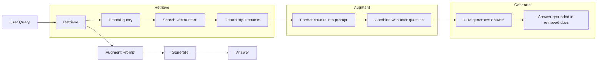
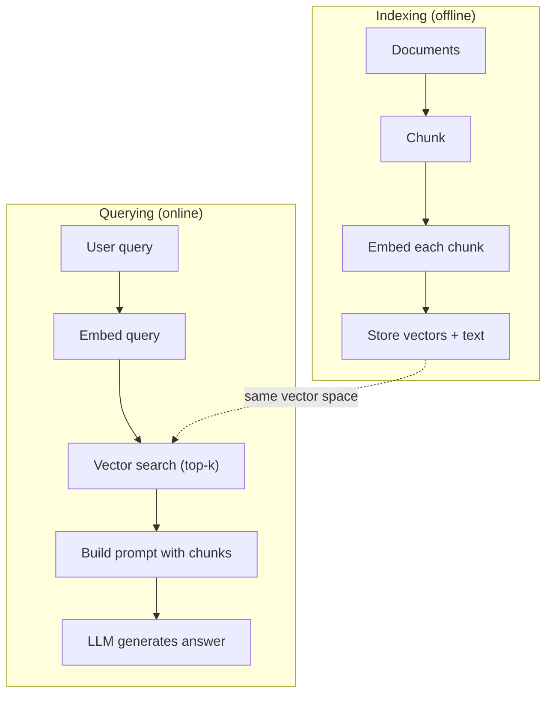

# RAG (Retrieval-Augmented Generation)

> Your LLM knows everything up to its training cutoff. It knows nothing about your company's docs, your codebase, or last week's meeting notes. RAG solves this by retrieving relevant documents and stuffing them into the prompt. It is the most deployed pattern in production AI.

**Type:** Build
**Languages:** Python, TypeScript
**Prerequisites:** Phase 10 (LLMs from Scratch), Phase 11 Lessons 01-05
**Time:** ~90 minutes
**Related:** Phase 5 · 23 (Chunking Strategies for RAG) for the six chunking algorithms and when each wins. Phase 5 · 22 (Embedding Models Deep Dive) for picking the embedder. Phase 11 · 07 (Advanced RAG) for hybrid search, reranking, and query transformation.

## Learning Objectives

- Build a complete RAG pipeline: document loading, chunking, embedding, vector storage, retrieval, and generation
- Implement semantic search using a vector database (ChromaDB, FAISS, or Pinecone) with proper indexing
- Explain why RAG is preferred over fine-tuning for knowledge-grounded applications (cost, freshness, attribution)
- Evaluate RAG quality using retrieval metrics (precision, recall) and generation metrics (faithfulness, relevance)

## The Problem

You build a chatbot for your company. A customer asks "What's the refund policy for enterprise plans?" The LLM responds with a generic answer about typical SaaS refund policies. The actual policy, buried in a 200-page internal wiki, says enterprise customers get a 60-day window with pro-rated refunds. The LLM has never seen this document. It cannot know what it was not trained on.

Fine-tuning is one solution. Take the LLM, train it on your internal docs, and deploy the updated model. This works but has serious problems. Fine-tuning costs thousands of dollars in compute. The model becomes stale the moment a document changes. You have no way to know which source the model drew from. And if the company acquires another product line next month, you fine-tune again.

RAG is the other solution. Leave the model untouched. When a question comes in, search your document store for relevant passages, paste them into the prompt before the question, and let the model answer using those passages as context. The document store can be updated in minutes. You can see exactly which documents were retrieved. The model itself never changes. This is why RAG is the dominant pattern in production: it's cheaper, fresher, more auditable, and works with any LLM.

Here's a small internal knowledge base with exactly this kind of buried policy — the running example for the rest of this lesson:

```python editable
# Example company policy documents
policies = [
    """Enterprise Plan Policy: Enterprise customers receive a 60-day refund window 
    with pro-rated refunds. For early termination within the first year, refunds are 
    calculated as (90 - days_used) / 90 * annual_fee. Volume discounts and multi-year 
    contracts apply. Contact sales@company.com for details.""",
    
    """Startup Plan Refund Policy: Startup customers on annual plans get a 30-day 
    money-back guarantee from the start date. No questions asked. Month-to-month 
    subscriptions can be cancelled anytime with no refund, as payment is non-recurring.""",
    
    """Free Trial Policy: All customers get a 14-day free trial with full feature access. 
    No credit card required. Trial can be extended by 7 days by contacting support@company.com. 
    After trial ends, upgrade to a paid plan or access expires automatically.""",
    
    """SaaS Service Level Agreement: We guarantee 99.9% uptime monthly. Refunds for 
    unplanned downtime exceeding 2 hours in a month are calculated as (downtime_hours / 730) 
    * monthly_fee. Planned maintenance windows are excluded. Emergency hotline available 24/7.""",
    
    """Payment and Billing: Invoices are sent monthly on the billing date. Late payments 
    over 30 days may result in service suspension. Currency conversion uses the daily rate 
    at invoice generation time. Refunds are issued to the original payment method within 5-7 business days."""
]

print(f"Loaded {len(policies)} policy documents for the knowledge base.")
for i, policy in enumerate(policies, 1):
    print(f"\nDoc {i} (first 80 chars): {policy[:80]}...")
```

## The Concept

Every example below shares this setup — run it once, then the rest reuse `lrn_llm`:

```python editable
import sys, json, types
lrn_llm = types.ModuleType("lrn_llm")
try:
    from pyodide.http import pyfetch as _pyfetch
    _IN_PYODIDE = True
except ImportError:
    import urllib.request as _urlreq
    _IN_PYODIDE = False
lrn_llm.API_BASE = "/api/llm"
lrn_llm.DEFAULT_MODEL = "azure/gpt-5.4-mini"
lrn_llm.API_KEY = ""

async def _lrn_call(messages, *, system=None, max_tokens=400, model=None):
    if system is not None:
        messages = [{"role": "system", "content": system}] + list(messages)
    payload = {"model": model or lrn_llm.DEFAULT_MODEL, "messages": messages,
               "max_completion_tokens": max_tokens}
    headers = {"content-type": "application/json"}
    _key = lrn_llm.API_KEY
    if _key:
        headers["Authorization"] = "Bearer " + _key
    url = lrn_llm.API_BASE.rstrip("/") + "/chat/completions"
    body = json.dumps(payload)
    if _IN_PYODIDE:
        r = await _pyfetch(url, method="POST", headers=headers, body=body)
        data = await r.json()
    else:
        req = _urlreq.Request(url, method="POST", headers=headers, data=body.encode("utf-8"))
        with _urlreq.urlopen(req, timeout=60) as r:
            data = json.loads(r.read())
    if "error" in data:
        raise RuntimeError("LLM error: " + str(data["error"]))
    return data

def _lrn_text(r):
    ch = (r or {}).get("choices") or []
    return (ch[0].get("message", {}) or {}).get("content", "") if ch else ""

async def _lrn_ping():
    r = await _lrn_call([{"role": "user", "content": "Reply with exactly: OK"}], max_tokens=5)
    return {"ok": _lrn_text(r).strip().upper().startswith("OK"), "model": r.get("model")}

lrn_llm.call = _lrn_call
lrn_llm.text = _lrn_text
lrn_llm.ping = _lrn_ping
r = await lrn_llm.ping()
print(f"LLM reachable: {r}")
```

### The RAG Pattern

The entire pattern fits in four steps:



Query -> Retrieve -> Augment prompt -> Generate. Every RAG system follows this pattern. The differences between production RAG systems are in the details of each step: how you chunk, how you embed, how you search, and how you construct the prompt.

### Why RAG Beats Fine-Tuning

| Concern | Fine-tuning | RAG |
|---------|------------|-----|
| Cost | $1,000-$100,000+ per training run | $0.01-$0.10 per query (embedding + LLM) |
| Freshness | Stale until retrained | Updated in minutes by re-indexing docs |
| Auditability | Cannot trace answer to source | Can show exact retrieved passages |
| Hallucination | Still hallucinates freely | Grounded in retrieved documents |
| Data privacy | Training data baked into weights | Documents stay in your vector store |

Fine-tuning changes the model's weights permanently. RAG changes the model's context temporarily. For most applications, temporary context is what you want.

The one case where fine-tuning wins: when you need the model to adopt a specific style, tone, or reasoning pattern that cannot be achieved through prompting alone. For factual knowledge retrieval, RAG wins every time.

### Embedding Models

An embedding model converts text into a dense vector. Similar texts produce vectors that are close together in this high-dimensional space. "How do I reset my password?" and "I need to change my password" produce nearly identical vectors despite sharing few words. "The cat sat on the mat" produces a very different vector.

Common embedding models (2026 lineup — see Phase 5 · 22 for full analysis):

| Model | Dimensions | Provider | Notes |
|-------|-----------|----------|-------|
| text-embedding-3-small | 1536 (Matryoshka) | OpenAI | Best price/performance for most use cases |
| text-embedding-3-large | 3072 (Matryoshka) | OpenAI | Higher accuracy, truncatable to 256/512/1024 |
| Gemini Embedding 2 | 3072 (Matryoshka) | Google | Top MTEB retrieval; 8K context |
| voyage-4 | 1024/2048 (Matryoshka) | Voyage AI | Domain variants (code, finance, law) |
| Cohere embed-v4 | 1024 (Matryoshka) | Cohere | Strong multilingual, 128K context |
| BGE-M3 | 1024 (dense + sparse + ColBERT) | BAAI (open-weight) | Three views from one model |
| Qwen3-Embedding | 4096 (Matryoshka) | Alibaba (open-weight) | Top open-weight retrieval score |
| all-MiniLM-L6-v2 | 384 | Open-weight (Sentence Transformers) | Prototyping baseline |

Use a hosted embedder (`text-embedding-3-small`, `voyage-4`, or your gateway's default). A TC does not roll their own. The rest of this lesson assumes a hosted embedder; if you're studying embeddings from first principles, see the Phase 2 NLP track.

### Vector Similarity

Given two vectors, how do you measure similarity? Three options:

**Cosine similarity**: the cosine of the angle between two vectors. Ranges from -1 (opposite) to 1 (identical). Ignores magnitude, only cares about direction. This is the default for RAG.

```
cosine_sim(a, b) = dot(a, b) / (||a|| * ||b||)
```

**Dot product**: the raw inner product. Larger vectors get higher scores. Useful when magnitude carries information (longer documents might be more relevant).

```
dot(a, b) = sum(a_i * b_i)
```

**L2 (Euclidean) distance**: straight-line distance in the vector space. Smaller distance = more similar. Sensitive to magnitude differences.

```
L2(a, b) = sqrt(sum((a_i - b_i)^2))
```

Cosine similarity is the standard. It handles documents of different lengths gracefully because it normalizes by magnitude. When someone says "vector search," they almost always mean cosine similarity.

### Chunking Strategies

Documents are too long to embed as single vectors. A 50-page PDF might produce a terrible embedding because it contains dozens of topics. Instead, you split documents into chunks and embed each chunk separately.

**Fixed-size chunking**: split every N tokens. Simple and predictable. A 512-token chunk with 50-token overlap means chunk 1 is tokens 0-511, chunk 2 is tokens 462-973, and so on. The overlap ensures you do not split a sentence at an unlucky boundary.

**Semantic chunking**: split at natural boundaries. Paragraphs, sections, or markdown headers. Each chunk is a coherent unit of meaning. More complex to implement but produces better retrieval.

**Recursive chunking**: try to split at the largest boundary first (section headers). If a section is still too large, split at paragraph boundaries. If a paragraph is still too large, split at sentence boundaries. This is the LangChain RecursiveCharacterTextSplitter approach and it works well in practice.

Chunk size matters more than people think:

- Too small (64-128 tokens): each chunk lacks context. "It increased 15% last quarter" means nothing without knowing what "it" refers to.
- Too large (2048+ tokens): each chunk covers multiple topics, diluting relevance. When you search for revenue data, you get a chunk that's 10% about revenue and 90% about headcount.
- Sweet spot (256-512 tokens): enough context to be self-contained, focused enough to be relevant.

Most production RAG systems use 256-512 token chunks with 50-token overlap. Anthropic's RAG guidelines recommend this range.

Here's fixed-size chunking with overlap, applied to the policy documents above:

```python editable
def chunk_text(text, chunk_size=50, overlap=10):
    """Split text into overlapping chunks of ~chunk_size words."""
    words = text.split()
    chunks = []
    start = 0
    while start < len(words):
        end = start + chunk_size
        chunk = " ".join(words[start:end])
        chunks.append(chunk)
        start += chunk_size - overlap  # overlap ensures context isn't lost at chunk boundaries
    return chunks

# Chunk all documents
all_chunks = []
for i, policy in enumerate(policies):
    chunks = chunk_text(policy, chunk_size=50, overlap=10)
    all_chunks.extend(chunks)
    print(f"Doc {i+1}: {len(chunks)} chunks")

print(f"\nTotal chunks in knowledge base: {len(all_chunks)}")
print(f"\nExample chunk:\n{all_chunks[0]}")
```

### Vector Databases

Once you have embeddings, you need somewhere to store and search them. Options:

| Database | Type | Best for |
|----------|------|----------|
| FAISS | Library (in-process) | Prototyping, small to medium datasets |
| Chroma | Lightweight DB | Local development, small deployments |
| Pinecone | Managed service | Production without ops overhead |
| Weaviate | Open source DB | Self-hosted production |
| pgvector | Postgres extension | Already using Postgres |
| Qdrant | Open source DB | High-performance self-hosted |

For this lesson, we build a simple in-memory vector store. It stores vectors in a list and does brute-force cosine similarity search. This is equivalent to FAISS with a flat index. It scales to maybe 100,000 vectors before getting slow. Production systems use approximate nearest neighbor (ANN) algorithms like HNSW to search millions of vectors in milliseconds.

To embed each chunk without calling a hosted embedding API, we use TF-IDF (Term Frequency-Inverse Document Frequency): frequent words in a chunk get a high TF score, rare words across the corpus get a high IDF score, and the product captures word importance. It's a dependency-free stand-in for the hosted embedders above — the retrieval math that follows is identical either way.

```python editable
import math
from collections import Counter

def build_vocabulary(documents):
    """Extract sorted vocabulary from all documents."""
    vocab = set()
    for doc in documents:
        vocab.update(doc.lower().split())
    return sorted(vocab)

def compute_tf(text, vocab):
    """Term Frequency: word count / total words."""
    words = text.lower().split()
    count = Counter(words)
    total = len(words) if len(words) > 0 else 1
    return [count.get(word, 0) / total for word in vocab]

def compute_idf(documents, vocab):
    """Inverse Document Frequency: log(total docs / docs containing word)."""
    n = len(documents)
    idf = []
    for word in vocab:
        doc_count = sum(1 for doc in documents if word in doc.lower().split())
        idf.append(math.log((n + 1) / (doc_count + 1)) + 1)
    return idf

def tfidf_embed(text, vocab, idf):
    """TF-IDF embedding: element-wise product of TF and IDF."""
    tf = compute_tf(text, vocab)
    return [t * i for t, i in zip(tf, idf)]

# Build vocabulary and IDF from all chunks
vocab = build_vocabulary(all_chunks)
idf = compute_idf(all_chunks, vocab)
print(f"Vocabulary size: {len(vocab)} unique words")
print(f"First 20 words in vocab: {vocab[:20]}")

# Embed all chunks
chunk_embeddings = [tfidf_embed(chunk, vocab, idf) for chunk in all_chunks]
print(f"\nEmbedded {len(chunk_embeddings)} chunks")
print(f"Embedding dimension: {len(chunk_embeddings[0])}")
```

With every chunk embedded, retrieval is brute-force cosine similarity search against all of them — given a user query, embed it with the same TF-IDF process, then rank chunks by similarity:

```python editable
def cosine_similarity(a, b):
    """Compute cosine similarity between two vectors.
    Range: -1 (opposite) to 1 (identical). Standard for RAG."""
    dot = sum(x * y for x, y in zip(a, b))
    norm_a = math.sqrt(sum(x * x for x in a))
    norm_b = math.sqrt(sum(x * x for x in b))
    if norm_a == 0 or norm_b == 0:
        return 0.0
    return dot / (norm_a * norm_b)

def retrieve(query, chunk_embeddings, chunks, vocab, idf, top_k=3):
    """Retrieve top-k chunks most similar to query."""
    query_emb = tfidf_embed(query, vocab, idf)
    scores = []
    for i, emb in enumerate(chunk_embeddings):
        sim = cosine_similarity(query_emb, emb)
        scores.append((i, sim))
    scores.sort(key=lambda x: x[1], reverse=True)
    retrieved = [(chunks[i], score) for i, score in scores[:top_k]]
    return retrieved

# Test retrieval
query = "What is the refund policy for enterprise customers?"
retrieved = retrieve(query, chunk_embeddings, all_chunks, vocab, idf, top_k=3)

print(f"Query: {query}\n")
for i, (chunk, score) in enumerate(retrieved, 1):
    print(f"Result {i} (similarity: {score:.3f}):")
    print(f"{chunk}\n")
```

### The Full Pipeline



The indexing phase runs once per document (or when documents update). The querying phase runs on every user request. In production, indexing might process millions of documents over hours. Querying must respond in under a second.

The last step of querying is building a prompt from the retrieved chunks and the user's question:

```python editable
def build_rag_prompt(query, retrieved_chunks):
    """Format retrieved chunks and query into a single prompt."""
    context = "\n\n---\n\n".join(
        f"[Source {i+1}]\n{chunk}"
        for i, chunk in enumerate(retrieved_chunks)
    )
    return f"""Answer the question based ONLY on the following context. 
If the context doesn't contain enough information, say "I don't have enough information to answer that."

Context:
{context}

Question: {query}

Answer:"""

# Build the augmented prompt
query = "What is the refund policy for enterprise customers?"
retrieved = retrieve(query, chunk_embeddings, all_chunks, vocab, idf, top_k=3)
retrieved_text = [chunk for chunk, _ in retrieved]
rag_prompt = build_rag_prompt(query, retrieved_text)

print("=== RAG PROMPT (sent to LLM) ===")
print(rag_prompt)
print("\n" + "="*50)
```

Now send that augmented prompt to a real LLM. It reads the context and answers grounded in your company's actual policies:

```python editable
# Generate answer using the LLM
query = "What is the refund policy for enterprise customers?"
retrieved = retrieve(query, chunk_embeddings, all_chunks, vocab, idf, top_k=3)
retrieved_text = [chunk for chunk, _ in retrieved]
rag_prompt = build_rag_prompt(query, retrieved_text)

response = await lrn_llm.call(
    [{"role": "user", "content": rag_prompt}],
    max_tokens=200
)
answer = lrn_llm.text(response)

print(f"Query: {query}")
print(f"\nLLM Answer (grounded in retrieved context):")
print(answer)
```

Wrapping retrieve + augment + generate into a single function gives a reusable RAG pipeline:

```python editable
async def rag_query(question, chunk_embeddings, chunks, vocab, idf, top_k=3, max_tokens=200):
    """Complete RAG pipeline: retrieve → augment → generate."""
    # Retrieve
    retrieved = retrieve(question, chunk_embeddings, chunks, vocab, idf, top_k=top_k)
    retrieved_text = [chunk for chunk, _ in retrieved]
    
    # Augment
    rag_prompt = build_rag_prompt(question, retrieved_text)
    
    # Generate
    response = await lrn_llm.call(
        [{"role": "user", "content": rag_prompt}],
        max_tokens=max_tokens
    )
    answer = lrn_llm.text(response)
    
    return {
        "question": question,
        "retrieved_chunks": retrieved_text,
        "answer": answer
    }

# Test with a different query
result = await rag_query(
    "Can I cancel my month-to-month subscription?",
    chunk_embeddings, all_chunks, vocab, idf, top_k=2
)

print(f"Question: {result['question']}")
print(f"\nTop retrieved chunk: {result['retrieved_chunks'][0][:150]}...")
print(f"\nLLM Answer: {result['answer']}")
```

To see exactly what RAG buys you, compare the same question with and without retrieved context — asked without context, the LLM falls back on generic training knowledge; asked with the retrieved chunks, it grounds its answer in your actual policy:

```python editable
# Non-RAG: LLM answers from its training data alone
question = "What is the enterprise plan refund policy?"

response_no_rag = await lrn_llm.call(
    [{"role": "user", "content": f"Question: {question}"}],
    max_tokens=150
)
answer_no_rag = lrn_llm.text(response_no_rag)

print("=== WITHOUT RAG (generic knowledge) ===")
print(answer_no_rag)
print()

# RAG: LLM answers using retrieved context
retrieved = retrieve(question, chunk_embeddings, all_chunks, vocab, idf, top_k=2)
retrieved_text = [chunk for chunk, _ in retrieved]
rag_prompt = build_rag_prompt(question, retrieved_text)

response_rag = await lrn_llm.call(
    [{"role": "user", "content": rag_prompt}],
    max_tokens=150
)
answer_rag = lrn_llm.text(response_rag)

print("=== WITH RAG (grounded in retrieved context) ===")
print(answer_rag)
```

### Real Numbers

Most production RAG systems use these parameters:

- **k = 5 to 10** retrieved chunks per query
- **Chunk size = 256 to 512 tokens** with 50-token overlap
- **Context budget**: 2,500-5,000 tokens of retrieved content per query
- **Total prompt**: ~8,000-16,000 tokens (system prompt + retrieved chunks + conversation history + user query)
- **Embedding dimension**: 384-3072 depending on model
- **Indexing throughput**: 100-1,000 documents per second with API embeddings
- **Query latency**: 50-200ms for retrieval, 500-3000ms for generation

### Try It Yourself

Edit the question below and run the cell to see RAG in action on your own queries. Try questions like "What happens if I don't pay on time?", "How long is the free trial?", or "What's the uptime guarantee?" — watch how retrieval pulls the relevant policy chunk and the LLM grounds its answer in that context.

```python editable
my_question = "What is the service level agreement uptime guarantee?"

result = await rag_query(
    my_question,
    chunk_embeddings, all_chunks, vocab, idf, top_k=2, max_tokens=200
)

print(f"Your Question: {result['question']}")
print(f"\nRetrieved Context:")
for i, chunk in enumerate(result['retrieved_chunks'], 1):
    print(f"  [{i}] {chunk[:120]}...")
print(f"\nLLM Answer:")
print(result['answer'])
```

## Further Reading

- Lewis et al., "Retrieval-Augmented Generation for Knowledge-Intensive NLP Tasks" (2020) -- the original RAG paper from Facebook AI Research that formalized the retrieve-then-generate pattern.
- Anthropic's RAG documentation (docs.anthropic.com) -- practical guidelines for chunk sizes, prompt construction, and evaluation.
- [Karpukhin et al., "Dense Passage Retrieval for Open-Domain Question Answering" (EMNLP 2020)](https://arxiv.org/abs/2004.04906) -- the DPR paper that proved dense bi-encoder retrieval beats BM25 on open-domain QA.

## Exercises

1. **Establish a baseline.** Run the lesson demo, then capture the inputs, outputs, and one invariant that demonstrates this objective: Build a complete RAG pipeline: document loading, chunking, embedding, vector storage, retrieval, and generation.
2. **Change one variable.** Modify a single input or parameter and use the resulting evidence to investigate this objective: Implement semantic search using a vector database (ChromaDB, FAISS, or Pinecone) with proper indexing.
3. **Probe an edge case.** Predict the result before running it, compare prediction with observation, and explain the discrepancy while applying this objective: Explain why RAG is preferred over fine-tuning for knowledge-grounded applications (cost, freshness, attribution).

## Reference Solution

Use the canonical [main.py](../code/main.py) as the executable baseline. A complete solution records a successful run, identifies the invariant tied to “Build a complete RAG pipeline: document loading, chunking, embedding, vector storage, retrieval, and generation,” and changes only one variable for the comparison. The edge-case result must distinguish the prediction from the observation, explain the cause using “Explain why RAG is preferred over fine-tuning for knowledge-grounded applications (cost, freshness, attribution),” and cite a repeatable check rather than relying on visual inspection alone.

## Guided Demo

Use the [10–15 minute guided demo](demo.md) to predict an invariant, run the canonical entrypoint, change one variable, and probe a failure case.
