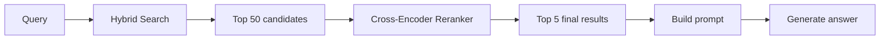
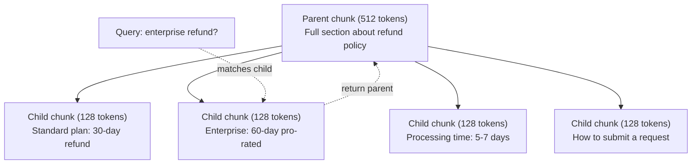
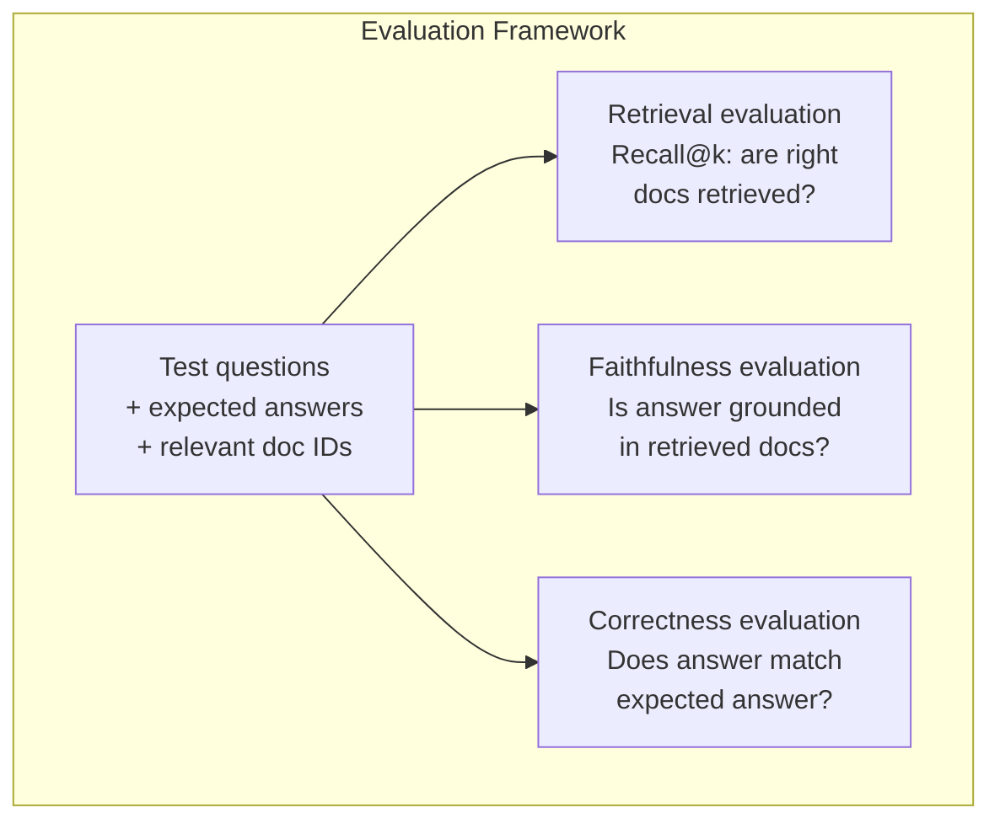

# Advanced RAG (Chunking, Reranking, Hybrid Search)

> Basic RAG retrieves the top-k most similar chunks. That works for simple questions. It falls apart for multi-hop reasoning, ambiguous queries, and large corpora. Advanced RAG is the difference between a demo that works on 10 documents and a system that works on 10 million.

**Type:** Build
**Languages:** Python
**Prerequisites:** Phase 11, Lesson 06 (RAG)
**Time:** ~90 minutes
**Related:** Phase 5 · 23 (Chunking Strategies for RAG) covers all six chunking algorithms — recursive, semantic, sentence, parent-document, late chunking, contextual retrieval — with Vectara/Anthropic benchmarks. This lesson builds on top: hybrid search, reranking, query transformation.

## Learning Objectives

- Implement advanced chunking strategies (semantic, recursive, parent-child) that preserve document structure and context
- Build a hybrid search pipeline combining BM25 keyword matching with semantic vector search and a cross-encoder reranker
- Apply query transformation techniques (HyDE, multi-query, step-back) to improve retrieval on ambiguous or complex questions
- Diagnose and fix common RAG failures: wrong chunk retrieved, answer not in context, multi-hop reasoning breakdown

## The Problem

You built a basic RAG pipeline in Lesson 06. It works for straightforward questions on a small corpus. Now try these:

**Ambiguous query**: "What was revenue last quarter?" Semantic search returns chunks about revenue strategy, revenue projections, and the CFO's thoughts on revenue growth. All semantically similar to the word "revenue." None containing the actual number. The correct chunk says "$47.2M in Q3 2025" but uses the word "earnings" instead of "revenue." The embedding model thinks "revenue strategy" is closer to the query than "Q3 earnings were $47.2M."

**Multi-hop question**: "Which team had the highest customer satisfaction score improvement?" This requires finding the satisfaction scores for each team, comparing them, and identifying the maximum. No single chunk contains the answer. The information is scattered across team reports.

**Large corpus problem**: You have 2 million chunks. The correct answer is in chunk #1,847,293. Your top-5 retrieval pulls chunks #14, #89,201, #1,200,000, #44, and #901,333. Close in embedding space, but none containing the answer. At this scale, approximate nearest neighbor search introduces enough error that relevant results get pushed out of the top-k.

Basic RAG fails because vector similarity is not the same as relevance. A chunk can be semantically similar to a query without being useful for answering it. Advanced RAG addresses this with four techniques: hybrid search (add keyword matching), reranking (score candidates more carefully), query transformation (fix the query before searching), and better chunking (retrieve at the right granularity).

## The Concept

### Hybrid Search: Semantic + Keyword

Semantic search (vector similarity) is good at understanding meaning. "How do I cancel my subscription?" matches "Steps to terminate your plan" even though they share no words. But it misses exact matches. "Error code E-4021" might not match a chunk containing "E-4021" if the embedding model treats it as noise.

Keyword search (BM25) is the opposite. It excels at exact matches. "E-4021" matches perfectly. But "cancel my subscription" returns zero results if the document says "terminate your plan."

Hybrid search runs both, then merges the results.

**BM25** (Best Matching 25) is the standard keyword search algorithm. It has been the backbone of search engines since the 1990s. The formula:

```
BM25(q, d) = sum over terms t in q:
    IDF(t) * (tf(t,d) * (k1 + 1)) / (tf(t,d) + k1 * (1 - b + b * |d| / avgdl))
```

Where tf(t,d) is the term frequency of t in document d, IDF(t) is the inverse document frequency, |d| is the document length, avgdl is the average document length, k1 controls term frequency saturation (default 1.2), and b controls length normalization (default 0.75).

In plain terms: BM25 scores documents higher when they contain query terms (especially rare ones), but with diminishing returns for repeated terms. A document with the word "revenue" 50 times is not 50x more relevant than one with it once.

### Reciprocal Rank Fusion (RRF)

You have two ranked lists: one from vector search, one from BM25. How do you combine them? Reciprocal Rank Fusion is the standard approach.

```
RRF_score(d) = sum over rankings R:
    1 / (k + rank_R(d))
```

Where k is a constant (typically 60) that prevents the top-ranked result from dominating.

A document ranked #1 in vector search and #5 in BM25 gets: 1/(60+1) + 1/(60+5) = 0.0164 + 0.0154 = 0.0318

A document ranked #3 in vector search and #2 in BM25 gets: 1/(60+3) + 1/(60+2) = 0.0159 + 0.0161 = 0.0320

RRF naturally balances the two signals. A document that ranks highly in both lists gets the best score. A document that ranks #1 in one list but is absent from the other gets a moderate score. This is robust because it uses ranks, not raw scores, so differences in score distributions between the two systems do not matter.

### Reranking

Retrieval (whether vector, keyword, or hybrid) is fast but imprecise. It uses bi-encoders: the query and each document are embedded independently, then compared. The embeddings are computed once and cached. This scales to millions of documents.

Reranking uses cross-encoders: the query and a candidate document are fed together into a model that outputs a relevance score. The model sees both texts simultaneously and can capture fine-grained interactions between them. A cross-encoder can understand that "What were Q3 earnings?" is highly relevant to a chunk containing "$47.2M in Q3" even if a bi-encoder missed the connection.

The trade-off: cross-encoders are 100-1000x slower than bi-encoders because they process the query-document pair jointly. You cannot pre-compute cross-encoder scores for a million documents. The solution: retrieve a larger candidate set (top-50 from hybrid search), then rerank with a cross-encoder to get the final top-5.



Common reranking models (2026 lineup):
- Cohere Rerank 3.5: managed API, multilingual, best recall gain on mixed corpora
- Voyage rerank-2.5: managed API, lowest latency of the hosted options
- Jina-Reranker-v2 Multilingual: open-weight, 100+ languages
- bge-reranker-v2-m3: open-weight, strong baseline
- cross-encoder/ms-marco-MiniLM-L-6-v2: open-weight, runs on CPU for prototyping
- ColBERTv2 / Jina-ColBERT-v2: late-interaction multi-vector rerankers — O(tokens) not O(docs) at scoring time

### Query Transformation

Sometimes the problem is not retrieval but the query itself. "What was that thing about the new policy change?" is a terrible search query. It contains no specific terms. The embedding is vague. No retrieval system can find the right documents from this.

**Query rewriting**: rephrase the user's query into a better search query. An LLM can do this:

```
User: "What was that thing about the new policy change?"
Rewritten: "Recent policy changes and updates"
```

**HyDE (Hypothetical Document Embeddings)**: instead of searching with the query, generate a hypothetical answer, embed that, and search for similar real documents.

```
Query: "What is the refund policy for enterprise?"
Hypothetical answer: "Enterprise customers are eligible for a full refund
within 60 days of purchase. Refunds are pro-rated based on the remaining
subscription period and processed within 5-7 business days."
```

Embed the hypothetical answer and search for real documents similar to it. The intuition: the hypothetical answer lives closer in embedding space to the real answer than the original question does. Questions and answers have different linguistic structures. By generating a hypothetical answer, you bridge the gap between "question space" and "answer space" in the embedding.

HyDE adds one LLM call before retrieval. This increases latency by 500-2000ms. Worth it when retrieval quality is poor on raw queries.

### Parent-Child Chunking

Standard chunking forces a trade-off: small chunks for precise retrieval, large chunks for sufficient context. Parent-child chunking eliminates this trade-off.

Index small chunks (128 tokens) for retrieval. When a small chunk is retrieved, return its parent chunk (512 tokens) for the prompt. The small chunk matches the query precisely. The parent chunk provides enough context for the LLM to generate a good answer.



The query "enterprise refund?" matches child chunk C2 precisely. But the prompt receives the full parent chunk P, which includes the surrounding context about processing time and submission process.

### Metadata Filtering

Before running vector search, filter the corpus by metadata: date, source, category, author, language. This reduces the search space and prevents irrelevant results.

"What changed in the security policy last month?" should only search documents from the last 30 days in the security category. Without metadata filtering, you search the entire corpus and might retrieve a 2-year-old security document that happens to be semantically similar.

Production RAG systems store metadata alongside each chunk: source document, creation date, category, author, version. Vector databases support pre-filtering by metadata before similarity search, which is critical for performance at scale.

### Evaluation

You built a RAG system. How do you know if it works? Three metrics:

**Retrieval relevance (Recall@k)**: for a set of test questions with known relevant documents, what percentage of relevant documents appear in the top-k results? If the answer to a question is in chunk #47, does chunk #47 appear in the top-5?

**Faithfulness**: is the generated answer grounded in the retrieved documents? If the retrieved chunks say "60-day refund window" and the model says "90-day refund window," that is a faithfulness failure. The model hallucinated despite having the correct context.

**Answer correctness**: does the generated answer match the expected answer? This is the end-to-end metric. It combines retrieval quality and generation quality.

A simple faithfulness check: take each claim in the generated answer and verify it appears (in substance) in the retrieved chunks. If the answer contains a fact not in any retrieved chunk, it is likely hallucinated.




## Use It

With a real cross-encoder for reranking:

```python
from sentence_transformers import CrossEncoder

reranker = CrossEncoder("cross-encoder/ms-marco-MiniLM-L-6-v2")

def rerank_with_cross_encoder(query, candidates, chunks, top_k=5):
    pairs = [(query, chunks[doc_id]) for doc_id, _ in candidates]
    scores = reranker.predict(pairs)
    scored = list(zip([doc_id for doc_id, _ in candidates], scores))
    scored.sort(key=lambda x: x[1], reverse=True)
    return scored[:top_k]
```

With Cohere's managed reranker:

```python
import cohere

co = cohere.Client()

def rerank_with_cohere(query, candidates, chunks, top_k=5):
    docs = [chunks[doc_id] for doc_id, _ in candidates]
    response = co.rerank(
        model="rerank-english-v3.0",
        query=query,
        documents=docs,
        top_n=top_k
    )
    return [(candidates[r.index][0], r.relevance_score) for r in response.results]
```

For HyDE with a real LLM:

```python
import anthropic

client = anthropic.Anthropic()

def hyde_with_llm(query):
    response = client.messages.create(
        model="claude-sonnet-4-20250514",
        max_tokens=256,
        messages=[{
            "role": "user",
            "content": f"Write a short paragraph that would be a good answer to this question. Do not say you don't know. Just write what the answer would look like.\n\nQuestion: {query}"
        }]
    )
    return response.content[0].text
```

For production hybrid search with Weaviate:

```python
import weaviate

client = weaviate.connect_to_local()

collection = client.collections.get("Documents")
response = collection.query.hybrid(
    query="enterprise refund policy",
    alpha=0.5,
    limit=10
)
```

The alpha parameter controls the balance: 0.0 = pure keyword (BM25), 1.0 = pure vector, 0.5 = equal weight. Most production systems use alpha between 0.3 and 0.7.

## Ship It

This lesson produces:
- `outputs/prompt-advanced-rag-debugger.md` -- a prompt for diagnosing and fixing RAG quality issues
- `outputs/skill-advanced-rag.md` -- a skill for building production-grade RAG with hybrid search and reranking


## Key Terms

| Term | What people say | What it actually means |
|------|----------------|----------------------|
| BM25 | "Keyword search" | A probabilistic ranking algorithm that scores documents by term frequency, inverse document frequency, and document length normalization |
| Hybrid search | "Best of both worlds" | Running semantic (vector) and keyword (BM25) search in parallel, then merging results with rank fusion |
| Reciprocal Rank Fusion | "Merge ranked lists" | Combining multiple ranked lists by summing 1/(k + rank) for each document across all lists |
| Reranking | "Second pass scoring" | Using a more expensive cross-encoder model to re-score a candidate set from initial retrieval |
| Cross-encoder | "Joint query-document model" | A model that takes a query and document as a single input, producing a relevance score; more accurate than bi-encoders but too slow for full corpus search |
| Bi-encoder | "Independent embedding model" | A model that embeds queries and documents independently; fast because embeddings are precomputed, but less accurate than cross-encoders |
| HyDE | "Search with a fake answer" | Generate a hypothetical answer to the query, embed it, and search for real documents similar to it |
| Parent-child chunking | "Small search, big context" | Index small chunks for precise retrieval but return the larger parent chunk to provide sufficient context |
| Metadata filtering | "Narrow before searching" | Filtering documents by attributes (date, source, category) before running vector search to reduce the search space |
| Faithfulness | "Did it stay grounded" | Whether the generated answer is supported by the retrieved documents, as opposed to hallucinated from the model's training data |

## Further Reading

- Robertson & Zaragoza, "The Probabilistic Relevance Framework: BM25 and Beyond" (2009) -- the definitive reference for BM25, explaining the probabilistic foundations behind the formula
- Cormack et al., "Reciprocal Rank Fusion Outperforms Condorcet and Individual Rank Learning Methods" (2009) -- the original RRF paper showing it beats more complex fusion methods
- Gao et al., "Precise Zero-Shot Dense Retrieval without Relevance Labels" (2022) -- the HyDE paper demonstrating that hypothetical document embeddings improve retrieval without any training data
- Nogueira & Cho, "Passage Re-ranking with BERT" (2019) -- showed cross-encoder reranking on top of BM25 significantly improves retrieval quality
- [Khattab et al., "DSPy: Compiling Declarative Language Model Calls into Self-Improving Pipelines" (2023)](https://arxiv.org/abs/2310.03714) -- treats prompt construction and weight selection as an optimization problem over retrieval pipelines; read this for "program LLMs" instead of "prompt LLMs."
- [Edge et al., "From Local to Global: A Graph RAG Approach to Query-Focused Summarization" (Microsoft Research 2024)](https://arxiv.org/abs/2404.16130) -- GraphRAG paper: entity-relation extraction + Leiden community detection for query-focused summarization; the global vs local retrieval distinction.
- [Asai et al., "Self-RAG: Learning to Retrieve, Generate, and Critique through Self-Reflection" (ICLR 2024)](https://arxiv.org/abs/2310.11511) -- self-evaluating RAG with reflection tokens; the agentic frontier past static retrieve-then-generate.
- [LangChain Query Construction blog](https://blog.langchain.dev/query-construction/) -- how to translate natural-language queries into structured database queries (Text-to-SQL, Cypher) as a pre-retrieval step.
