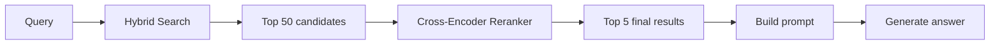
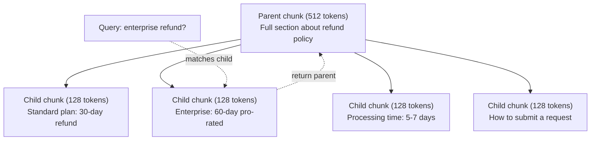
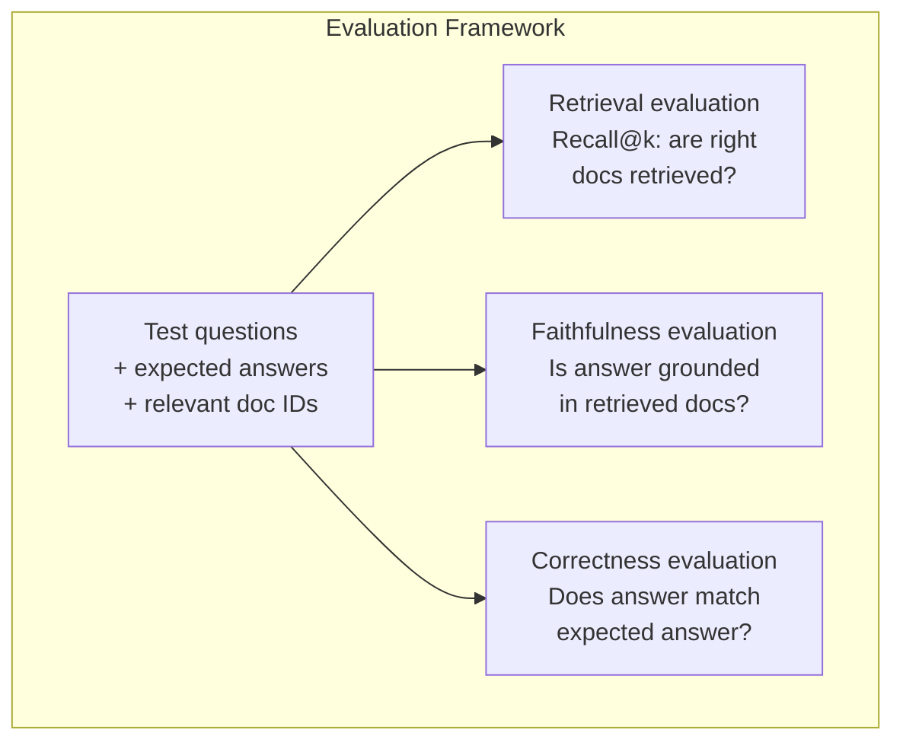

# Advanced RAG (Chunking, Reranking, Hybrid Search)

> Basic RAG retrieves the top-k most similar chunks. That works for simple questions. It falls apart for multi-hop reasoning, ambiguous queries, and large corpora. Advanced RAG is the difference between a demo that works on 10 documents and a system that works on 10 million.

**Type:** Build
**Languages:** Python
**Prerequisites:** Phase 11, Lesson 06 (RAG)
**Time:** ~90 minutes
**Related:** Phase 5 · 23 (Chunking Strategies for RAG) covers all six chunking algorithms — recursive, semantic, sentence, parent-document, late chunking, contextual retrieval — with Vectara/Anthropic benchmarks. This lesson builds on top: hybrid search, reranking, query transformation.

## Learning Objectives

- Implement advanced chunking strategies (semantic, recursive, parent-child) that preserve document structure and context
- Build a hybrid search pipeline combining BM25 keyword matching with semantic vector search and a cross-encoder reranker
- Apply query transformation techniques (HyDE, multi-query, step-back) to improve retrieval on ambiguous or complex questions
- Diagnose and fix common RAG failures: wrong chunk retrieved, answer not in context, multi-hop reasoning breakdown

## The Problem

You built a basic RAG pipeline in Lesson 06. It works for straightforward questions on a small corpus. Now try these:

**Ambiguous query**: "What was revenue last quarter?" Semantic search returns chunks about revenue strategy, revenue projections, and the CFO's thoughts on revenue growth. All semantically similar to the word "revenue." None containing the actual number. The correct chunk says "$47.2M in Q3 2025" but uses the word "earnings" instead of "revenue." The embedding model thinks "revenue strategy" is closer to the query than "Q3 earnings were $47.2M."

**Multi-hop question**: "Which team had the highest customer satisfaction score improvement?" This requires finding the satisfaction scores for each team, comparing them, and identifying the maximum. No single chunk contains the answer. The information is scattered across team reports.

**Large corpus problem**: You have 2 million chunks. The correct answer is in chunk #1,847,293. Your top-5 retrieval pulls chunks #14, #89,201, #1,200,000, #44, and #901,333. Close in embedding space, but none containing the answer. At this scale, approximate nearest neighbor search introduces enough error that relevant results get pushed out of the top-k.

Basic RAG fails because vector similarity is not the same as relevance. A chunk can be semantically similar to a query without being useful for answering it. Advanced RAG addresses this with four techniques: hybrid search (add keyword matching), reranking (score candidates more carefully), query transformation (fix the query before searching), and better chunking (retrieve at the right granularity).

## The Concept

Every example below shares this setup — run it once, then the rest reuse `lrn_llm`:

```python editable
import sys, json, types
lrn_llm = types.ModuleType("lrn_llm")
try:
    from pyodide.http import pyfetch as _pyfetch
    _IN_PYODIDE = True
except ImportError:
    import urllib.request as _urlreq
    _IN_PYODIDE = False
lrn_llm.API_BASE = "/api/llm"
lrn_llm.DEFAULT_MODEL = "azure/gpt-5.4-mini"
lrn_llm.API_KEY = ""

async def _lrn_call(messages, *, system=None, max_tokens=400, model=None):
    if system is not None:
        messages = [{"role": "system", "content": system}] + list(messages)
    payload = {"model": model or lrn_llm.DEFAULT_MODEL, "messages": messages,
               "max_completion_tokens": max_tokens}
    headers = {"content-type": "application/json"}
    _key = lrn_llm.API_KEY
    if _key:
        headers["Authorization"] = "Bearer " + _key
    url = lrn_llm.API_BASE.rstrip("/") + "/chat/completions"
    body = json.dumps(payload)
    if _IN_PYODIDE:
        r = await _pyfetch(url, method="POST", headers=headers, body=body)
        data = await r.json()
    else:
        req = _urlreq.Request(url, method="POST", headers=headers, data=body.encode("utf-8"))
        with _urlreq.urlopen(req, timeout=60) as r:
            data = json.loads(r.read())
    if "error" in data:
        raise RuntimeError("LLM error: " + str(data["error"]))
    return data

def _lrn_text(r):
    ch = (r or {}).get("choices") or []
    return (ch[0].get("message", {}) or {}).get("content", "") if ch else ""

async def _lrn_ping():
    r = await _lrn_call([{"role": "user", "content": "Reply with exactly: OK"}], max_tokens=5)
    return {"ok": _lrn_text(r).strip().upper().startswith("OK"), "model": r.get("model")}

lrn_llm.call = _lrn_call
lrn_llm.text = _lrn_text
lrn_llm.ping = _lrn_ping
r = await lrn_llm.ping()
print(f"LLM reachable: {r}")
```

### Hybrid Search: Semantic + Keyword

Semantic search (vector similarity) is good at understanding meaning. "How do I cancel my subscription?" matches "Steps to terminate your plan" even though they share no words. But it misses exact matches. "Error code E-4021" might not match a chunk containing "E-4021" if the embedding model treats it as noise.

Keyword search (BM25) is the opposite. It excels at exact matches. "E-4021" matches perfectly. But "cancel my subscription" returns zero results if the document says "terminate your plan."

Hybrid search runs both, then merges the results.

**BM25** (Best Matching 25) is the standard keyword search algorithm. It has been the backbone of search engines since the 1990s. The formula:

```
BM25(q, d) = sum over terms t in q:
    IDF(t) * (tf(t,d) * (k1 + 1)) / (tf(t,d) + k1 * (1 - b + b * |d| / avgdl))
```

Where tf(t,d) is the term frequency of t in document d, IDF(t) is the inverse document frequency, |d| is the document length, avgdl is the average document length, k1 controls term frequency saturation (default 1.2), and b controls length normalization (default 0.75).

In plain terms: BM25 scores documents higher when they contain query terms (especially rare ones), but with diminishing returns for repeated terms. A document with the word "revenue" 50 times is not 50x more relevant than one with it once.

Here's a small customer-support knowledge base and a BM25 index over it:

```python editable
import math
from collections import Counter

# Sample knowledge base: refund and billing policies
chunks = [
    "Standard plan refund policy: Customers on the standard plan are eligible for a full refund within 30 days of purchase. After 30 days, no refunds are available.",
    "Enterprise plan refund policy: Enterprise customers are eligible for a full refund within 60 days of purchase. Refunds are pro-rated based on the remaining subscription period.",
    "Refund processing time: All approved refunds are processed within 5-7 business days. The money will be returned to the original payment method.",
    "How to request a refund: Submit a refund request through your account settings under Billing > Refunds, or contact support@company.com with your account ID.",
    "Monthly billing charges: We charge at the beginning of each month. You can view your invoice in the Billing section of your account.",
    "Team subscription discounts: Teams of 5+ users get 15% off. Teams of 10+ get 25% off. Contact sales for volume pricing.",
    "Security and encryption: We use AES-256 encryption for all data in transit and at rest. All communications are protected by TLS 1.3.",
    "Subscription cancellation: Cancel your subscription anytime from Account Settings > Subscription. Cancellation takes effect at the end of your current billing period.",
]

class BM25:
    """BM25 keyword search implementation."""
    def __init__(self, k1=1.2, b=0.75):
        self.k1 = k1
        self.b = b
        self.docs = []
        self.doc_lengths = []
        self.avg_dl = 0
        self.doc_freqs = {}
        self.n_docs = 0

    def index(self, documents):
        self.docs = documents
        self.n_docs = len(documents)
        self.doc_lengths = []
        self.doc_freqs = {}
        
        for doc in documents:
            words = doc.lower().split()
            self.doc_lengths.append(len(words))
            unique_words = set(words)
            for word in unique_words:
                self.doc_freqs[word] = self.doc_freqs.get(word, 0) + 1
        
        self.avg_dl = sum(self.doc_lengths) / self.n_docs if self.n_docs else 1

    def score(self, query, doc_idx):
        query_words = query.lower().split()
        doc_words = self.docs[doc_idx].lower().split()
        doc_len = self.doc_lengths[doc_idx]
        word_counts = Counter(doc_words)
        score = 0.0
        
        for term in query_words:
            if term not in word_counts:
                continue
            tf = word_counts[term]
            df = self.doc_freqs.get(term, 0)
            idf = math.log((self.n_docs - df + 0.5) / (df + 0.5) + 1)
            numerator = tf * (self.k1 + 1)
            denominator = tf + self.k1 * (1 - self.b + self.b * doc_len / self.avg_dl)
            score += idf * numerator / denominator
        
        return score

    def search(self, query, top_k=10):
        scores = [(i, self.score(query, i)) for i in range(self.n_docs)]
        scores.sort(key=lambda x: x[1], reverse=True)
        return scores[:top_k]

# Initialize BM25 index
bm25 = BM25()
bm25.index(chunks)
print("BM25 index built on", len(chunks), "chunks")
```

For the semantic side of hybrid search, this lesson uses word overlap as a stand-in for real embedding similarity (Lesson 06 covers actual embeddings) — enough to show how semantic and keyword search differ:

```python editable
def semantic_like_search(query, chunks, top_k=10):
    """Score chunks by word overlap with query (proxy for semantic search)."""
    query_words = set(query.lower().split())
    scores = []
    
    for i, chunk in enumerate(chunks):
        chunk_words = set(chunk.lower().split())
        # Overlap ratio
        overlap = len(query_words & chunk_words)
        # Boost for exact phrase matches
        phrase_boost = 1.0 if query.lower() in chunk.lower() else 0.0
        score = overlap + phrase_boost * 5.0
        scores.append((i, score))
    
    scores.sort(key=lambda x: x[1], reverse=True)
    return scores[:top_k]

print("Semantic-like search ready")
```

### Reciprocal Rank Fusion (RRF)

You have two ranked lists: one from vector search, one from BM25. How do you combine them? Reciprocal Rank Fusion is the standard approach.

```
RRF_score(d) = sum over rankings R:
    1 / (k + rank_R(d))
```

Where k is a constant (typically 60) that prevents the top-ranked result from dominating.

A document ranked #1 in vector search and #5 in BM25 gets: 1/(60+1) + 1/(60+5) = 0.0164 + 0.0154 = 0.0318

A document ranked #3 in vector search and #2 in BM25 gets: 1/(60+3) + 1/(60+2) = 0.0159 + 0.0161 = 0.0320

RRF naturally balances the two signals. A document that ranks highly in both lists gets the best score. A document that ranks #1 in one list but is absent from the other gets a moderate score. This is robust because it uses ranks, not raw scores, so differences in score distributions between the two systems do not matter.

```python editable
def reciprocal_rank_fusion(ranked_lists, k=60):
    """Combine multiple ranked lists using RRF."""
    scores = {}
    for ranked_list in ranked_lists:
        for rank, (doc_id, _) in enumerate(ranked_list):
            if doc_id not in scores:
                scores[doc_id] = 0.0
            scores[doc_id] += 1.0 / (k + rank + 1)
    fused = sorted(scores.items(), key=lambda x: x[1], reverse=True)
    return fused

def hybrid_search(query, chunks, top_k=5):
    """Run hybrid search: BM25 + semantic-like, merged via RRF."""
    bm25_results = bm25.search(query, top_k=10)
    semantic_results = semantic_like_search(query, chunks, top_k=10)
    fused = reciprocal_rank_fusion([bm25_results, semantic_results], k=60)
    return fused[:top_k]

print("Hybrid search pipeline ready")
```

### Reranking

Retrieval (whether vector, keyword, or hybrid) is fast but imprecise. It uses bi-encoders: the query and each document are embedded independently, then compared. The embeddings are computed once and cached. This scales to millions of documents.

Reranking uses cross-encoders: the query and a candidate document are fed together into a model that outputs a relevance score. The model sees both texts simultaneously and can capture fine-grained interactions between them. A cross-encoder can understand that "What were Q3 earnings?" is highly relevant to a chunk containing "$47.2M in Q3" even if a bi-encoder missed the connection.

The trade-off: cross-encoders are 100-1000x slower than bi-encoders because they process the query-document pair jointly. You cannot pre-compute cross-encoder scores for a million documents. The solution: retrieve a larger candidate set (top-50 from hybrid search), then rerank with a cross-encoder to get the final top-5.



Common reranking models (2026 lineup):
- Cohere Rerank 3.5: managed API, multilingual, best recall gain on mixed corpora
- Voyage rerank-2.5: managed API, lowest latency of the hosted options
- Jina-Reranker-v2 Multilingual: open-weight, 100+ languages
- bge-reranker-v2-m3: open-weight, strong baseline
- cross-encoder/ms-marco-MiniLM-L-6-v2: open-weight, runs on CPU for prototyping
- ColBERTv2 / Jina-ColBERT-v2: late-interaction multi-vector rerankers — O(tokens) not O(docs) at scoring time

In production you'd use a cross-encoder model. Here we use the LLM itself as a reranker — same idea, ask it to look at the query and every candidate together and rank them:

```python editable
async def rerank_with_llm(query, candidates, chunks):
    """Use LLM to score query-document relevance."""
    # Build a list of candidate chunks
    candidate_chunks = [chunks[doc_id] for doc_id, _ in candidates]
    
    # Ask LLM to rank them
    prompt = f"""You are a relevance ranker. Given a query and candidate documents, rank them by relevance to answering the query.

Query: {query}

Candidates:
"""
    for i, chunk in enumerate(candidate_chunks):
        prompt += f"\n[{i}] {chunk}"
    
    prompt += "\n\nReply with ONLY a comma-separated list of indices in descending relevance order (e.g., '2,0,1'). No explanation."
    
    r = await lrn_llm.call([{"role": "user", "content": prompt}], max_tokens=50)
    ranking_str = lrn_llm.text(r).strip()
    
    try:
        ranked_indices = [int(x.strip()) for x in ranking_str.split(',')]
        # Return reranked list
        reranked = [(candidates[i][0], candidates[i][1]) for i in ranked_indices if i < len(candidates)]
        return reranked
    except:
        return candidates  # fallback if parsing fails

print("LLM-based reranker ready")
```

Three quick tests show what hybrid search + reranking buys you. First, an ambiguous query — different plans have different refund windows, so a good pipeline should surface both the standard (30-day) and enterprise (60-day) policies:

```python editable
async def test_ambiguous_query():
    query = "What's the refund window?"
    
    # Step 1: Hybrid search
    candidates = hybrid_search(query, chunks, top_k=5)
    print(f"Hybrid search results for '{query}':")
    for i, (doc_id, score) in enumerate(candidates, 1):
        print(f"  {i}. [score={score:.3f}] {chunks[doc_id][:70]}...")
    
    # Step 2: Rerank with LLM
    reranked = await rerank_with_llm(query, candidates, chunks)
    print(f"\nAfter LLM reranking:")
    for i, (doc_id, score) in enumerate(reranked, 1):
        print(f"  {i}. {chunks[doc_id][:70]}...")

await test_ambiguous_query()
```

Second, a multi-hop query that needs facts pulled from more than one chunk (refund processing time plus which plans are eligible):

```python editable
async def test_multi_hop_query():
    query = "How long does a refund take and which plans are eligible?"
    
    # Step 1: Hybrid search
    candidates = hybrid_search(query, chunks, top_k=5)
    print(f"Hybrid search for '{query}':")
    for i, (doc_id, score) in enumerate(candidates, 1):
        print(f"  {i}. [score={score:.3f}] {chunks[doc_id][:70]}...")
    
    # Step 2: Rerank with LLM
    reranked = await rerank_with_llm(query, candidates, chunks)
    print(f"\nAfter LLM reranking:")
    for i, (doc_id, score) in enumerate(reranked, 1):
        print(f"  {i}. {chunks[doc_id][:70]}...")

await test_multi_hop_query()
```

Third, an exact-match query — the kind of query where BM25's keyword matching does the real work:

```python editable
# Add a chunk about error codes
chunks.append("Error code E-4021: This error occurs when subscription payment fails. Check your payment method in Billing Settings or contact support.")
bm25.index(chunks)  # Re-index

async def test_exact_match():
    query = "E-4021 error"
    
    # Step 1: Hybrid search
    candidates = hybrid_search(query, chunks, top_k=5)
    print(f"Hybrid search for '{query}':")
    for i, (doc_id, score) in enumerate(candidates, 1):
        print(f"  {i}. [score={score:.3f}] {chunks[doc_id][:70]}...")

await test_exact_match()
```

### Query Transformation

Sometimes the problem is not retrieval but the query itself. "What was that thing about the new policy change?" is a terrible search query. It contains no specific terms. The embedding is vague. No retrieval system can find the right documents from this.

**Query rewriting**: rephrase the user's query into a better search query. An LLM can do this:

```
User: "What was that thing about the new policy change?"
Rewritten: "Recent policy changes and updates"
```

**HyDE (Hypothetical Document Embeddings)**: instead of searching with the query, generate a hypothetical answer, embed that, and search for similar real documents.

```
Query: "What is the refund policy for enterprise?"
Hypothetical answer: "Enterprise customers are eligible for a full refund
within 60 days of purchase. Refunds are pro-rated based on the remaining
subscription period and processed within 5-7 business days."
```

Embed the hypothetical answer and search for real documents similar to it. The intuition: the hypothetical answer lives closer in embedding space to the real answer than the original question does. Questions and answers have different linguistic structures. By generating a hypothetical answer, you bridge the gap between "question space" and "answer space" in the embedding.

HyDE adds one LLM call before retrieval. This increases latency by 500-2000ms. Worth it when retrieval quality is poor on raw queries.

```python editable
async def hyde_generate(query):
    """Use LLM to generate a hypothetical answer."""
    prompt = f"""Write a short paragraph that would be a good answer to this question about our billing/refund policies. Do not say you don't know. Just write what the answer would look like.

Question: {query}

Answer:"""
    r = await lrn_llm.call([{"role": "user", "content": prompt}], max_tokens=100)
    return lrn_llm.text(r)

async def hyde_search(query):
    """Generate hypothetical answer, then search for similar documents."""
    hypothesis = await hyde_generate(query)
    print(f"Hypothetical answer: {hypothesis[:80]}...\n")
    
    # Search using the hypothesis as query
    candidates = hybrid_search(hypothesis, chunks, top_k=5)
    print(f"Documents similar to hypothesis:")
    for i, (doc_id, score) in enumerate(candidates, 1):
        print(f"  {i}. [score={score:.3f}] {chunks[doc_id][:70]}...")
    
    return candidates

# Test HyDE with a vague query
query = "How do I get my money back?"
results = await hyde_search(query)
```

### Parent-Child Chunking

Standard chunking forces a trade-off: small chunks for precise retrieval, large chunks for sufficient context. Parent-child chunking eliminates this trade-off.

Index small chunks (128 tokens) for retrieval. When a small chunk is retrieved, return its parent chunk (512 tokens) for the prompt. The small chunk matches the query precisely. The parent chunk provides enough context for the LLM to generate a good answer.



The query "enterprise refund?" matches child chunk C2 precisely. But the prompt receives the full parent chunk P, which includes the surrounding context about processing time and submission process.

```python editable
def create_parent_child_chunks(documents, parent_size=100, child_size=30):
    """Create parent-child chunk structure."""
    parents = []
    children = []
    child_to_parent = {}
    
    for doc_text in documents:
        words = doc_text.split()
        parent_idx = len(parents)
        parent_text = " ".join(words[:parent_size])
        parents.append(parent_text)
        
        child_start = 0
        while child_start < len(words):
            child_end = min(child_start + child_size, len(words))
            child_text = " ".join(words[child_start:child_end])
            child_idx = len(children)
            children.append(child_text)
            child_to_parent[child_idx] = parent_idx
            child_start += child_size
    
    return parents, children, child_to_parent

parents, children, child_to_parent = create_parent_child_chunks(chunks)
print(f"Created {len(children)} child chunks from {len(chunks)} originals")
print(f"   {len(parents)} parent chunks for context")
print(f"\nExample child chunk: {children[0][:60]}...")
print(f"Its parent: {parents[child_to_parent[0]][:60]}...")
```

### Metadata Filtering

Before running vector search, filter the corpus by metadata: date, source, category, author, language. This reduces the search space and prevents irrelevant results.

"What changed in the security policy last month?" should only search documents from the last 30 days in the security category. Without metadata filtering, you search the entire corpus and might retrieve a 2-year-old security document that happens to be semantically similar.

Production RAG systems store metadata alongside each chunk: source document, creation date, category, author, version. Vector databases support pre-filtering by metadata before similarity search, which is critical for performance at scale.

### Evaluation

You built a RAG system. How do you know if it works? Three metrics:

**Retrieval relevance (Recall@k)**: for a set of test questions with known relevant documents, what percentage of relevant documents appear in the top-k results? If the answer to a question is in chunk #47, does chunk #47 appear in the top-5?

**Faithfulness**: is the generated answer grounded in the retrieved documents? If the retrieved chunks say "60-day refund window" and the model says "90-day refund window," that is a faithfulness failure. The model hallucinated despite having the correct context.

**Answer correctness**: does the generated answer match the expected answer? This is the end-to-end metric. It combines retrieval quality and generation quality.

A simple faithfulness check: take each claim in the generated answer and verify it appears (in substance) in the retrieved chunks. If the answer contains a fact not in any retrieved chunk, it is likely hallucinated.



```python editable
def evaluate_faithfulness(answer, retrieved_chunks):
    """Score how grounded the answer is in retrieved chunks."""
    answer_sentences = [s.strip() for s in answer.split(".") if len(s.strip()) > 10]
    if not answer_sentences:
        return 1.0, []
    
    context = " ".join(retrieved_chunks).lower()
    context_words = set(context.split())
    
    grounded = 0
    ungrounded = []
    
    for sentence in answer_sentences:
        words = set(sentence.lower().split())
        # Remove stop words for evaluation
        stop_words = {"the", "a", "an", "is", "are", "was", "were", "and", "or", "to", "of"}
        content_words = words - stop_words
        
        if not content_words:
            grounded += 1
            continue
        
        matched = sum(1 for w in content_words if w in context_words)
        ratio = matched / len(content_words) if content_words else 0
        
        if ratio >= 0.5:
            grounded += 1
        else:
            ungrounded.append(sentence)
    
    score = grounded / len(answer_sentences) if answer_sentences else 1.0
    return score, ungrounded

print("Faithfulness evaluator ready")
```

Tying it all together: hybrid search, then rerank, then generate, then evaluate faithfulness — the full Advanced RAG pipeline:

```python editable
async def rag_pipeline(query):
    """Full Advanced RAG pipeline."""
    print(f"Query: {query}\n")
    
    # Step 1: Hybrid search
    candidates = hybrid_search(query, chunks, top_k=5)
    print(f"Hybrid search top-5:")
    for i, (doc_id, score) in enumerate(candidates, 1):
        print(f"  {i}. {chunks[doc_id][:60]}...")
    
    # Step 2: Rerank
    reranked = await rerank_with_llm(query, candidates, chunks)
    print(f"\nAfter reranking:")
    for i, (doc_id, score) in enumerate(reranked, 1):
        print(f"  {i}. {chunks[doc_id][:60]}...")
    
    # Step 3: Build context
    context = "\n\n".join([chunks[doc_id] for doc_id, _ in reranked[:3]])
    
    # Step 4: Generate answer
    prompt = f"""You are a customer support assistant. Answer the customer's question based ONLY on the provided information.

Information:
{context}

Question: {query}

Answer:"""
    r = await lrn_llm.call([{"role": "user", "content": prompt}], max_tokens=150, system="You are helpful and concise.")
    answer = lrn_llm.text(r)
    print(f"\nGenerated answer: {answer}")
    
    # Step 5: Evaluate faithfulness
    retrieved = [chunks[doc_id] for doc_id, _ in reranked[:3]]
    faith_score, ungrounded = evaluate_faithfulness(answer, retrieved)
    print(f"\nFaithfulness score: {faith_score:.2f}")
    if ungrounded:
        print(f"Potentially hallucinated claims:")
        for claim in ungrounded:
            print(f"  - {claim}")

await rag_pipeline("What is the refund policy for enterprise customers?")
```

### Try It Yourself

Edit the query below and run the full RAG pipeline on your own question. Try ambiguous, multi-hop, and specific queries to see how Advanced RAG handles them — for example "How long until my refund shows up?", "Which plan should I choose?", "What encryption do you use?", or "How do I cancel?"

```python editable
my_query = "TODO: Edit this with your own customer support question"

if not my_query.startswith("TODO"):
    await rag_pipeline(my_query)
else:
    print("Replace the TODO with your question and run this cell.")
    print("\nExample questions:")
    print("  - How long until my refund shows up?")
    print("  - Which plan should I choose?")
    print("  - What encryption do you use?")
    print("  - How do I cancel?")
```

## Further Reading

- Robertson & Zaragoza, "The Probabilistic Relevance Framework: BM25 and Beyond" (2009) -- the definitive reference for BM25, explaining the probabilistic foundations behind the formula
- Cormack et al., "Reciprocal Rank Fusion Outperforms Condorcet and Individual Rank Learning Methods" (2009) -- the original RRF paper showing it beats more complex fusion methods
- Gao et al., "Precise Zero-Shot Dense Retrieval without Relevance Labels" (2022) -- the HyDE paper demonstrating that hypothetical document embeddings improve retrieval without any training data
- Nogueira & Cho, "Passage Re-ranking with BERT" (2019) -- showed cross-encoder reranking on top of BM25 significantly improves retrieval quality
- [Khattab et al., "DSPy: Compiling Declarative Language Model Calls into Self-Improving Pipelines" (2023)](https://arxiv.org/abs/2310.03714) -- treats prompt construction and weight selection as an optimization problem over retrieval pipelines; read this for "program LLMs" instead of "prompt LLMs."
- [Edge et al., "From Local to Global: A Graph RAG Approach to Query-Focused Summarization" (Microsoft Research 2024)](https://arxiv.org/abs/2404.16130) -- GraphRAG paper: entity-relation extraction + Leiden community detection for query-focused summarization; the global vs local retrieval distinction.
- [Asai et al., "Self-RAG: Learning to Retrieve, Generate, and Critique through Self-Reflection" (ICLR 2024)](https://arxiv.org/abs/2310.11511) -- self-evaluating RAG with reflection tokens; the agentic frontier past static retrieve-then-generate.
- [LangChain Query Construction blog](https://blog.langchain.dev/query-construction/) -- how to translate natural-language queries into structured database queries (Text-to-SQL, Cypher) as a pre-retrieval step.

## Exercises

1. **Establish a baseline.** Run the lesson demo, then capture the inputs, outputs, and one invariant that demonstrates this objective: Implement advanced chunking strategies (semantic, recursive, parent-child) that preserve document structure and context.
2. **Change one variable.** Modify a single input or parameter and use the resulting evidence to investigate this objective: Build a hybrid search pipeline combining BM25 keyword matching with semantic vector search and a cross-encoder reranker.
3. **Probe an edge case.** Predict the result before running it, compare prediction with observation, and explain the discrepancy while applying this objective: Apply query transformation techniques (HyDE, multi-query, step-back) to improve retrieval on ambiguous or complex questions.

## Reference Solution

Use the canonical [main.py](../code/main.py) as the executable baseline. A complete solution records a successful run, identifies the invariant tied to “Implement advanced chunking strategies (semantic, recursive, parent-child) that preserve document structure and context,” and changes only one variable for the comparison. The edge-case result must distinguish the prediction from the observation, explain the cause using “Apply query transformation techniques (HyDE, multi-query, step-back) to improve retrieval on ambiguous or complex questions,” and cite a repeatable check rather than relying on visual inspection alone.
