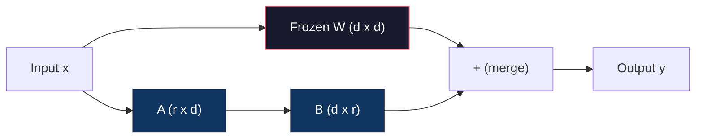
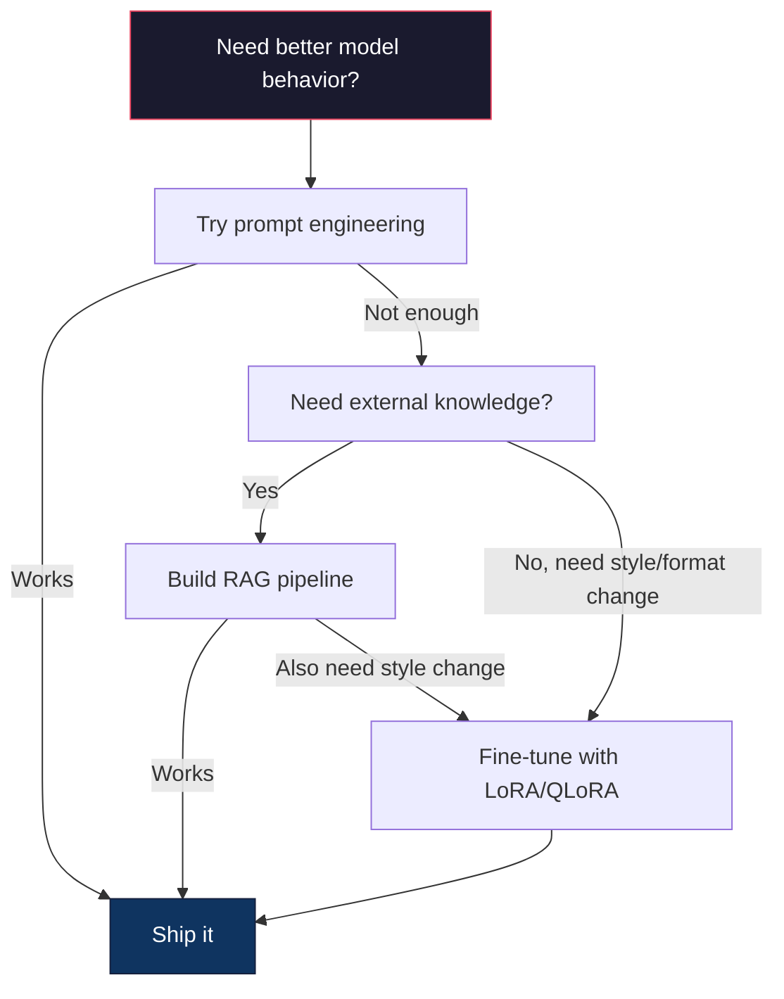

# Fine-Tuning with LoRA & QLoRA

> Full fine-tuning a 7B model requires 56GB of VRAM. You don't have that. Neither do most companies. LoRA lets you fine-tune the same model in 6GB by training less than 1% of the parameters. This isn't a compromise -- it matches full fine-tuning quality on most tasks. The entire open-source fine-tuning ecosystem runs on this one trick.

**Type:** Build
**Languages:** Python
**Prerequisites:** Phase 10, Lesson 06 (Instruction Tuning / SFT)
**Time:** ~75 minutes
**Related:** Phase 10 covers the SFT/DPO loops from scratch. This lesson plugs those into the 2026 PEFT toolkits (PEFT, TRL, Unsloth, Axolotl, LLaMA-Factory).

## Learning Objectives

- Implement LoRA by injecting low-rank adapter matrices (A and B) into a pretrained model's attention layers
- Calculate the parameter savings of LoRA vs full fine-tuning: rank r with d_model dimensions trains 2*r*d parameters instead of d^2
- Fine-tune a model using QLoRA (4-bit quantized base + LoRA adapters) to fit within consumer GPU memory
- Merge LoRA weights back into the base model for deployment and compare inference speed with and without adapters

## The Problem

You have a base model. Llama 3 8B. You want it to answer customer support tickets in your company's voice. SFT is the answer. But SFT has a cost problem.

Full fine-tuning updates every parameter in the model. Llama 3 8B has 8 billion parameters. In fp16, each parameter takes 2 bytes. That's 16GB just to load the weights. During training, you also need gradients (16GB), optimizer states for Adam (32GB for momentum + variance), and activations. Total: roughly 56GB of VRAM for a single 8B model.

An A100 80GB can barely fit this. Two A100s cost $3-4/hour on cloud providers. Training for 3 epochs on 50,000 examples takes 6-10 hours. That's $30-40 per experiment. Run 10 experiments to get the hyperparameters right and you've spent $400 before deploying anything.

Scale this to Llama 3 70B and the numbers get absurd. 140GB for weights alone. You need a cluster. $100+ per experiment.

There's a deeper problem too. Full fine-tuning modifies every weight in the model. If you fine-tune on customer support data, you might degrade the model's general capabilities. It's called catastrophic forgetting. The model gets better at your task and worse at everything else.

You need a method that trains fewer parameters, uses less memory, and doesn't destroy the model's existing knowledge.

## The Concept

### LoRA: Low-Rank Adaptation

Edward Hu and colleagues at Microsoft published LoRA in June 2021. The paper's insight: the weight updates during fine-tuning have low intrinsic rank. You don't need to update all 16.7 million parameters in a 4096x4096 weight matrix. The useful information in the update can be captured by a matrix of rank 16 or 32.

Here's the math. A standard linear layer computes:

```
y = Wx
```

Where W is a d_out x d_in matrix. For a 4096x4096 attention projection, that's 16,777,216 parameters.

LoRA freezes W and adds a low-rank decomposition:

```
y = Wx + BAx
```

Where B is (d_out x r) and A is (r x d_in). The rank r is much smaller than d -- typically 8, 16, or 32.

For r=16 on a 4096x4096 layer:
- Original parameters: 4096 x 4096 = 16,777,216
- LoRA parameters: (4096 x 16) + (16 x 4096) = 65,536 + 65,536 = 131,072
- Reduction: 131,072 / 16,777,216 = 0.78%

You're training 0.78% of the parameters and getting 95-100% of the quality.



A is initialized with a random Gaussian. B is initialized to zero. This means the LoRA contribution starts at zero -- the model begins training from its original behavior and gradually learns the adaptation.

### The Scaling Factor: Alpha

LoRA introduces a scaling factor alpha that controls how much the low-rank update affects the output:

```
y = Wx + (alpha / r) * BAx
```

When alpha = r, the scaling is 1x. When alpha = 2r (the common default), the scaling is 2x. This hyperparameter controls the learning rate of the LoRA path independently of the base learning rate.

Practical guidance:
- alpha = 2 * rank is a common community convention (the original paper used alpha = rank in most experiments)
- alpha = rank gives 1x scaling, conservative but stable
- Higher alpha means larger updates per step, which can speed convergence or cause instability

### Where to Apply LoRA

A transformer has many linear layers. You don't need to add LoRA to all of them. The original paper tested different combinations:

| Target Layers | Trainable Params (7B) | Quality |
|--------------|----------------------|---------|
| q_proj only | 4.7M | Good |
| q_proj + v_proj | 9.4M | Better |
| q_proj + k_proj + v_proj + o_proj | 18.9M | Best for attention |
| All linear (attention + MLP) | 37.7M | Marginal gain, 2x params |

The sweet spot for most tasks: q_proj + v_proj. This targets the query and value projections in self-attention, which control what the model attends to and what information it extracts. Adding MLP layers helps for complex tasks like code generation but doubles the parameter count for diminishing returns on simpler tasks.

### Rank Selection

The rank r controls the expressiveness of the adaptation:

| Rank | Trainable Params (per layer) | Best For |
|------|---------------------------|----------|
| 4 | 32,768 | Simple classification, sentiment |
| 8 | 65,536 | Single-domain Q&A, summarization |
| 16 | 131,072 | Multi-domain tasks, instruction following |
| 32 | 262,144 | Complex reasoning, code generation |
| 64 | 524,288 | Diminishing returns for most tasks |
| 128 | 1,048,576 | Rarely justified |

Hu et al. showed that r=4 already captures most of the adaptation for simple tasks. r=8 and r=16 are the most common choices in practice. Going beyond r=64 rarely improves quality and starts to lose LoRA's memory advantage.

### QLoRA: 4-Bit Quantization + LoRA

Tim Dettmers and colleagues at the University of Washington published QLoRA in May 2023. The idea: quantize the frozen base model to 4-bit precision, then attach LoRA adapters in fp16 on top.

This changes the memory equation dramatically:

| Method | Weight Memory (7B) | Training Memory (7B) | GPU Required |
|--------|-------------------|---------------------|-------------|
| Full fine-tune (fp16) | 14GB | ~56GB | 1x A100 80GB |
| LoRA (fp16 base) | 14GB | ~18GB | 1x A100 40GB |
| QLoRA (4-bit base) | 3.5GB | ~6GB | 1x RTX 3090 24GB |

QLoRA makes three technical contributions:

**NF4 (Normal Float 4-bit)**: A new data type designed specifically for neural network weights. Neural network weights follow a roughly normal distribution. NF4 places its 16 quantization levels at the quantiles of a standard normal distribution. This is information-theoretically optimal for normally distributed data. It loses less information than uniform 4-bit quantization (INT4) or standard Float4.

**Double quantization**: The quantization constants themselves take memory. Each block of 64 weights needs a fp32 scale factor (4 bytes). For a 7B model, that's an extra 0.4GB. Double quantization quantizes these constants to fp8, reducing the overhead to 0.1GB. Small but it adds up.

**Paged optimizers**: During training, optimizer states (Adam's momentum and variance) can exceed GPU memory on long sequences. Paged optimizers use NVIDIA's unified memory to automatically page optimizer states to CPU RAM when GPU memory is exhausted, and page them back when needed. This prevents OOM crashes at the cost of some throughput.

### The Quality Question

Does reducing parameters or quantizing the base hurt quality? The published evidence (QLoRA paper, 2023; subsequent Llama-3-era replications) consistently shows LoRA and QLoRA landing within a few points of full fine-tuning on standard benchmarks — MMLU, MT-Bench, HumanEval — at a fraction of the memory and compute. Specific numbers shift with model family and benchmark version; before quoting them in a SoW or a steering deck, pull the latest from the QLoRA / PEFT papers and the relevant Llama-3 / Mistral / Qwen fine-tuning reports.

### Real-World Costs

Fine-tuning Llama 3 8B on 50,000 examples (3 epochs):

| Method | GPU | Time | Cost |
|--------|-----|------|------|
| Full fine-tune | 2x A100 80GB | 8 hours | ~$32 |
| LoRA r=16 | 1x A100 40GB | 4 hours | ~$8 |
| QLoRA r=16 | 1x RTX 4090 24GB | 6 hours | ~$5 |
| QLoRA r=16 (Unsloth) | 1x RTX 4090 24GB | 2.5 hours | ~$2 |
| QLoRA r=16 | 1x T4 16GB | 12 hours | ~$4 |

QLoRA on a single consumer GPU costs less than a lunch. This is why the open-weight fine-tuning community exploded in 2023 and why every training framework below ships QLoRA by default in 2026.

### The 2026 PEFT stack

| Framework | What it is | Pick when |
|-----------|-----------|-----------|
| **Hugging Face PEFT** | The canonical LoRA/QLoRA/DoRA/IA3 library | You want raw control and your training loop is already on `transformers.Trainer` |
| **TRL** | HF's reinforcement-from-feedback trainers (SFT, DPO, GRPO, PPO, ORPO) | You need DPO/GRPO after SFT; built on top of PEFT |
| **Unsloth** | Triton-kernel rewrite of the forward/backward pass | You want 2-5x speedup + half the VRAM with no accuracy loss; Llama/Mistral/Qwen family |
| **Axolotl** | YAML-config wrapper over PEFT + TRL + DeepSpeed + Unsloth | You want reproducible, version-controlled training runs |
| **LLaMA-Factory** | GUI/CLI/API over PEFT + TRL | You want zero-code fine-tuning; 100+ model families supported |
| **torchtune** | Native PyTorch recipes, no `transformers` dep | You want minimal deps and your org already standardizes on PyTorch |

Rule of thumb: research use or one-off experiment → PEFT. Repeatable production pipeline → Axolotl with Unsloth kernels enabled. Throwaway prototyping → LLaMA-Factory.

### Merging Adapters

After training, you have two things: the frozen base model and a small LoRA adapter (typically 10-100MB). You can either:

1. **Keep them separate**: Load the base model, load the adapter on top. Swap adapters for different tasks. This is how you serve multiple fine-tuned variants from one base model.

2. **Merge them permanently**: Compute W' = W + (alpha/r) * BA and save the result as a new full model. The merged model is the same size as the original. No inference overhead. No adapter to manage.

For serving multiple tasks (customer support adapter, code adapter, translation adapter), keep them separate. For deploying a single specialized model, merge.

Advanced merging techniques for combining multiple adapters:

- **TIES-Merging** (Yadav et al. 2023): Trims small-magnitude parameters, resolves sign conflicts, then merges. Reduces interference between adapters.
- **DARE** (Yu et al. 2023): Randomly drops adapter parameters before merging and rescales the rest. Surprisingly effective at combining capabilities.
- **Task arithmetic**: Simply add or subtract adapter weights. Adding a "code" adapter and a "math" adapter often produces a model good at both.

### When NOT to Fine-Tune

Fine-tuning is the third option, not the first.

**First: prompt engineering.** Write a better system prompt. Add few-shot examples. Use chain-of-thought. This costs nothing and takes minutes. If prompting gets you 80% of the way there, you probably don't need to fine-tune.

**Second: RAG.** If the model needs to know about your specific data (documents, knowledge base, product catalog), retrieval is cheaper and more maintainable than baking it into weights. See Lesson 06.

**Third: fine-tuning.** Use this when you need the model to adopt a specific style, format, or reasoning pattern that cannot be achieved through prompting. When you need consistent structured output. When you need to distill a larger model into a smaller one. When latency matters and you can't afford the extra tokens from few-shot prompting.




## Further Reading

- Hu et al., "LoRA: Low-Rank Adaptation of Large Language Models" (2021) -- the original paper introducing the low-rank decomposition method, tested on GPT-3 175B with rank as low as 4
- Dettmers et al., "QLoRA: Efficient Finetuning of Quantized Language Models" (2023) -- introduces NF4, double quantization, and paged optimizers, enabling 65B fine-tuning on a single 48GB GPU
- PEFT library documentation (huggingface.co/docs/peft) -- the standard library for LoRA, QLoRA, and other parameter-efficient methods in the Hugging Face ecosystem
- Yadav et al., "TIES-Merging: Resolving Interference When Merging Models" (2023) -- techniques for combining multiple LoRA adapters without quality degradation
- [Rafailov et al., "Direct Preference Optimization: Your Language Model is Secretly a Reward Model" (NeurIPS 2023)](https://arxiv.org/abs/2305.18290) -- DPO derivation; the preference-tuning stage that comes after SFT, no reward model needed.
- [TRL documentation](https://huggingface.co/docs/trl/) -- official reference for `SFTTrainer`, `DPOTrainer`, `KTOTrainer`, and the integration surface with PEFT/bitsandbytes/Unsloth.
- [Unsloth documentation](https://docs.unsloth.ai/) -- fused kernels that double fine-tuning throughput and halve memory; the performance layer under TRL.
- [Axolotl documentation](https://axolotl-ai-cloud.github.io/axolotl/) -- YAML-configured multi-GPU SFT/DPO/QLoRA trainer; the config-as-code alternative to hand-written scripts.

## Exercises

1. **Establish a baseline.** Run the lesson demo, then capture the inputs, outputs, and one invariant that demonstrates this objective: Implement LoRA by injecting low-rank adapter matrices (A and B) into a pretrained model's attention layers.
2. **Change one variable.** Modify a single input or parameter and use the resulting evidence to investigate this objective: Calculate the parameter savings of LoRA vs full fine-tuning: rank r with d_model dimensions trains 2*r*d parameters instead of d^2.
3. **Probe an edge case.** Predict the result before running it, compare prediction with observation, and explain the discrepancy while applying this objective: Fine-tune a model using QLoRA (4-bit quantized base + LoRA adapters) to fit within consumer GPU memory.

## Reference Solution

Use the canonical [main.py](../code/main.py) as the executable baseline. A complete solution records a successful run, identifies the invariant tied to “Implement LoRA by injecting low-rank adapter matrices (A and B) into a pretrained model's attention layers,” and changes only one variable for the comparison. The edge-case result must distinguish the prediction from the observation, explain the cause using “Fine-tune a model using QLoRA (4-bit quantized base + LoRA adapters) to fit within consumer GPU memory,” and cite a repeatable check rather than relying on visual inspection alone.
