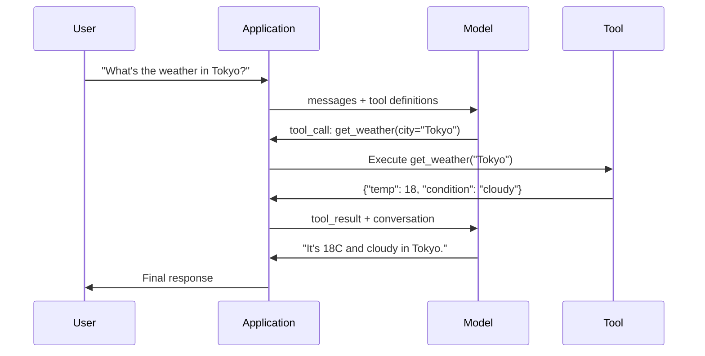

# Function Calling & Tool Use

> LLMs cannot do anything. They generate text. That is the entire capability. They cannot check the weather, query a database, send an email, run code, or read a file. Every "AI agent" you have ever seen is an LLM generating JSON that says which function to call -- and then your code actually calling it. The model is the brain. Tools are the hands. Function calling is the nervous system connecting them.

**Type:** Build
**Languages:** TypeScript
**Prerequisites:** Phase 11 Lesson 03 (Structured Outputs)
**Time:** ~75 minutes
**Related:** Phase 11 · 14 (Model Context Protocol) — when a tool is shared across hosts, graduate from inline function-calling to an MCP server. This lesson covers the inline case; MCP covers the protocol case.

## Learning Objectives

- Implement a function calling loop: define tool schemas, parse the model's tool-call JSON, execute functions, and return results
- Design tool schemas with clear descriptions and typed parameters that the model can reliably invoke
- Build a multi-turn agent loop that chains multiple function calls to answer complex queries
- Handle function calling edge cases: parallel tool calls, error propagation, and preventing infinite tool loops

## The Problem

You build a chatbot. A user asks: "What's the weather in Tokyo right now?"

The model responds: "I don't have access to real-time weather data, but based on the season, Tokyo is likely around 15 degrees Celsius..."

That is a hallucination dressed in a disclaimer. The model does not know the weather. It never will. Weather changes every hour. The model's training data is months old.

The correct answer requires calling the OpenWeatherMap API, getting the current temperature, and returning the real number. The model cannot call APIs. Your code can. The missing piece: a structured protocol that lets the model say "I need to call the weather API with these arguments" and lets your code execute it and feed the result back.

This is function calling. The model outputs structured JSON describing which function to invoke with what arguments. Your application executes the function. The result goes back into the conversation. The model uses the result to produce its final answer.

Without function calling, LLMs are encyclopedias. With it, they become agents.

## The Concept

Every example below shares this setup — run it once, then the rest reuse `lrn_llm`:

```python editable
import sys, json, types
lrn_llm = types.ModuleType("lrn_llm")
try:
    from pyodide.http import pyfetch as _pyfetch
    _IN_PYODIDE = True
except ImportError:
    import urllib.request as _urlreq
    _IN_PYODIDE = False
lrn_llm.API_BASE = "/api/llm"
lrn_llm.DEFAULT_MODEL = "azure/gpt-5.4-mini"
lrn_llm.API_KEY = ""

async def _lrn_call(messages, *, system=None, max_tokens=400, model=None):
    if system is not None:
        messages = [{"role": "system", "content": system}] + list(messages)
    payload = {"model": model or lrn_llm.DEFAULT_MODEL, "messages": messages,
               "max_completion_tokens": max_tokens}
    headers = {"content-type": "application/json"}
    _key = lrn_llm.API_KEY
    if _key:
        headers["Authorization"] = "Bearer " + _key
    url = lrn_llm.API_BASE.rstrip("/") + "/chat/completions"
    body = json.dumps(payload)
    if _IN_PYODIDE:
        r = await _pyfetch(url, method="POST", headers=headers, body=body)
        data = await r.json()
    else:
        req = _urlreq.Request(url, method="POST", headers=headers, data=body.encode("utf-8"))
        with _urlreq.urlopen(req, timeout=60) as r:
            data = json.loads(r.read())
    if "error" in data:
        raise RuntimeError("LLM error: " + str(data["error"]))
    return data

def _lrn_text(r):
    ch = (r or {}).get("choices") or []
    return (ch[0].get("message", {}) or {}).get("content", "") if ch else ""

async def _lrn_ping():
    r = await _lrn_call([{"role": "user", "content": "Reply with exactly: OK"}], max_tokens=5)
    return {"ok": _lrn_text(r).strip().upper().startswith("OK"), "model": r.get("model")}

lrn_llm.call = _lrn_call
lrn_llm.text = _lrn_text
lrn_llm.ping = _lrn_ping
r = await lrn_llm.ping()
print(f"LLM reachable: {r}")
```

### The Function Calling Loop

Every tool-use interaction follows the same 5-step loop.



Step 1: the user sends a message. Step 2: the model receives the message along with tool definitions (JSON Schema describing available functions). Step 3: instead of responding with text, the model outputs a tool call -- a structured JSON object with the function name and arguments. Step 4: your code executes the function and captures the result. Step 5: the result goes back to the model, which now has real data to produce its final answer.

The model never executes anything. It only decides what to call and with what arguments. Your code is the executor.

### Tool Definitions: The JSON Schema Contract

Each tool is defined by a JSON Schema that tells the model what the function does, what arguments it takes, and what types those arguments must be.

```json
{
  "type": "function",
  "function": {
    "name": "get_weather",
    "description": "Get current weather for a city. Returns temperature in Celsius and conditions.",
    "parameters": {
      "type": "object",
      "properties": {
        "city": {
          "type": "string",
          "description": "City name, e.g. 'Tokyo' or 'San Francisco'"
        },
        "units": {
          "type": "string",
          "enum": ["celsius", "fahrenheit"],
          "description": "Temperature units"
        }
      },
      "required": ["city"]
    }
  }
}
```

The `description` fields are critical. The model reads them to decide when and how to use the tool. A vague description like "gets weather" produces worse tool selection than "Get current weather for a city. Returns temperature in Celsius and conditions." The description is a prompt for tool selection.

Here's a small tool registry with two tools — weather lookup and a calculator — each with a JSON Schema definition (what the model sees) and a Python function (what your code executes):

```python editable
import math, time

# In-memory tool definitions and implementations
TOOL_REGISTRY = {}

def register_tool(name, description, parameters, function):
    TOOL_REGISTRY[name] = {
        "definition": {
            "type": "function",
            "function": {"name": name, "description": description, "parameters": parameters},
        },
        "function": function,
    }

# Weather database
WEATHER_DB = {
    "tokyo": {"temp_c": 18, "condition": "cloudy", "humidity": 72, "wind_kph": 14},
    "new york": {"temp_c": 22, "condition": "sunny", "humidity": 45, "wind_kph": 8},
    "london": {"temp_c": 12, "condition": "rainy", "humidity": 88, "wind_kph": 22},
}

def get_weather(city, units="celsius"):
    key = city.lower().strip()
    if key not in WEATHER_DB:
        return {"error": True, "message": f"City '{city}' not found.", "code": "CITY_NOT_FOUND"}
    data = WEATHER_DB[key].copy()
    if units == "fahrenheit":
        data["temp_f"] = round(data["temp_c"] * 9 / 5 + 32, 1)
        del data["temp_c"]
    data["city"] = city
    return data

def calculator(expression, precision=2):
    allowed = set("0123456789+-*/.() ")
    if not all(c in allowed for c in expression):
        return {"error": True, "message": f"Invalid characters in expression"}
    try:
        result = eval(expression, {"__builtins__": {}}, {"math": math})
        return {"result": round(float(result), precision), "expression": expression}
    except Exception as e:
        return {"error": True, "message": str(e)}

# Register the tools
register_tool(
    "get_weather",
    "Get current weather for a city. Returns temperature, condition, humidity, and wind speed.",
    {"type": "object", "properties": {"city": {"type": "string", "description": "City name, e.g. 'Tokyo' or 'London'"}, "units": {"type": "string", "enum": ["celsius", "fahrenheit"], "description": "Temperature units"}}, "required": ["city"]},
    get_weather,
)
register_tool(
    "calculator",
    "Evaluate a mathematical expression. Supports +, -, *, /, parentheses, and decimals. Returns the numeric result.",
    {"type": "object", "properties": {"expression": {"type": "string", "description": "Math expression, e.g. '(10 + 5) * 3'"}, "precision": {"type": "integer", "description": "Decimal places in result"}}, "required": ["expression"]},
    calculator,
)

print(f"Registered {len(TOOL_REGISTRY)} tools")
for name in TOOL_REGISTRY:
    print(f"  - {name}")
```

When the model decides which tool to call, your code executes the actual function and returns the result:

```python editable
def execute_tool_call(tool_call):
    """Execute a tool call and return the result with timing."""
    name = tool_call["name"]
    args = tool_call.get("arguments", {})
    
    if name not in TOOL_REGISTRY:
        return {"error": True, "message": f"Unknown tool: {name}", "code": "UNKNOWN_TOOL"}
    
    func = TOOL_REGISTRY[name]["function"]
    start = time.time()
    
    try:
        result = func(**args)
    except TypeError as e:
        result = {"error": True, "message": f"Invalid arguments: {e}"}
    
    elapsed_ms = round((time.time() - start) * 1000, 2)
    return {"tool": name, "result": result, "execution_time_ms": elapsed_ms}

# Test direct execution
print("Direct tool execution test:")
test_call = {"name": "calculator", "arguments": {"expression": "(10 + 5) * 3 / 2"}}
exec_result = execute_tool_call(test_call)
print(f"Tool: {exec_result['tool']}")
print(f"Result: {exec_result['result']}")
print(f"Time: {exec_result['execution_time_ms']}ms")
```

### Provider Comparison

Every major provider supports function calling, but the API surface differs.

| Provider | API Parameter | Tool Call Format | Parallel Calls | Forced Calling |
|----------|--------------|-----------------|---------------|----------------|
| OpenAI (GPT-5) | `tools` | `tool_calls[].function` | Yes (multiple per turn) | `tool_choice="required"` |
| Anthropic (Claude 4.6/4.7) | `tools` | `content[].type="tool_use"` | Yes (multiple blocks) | `tool_choice={"type":"any"}` |
| Google (Gemini 3) | `function_declarations` | `functionCall` | Yes | `function_calling_config` |
| Open-weight (Llama 4, Qwen3, DeepSeek-V3) | Native `tools` on Llama 4; Hermes or ChatML on others | Mixed | Model-dependent | Prompt-based or `tool_choice` if supported |

By 2026 the three closed providers have converged on near-identical JSON-Schema-based formats. Llama 4 ships with a native `tools` field that matches OpenAI's shape. Open-weight fine-tunes still vary — the Hermes format (NousResearch) is the most common for third-party fine-tunes. For shared tools across hosts, prefer MCP (Phase 11 · 14) over inline function-calling — the server is the same for all of them.

### Tool Choice: Auto, Required, Specific

You control when the model uses tools.

**Auto** (default): the model decides whether to call a tool or respond directly. "What's 2+2?" -- responds directly. "What's the weather?" -- calls the tool.

**Required**: the model must call at least one tool. Use this when you know the user's intent requires a tool. Prevents the model from guessing instead of looking up real data.

**Specific function**: force the model to call a particular function. `tool_choice={"type":"function", "function": {"name": "get_weather"}}` guarantees the weather tool is called, regardless of the query. Use this for routing -- when upstream logic already determined which tool is needed.

Here's the full agent loop for auto tool choice: send the user's message and the tool registry to the model, let it decide whether to call a tool or answer directly, execute any tool call and feed the result back (repeating until it gives a final answer or a `max_iterations` guard trips):

```python editable
async def run_function_calling_loop(user_message, max_iterations=5):
    """
    Run the function calling loop to completion:
    1. Send user message + tool definitions to LLM
    2. LLM decides: call a tool, or answer directly
    3. If a tool call: execute it, feed the result back to the LLM (Step 5), go to 2
    4. If a direct/final response: return it
    Bounded by max_iterations so a model that keeps requesting tools can't loop forever.
    """
    system_prompt = """You are a helpful assistant with access to tools.
When the user asks a question:
1. Decide which tool(s) would help answer it
2. Call the appropriate tool with the correct arguments
3. DO NOT call tools for general knowledge questions
4. Once a tool result has been given to you, use it to produce a final natural-language answer

You MUST respond with a JSON object in this exact format:
{"tool_name": "<name>", "arguments": {<args>}}

Or, once you have enough information to answer (including right after a tool result
was given to you):
{"response": "Your final answer here"}"""

    transcript = [f"User: {user_message}"]
    tool_calls_made = []

    for iteration in range(1, max_iterations + 1):
        response = await lrn_llm.call(
            [{"role": "user", "content": "\n".join(transcript)}],
            system=system_prompt, max_tokens=300
        )
        model_output = lrn_llm.text(response)
        print(f"[Iteration {iteration}] LLM: " +
              (f"{model_output[:150]}..." if len(model_output) > 150 else model_output))

        try:
            decision = json.loads(model_output)
        except json.JSONDecodeError:
            return {"type": "error", "message": "LLM returned invalid JSON", "raw": model_output,
                    "iterations": iteration, "tool_calls": tool_calls_made}

        if "response" in decision:
            return {"type": "final" if tool_calls_made else "direct",
                    "response": decision["response"], "iterations": iteration,
                    "tool_calls": tool_calls_made}

        if "tool_name" in decision:
            tool_call = {"name": decision["tool_name"], "arguments": decision.get("arguments", {})}
            exec_result = execute_tool_call(tool_call)
            tool_calls_made.append(exec_result["tool"])

            if exec_result["result"].get("error"):
                return {"type": "error", "tool": exec_result["tool"],
                        "error": exec_result["result"]["message"], "iterations": iteration,
                        "tool_calls": tool_calls_made}

            # Step 5: feed the tool result back to the model instead of returning it to
            # the caller — this is the step that was previously skipped.
            transcript.append(f"Assistant: called {exec_result['tool']}({tool_call['arguments']})")
            transcript.append(f"Tool result: {json.dumps(exec_result['result'])}")
            continue

        return {"type": "error", "message": "LLM response did not contain tool_name or response field",
                "iterations": iteration, "tool_calls": tool_calls_made}

    return {"type": "error", "message": f"Exceeded max_iterations ({max_iterations}) without a final response",
            "iterations": max_iterations, "tool_calls": tool_calls_made}

print("Function calling loop ready (feeds tool results back, guarded by max_iterations)")
```

Three queries show auto tool choice deciding for itself. First, a weather query — the model should call `get_weather`:

```python editable
def print_loop_result(result):
    """Result is always the model's own final answer now — 'final' means it came
    after one or more tool calls whose results were fed back; 'direct' means no tool
    was needed at all."""
    print(f"\nResult type: {result.get('type')} (iterations: {result.get('iterations')}, "
          f"tools called: {result.get('tool_calls') or 'none'})")
    if result.get('type') in ('final', 'direct'):
        print(f"Response: {result.get('response')}")
    elif result.get('type') == 'error':
        print(f"Error: {result.get('error') or result.get('message')}")

result = await run_function_calling_loop("What's the weather in Tokyo?")
print_loop_result(result)
```

Second, a math question — the model should call `calculator`:

```python editable
result = await run_function_calling_loop("Calculate (100 + 250) * 0.15")
print_loop_result(result)
```

Third, a general knowledge question — the model should recognize it needs no tool and answer directly:

```python editable
result = await run_function_calling_loop("What is the capital of France?")
print_loop_result(result)
```

### Parallel Function Calling

GPT-4o and Claude can call multiple functions in a single turn. A user asks: "What's the weather in Tokyo and New York?" The model outputs two tool calls simultaneously:

```json
[
  {"name": "get_weather", "arguments": {"city": "Tokyo"}},
  {"name": "get_weather", "arguments": {"city": "New York"}}
]
```

Your code executes both (ideally concurrently), returns both results, and the model synthesizes a single response. This cuts round trips from 2 to 1. For agents with 5-10 tool calls per query, parallel calling reduces latency by 60-80%.

### Structured Outputs vs Function Calling

Lesson 03 covered structured outputs. Function calling uses the same JSON Schema machinery, but for a different purpose.

**Structured outputs**: force the model to produce data in a specific shape. The output is the final product. Example: extract product info from text as `{name, price, in_stock}`.

**Function calling**: the model declares an intent to execute an action. The output is an intermediate step. Example: `get_weather(city="Tokyo")` -- the model is requesting an action, not producing the final answer.

Use structured outputs when you want data extraction. Use function calling when you want the model to interact with external systems.

### Security: The Non-Negotiable Rules

Function calling is the most dangerous capability you can give an LLM. The model chooses what to execute. If your tool set includes database queries, the model constructs the queries. If it includes shell commands, the model writes them.

**Rule 1: Never pass model-generated SQL directly to a database.** The model can and will generate DROP TABLE, UNION injections, or queries that return every row. Always parameterize. Always validate. Always use an allowlist of operations.

**Rule 2: Allowlist functions.** The model can only call functions you explicitly define. Never build a generic "execute any function by name" tool. If you have 50 internal functions, expose only the 5 the user needs.

**Rule 3: Validate arguments.** The model might pass a city name of `"; DROP TABLE users; --"`. Validate every argument against expected types, ranges, and formats before execution.

**Rule 4: Sanitize tool results.** If a tool returns sensitive data (API keys, PII, internal errors), filter it before sending it back to the model. The model will include tool results in its response verbatim.

**Rule 5: Rate limit tool calls.** A model in a loop can call tools hundreds of times. Set a maximum (10-20 calls per conversation is reasonable). Break infinite loops.

### Error Handling

Tools fail. APIs time out. Databases go down. Files do not exist. The model needs to know when a tool fails and why.

Return errors as structured tool results, not exceptions:

```json
{
  "error": true,
  "message": "City 'Toky' not found. Did you mean 'Tokyo'?",
  "code": "CITY_NOT_FOUND"
}
```

The model reads this, adjusts its arguments, and retries. Models are good at self-correcting from structured error messages. They are bad at recovering from empty responses or generic "something went wrong" errors.

### MCP: Model Context Protocol

MCP is Anthropic's open standard for tool interoperability. Instead of every application defining its own tools, MCP provides a universal protocol: tools are served by MCP servers, consumed by MCP clients (like Claude Code, Cursor, or your application).

One MCP server can expose tools to any compatible client. A Postgres MCP server gives any MCP-compatible agent database access. A GitHub MCP server gives any agent repository access. The tools are defined once, used everywhere.

MCP is to function calling what HTTP is to networking. It standardizes the transport layer so tools become portable.

### Try It Yourself

Edit the query below and run it. The LLM will decide which tool to call (or respond directly if no tool is needed). Try a weather query ("What's the weather in London?"), math ("What is 15% of 500?"), or general knowledge ("Tell me about function calling in AI").

```python editable
query = "What's the weather in New York?"
print(f"User query: {query}\n")

result = await run_function_calling_loop(query)
print_loop_result(result)
```

## Further Reading

- [OpenAI Function Calling Guide](https://platform.openai.com/docs/guides/function-calling) -- the definitive reference for tool use with GPT-4o, including parallel calls, forced calling, and structured arguments
- [Anthropic Tool Use Guide](https://docs.anthropic.com/en/docs/tool-use) -- Claude's tool use implementation with input_schema, multi-tool responses, and tool_choice configuration
- [Model Context Protocol Specification](https://modelcontextprotocol.io) -- the open standard for tool interoperability across AI applications, with server/client architecture
- [Schick et al., 2023 -- "Toolformer: Language Models Can Teach Themselves to Use Tools"](https://arxiv.org/abs/2302.04761) -- the foundational paper on training LLMs to decide when and how to call external tools
- [Patil et al., 2023 -- "Gorilla: Large Language Model Connected with Massive APIs"](https://arxiv.org/abs/2305.15334) -- fine-tuning LLMs for accurate API calls across 1,645 APIs with hallucination reduction
- [Berkeley Function Calling Leaderboard](https://gorilla.cs.berkeley.edu/leaderboard.html) -- real-time benchmark comparing function calling accuracy across GPT-4o, Claude, Gemini, and open models
- [Yao et al., "ReAct: Synergizing Reasoning and Acting in Language Models" (ICLR 2023)](https://arxiv.org/abs/2210.03629) -- the Thought-Action-Observation loop that is the outer agent loop around every tool call; where this lesson ends, Phase 14 picks up.
- [Anthropic — Building effective agents (Dec 2024)](https://www.anthropic.com/research/building-effective-agents) -- five composable patterns (prompt chaining, routing, parallelization, orchestrator-workers, evaluator-optimizer) built from the single tool-use primitive.

## Exercises

1. **Establish a baseline.** Run the lesson demo, then capture the inputs, outputs, and one invariant that demonstrates this objective: Implement a function calling loop: define tool schemas, parse the model's tool-call JSON, execute functions, and return results.
2. **Change one variable.** Modify a single input or parameter and use the resulting evidence to investigate this objective: Design tool schemas with clear descriptions and typed parameters that the model can reliably invoke.
3. **Probe an edge case.** Predict the result before running it, compare prediction with observation, and explain the discrepancy while applying this objective: Build a multi-turn agent loop that chains multiple function calls to answer complex queries.

## Reference Solution

Use the canonical [main.ts](../code/main.ts) as the executable baseline. A complete solution records a successful run, identifies the invariant tied to “Implement a function calling loop: define tool schemas, parse the model's tool-call JSON, execute functions, and return results,” and changes only one variable for the comparison. The edge-case result must distinguish the prediction from the observation, explain the cause using “Build a multi-turn agent loop that chains multiple function calls to answer complex queries,” and cite a repeatable check rather than relying on visual inspection alone.
